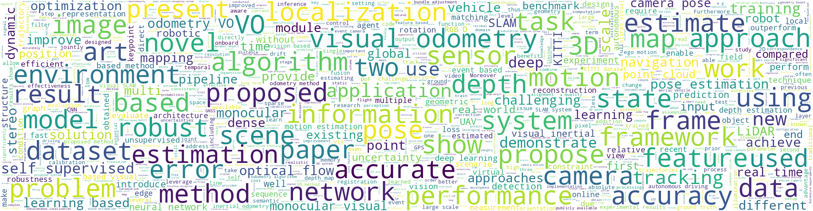
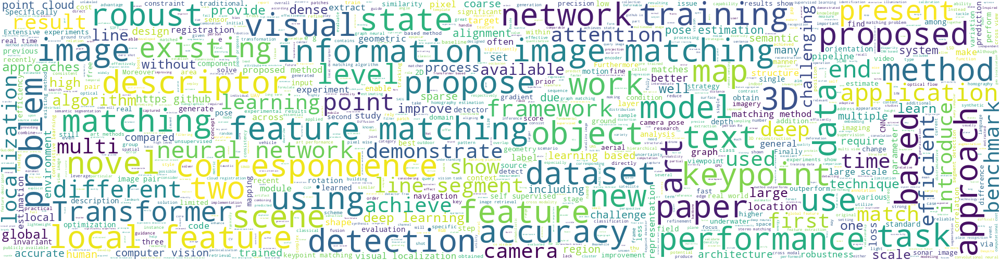
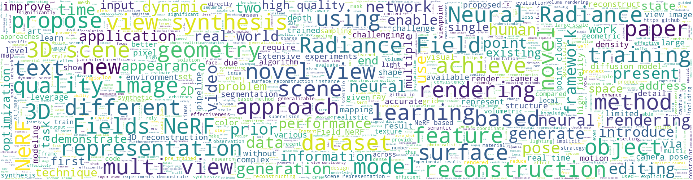
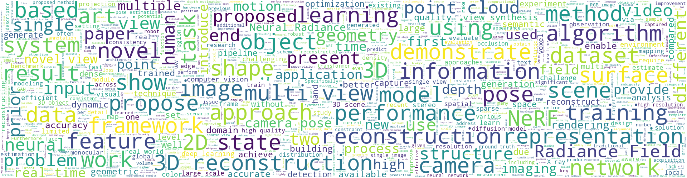
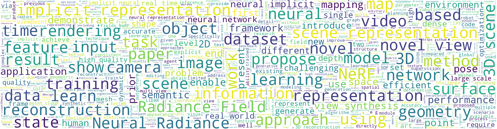

# [Review] CV Papers from arXiv.org

> Github source and usage instructions: [here](https://github.com/Vincentqyw/cv-arxiv-daily/blob/main/docs/README.md)  
> Updated on June 16, 2023  

---

# Table of Contents
* [SLAM](#SLAM) 
* [SFM](#SFM)
* [Visual Localization](#Visual-Localization) 
* [Keypoint Detection](#Keypoint-Detection) 
* [Image Matching](#Image-Matching) 
* [Neural Rendering ](#Neural-Rendering) 
* [3D Reconstruction](#3D-Reconstruction) 
* [Scene Representation](#Scene-Representation) 
* [Geometry Processing](#Geometry-Processing) 

  
Word Cloud

  <ol>

  * SLAM

  
  
  * SFM
    
  
  
  * Visual Localization

  
  
  * Keypoint Detection
    
  
  
  * Image Matching
    
  
  
  * Neural Rendering
    
  
  
  * 3D Reconstruction
    
  
  
  * Scene Representation
    
  
  
  * Geometry Processing
    
  

  </ol>

---

## SLAM

|Publish Date|Title|Authors|PDF|Code|
|---|---|---|---|---|
|**2023-06-01**|**Event-based Visual Odometry with Full Temporal Resolution via Continuous-time Gaussian Process Regression**|Jianeng Wang et.al.|[2306.01188](http://arxiv.org/abs/2306.01188)|null|
|**2023-05-28**|**OSPC: Online Sequential Photometric Calibration**|Jawad Haidar et.al.|[2305.17673](http://arxiv.org/abs/2305.17673)|null|
|**2023-05-15**|**Event Camera-based Visual Odometry for Dynamic Motion Tracking of a Legged Robot Using Adaptive Time Surface**|Shifan Zhu et.al.|[2305.08962](http://arxiv.org/abs/2305.08962)|null|
|**2023-05-10**|**Transformer-based model for monocular visual odometry: a video understanding approach**|André O. Françani et.al.|[2305.06121](http://arxiv.org/abs/2305.06121)|**[link](https://github.com/aofrancani/tsformer-vo)**|
|**2023-04-29**|**Modality-invariant Visual Odometry for Embodied Vision**|Marius Memmel et.al.|[2305.00348](http://arxiv.org/abs/2305.00348)|**[link](https://github.com/memmelma/vo-transformer)**|
|**2023-04-21**|**FSNet: Redesign Self-Supervised MonoDepth for Full-Scale Depth Prediction for Autonomous Driving**|Yuxuan Liu et.al.|[2304.10719](http://arxiv.org/abs/2304.10719)|null|
|**2023-04-18**|**Visual-LiDAR Odometry and Mapping with Monocular Scale Correction and Motion Compensation**|Hanyu Cai et.al.|[2304.08978](http://arxiv.org/abs/2304.08978)|null|
|**2023-04-12**|**SiLK -- Simple Learned Keypoints**|Pierre Gleize et.al.|[2304.06194](http://arxiv.org/abs/2304.06194)|**[link](https://github.com/facebookresearch/silk)**|
|**2023-04-11**|**ClusterFusion: Real-time Relative Positioning and Dense Reconstruction for UAV Cluster**|Yifei Dong et.al.|[2304.04943](http://arxiv.org/abs/2304.04943)|null|
|**2023-03-21**|**Learning a Depth Covariance Function**|Eric Dexheimer et.al.|[2303.12157](http://arxiv.org/abs/2303.12157)|null|
|**2023-03-21**|**Online Learning of Wheel Odometry Correction for Mobile Robots with Attention-based Neural Network**|Alessandro Navone et.al.|[2303.11725](http://arxiv.org/abs/2303.11725)|null|
|**2023-03-20**|**VR-SLAM: A Visual-Range Simultaneous Localization and Mapping System using Monocular Camera and Ultra-wideband Sensors**|Thien Hoang Nguyen et.al.|[2303.10903](http://arxiv.org/abs/2303.10903)|null|
|**2023-03-17**|**CoVIO: Online Continual Learning for Visual-Inertial Odometry**|Niclas Vödisch et.al.|[2303.10149](http://arxiv.org/abs/2303.10149)|**[link](https://github.com/robot-learning-freiburg/CL-SLAM)**|
|**2023-03-15**|**UMS-VINS: United Monocular-Stereo Features for Visual-Inertial Tightly Coupled Odometry**|Chaoyang Jiang et.al.|[2303.08550](http://arxiv.org/abs/2303.08550)|null|
|**2023-03-13**|**Discovering Multiple Algorithm Configurations**|Leonid Keselman et.al.|[2303.07434](http://arxiv.org/abs/2303.07434)|null|
|**2023-03-09**|**Virtual Inverse Perspective Mapping for Simultaneous Pose and Motion Estimation**|Masahiro Hirano et.al.|[2303.05192](http://arxiv.org/abs/2303.05192)|null|
|**2023-03-16**|**Stereo Event-based Visual-Inertial Odometry**|Kunfeng Wang et.al.|[2303.05086](http://arxiv.org/abs/2303.05086)|**[link](https://github.com/wkunfeng/sevio)**|
|**2023-03-07**|**Long Distance GNSS-Denied Visual Inertial Navigation for Autonomous Fixed Wing Unmanned Air Vehicles: SO(3) Manifold Filter based on Virtual Vision Sensor**|Eduardo Gallo et.al.|[2303.03804](http://arxiv.org/abs/2303.03804)|null|
|**2023-03-03**|**Lightweight, Uncertainty-Aware Conformalized Visual Odometry**|Alex C. Stutts et.al.|[2303.02207](http://arxiv.org/abs/2303.02207)|null|
|**2023-02-24**|**FLSea: Underwater Visual-Inertial and Stereo-Vision Forward-Looking Datasets**|Yelena Randall et.al.|[2302.12772](http://arxiv.org/abs/2302.12772)|null|
|**2023-02-27**|**CP+: Camera Poses Augmentation with Large-scale LiDAR Maps**|Jiadi Cui et.al.|[2302.12198](http://arxiv.org/abs/2302.12198)|null|
|**2023-02-19**|**EdgeVO: An Efficient and Accurate Edge-based Visual Odometry**|Hui Zhao et.al.|[2302.09493](http://arxiv.org/abs/2302.09493)|null|
|**2023-01-27**|**HDPV-SLAM: Hybrid Depth-augmented Panoramic Visual SLAM for Mobile Mapping System with Tilted LiDAR and Panoramic Visual Camera**|Mostafa Ahmadi et.al.|[2301.11823](http://arxiv.org/abs/2301.11823)|null|
|**2023-01-26**|**Distributed Optimization Methods for Multi-Robot Systems: Part I -- A Tutorial**|Ola Shorinwa et.al.|[2301.11313](http://arxiv.org/abs/2301.11313)|null|
|**2023-01-24**|**Generalized Object Search**|Kaiyu Zheng et.al.|[2301.10121](http://arxiv.org/abs/2301.10121)|null|
|**2023-01-22**|**Improving Autonomous Vehicle Mapping and Navigation in Work Zones Using Crowdsourcing Vehicle Trajectories**|Hanlin Chen et.al.|[2301.09194](http://arxiv.org/abs/2301.09194)|null|
|**2023-01-21**|**Dense RGB SLAM with Neural Implicit Maps**|Heng Li et.al.|[2301.08930](http://arxiv.org/abs/2301.08930)|null|
|**2023-01-18**|**Extended FastSLAM Using Cellular Multipath Component Delays and Angular Information**|Junshi Chen et.al.|[2301.07560](http://arxiv.org/abs/2301.07560)|null|
|**2023-01-17**|**COVINS-G: A Generic Back-end for Collaborative Visual-Inertial SLAM**|Manthan Patel et.al.|[2301.07147](http://arxiv.org/abs/2301.07147)|**[link](https://github.com/VIS4ROB-lab/covins)**|
|**2023-01-31**|**Swarm-SLAM : Sparse Decentralized Collaborative Simultaneous Localization and Mapping Framework for Multi-Robot Systems**|Pierre-Yves Lajoie et.al.|[2301.06230](http://arxiv.org/abs/2301.06230)|**[link](https://github.com/mistlab/swarm-slam)**|
|**2023-01-13**|**A LiDAR-Inertial-Visual SLAM System with Loop Detection**|Kangcheng Liu et.al.|[2301.05604](http://arxiv.org/abs/2301.05604)|null|
|**2023-01-11**|**AdaptSLAM: Edge-Assisted Adaptive SLAM with Resource Constraints via Uncertainty Minimization**|Ying Chen et.al.|[2301.04620](http://arxiv.org/abs/2301.04620)|**[link](https://github.com/i3tyc/adaptslam)**|
|**2023-01-12**|**TBV Radar SLAM -- trust but verify loop candidates**|Daniel Adolfsson et.al.|[2301.04397](http://arxiv.org/abs/2301.04397)|**[link](https://github.com/dan11003/tbv_slam_public)**|
|**2022-12-31**|**Digital Twin-Enabled Domain Adaptation for Zero-Touch UAV Networks: Survey and Challenges**|Maxwell McManus et.al.|[2301.03359](http://arxiv.org/abs/2301.03359)|null|
|**2023-01-09**|**Motion Addition and Motion Optimization**|Liqun Qi et.al.|[2301.03174](http://arxiv.org/abs/2301.03174)|null|
|**2023-01-08**|**Towards Open World NeRF-Based SLAM**|Daniil Lisus et.al.|[2301.03102](http://arxiv.org/abs/2301.03102)|null|
|**2023-01-06**|**CyberLoc: Towards Accurate Long-term Visual Localization**|Liu Liu et.al.|[2301.02403](http://arxiv.org/abs/2301.02403)|null|
|**2023-01-03**|**LunarNav: Crater-based Localization for Long-range Autonomous Lunar Rover Navigation**|Shreyansh Daftry et.al.|[2301.01350](http://arxiv.org/abs/2301.01350)|null|
|**2022-12-31**|**4Seasons: Benchmarking Visual SLAM and Long-Term Localization for Autonomous Driving in Challenging Conditions**|Patrick Wenzel et.al.|[2301.01147](http://arxiv.org/abs/2301.01147)|null|
|**2023-01-03**|**BS3D: Building-scale 3D Reconstruction from RGB-D Images**|Janne Mustaniemi et.al.|[2301.01057](http://arxiv.org/abs/2301.01057)|null|
|**2023-01-10**|**An Event-based Algorithm for Simultaneous 6-DOF Camera Pose Tracking and Mapping**|Masoud Dayani Najafabadi et.al.|[2301.00618](http://arxiv.org/abs/2301.00618)|null|
|**2022-12-25**|**A Combined Approach Toward Consistent Reconstructions of Indoor Spaces Based on 6D RGB-D Odometry and KinectFusion**|Nadia Figueroa et.al.|[2212.14772](http://arxiv.org/abs/2212.14772)|null|
|**2022-12-29**|**An Enhanced LiDAR-Inertial SLAM System for Robotics Localization and Mapping**|Kangcheng Liu et.al.|[2212.14209](http://arxiv.org/abs/2212.14209)|**[link](https://github.com/KangchengLiu/slam_resources)**|
|**2022-12-27**|**Clock and Orientation-Robust Simultaneous Radio Localization and Mapping at Millimeter Wave Bands**|Felipe Gómez-Cuba et.al.|[2212.13477](http://arxiv.org/abs/2212.13477)|**[link](https://github.com/gomezcuba/castro-5g)**|
|**2023-04-14**|**ESVIO: Event-based Stereo Visual Inertial Odometry**|Peiyu Chen et.al.|[2212.13184](http://arxiv.org/abs/2212.13184)|**[link](https://github.com/arclab-hku/event_based_vo-vio-slam)**|
|**2022-12-24**|**A Comprehensive Review on Autonomous Navigation**|Saeid Nahavandi et.al.|[2212.12808](http://arxiv.org/abs/2212.12808)|null|
|**2022-12-23**|**Radio SLAM for 6G Systems at THz Frequencies: Design and Experimental Validation**|Marina Lotti et.al.|[2212.12388](http://arxiv.org/abs/2212.12388)|null|
|**2022-12-23**|**Implementation of a Blind navigation method in outdoors/indoors areas**|Mohammad Javadian Farzaneh et.al.|[2212.12185](http://arxiv.org/abs/2212.12185)|null|
|**2022-12-22**|**S-Graphs+: Real-time Localization and Mapping leveraging Hierarchical Representations**|Hriday Bavle et.al.|[2212.11770](http://arxiv.org/abs/2212.11770)|**[link](https://github.com/snt-arg/s_graphs_docker)**|
|**2022-12-22**|**Active SLAM: A Review On Last Decade**|Muhammad Farhan Ahmed et.al.|[2212.11654](http://arxiv.org/abs/2212.11654)|null|
|**2022-12-27**|**Motion, Unit Dual Quaternion and Motion Optimization**|Liqun Qi et.al.|[2212.11593](http://arxiv.org/abs/2212.11593)|null|
|**2022-12-22**|**Vision-Based Environmental Perception for Autonomous Driving**|Fei Liu et.al.|[2212.11453](http://arxiv.org/abs/2212.11453)|null|
|**2022-12-19**|**Mu $^{2}$ SLAM: Multitask, Multilingual Speech and Language Models**|Yong Cheng et.al.|[2212.09553](http://arxiv.org/abs/2212.09553)|null|
|**2022-12-16**|**Cartographer_glass: 2D Graph SLAM Framework using LiDAR for Glass Environments**|Lasitha Weerakoon et.al.|[2212.08633](http://arxiv.org/abs/2212.08633)|null|
|**2022-12-16**|**rWiFiSLAM: Effective WiFi Ranging based SLAM System in Ambient Environments**|Bo Wei et.al.|[2212.08418](http://arxiv.org/abs/2212.08418)|null|
|**2023-03-02**|**AirVO: An Illumination-Robust Point-Line Visual Odometry**|Kuan Xu et.al.|[2212.07595](http://arxiv.org/abs/2212.07595)|**[link](https://github.com/xukuanHIT/AirVO)**|
|**2022-12-14**|**Autonomous Vehicle Navigation with LIDAR using Path Planning**|Rahul M K et.al.|[2212.07155](http://arxiv.org/abs/2212.07155)|null|
|**2022-12-14**|**RIS-Enabled and Access-Point-Free Simultaneous Radio Localization and Mapping**|Hyowon Kim et.al.|[2212.07141](http://arxiv.org/abs/2212.07141)|null|
|**2022-12-13**|**Know What You Don't Know: Consistency in Sliding Window Filtering with Unobservable States Applied to Visual-Inertial SLAM (Extended Version)**|Daniil Lisus et.al.|[2212.06923](http://arxiv.org/abs/2212.06923)|null|
|**2022-12-13**|**SST: Real-time End-to-end Monocular 3D Reconstruction via Sparse Spatial-Temporal Guidance**|Chenyangguang Zhang et.al.|[2212.06524](http://arxiv.org/abs/2212.06524)|null|
|**2022-12-13**|**Localization and Navigation System for Indoor Mobile Robot**|Yanbaihui Liu et.al.|[2212.06391](http://arxiv.org/abs/2212.06391)|null|
|**2022-12-12**|**Evaluation of RGB-D SLAM in Large Indoor Environments**|Kirill Muravyev et.al.|[2212.05980](http://arxiv.org/abs/2212.05980)|null|
|**2022-12-19**|**A Light-Weight LiDAR-Inertial SLAM System with Loop Closing**|Kangcheng Liu et.al.|[2212.05743](http://arxiv.org/abs/2212.05743)|**[link](https://github.com/KangchengLiu/deep-learning-localization-mapping)**|
|**2022-12-12**|**An Integrated LiDAR-SLAM System for Complex Environment with Noisy Point Clouds**|Kangcheng Liu et.al.|[2212.05705](http://arxiv.org/abs/2212.05705)|**[link](https://github.com/KangchengLiu/deep-learning-localization-mapping)**|
|**2022-12-09**|**SLAM for Visually Impaired People: A Survey**|Marziyeh Bamdad et.al.|[2212.04745](http://arxiv.org/abs/2212.04745)|null|
|**2022-12-09**|**Ego-Body Pose Estimation via Ego-Head Pose Estimation**|Jiaman Li et.al.|[2212.04636](http://arxiv.org/abs/2212.04636)|null|
|**2022-12-06**|**Receding Horizon Planning with Rule Hierarchies for Autonomous Vehicles**|Sushant Veer et.al.|[2212.03323](http://arxiv.org/abs/2212.03323)|null|
|**2022-12-06**|**PRISM: Probabilistic Real-Time Inference in Spatial World Models**|Atanas Mirchev et.al.|[2212.02988](http://arxiv.org/abs/2212.02988)|null|
|**2022-12-06**|**RGB-L: Enhancing Indirect Visual SLAM using LiDAR-based Dense Depth Maps**|Florian Sauerbeck et.al.|[2212.02085](http://arxiv.org/abs/2212.02085)|**[link](https://github.com/tumftm/orb_slam3_rgbl)**|
|**2022-12-05**|**DL-SLOT: Dynamic LiDAR SLAM and object tracking based on collaborative graph optimization**|Xuebo Tian et.al.|[2212.02077](http://arxiv.org/abs/2212.02077)|null|
|**2022-12-05**|**ObjectMatch: Robust Registration using Canonical Object Correspondences**|Can Gümeli et.al.|[2212.01985](http://arxiv.org/abs/2212.01985)|null|
|**2022-12-02**|**Sparse SPN: Depth Completion from Sparse Keypoints**|Yuqun Wu et.al.|[2212.00987](http://arxiv.org/abs/2212.00987)|null|
|**2022-12-01**|**maplab 2.0 -- A Modular and Multi-Modal Mapping Framework**|Andrei Cramariuc et.al.|[2212.00654](http://arxiv.org/abs/2212.00654)|**[link](https://github.com/ethz-asl/maplab)**|
|**2022-12-01**|**AstroSLAM: Autonomous Monocular Navigation in the Vicinity of a Celestial Small Body -- Theory and Experiments**|Mehregan Dor et.al.|[2212.00350](http://arxiv.org/abs/2212.00350)|null|
|**2022-11-30**|**MVRackLay: Monocular Multi-View Layout Estimation for Warehouse Racks and Shelves**|Pranjali Pathre et.al.|[2211.16882](http://arxiv.org/abs/2211.16882)|null|
|**2022-11-29**|**PatchMatch-Stereo-Panorama, a fast dense reconstruction from 360° video images**|Hartmut Surmann et.al.|[2211.16266](http://arxiv.org/abs/2211.16266)|**[link](https://github.com/roblabwh/patchmatch)**|
|**2022-11-29**|**MmWave Mapping and SLAM for 5G and Beyond**|Yu Ge et.al.|[2211.16024](http://arxiv.org/abs/2211.16024)|null|
|**2022-11-28**|**Safety-quantifiable Line Feature-based Monocular Visual Localization with 3D Prior Map**|Xi Zheng et.al.|[2211.15127](http://arxiv.org/abs/2211.15127)|null|
|**2022-11-29**|**BALF: Simple and Efficient Blur Aware Local Feature Detector**|Zhenjun Zhao et.al.|[2211.14731](http://arxiv.org/abs/2211.14731)|null|
|**2022-11-27**|**Development of a Modular Real-time Shared-control System for a Smart Wheelchair**|Vaishanth Ramaraj et.al.|[2211.14711](http://arxiv.org/abs/2211.14711)|null|
|**2022-11-26**|**A1 SLAM: Quadruped SLAM using the A1's Onboard Sensors**|Jerred Chen et.al.|[2211.14432](http://arxiv.org/abs/2211.14432)|**[link](https://github.com/jerredchen/a1_slam)**|
|**2022-11-23**|**ActiveRMAP: Radiance Field for Active Mapping And Planning**|Huangying Zhan et.al.|[2211.12656](http://arxiv.org/abs/2211.12656)|null|
|**2022-11-22**|**Vision-based localization methods under GPS-denied conditions**|Zihao Lu et.al.|[2211.11988](http://arxiv.org/abs/2211.11988)|null|
|**2022-11-21**|**Towards Live 3D Reconstruction from Wearable Video: An Evaluation of V-SLAM, NeRF, and Videogrammetry Techniques**|David Ramirez et.al.|[2211.11836](http://arxiv.org/abs/2211.11836)|null|
|**2022-11-21**|**ESLAM: Efficient Dense SLAM System Based on Hybrid Representation of Signed Distance Fields**|Mohammad Mahdi Johari et.al.|[2211.11704](http://arxiv.org/abs/2211.11704)|null|
|**2022-11-24**|**Data Fusion for Multipath-Based SLAM: Combing Information from Multiple Propagation Paths**|Erik Leitinger et.al.|[2211.09241](http://arxiv.org/abs/2211.09241)|null|
|**2022-11-16**|**Self-supervised Egomotion and Depth Learning via Bi-directional Coarse-to-Fine Scale Recovery**|Hao Qu et.al.|[2211.08904](http://arxiv.org/abs/2211.08904)|null|
|**2022-11-20**|**Detecting Line Segments in Motion-blurred Images with Events**|Huai Yu et.al.|[2211.07365](http://arxiv.org/abs/2211.07365)|**[link](https://github.com/lh9171338/FE-LSD)**|
|**2022-11-13**|**Automatic Eye-in-Hand Calibration using EKF**|Aditya Ramakrishnan et.al.|[2211.06881](http://arxiv.org/abs/2211.06881)|null|
|**2022-11-12**|**Active View Planning for Visual SLAM in Outdoor Environments Based on Continuous Information Modeling**|Zhihao Wang et.al.|[2211.06557](http://arxiv.org/abs/2211.06557)|**[link](https://github.com/hitsz-nrsl/iglov)**|
|**2022-11-11**|**Multi-domain Cooperative SLAM: The Enabler for Integrated Sensing and Communications**|Jie Yang et.al.|[2211.05982](http://arxiv.org/abs/2211.05982)|null|
|**2022-11-10**|**Online Stochastic Variational Gaussian Process Mapping for Large-Scale SLAM in Real Time**|Ignacio Torroba et.al.|[2211.05601](http://arxiv.org/abs/2211.05601)|**[link](https://github.com/ignaciotb/uwexploration)**|
|**2022-11-07**|**When Geometry is not Enough: Using Reflector Markers in Lidar SLAM**|Gerhard Kurz et.al.|[2211.03484](http://arxiv.org/abs/2211.03484)|null|
|**2022-11-07**|**Detecting Invalid Map Merges in Lifelong SLAM**|Matthias Holoch et.al.|[2211.03423](http://arxiv.org/abs/2211.03423)|null|
|**2022-11-06**|**Wheel-SLAM: Simultaneous Localization and Terrain Mapping Using One Wheel-mounted IMU**|Yibin Wu et.al.|[2211.03174](http://arxiv.org/abs/2211.03174)|**[link](https://github.com/i2nav-whu/wheel-slam)**|
|**2022-11-07**|**Lidar-level localization with radar? The CFEAR approach to accurate, fast and robust large-scale radar odometry in diverse environments**|Daniel Adolfsson et.al.|[2211.02445](http://arxiv.org/abs/2211.02445)|**[link](https://github.com/dan11003/cfear_evaluation)**|
|**2022-11-03**|**DyOb-SLAM : Dynamic Object Tracking SLAM System**|Rushmian Annoy Wadud et.al.|[2211.01941](http://arxiv.org/abs/2211.01941)|null|
|**2022-11-03**|**Enhanced Visual Feedback with Decoupled Viewpoint Control in Immersive Humanoid Robot Teleoperation using SLAM**|Yang Chen et.al.|[2211.01749](http://arxiv.org/abs/2211.01749)|null|
|**2022-11-04**|**$D^2$ SLAM: Decentralized and Distributed Collaborative Visual-inertial SLAM System for Aerial Swarm**|Hao Xu et.al.|[2211.01538](http://arxiv.org/abs/2211.01538)|**[link](https://github.com/hkust-aerial-robotics/d2slam)**|
|**2022-11-02**|**Semantic SuperPoint: A Deep Semantic Descriptor**|Gabriel S. Gama et.al.|[2211.01098](http://arxiv.org/abs/2211.01098)|**[link](https://github.com/gabriel-sgama/semantic-superpoint)**|
|**2022-11-02**|**Ambiguity-Aware Multi-Object Pose Optimization for Visually-Assisted Robot Manipulation**|Myung-Hwan Jeon et.al.|[2211.00960](http://arxiv.org/abs/2211.00960)|**[link](https://github.com/rpmsnu/prima6d)**|
|**2022-11-01**|**Expansion of Visual Hints for Improved Generalization in Stereo Matching**|Andrea Pilzer et.al.|[2211.00392](http://arxiv.org/abs/2211.00392)|null|
|**2022-10-31**|**Mapping Extended Landmarks for Radar SLAM**|Shuai Sun et.al.|[2210.17207](http://arxiv.org/abs/2210.17207)|null|
|**2022-10-25**|**MAROAM: Map-based Radar SLAM through Two-step Feature Selection**|Dequan Wang et.al.|[2210.13797](http://arxiv.org/abs/2210.13797)|null|
|**2022-10-25**|**S3E: A Large-scale Multimodal Dataset for Collaborative SLAM**|Dapeng Feng et.al.|[2210.13723](http://arxiv.org/abs/2210.13723)|**[link](https://github.com/pengyu-team/s3e)**|
|**2022-10-24**|**NeRF-SLAM: Real-Time Dense Monocular SLAM with Neural Radiance Fields**|Antoni Rosinol et.al.|[2210.13641](http://arxiv.org/abs/2210.13641)|**[link](https://github.com/ToniRV/NeRF-SLAM)**|
|**2022-10-24**|**Compact simultaneous label-free autofluorescence multi-harmonic (SLAM) microscopy for user-friendly photodamage-monitored imaging**|Geng Wang et.al.|[2210.13556](http://arxiv.org/abs/2210.13556)|null|
|**2022-10-28**|**A geometry method for LED mapping**|Junlin Huang et.al.|[2210.13031](http://arxiv.org/abs/2210.13031)|null|
|**2022-10-28**|**VP-SLAM: A Monocular Real-time Visual SLAM with Points, Lines and Vanishing Points**|Andreas Georgis et.al.|[2210.12756](http://arxiv.org/abs/2210.12756)|null|
|**2022-10-22**|**SLAM: Semantic Learning based Activation Map for Weakly Supervised Semantic Segmentation**|Junliang Chen et.al.|[2210.12417](http://arxiv.org/abs/2210.12417)|null|
|**2022-10-21**|**DCL-SLAM: A Distributed Collaborative LiDAR SLAM Framework for a Robotic Swarm**|Shipeng Zhong et.al.|[2210.11978](http://arxiv.org/abs/2210.11978)|**[link](https://github.com/pengyu-team/dcl-slam)**|
|**2022-10-21**|**Motion Primitives Based Kinodynamic RRT for Autonomous Vehicle Navigation in Complex Environments**|Shubham Kedia et.al.|[2210.11652](http://arxiv.org/abs/2210.11652)|null|
|**2022-10-22**|**Visual SLAM: What are the Current Trends and What to Expect?**|Ali Tourani et.al.|[2210.10491](http://arxiv.org/abs/2210.10491)|null|
|**2023-01-18**|**Initial Orbit Determination from Only Heading Measurements**|John A. Christian et.al.|[2210.10120](http://arxiv.org/abs/2210.10120)|null|
|**2022-10-18**|**Vision-based GNSS-Free Localization for UAVs in the Wild**|Marius-Mihail Gurgu et.al.|[2210.09727](http://arxiv.org/abs/2210.09727)|**[link](https://github.com/tiers/wildnav)**|
|**2022-10-18**|**Split-KalmanNet: A Robust Model-Based Deep Learning Approach for SLAM**|Geon Choi et.al.|[2210.09636](http://arxiv.org/abs/2210.09636)|null|
|**2022-10-16**|**D2SLAM: Semantic visual SLAM based on the influence of Depth for Dynamic environments**|Ayman Beghdadi et.al.|[2210.08647](http://arxiv.org/abs/2210.08647)|null|
|**2022-10-16**|**Indoor Smartphone SLAM with Learned Echoic Location Features**|Wenjie Luo et.al.|[2210.08493](http://arxiv.org/abs/2210.08493)|null|
|**2022-10-15**|**Self-Improving SLAM in Dynamic Environments: Learning When to Mask**|Adrian Bojko et.al.|[2210.08350](http://arxiv.org/abs/2210.08350)|**[link](https://github.com/adrianbojko/consinv-dataset)**|
|**2022-10-13**|**Design and Evaluation of a Generic Visual SLAM Framework for Multi-Camera Systems**|Pushyami Kaveti et.al.|[2210.07315](http://arxiv.org/abs/2210.07315)|null|
|**2022-10-12**|**RING++: Roto-translation Invariant Gram for Global Localization on a Sparse Scan Map**|Xuecheng Xu et.al.|[2210.05984](http://arxiv.org/abs/2210.05984)|**[link](https://github.com/MaverickPeter/MR_SLAM)**|
|**2022-10-11**|**Observability Analysis of Graph SLAM-Based Joint Calibration of Multiple Microphone Arrays and Sound Source Localization**|Yuanzheng He et.al.|[2210.05600](http://arxiv.org/abs/2210.05600)|null|
|**2022-10-11**|**Autonomous Asteroid Characterization Through Nanosatellite Swarming**|Kaitlin Dennison et.al.|[2210.05518](http://arxiv.org/abs/2210.05518)|null|
|**2022-10-11**|**DeepMLE: A Robust Deep Maximum Likelihood Estimator for Two-view Structure from Motion**|Yuxi Xiao et.al.|[2210.05517](http://arxiv.org/abs/2210.05517)|null|
|**2022-10-11**|**Multi-Object Navigation with dynamically learned neural implicit representations**|Pierre Marza et.al.|[2210.05129](http://arxiv.org/abs/2210.05129)|null|
|**2022-10-12**|**Spectral Sparsification for Communication-Efficient Collaborative Rotation and Translation Estimation**|Yulun Tian et.al.|[2210.05020](http://arxiv.org/abs/2210.05020)|null|
|**2022-10-10**|**Using Detection, Tracking and Prediction in Visual SLAM to Achieve Real-time Semantic Mapping of Dynamic Scenarios**|Xingyu Chen et.al.|[2210.04562](http://arxiv.org/abs/2210.04562)|null|
|**2022-10-09**|**Fusing Event-based Camera and Radar for SLAM Using Spiking Neural Networks with Continual STDP Learning**|Ali Safa et.al.|[2210.04236](http://arxiv.org/abs/2210.04236)|null|
|**2022-10-06**|**SCORE: A Second-Order Conic Initialization for Range-Aided SLAM**|Alan Papalia et.al.|[2210.03177](http://arxiv.org/abs/2210.03177)|**[link](https://github.com/marineroboticsgroup/score)**|
|**2022-10-06**|**Feature-Realistic Neural Fusion for Real-Time, Open Set Scene Understanding**|Kirill Mazur et.al.|[2210.03043](http://arxiv.org/abs/2210.03043)|null|
|**2022-10-06**|**Feasibility on Detecting Door Slamming towards Monitoring Early Signs of Domestic Violence**|Osian Morgan et.al.|[2210.02642](http://arxiv.org/abs/2210.02642)|null|
|**2022-10-05**|**MOTSLAM: MOT-assisted monocular dynamic SLAM using single-view depth estimation**|Hanwei Zhang et.al.|[2210.02038](http://arxiv.org/abs/2210.02038)|null|
|**2022-10-04**|**Dense Prediction Transformer for Scale Estimation in Monocular Visual Odometry**|André O. Françani et.al.|[2210.01723](http://arxiv.org/abs/2210.01723)|**[link](https://github.com/aofrancani/dpt-vo)**|
|**2022-10-04**|**O2S: Open-source open shuttle**|Nwankwo Linus et.al.|[2210.01627](http://arxiv.org/abs/2210.01627)|null|
|**2022-10-04**|**Wi-Closure: Reliable and Efficient Search of Inter-robot Loop Closures Using Wireless Sensing**|Weiying Wang et.al.|[2210.01320](http://arxiv.org/abs/2210.01320)|null|
|**2022-10-03**|**Probabilistic Volumetric Fusion for Dense Monocular SLAM**|Antoni Rosinol et.al.|[2210.01276](http://arxiv.org/abs/2210.01276)|null|
|**2022-10-03**|**DRACo-SLAM: Distributed Robust Acoustic Communication-efficient SLAM for Imaging Sonar Equipped Underwater Robot Teams**|John McConnell et.al.|[2210.00867](http://arxiv.org/abs/2210.00867)|**[link](https://github.com/jake3991/draco-slam)**|
|**2022-10-03**|**A Benchmark for Multi-Modal Lidar SLAM with Ground Truth in GNSS-Denied Environments**|Ha Sier et.al.|[2210.00812](http://arxiv.org/abs/2210.00812)|**[link](https://github.com/tiers/tiers-lidars-dataset-enhanced)**|
|**2023-04-03**|**Unsupervised Visual Odometry and Action Integration for PointGoal Navigation in Indoor Environment**|Yijun Cao et.al.|[2210.00413](http://arxiv.org/abs/2210.00413)|null|
|**2022-10-01**|**Det-SLAM: A semantic visual SLAM for highly dynamic scenes using Detectron2**|Ali Eslamian et.al.|[2210.00278](http://arxiv.org/abs/2210.00278)|null|
|**2022-09-30**|**PyPose: A Library for Robot Learning with Physics-based Optimization**|Chen Wang et.al.|[2209.15428](http://arxiv.org/abs/2209.15428)|**[link](https://github.com/pypose/pypose)**|
|**2022-09-29**|**DirectTracker: 3D Multi-Object Tracking Using Direct Image Alignment and Photometric Bundle Adjustment**|Mariia Gladkova et.al.|[2209.14965](http://arxiv.org/abs/2209.14965)|null|
|**2022-09-28**|**Robust Incremental Smoothing and Mapping (riSAM)**|Daniel McGann et.al.|[2209.14359](http://arxiv.org/abs/2209.14359)|null|
|**2023-01-31**|**Orbeez-SLAM: A Real-time Monocular Visual SLAM with ORB Features and NeRF-realized Mapping**|Chi-Ming Chung et.al.|[2209.13274](http://arxiv.org/abs/2209.13274)|**[link](https://github.com/MarvinChung/Orbeez-slam)**|
|**2022-09-24**|**Graph Neural Networks for Multi-Robot Active Information Acquisition**|Mariliza Tzes et.al.|[2209.12091](http://arxiv.org/abs/2209.12091)|null|
|**2022-09-24**|**Closing the Loop: Graph Networks to Unify Semantic Objects and Visual Features for Multi-object Scenes**|Jonathan J. Y. Kim et.al.|[2209.11894](http://arxiv.org/abs/2209.11894)|null|
|**2022-09-23**|**involve-MI: Informative Planning with High-Dimensional Non-Parametric Beliefs**|Gilad Rotman et.al.|[2209.11591](http://arxiv.org/abs/2209.11591)|null|
|**2022-09-23**|**Automatic Sign Reading and Localization for Semantic Mapping with an Office Robot**|David Balaban et.al.|[2209.11432](http://arxiv.org/abs/2209.11432)|null|
|**2022-09-22**|**SQ-SLAM: Monocular Semantic SLAM Based on Superquadric Object Representation**|Xiao Han et.al.|[2209.10817](http://arxiv.org/abs/2209.10817)|null|
|**2022-09-22**|**Acoustic SLAM based on the Direction-of-Arrival and the Direct-to-Reverberant Energy Ratio**|Wenhao Qiu et.al.|[2209.10726](http://arxiv.org/abs/2209.10726)|null|
|**2022-09-21**|**Visual Localization and Mapping in Dynamic and Changing Environments**|João Carlos Virgolino Soares et.al.|[2209.10710](http://arxiv.org/abs/2209.10710)|null|
|**2022-09-20**|**Uncertainty-Aware Tightly-Coupled GPS Fused LIO-SLAM**|Sabir Hossain et.al.|[2209.10047](http://arxiv.org/abs/2209.10047)|null|
|**2022-09-20**|**WGICP: Differentiable Weighted GICP-Based Lidar Odometry**|Sanghyun Son et.al.|[2209.09777](http://arxiv.org/abs/2209.09777)|null|
|**2022-09-20**|**PADLoC: LiDAR-Based Deep Loop Closure Detection and Registration using Panoptic Attention**|José Arce et.al.|[2209.09699](http://arxiv.org/abs/2209.09699)|**[link](https://github.com/robot-learning-freiburg/PADLoC)**|
|**2022-09-19**|**MeSLAM: Memory Efficient SLAM based on Neural Fields**|Evgenii Kruzhkov et.al.|[2209.09357](http://arxiv.org/abs/2209.09357)|null|
|**2022-09-19**|**LMBAO: A Landmark Map for Bundle Adjustment Odometry in LiDAR SLAM**|Letian Zhang et.al.|[2209.08810](http://arxiv.org/abs/2209.08810)|null|
|**2022-09-18**|**HGI-SLAM: Loop Closure With Human and Geometric Importance Features**|Shuhul Mujoo et.al.|[2209.08608](http://arxiv.org/abs/2209.08608)|null|
|**2022-09-18**|**Data-driven Loop Closure Detection in Bathymetric Point Clouds for Underwater SLAM**|Jiarui Tan et.al.|[2209.08578](http://arxiv.org/abs/2209.08578)|**[link](https://github.com/tjr16/bathy_nn_learning)**|
|**2022-09-26**|**SF2SE3: Clustering Scene Flow into SE(3)-Motions via Proposal and Selection**|Leonhard Sommer et.al.|[2209.08532](http://arxiv.org/abs/2209.08532)|**[link](https://github.com/lmb-freiburg/sf2se3)**|
|**2023-04-29**|**DytanVO: Joint Refinement of Visual Odometry and Motion Segmentation in Dynamic Environments**|Shihao Shen et.al.|[2209.08430](http://arxiv.org/abs/2209.08430)|**[link](https://github.com/geniussh/dytanvo)**|
|**2022-09-17**|**OA-SLAM: Leveraging Objects for Camera Relocalization in Visual SLAM**|Matthieu Zins et.al.|[2209.08338](http://arxiv.org/abs/2209.08338)|null|
|**2022-09-17**|**PlaneSLAM: Plane-based LiDAR SLAM for Motion Planning in Structured 3D Environments**|Adam Dai et.al.|[2209.08248](http://arxiv.org/abs/2209.08248)|**[link](https://github.com/stanford-navlab/planeslam)**|
|**2022-09-16**|**ViWiD: Leveraging WiFi for Robust and Resource-Efficient SLAM**|Aditya Arun et.al.|[2209.08091](http://arxiv.org/abs/2209.08091)|null|
|**2022-09-16**|**iDF-SLAM: End-to-End RGB-D SLAM with Neural Implicit Mapping and Deep Feature Tracking**|Yuhang Ming et.al.|[2209.07919](http://arxiv.org/abs/2209.07919)|null|
|**2022-09-16**|**TwistSLAM++: Fusing multiple modalities for accurate dynamic semantic SLAM**|Mathieu Gonzalez et.al.|[2209.07888](http://arxiv.org/abs/2209.07888)|null|
|**2022-09-15**|**Landmark Management in the Application of Radar SLAM**|Shuai Sun et.al.|[2209.07199](http://arxiv.org/abs/2209.07199)|null|
|**2022-09-15**|**PROB-SLAM: Real-time Visual SLAM Based on Probabilistic Graph Optimization**|Xianwei Meng et.al.|[2209.07061](http://arxiv.org/abs/2209.07061)|null|
|**2022-09-14**|**Semantic Visual Simultaneous Localization and Mapping: A Survey**|Kaiqi Chen et.al.|[2209.06428](http://arxiv.org/abs/2209.06428)|null|
|**2022-09-13**|**Optimizing SLAM Evaluation Footprint Through Dynamic Range Coverage Analysis of Datasets**|Islam Ali et.al.|[2209.06316](http://arxiv.org/abs/2209.06316)|null|
|**2022-09-12**|**A Review on Visual-SLAM: Advancements from Geometric Modelling to Learning-based Semantic Scene Understanding**|Tin Lai et.al.|[2209.05222](http://arxiv.org/abs/2209.05222)|null|
|**2022-09-12**|**Attitude-Guided Loop Closure for Cameras with Negative Plane**|Ze Wang et.al.|[2209.05167](http://arxiv.org/abs/2209.05167)|**[link](https://github.com/flysoaryun/lf-vio-loop)**|
|**2022-09-09**|**General Place Recognition Survey: Towards the Real-world Autonomy Age**|Peng Yin et.al.|[2209.04497](http://arxiv.org/abs/2209.04497)|**[link](https://github.com/MetaSLAM/GPRS)**|
|**2022-09-08**|**ExplORB-SLAM: Active Visual SLAM Exploiting the Pose-graph Topology**|Julio A. Placed et.al.|[2209.03693](http://arxiv.org/abs/2209.03693)|**[link](https://github.com/julioplaced/explorb-slam)**|
|**2022-09-08**|**R $^3$ LIVE++: A Robust, Real-time, Radiance reconstruction package with a tightly-coupled LiDAR-Inertial-Visual state Estimator**|Jiarong Lin et.al.|[2209.03666](http://arxiv.org/abs/2209.03666)|**[link](https://github.com/hku-mars/r3live)**|
|**2022-09-06**|**Group- $k$ Consistent Measurement Set Maximization for Robust Outlier Detection**|Brendon Forsgren et.al.|[2209.02658](http://arxiv.org/abs/2209.02658)|**[link](https://bitbucket.org/jmangelson/gkcm)**|
|**2022-10-10**|**Neuromorphic Visual Odometry with Resonator Networks**|Alpha Renner et.al.|[2209.02000](http://arxiv.org/abs/2209.02000)|null|
|**2022-09-05**|**MuCaSLAM: CNN-Based Frame Quality Assessment for Mobile Robot with Omnidirectional Visual SLAM**|Pavel Karpyshev et.al.|[2209.01936](http://arxiv.org/abs/2209.01936)|null|
|**2022-09-05**|**Analysis of the Effect of Time Delay for Unmanned Aerial Vehicles with Applications to Vision Based Navigation**|Muhammad Ahmed Humais et.al.|[2209.01933](http://arxiv.org/abs/2209.01933)|null|
|**2022-09-05**|**ElasticROS: An Elastically Collaborative Robot Operation System for Fog and Cloud Robotics**|Boyi Liu et.al.|[2209.01774](http://arxiv.org/abs/2209.01774)|null|
|**2022-09-04**|**CloudVision: DNN-based Visual Localization of Autonomous Robots using Prebuilt LiDAR Point Cloud**|Evgeny Yudin et.al.|[2209.01605](http://arxiv.org/abs/2209.01605)|null|
|**2022-09-04**|**Pseudo-LiDAR for Visual Odometry**|Huiying Deng et.al.|[2209.01567](http://arxiv.org/abs/2209.01567)|null|
|**2022-08-31**|**PFilter: Building Persistent Maps through Feature Filtering for Fast and Accurate LiDAR-based SLAM**|Yifan Duan et.al.|[2208.14848](http://arxiv.org/abs/2208.14848)|null|
|**2022-08-30**|**BioSLAM: A Bio-inspired Lifelong Memory System for General Place Recognition**|Peng Yin et.al.|[2208.14543](http://arxiv.org/abs/2208.14543)|null|
|**2022-08-27**|**Learning to SLAM on the Fly in Unknown Environments: A Continual Learning Approach for Drones in Visually Ambiguous Scenes**|Ali Safa et.al.|[2208.12997](http://arxiv.org/abs/2208.12997)|null|
|**2022-08-25**|**FusionPortable: A Multi-Sensor Campus-Scene Dataset for Evaluation of Localization and Mapping Accuracy on Diverse Platforms**|Jianhao Jiao et.al.|[2208.11865](http://arxiv.org/abs/2208.11865)|null|
|**2022-08-25**|**Lidar SLAM for Autonomous Driving Vehicles**|Farhad Aghili et.al.|[2208.11855](http://arxiv.org/abs/2208.11855)|null|
|**2022-08-24**|**DynaVINS: A Visual-Inertial SLAM for Dynamic Environments**|Seungwon Song et.al.|[2208.11500](http://arxiv.org/abs/2208.11500)|**[link](https://github.com/url-kaist/dynavins)**|
|**2022-08-22**|**Doppler Exploitation in Bistatic mmWave Radio SLAM**|Yu Ge et.al.|[2208.10204](http://arxiv.org/abs/2208.10204)|null|
|**2022-08-21**|**Hilti-Oxford Dataset: A Millimetre-Accurate Benchmark for Simultaneous Localization and Mapping**|Lintong Zhang et.al.|[2208.09825](http://arxiv.org/abs/2208.09825)|null|
|**2022-08-26**|**JVLDLoc: a Joint Optimization of Visual-LiDAR Constraints and Direction Priors for Localization in Driving Scenario**|Longrui Dong et.al.|[2208.09777](http://arxiv.org/abs/2208.09777)|null|
|**2022-08-18**|**Pixel-Wise Prediction based Visual Odometry via Uncertainty Estimation**|Hao-Wei Chen et.al.|[2208.08892](http://arxiv.org/abs/2208.08892)|null|
|**2022-08-15**|**BoW3D: Bag of Words for Real-time Loop Closing in 3D LiDAR SLAM**|Yunge Cui et.al.|[2208.07473](http://arxiv.org/abs/2208.07473)|**[link](https://github.com/yungecui/bow3d)**|
|**2022-10-07**|**Look Both Ways: Bidirectional Visual Sensing for Automatic Multi-Camera Registration**|Subodh Mishra et.al.|[2208.07362](http://arxiv.org/abs/2208.07362)|null|
|**2022-08-12**|**Handling Constrained Optimization in Factor Graphs for Autonomous Navigation**|Barbara Bazzana et.al.|[2208.06325](http://arxiv.org/abs/2208.06325)|null|
|**2022-08-11**|**RelPose: Predicting Probabilistic Relative Rotation for Single Objects in the Wild**|Jason Y. Zhang et.al.|[2208.05963](http://arxiv.org/abs/2208.05963)|null|
|**2023-05-23**|**Deep Patch Visual Odometry**|Zachary Teed et.al.|[2208.04726](http://arxiv.org/abs/2208.04726)|**[link](https://github.com/princeton-vl/dpvo)**|
|**2022-08-08**|**Visual-Inertial Multi-Instance Dynamic SLAM with Object-level Relocalisation**|Yifei Ren et.al.|[2208.04274](http://arxiv.org/abs/2208.04274)|**[link](https://github.com/smartroboticslab/vimid)**|
|**2022-08-08**|**SLAM-TKA: Real-time Intra-operative Measurement of Tibial Resection Plane in Conventional Total Knee Arthroplasty**|Shuai Zhang et.al.|[2208.03945](http://arxiv.org/abs/2208.03945)|**[link](https://github.com/zsustc/calibration)**|
|**2022-08-05**|**A Survey on Visual Map Localization Using LiDARs and Cameras**|Elhousni Mahdi et.al.|[2208.03376](http://arxiv.org/abs/2208.03376)|null|
|**2022-08-04**|**SROS2: Usable Cyber Security Tools for ROS 2**|Victor Mayoral Vilches et.al.|[2208.02615](http://arxiv.org/abs/2208.02615)|**[link](https://github.com/ros-swg/turtlebot3_demo)**|
|**2022-08-03**|**Evaluation and comparison of eight popular Lidar and Visual SLAM algorithms**|Bharath Garigipati et.al.|[2208.02063](http://arxiv.org/abs/2208.02063)|null|
|**2022-08-02**|**Present and Future of SLAM in Extreme Underground Environments**|Kamak Ebadi et.al.|[2208.01787](http://arxiv.org/abs/2208.01787)|null|
|**2022-08-01**|**Visual-Inertial SLAM with Tightly-Coupled Dropout-Tolerant GPS Fusion**|Simon Boche et.al.|[2208.00709](http://arxiv.org/abs/2208.00709)|null|
|**2022-07-29**|**Neural Density-Distance Fields**|Itsuki Ueda et.al.|[2207.14455](http://arxiv.org/abs/2207.14455)|**[link](https://github.com/ueda0319/neddf)**|
|**2022-07-19**|**ALTO: A Large-Scale Dataset for UAV Visual Place Recognition and Localization**|Ivan Cisneros et.al.|[2207.12317](http://arxiv.org/abs/2207.12317)|**[link](https://github.com/metaslam/alto)**|
|**2022-07-25**|**DeepFusion: Real-Time Dense 3D Reconstruction for Monocular SLAM using Single-View Depth and Gradient Predictions**|Tristan Laidlow et.al.|[2207.12244](http://arxiv.org/abs/2207.12244)|null|
|**2022-07-25**|**Scalable Fiducial Tag Localization on a 3D Prior Map via Graph-Theoretic Global Tag-Map Registration**|Kenji Koide et.al.|[2207.11942](http://arxiv.org/abs/2207.11942)|null|
|**2022-07-22**|**NeurAR: Neural Uncertainty for Autonomous 3D Reconstruction**|Yunlong Ran et.al.|[2207.10985](http://arxiv.org/abs/2207.10985)|null|
|**2022-07-22**|**Dense RGB-D-Inertial SLAM with Map Deformations**|Tristan Laidlow et.al.|[2207.10940](http://arxiv.org/abs/2207.10940)|null|
|**2022-07-22**|**PLD-SLAM: A Real-Time Visual SLAM Using Points and Line Segments in Dynamic Scenes**|BaoSheng Zhang et.al.|[2207.10916](http://arxiv.org/abs/2207.10916)|null|
|**2022-07-21**|**Multi-Event-Camera Depth Estimation and Outlier Rejection by Refocused Events Fusion**|Suman Ghosh et.al.|[2207.10494](http://arxiv.org/abs/2207.10494)|**[link](https://github.com/tub-rip/dvs_mcemvs)**|
|**2022-07-21**|**Online Localisation and Colored Mesh Reconstruction Architecture for 3D Visual Feedback in Robotic Exploration Missions**|Quentin Serdel et.al.|[2207.10489](http://arxiv.org/abs/2207.10489)|**[link](https://github.com/onera/olcmr)**|
|**2022-07-21**|**On applicability of von Karman's momentum theory in predicting the water entry load of V-shaped structures with varying initial velocity**|Yujin Lu et.al.|[2207.10413](http://arxiv.org/abs/2207.10413)|null|
|**2022-07-20**|**E-Graph: Minimal Solution for Rigid Rotation with Extensibility Graphs**|Yanyan Li et.al.|[2207.10008](http://arxiv.org/abs/2207.10008)|null|
|**2022-07-19**|**Hybrid Belief Pruning with Guarantees for Viewpoint-Dependent Semantic SLAM**|Tuvy Lemberg et.al.|[2207.09103](http://arxiv.org/abs/2207.09103)|null|
|**2022-07-18**|**DeFlowSLAM: Self-Supervised Scene Motion Decomposition for Dynamic Dense SLAM**|Weicai Ye et.al.|[2207.08794](http://arxiv.org/abs/2207.08794)|**[link](https://github.com/zju3dv/DeFlowSLAM)**|
|**2022-07-18**|**Revisiting PatchMatch Multi-View Stereo for Urban 3D Reconstruction**|Marco Orsingher et.al.|[2207.08439](http://arxiv.org/abs/2207.08439)|null|
|**2022-07-18**|**ORB-based SLAM accelerator on SoC FPGA**|Vibhakar Vemulapati et.al.|[2207.08405](http://arxiv.org/abs/2207.08405)|null|
|**2022-07-16**|**JPerceiver: Joint Perception Network for Depth, Pose and Layout Estimation in Driving Scenes**|Haimei Zhao et.al.|[2207.07895](http://arxiv.org/abs/2207.07895)|**[link](https://github.com/sunnyhelen/jperceiver)**|
|**2022-07-14**|**Challenges of SLAM in extremely unstructured environments: the DLR Planetary Stereo, Solid-State LiDAR, Inertial Dataset**|Riccardo Giubilato et.al.|[2207.06815](http://arxiv.org/abs/2207.06815)|null|
|**2022-07-14**|**Semi-supervised Vector-Quantization in Visual SLAM using HGCN**|Amir Zarringhalam et.al.|[2207.06738](http://arxiv.org/abs/2207.06738)|null|
|**2022-07-14**|**Self-supervised Vector-Quantization in Visual SLAM using Deep Convolutional Autoencoders**|Amir Zarringhalam et.al.|[2207.06732](http://arxiv.org/abs/2207.06732)|null|
|**2022-07-13**|**SLAM: SLO-Aware Memory Optimization for Serverless Applications**|Gor Safaryan et.al.|[2207.06183](http://arxiv.org/abs/2207.06183)|null|
|**2022-07-19**|**Structure PLP-SLAM: Efficient Sparse Mapping and Localization using Point, Line and Plane for Monocular, RGB-D and Stereo Cameras**|Fangwen Shu et.al.|[2207.06058](http://arxiv.org/abs/2207.06058)|**[link](https://github.com/peterfws/structure-plp-slam)**|
|**2022-10-04**|**Physical Passive Patch Adversarial Attacks on Visual Odometry Systems**|Yaniv Nemcovsky et.al.|[2207.05729](http://arxiv.org/abs/2207.05729)|**[link](https://github.com/patchadversarialattacks/patchadversarialattacks)**|
|**2022-07-12**|**Accelerating Certifiable Estimation with Preconditioned Eigensolvers**|David M. Rosen et.al.|[2207.05257](http://arxiv.org/abs/2207.05257)|null|
|**2022-07-12**|**Robust Key-Frame Stereo Visual SLAM with low-threshold Point and Line Features**|Meiyu Zhi et.al.|[2207.05244](http://arxiv.org/abs/2207.05244)|null|
|**2022-07-14**|**SLAM Backends with Objects in Motion: A Unifying Framework and Tutorial**|Chih-Yuan Chiu et.al.|[2207.05043](http://arxiv.org/abs/2207.05043)|null|
|**2022-07-08**|**BlindSpotNet: Seeing Where We Cannot See**|Taichi Fukuda et.al.|[2207.03870](http://arxiv.org/abs/2207.03870)|null|
|**2022-07-08**|**Continuous Target-free Extrinsic Calibration of a Multi-Sensor System from a Sequence of Static Viewpoints**|Philipp Glira et.al.|[2207.03785](http://arxiv.org/abs/2207.03785)|null|
|**2022-07-08**|**Distributed Ranging SLAM for Multiple Robots with Ultra-WideBand and Odometry Measurements**|Ran Liu et.al.|[2207.03700](http://arxiv.org/abs/2207.03700)|null|
|**2022-07-07**|**RWT-SLAM: Robust Visual SLAM for Highly Weak-textured Environments**|Qihao Peng et.al.|[2207.03539](http://arxiv.org/abs/2207.03539)|null|
|**2022-07-06**|**RoVaR: Robust Multi-agent Tracking through Dual-layer Diversity in Visual and RF Sensor Fusion**|Mallesham Dasari et.al.|[2207.02792](http://arxiv.org/abs/2207.02792)|null|
|**2022-07-06**|**VI-SLAM2tag: Low-Effort Labeled Dataset Collection for Fingerprinting-Based Indoor Localization**|Marius Laska et.al.|[2207.02668](http://arxiv.org/abs/2207.02668)|null|
|**2022-07-06**|**A Novel Hybrid Endoscopic Dataset for Evaluating Machine Learning-based Photometric Image Enhancement Models**|Axel Garcia-Vega et.al.|[2207.02396](http://arxiv.org/abs/2207.02396)|null|
|**2023-03-26**|**PVO: Panoptic Visual Odometry**|Weicai Ye et.al.|[2207.01610](http://arxiv.org/abs/2207.01610)|**[link](https://github.com/zju3dv/PVO)**|
|**2022-07-04**|**VECtor: A Versatile Event-Centric Benchmark for Multi-Sensor SLAM**|Ling Gao et.al.|[2207.01404](http://arxiv.org/abs/2207.01404)|null|
|**2022-07-04**|**VIP-SLAM: An Efficient Tightly-Coupled RGB-D Visual Inertial Planar SLAM**|Danpeng Chen et.al.|[2207.01158](http://arxiv.org/abs/2207.01158)|null|
|**2022-07-03**|**Wireless Channel Prediction in Partially Observed Environments**|Mingsheng Yin et.al.|[2207.00934](http://arxiv.org/abs/2207.00934)|null|
|**2022-07-02**|**Drift Reduction for Monocular Visual Odometry of Intelligent Vehicles using Feedforward Neural Networks**|Hassan Wagih et.al.|[2207.00909](http://arxiv.org/abs/2207.00909)|null|
|**2022-07-01**|**A Survey on Active Simultaneous Localization and Mapping: State of the Art and New Frontiers**|Julio A. Placed et.al.|[2207.00254](http://arxiv.org/abs/2207.00254)|null|
|**2022-07-01**|**Keeping Less is More: Point Sparsification for Visual SLAM**|Yeonsoo Park et.al.|[2207.00225](http://arxiv.org/abs/2207.00225)|null|
|**2022-06-30**|**Controlled and impulsive compression of an entrapped air bubble during impact**|Utkarsh Jain et.al.|[2206.15297](http://arxiv.org/abs/2206.15297)|null|
|**2022-06-30**|**Neural Rendering for Stereo 3D Reconstruction of Deformable Tissues in Robotic Surgery**|Yuehao Wang et.al.|[2206.15255](http://arxiv.org/abs/2206.15255)|**[link](https://github.com/med-air/endonerf)**|
|**2022-06-28**|**Position-Agnostic Autonomous Navigation in Vineyards with Deep Reinforcement Learning**|Mauro Martini et.al.|[2206.14155](http://arxiv.org/abs/2206.14155)|null|
|**2022-06-27**|**IBISCape: A Simulated Benchmark for multi-modal SLAM Systems Evaluation in Large-scale Dynamic Environments**|Abanob Soliman et.al.|[2206.13455](http://arxiv.org/abs/2206.13455)|**[link](https://github.com/AbanobSoliman/IBISCape)**|
|**2022-06-26**|**An Efficient Global Optimality Certificate for Landmark-Based SLAM**|Connor Holmes et.al.|[2206.12961](http://arxiv.org/abs/2206.12961)|**[link](https://github.com/holmesco/se-sync-landmarks)**|
|**2022-09-16**|**AFT-VO: Asynchronous Fusion Transformers for Multi-View Visual Odometry Estimation**|Nimet Kaygusuz et.al.|[2206.12946](http://arxiv.org/abs/2206.12946)|null|
|**2022-06-21**|**Object Structural Points Representation for Graph-based Semantic Monocular Localization and Mapping**|Davide Tateo et.al.|[2206.10263](http://arxiv.org/abs/2206.10263)|**[link](https://github.com/airlab-polimi/c-slam)**|
|**2022-06-20**|**Data Fusion for Radio Frequency SLAM with Robust Sampling**|Erik Leitinger et.al.|[2206.09746](http://arxiv.org/abs/2206.09746)|null|
|**2022-06-19**|**RF-LIO: Removal-First Tightly-coupled Lidar Inertial Odometry in High Dynamic Environments**|Chenglong Qian et.al.|[2206.09463](http://arxiv.org/abs/2206.09463)|null|
|**2022-06-17**|**Efficient WiFi LiDAR SLAM for Autonomous Robots in Large Environments**|Khairuldanial Ismail et.al.|[2206.08733](http://arxiv.org/abs/2206.08733)|null|
|**2022-06-17**|**An Algorithm for the SE(3)-Transformation on Neural Implicit Maps for Remapping Functions**|Yijun Yuan et.al.|[2206.08712](http://arxiv.org/abs/2206.08712)|**[link](https://github.com/jarrome/imt_mapping)**|
|**2022-06-13**|**ICP Algorithm: Theory, Practice And Its SLAM-oriented Taxonomy**|Hao Bai et.al.|[2206.06435](http://arxiv.org/abs/2206.06435)|null|
|**2022-06-10**|**Experimental Evaluation of Visual-Inertial Odometry Systems for Arable Farming**|Javier Cremona et.al.|[2206.05066](http://arxiv.org/abs/2206.05066)|**[link](https://github.com/cifasis/slam_agricultural_evaluation)**|
|**2022-06-09**|**SparseFormer: Attention-based Depth Completion Network**|Frederik Warburg et.al.|[2206.04557](http://arxiv.org/abs/2206.04557)|null|
|**2022-06-07**|**Robot Self-Calibration Using Actuated 3D Sensors**|Arne Peters et.al.|[2206.03430](http://arxiv.org/abs/2206.03430)|null|
|**2022-06-07**|**Object Scan Context: Object-centric Spatial Descriptor for Place Recognition within 3D Point Cloud Map**|Haodong Yuan et.al.|[2206.03062](http://arxiv.org/abs/2206.03062)|null|
|**2022-06-05**|**DarkSLAM: GAN-assisted Visual SLAM for Reliable Operation in Low-light Conditions**|Alena Savinykh et.al.|[2206.02199](http://arxiv.org/abs/2206.02199)|null|
|**2022-06-04**|**C $^3$ Fusion: Consistent Contrastive Colon Fusion, Towards Deep SLAM in Colonoscopy**|Erez Posner et.al.|[2206.01961](http://arxiv.org/abs/2206.01961)|null|
|**2022-06-07**|**Is Mapping Necessary for Realistic PointGoal Navigation?**|Ruslan Partsey et.al.|[2206.00997](http://arxiv.org/abs/2206.00997)|**[link](https://github.com/rpartsey/pointgoal-navigation)**|
|**2022-06-01**|**PaGO-LOAM: Robust Ground-Optimized LiDAR Odometry**|Dong-Uk Seo et.al.|[2206.00266](http://arxiv.org/abs/2206.00266)|**[link](https://github.com/url-kaist/alterground-lego-loam)**|
|**2022-05-27**|**A Look at Improving Robustness in Visual-inertial SLAM by Moment Matching**|Arno Solin et.al.|[2205.13821](http://arxiv.org/abs/2205.13821)|null|
|**2022-12-22**|**GNSS-Denied Semi Direct Visual Navigation for Autonomous UAVs Aided by PI-Inspired Inertial Priors**|Eduardo Gallo et.al.|[2205.13242](http://arxiv.org/abs/2205.13242)|null|
|**2022-05-31**|**LAMP 2.0: A Robust Multi-Robot SLAM System for Operation in Challenging Large-Scale Underground Environments**|Yun Chang et.al.|[2205.13135](http://arxiv.org/abs/2205.13135)|**[link](https://github.com/nebula-autonomy/nebula-multirobot-dataset)**|
|**2022-05-25**|**Wildcat: Online Continuous-Time 3D Lidar-Inertial SLAM**|Milad Ramezani et.al.|[2205.12595](http://arxiv.org/abs/2205.12595)|null|
|**2022-05-24**|**Loop Closure Prioritization for Efficient and Scalable Multi-Robot SLAM**|Christopher E. Denniston et.al.|[2205.12402](http://arxiv.org/abs/2205.12402)|**[link](https://github.com/nebula-autonomy/lamp)**|
|**2022-05-22**|**ALITA: A Large-scale Incremental Dataset for Long-term Autonomy**|Peng Yin et.al.|[2205.10737](http://arxiv.org/abs/2205.10737)|**[link](https://github.com/metaslam/alita)**|
|**2022-05-19**|**FogROS 2: An Adaptive and Extensible Platform for Cloud and Fog Robotics Using ROS 2**|Jeffrey Ichnowski et.al.|[2205.09778](http://arxiv.org/abs/2205.09778)|**[link](https://github.com/BerkeleyAutomation/FogROS2)**|
|**2022-05-17**|**Global Data Association for SLAM with 3D Grassmannian Manifold Objects**|Parker C. Lusk et.al.|[2205.08556](http://arxiv.org/abs/2205.08556)|null|
|**2022-09-29**|**DynPL-SVO: A New Method Using Point and Line Features for Stereo Visual Odometry in Dynamic Scenes**|Baosheng Zhang et.al.|[2205.08207](http://arxiv.org/abs/2205.08207)|null|
|**2022-05-19**|**Cluster on Wheels**|Yuanyuan Yang et.al.|[2205.08151](http://arxiv.org/abs/2205.08151)|null|
|**2022-05-12**|**Dynamic Dense RGB-D SLAM using Learning-based Visual Odometry**|Shihao Shen et.al.|[2205.05916](http://arxiv.org/abs/2205.05916)|**[link](https://github.com/geniussh/dynamic-dense-rgbd-slam-with-tartanvo)**|
|**2022-05-12**|**S3E-GNN: Sparse Spatial Scene Embedding with Graph Neural Networks for Camera Relocalization**|Ran Cheng et.al.|[2205.05861](http://arxiv.org/abs/2205.05861)|null|
|**2022-05-14**|**Multi-modal Semantic SLAM for Complex Dynamic Environments**|Han Wang et.al.|[2205.04300](http://arxiv.org/abs/2205.04300)|**[link](https://github.com/wh200720041/mms_slam)**|
|**2022-05-06**|**OROS: Orchestrating ROS-driven Collaborative Connected Robots in Mission-Critical Operations**|Carmen Delgado et.al.|[2205.03256](http://arxiv.org/abs/2205.03256)|null|
|**2022-05-05**|**CNN-Augmented Visual-Inertial SLAM with Planar Constraints**|Pan Ji et.al.|[2205.02940](http://arxiv.org/abs/2205.02940)|null|
|**2022-05-05**|**PMBM-based SLAM Filters in 5G mmWave Vehicular Networks**|Hyowon Kim et.al.|[2205.02502](http://arxiv.org/abs/2205.02502)|null|
|**2022-05-04**|**BodySLAM: Joint Camera Localisation, Mapping, and Human Motion Tracking**|Dorian Henning et.al.|[2205.02301](http://arxiv.org/abs/2205.02301)|null|
|**2022-05-04**|**A Global Asymptotic Convergent Observer for SLAM**|Seyed Hamed Hashemi et.al.|[2205.01953](http://arxiv.org/abs/2205.01953)|null|
|**2022-05-04**|**Symmetry and Uncertainty-Aware Object SLAM for 6DoF Object Pose Estimation**|Nathaniel Merrill et.al.|[2205.01823](http://arxiv.org/abs/2205.01823)|**[link](https://github.com/rpng/suo_slam)**|
|**2022-05-03**|**GeoRefine: Self-Supervised Online Depth Refinement for Accurate Dense Mapping**|Pan Ji et.al.|[2205.01656](http://arxiv.org/abs/2205.01656)|null|
|**2022-04-29**|**Struct-MDC: Mesh-Refined Unsupervised Depth Completion Leveraging Structural Regularities from Visual SLAM**|Jinwoo Jeon et.al.|[2204.13877](http://arxiv.org/abs/2204.13877)|**[link](https://github.com/url-kaist/Struct-MDC)**|
|**2022-04-27**|**The Revisiting Problem in Simultaneous Localization and Mapping: A Survey on Visual Loop Closure Detection**|Konstantinos A. Tsintotas et.al.|[2204.12831](http://arxiv.org/abs/2204.12831)|null|
|**2022-04-27**|**Dynamic Registration: Joint Ego Motion Estimation and 3D Moving Object Detection in Dynamic Environment**|Wenyu Li et.al.|[2204.12769](http://arxiv.org/abs/2204.12769)|null|
|**2022-04-29**|**MLO: Multi-Object Tracking and Lidar Odometry in Dynamic Environment**|Tingchen Ma et.al.|[2204.11621](http://arxiv.org/abs/2204.11621)|null|
|**2022-04-23**|**Indoor simultaneous localization and mapping based on fringe projection profilometry**|Yang Zhao et.al.|[2204.11020](http://arxiv.org/abs/2204.11020)|null|
|**2022-04-23**|**TerrainMesh: Metric-Semantic Terrain Reconstruction from Aerial Images Using Joint 2D-3D Learning**|Qiaojun Feng et.al.|[2204.10993](http://arxiv.org/abs/2204.10993)|null|
|**2022-04-22**|**Enough is Enough: Towards Autonomous Uncertainty-driven Stopping Criteria**|Julio A. Placed et.al.|[2204.10631](http://arxiv.org/abs/2204.10631)|null|
|**2022-04-22**|**Fast Autonomous Robotic Exploration Using the Underlying Graph Structure**|Julio A. Placed et.al.|[2204.10610](http://arxiv.org/abs/2204.10610)|null|
|**2022-04-22**|**Making Parameterization and Constrains of Object Landmark Globally Consistent via SPD(3) Manifold and Improved Cost Functions**|Yutong Hu et.al.|[2204.10552](http://arxiv.org/abs/2204.10552)|null|
|**2022-04-22**|**Implicit Object Mapping With Noisy Data**|Jad Abou-Chakra et.al.|[2204.10516](http://arxiv.org/abs/2204.10516)|**[link](https://github.com/jc211/implicit_object_reconstruction_dataset)**|
|**2022-04-19**|**Photometric single-view dense 3D reconstruction in endoscopy**|Victor M. Batlle et.al.|[2204.09083](http://arxiv.org/abs/2204.09083)|null|
|**2022-04-18**|**Pulsar skips: Understanding variations in the regular periods of rotating neutron stars**|Clayton Miller et.al.|[2204.08449](http://arxiv.org/abs/2204.08449)|null|
|**2022-04-18**|**Tracking monocular camera pose and deformation for SLAM inside the human body**|Juan J. Gomez Rodriguez et.al.|[2204.08309](http://arxiv.org/abs/2204.08309)|null|
|**2022-04-18**|**Mapping While Following: 2D LiDAR SLAM in Indoor Dynamic Environments with a Person Tracker**|Hanjing Ye et.al.|[2204.08163](http://arxiv.org/abs/2204.08163)|null|
|**2022-04-24**|**Event-aided Direct Sparse Odometry**|Javier Hidalgo-Carrió et.al.|[2204.07640](http://arxiv.org/abs/2204.07640)|null|
|**2022-04-14**|**ViViD++: Vision for Visibility Dataset**|Alex Junho Lee et.al.|[2204.06183](http://arxiv.org/abs/2204.06183)|null|
|**2022-04-12**|**HiTPR: Hierarchical Transformer for Place Recognition in Point Cloud**|Zhixing Hou et.al.|[2204.05481](http://arxiv.org/abs/2204.05481)|null|
|**2022-04-12**|**RGB-D Semantic SLAM for Surgical Robot Navigation in the Operating Room**|Cong Gao et.al.|[2204.05467](http://arxiv.org/abs/2204.05467)|null|
|**2022-04-11**|**Optimized SC-F-LOAM: Optimized Fast LiDAR Odometry and Mapping Using Scan Context**|Lizhou Liao et.al.|[2204.04932](http://arxiv.org/abs/2204.04932)|**[link](https://github.com/SlamCabbage/Optimized-SC-F-LOAM)**|
|**2022-04-04**|**Monitoring social distancing with single image depth estimation**|Alessio Mingozzi et.al.|[2204.01693](http://arxiv.org/abs/2204.01693)|null|
|**2022-04-01**|**Bi-directional Loop Closure for Visual SLAM**|Ihtisham Ali et.al.|[2204.01524](http://arxiv.org/abs/2204.01524)|null|
|**2022-04-04**|**IMOT: General-Purpose, Fast and Robust Estimation for Spatial Perception Problems with Outliers**|Lei Sun et.al.|[2204.01324](http://arxiv.org/abs/2204.01324)|null|
|**2022-04-04**|**Improving Monocular Visual Odometry Using Learned Depth**|Libo Sun et.al.|[2204.01268](http://arxiv.org/abs/2204.01268)|null|
|**2022-04-03**|**Indoor Navigation Assistance for Visually Impaired People via Dynamic SLAM and Panoptic Segmentation with an RGB-D Sensor**|Wenyan Ou et.al.|[2204.01154](http://arxiv.org/abs/2204.01154)|null|
|**2022-04-02**|**UrbanFly: Uncertainty-Aware Planning for Navigation Amongst High-Rises with Monocular Visual-Inertial SLAM Maps**|Ayyappa Swamy Thatavarthy et.al.|[2204.00865](http://arxiv.org/abs/2204.00865)|**[link](https://github.com/sudarshan-s-harithas/urbanfly)**|
|**2022-03-31**|**Curiosity Driven Self-supervised Tactile Exploration of Unknown Objects**|Yujie Lu et.al.|[2204.00035](http://arxiv.org/abs/2204.00035)|null|
|**2022-03-30**|**GTP-SLAM: Game-Theoretic Priors for Simultaneous Localization and Mapping in Multi-Agent Scenarios**|Chih-Yuan Chiu et.al.|[2203.16690](http://arxiv.org/abs/2203.16690)|null|
|**2022-03-29**|**Indoor SLAM Using a Foot-mounted IMU and the local Magnetic Field**|Mostafa Osman et.al.|[2203.15866](http://arxiv.org/abs/2203.15866)|null|
|**2022-02-20**|**COMPASS: Contrastive Multimodal Pretraining for Autonomous Systems**|Shuang Ma et.al.|[2203.15788](http://arxiv.org/abs/2203.15788)|null|
|**2022-03-29**|**Eventor: An Efficient Event-Based Monocular Multi-View Stereo Accelerator on FPGA Platform**|Mingjun Li et.al.|[2203.15439](http://arxiv.org/abs/2203.15439)|null|
|**2022-03-29**|**Sparse Image based Navigation Architecture to Mitigate the need of precise Localization in Mobile Robots**|Pranay Mathur et.al.|[2203.15272](http://arxiv.org/abs/2203.15272)|null|
|**2022-03-28**|**Visual Odometry for RGB-D Cameras**|Afonso Fontes et.al.|[2203.15119](http://arxiv.org/abs/2203.15119)|null|
|**2022-03-28**|**Are High-Resolution Event Cameras Really Needed?**|Daniel Gehrig et.al.|[2203.14672](http://arxiv.org/abs/2203.14672)|null|
|**2022-03-25**|**Spectral Measurement Sparsification for Pose-Graph SLAM**|Kevin J. Doherty et.al.|[2203.13897](http://arxiv.org/abs/2203.13897)|**[link](https://github.com/MarineRoboticsGroup/mac)**|
|**2022-03-25**|**FD-SLAM: 3-D Reconstruction Using Features and Dense Matching**|Xingrui Yang et.al.|[2203.13861](http://arxiv.org/abs/2203.13861)|null|
|**2022-03-25**|**Gravity-constrained point cloud registration**|Vladimír Kubelka et.al.|[2203.13799](http://arxiv.org/abs/2203.13799)|null|
|**2022-03-24**|**MD-SLAM: Multi-cue Direct SLAM**|Luca Di Giammarino et.al.|[2203.13237](http://arxiv.org/abs/2203.13237)|**[link](https://github.com/digiamm/md_slam)**|
|**2022-03-24**|**Unsupervised Simultaneous Learning for Camera Re-Localization and Depth Estimation from Video**|Shun Taguchi et.al.|[2203.12804](http://arxiv.org/abs/2203.12804)|null|
|**2022-03-20**|**Lateral Ego-Vehicle Control without Supervision using Point Clouds**|Florian Müller et.al.|[2203.10662](http://arxiv.org/abs/2203.10662)|null|
|**2022-03-19**|**Hybrid Active and Passive Sensing for SLAM in Wireless Communication Systems**|Jie Yang et.al.|[2203.10267](http://arxiv.org/abs/2203.10267)|null|
|**2022-03-18**|**Lunar Rover Localization Using Craters as Landmarks**|Larry Matthies et.al.|[2203.10073](http://arxiv.org/abs/2203.10073)|null|
|**2022-03-16**|**Any Way You Look At It: Semantic Crossview Localization and Mapping with LiDAR**|Ian D. Miller et.al.|[2203.08925](http://arxiv.org/abs/2203.08925)|**[link](https://github.com/iandouglas96/cross_view_slam)**|
|**2022-03-15**|**Neural RF SLAM for unsupervised positioning and mapping with channel state information**|Shreya Kadambi et.al.|[2203.08264](http://arxiv.org/abs/2203.08264)|null|
|**2022-03-15**|**Simultaneous Localisation and Mapping with Quadric Surfaces**|Tristan Laidlow et.al.|[2203.08040](http://arxiv.org/abs/2203.08040)|null|
|**2022-03-14**|**RAUM-VO: Rotational Adjusted Unsupervised Monocular Visual Odometry**|Claudio Cimarelli et.al.|[2203.07162](http://arxiv.org/abs/2203.07162)|null|
|**2022-03-14**|**Drift Reduced Navigation with Deep Explainable Features**|Mohd Omama et.al.|[2203.06897](http://arxiv.org/abs/2203.06897)|**[link](https://github.com/mohdomama/drndef)**|
|**2022-03-11**|**An Efficient Accelerator for Deep Learning-based Point Cloud Registration on FPGAs**|Keisuke Sugiura et.al.|[2203.05763](http://arxiv.org/abs/2203.05763)|null|
|**2022-03-11**|**Towards Scale Consistent Monocular Visual Odometry by Learning from the Virtual World**|Sen Zhang et.al.|[2203.05712](http://arxiv.org/abs/2203.05712)|null|
|**2022-03-10**|**High Definition, Inexpensive, Underwater Mapping**|Bharat Joshi et.al.|[2203.05640](http://arxiv.org/abs/2203.05640)|**[link](https://github.com/autonomousfieldroboticslab/gopro_ros)**|
|**2022-03-10**|**SelfTune: Metrically Scaled Monocular Depth Estimation through Self-Supervised Learning**|Jaehoon Choi et.al.|[2203.05332](http://arxiv.org/abs/2203.05332)|null|
|**2022-03-09**|**A high-precision self-supervised monocular visual odometry in foggy weather based on robust cycled generative adversarial networks and multi-task learning aided depth estimation**|Xiuyuan Li et.al.|[2203.04812](http://arxiv.org/abs/2203.04812)|null|
|**2022-03-08**|**Tune your Place Recognition: Self-Supervised Domain Calibration via Robust SLAM**|Pierre-Yves Lajoie et.al.|[2203.04446](http://arxiv.org/abs/2203.04446)|**[link](https://github.com/mistlab/vpr-calibration-and-uncertainty)**|
|**2022-03-08**|**SLAM-Supported Self-Training for 6D Object Pose Estimation**|Ziqi Lu et.al.|[2203.04424](http://arxiv.org/abs/2203.04424)|**[link](https://github.com/520xyxyzq/slam-super-6d)**|
|**2022-03-08**|**An Online Semantic Mapping System for Extending and Enhancing Visual SLAM**|Thorsten Hempel et.al.|[2203.03944](http://arxiv.org/abs/2203.03944)|null|
|**2022-03-07**|**Multi-Modal Lidar Dataset for Benchmarking General-Purpose Localization and Mapping Algorithms**|Qingqing Li et.al.|[2203.03454](http://arxiv.org/abs/2203.03454)|**[link](https://github.com/tiers/tiers-lidars-dataset)**|
|**2022-03-07**|**OverlapTransformer: An Efficient and Rotation-Invariant Transformer Network for LiDAR-Based Place Recognition**|Junyi Ma et.al.|[2203.03397](http://arxiv.org/abs/2203.03397)|**[link](https://github.com/haomo-ai/OverlapTransformer)**|
|**2022-03-06**|**Minimum Cost Multicuts for Incorrect Landmark Edge Detection in Pose-graph SLAM**|Kazushi Aiba et.al.|[2203.02887](http://arxiv.org/abs/2203.02887)|null|
|**2022-03-06**|**RGB-D SLAM in Indoor Planar Environments with Multiple Large Dynamic Objects**|Ran Long et.al.|[2203.02882](http://arxiv.org/abs/2203.02882)|null|
|**2022-03-03**|**STUN: Self-Teaching Uncertainty Estimation for Place Recognition**|Kaiwen Cai et.al.|[2203.01851](http://arxiv.org/abs/2203.01851)|**[link](https://github.com/ramdrop/stun)**|
|**2023-03-13**|**Continual SLAM: Beyond Lifelong Simultaneous Localization and Mapping Through Continual Learning**|Niclas Vödisch et.al.|[2203.01578](http://arxiv.org/abs/2203.01578)|**[link](https://github.com/robot-learning-freiburg/CL-SLAM)**|
|**2022-03-02**|**Vision-based Large-scale 3D Semantic Mapping for Autonomous Driving Applications**|Qing Cheng et.al.|[2203.01087](http://arxiv.org/abs/2203.01087)|null|
|**2022-03-02**|**Asynchronous Optimisation for Event-based Visual Odometry**|Daqi Liu et.al.|[2203.01037](http://arxiv.org/abs/2203.01037)|null|
|**2022-03-02**|**FAST-LIVO: Fast and Tightly-coupled Sparse-Direct LiDAR-Inertial-Visual Odometry**|Chunran Zheng et.al.|[2203.00893](http://arxiv.org/abs/2203.00893)|**[link](https://github.com/hku-mars/fast-livo)**|
|**2022-03-02**|**Distributed Riemannian Optimization with Lazy Communication for Collaborative Geometric Estimation**|Yulun Tian et.al.|[2203.00851](http://arxiv.org/abs/2203.00851)|null|
|**2022-03-01**|**Descriptellation: Deep Learned Constellation Descriptors for SLAM**|Chunwei Xing et.al.|[2203.00567](http://arxiv.org/abs/2203.00567)|null|
|**2022-03-01**|**Collaborative Robot Mapping using Spectral Graph Analysis**|Lukas Bernreiter et.al.|[2203.00308](http://arxiv.org/abs/2203.00308)|null|
|**2022-03-01**|**Efficient Globally-Optimal Correspondence-Less Visual Odometry for Planar Ground Vehicles**|Ling Gao et.al.|[2203.00291](http://arxiv.org/abs/2203.00291)|null|
|**2022-02-26**|**RL-PGO: Reinforcement Learning-based Planar Pose-Graph Optimization**|Nikolaos Kourtzanidis et.al.|[2202.13221](http://arxiv.org/abs/2202.13221)|**[link](https://github.com/Nick-Kou/RL-PGO)**|
|**2022-02-25**|**Probabilistic Data Association for Semantic SLAM at Scale**|Elad Michael et.al.|[2202.12802](http://arxiv.org/abs/2202.12802)|**[link](https://github.com/eladmichael/probabilisticsemslam)**|
|**2022-07-18**|**LF-VIO: A Visual-Inertial-Odometry Framework for Large Field-of-View Cameras with Negative Plane**|Ze Wang et.al.|[2202.12613](http://arxiv.org/abs/2202.12613)|**[link](https://github.com/flysoaryun/lf-vio)**|
|**2022-02-24**|**TwistSLAM: Constrained SLAM in Dynamic Environment**|Mathieu Gonzalez et.al.|[2202.12384](http://arxiv.org/abs/2202.12384)|null|
|**2022-02-24**|**Light Robust Monocular Depth Estimation For Outdoor Environment Via Monochrome And Color Camera Fusion**|Hyeonsoo Jang et.al.|[2202.12108](http://arxiv.org/abs/2202.12108)|null|
|**2022-02-23**|**MITI: SLAM Benchmark for Laparoscopic Surgery**|Regine Hartwig et.al.|[2202.11496](http://arxiv.org/abs/2202.11496)|null|
|**2022-02-23**|**DL-SLOT: Dynamic Lidar SLAM and Object Tracking Based On Graph Optimization**|Xuebo Tian et.al.|[2202.11431](http://arxiv.org/abs/2202.11431)|null|
|**2022-02-23**|**Are We Ready for Robust and Resilient SLAM? A Framework For Quantitative Characterization of SLAM Datasets**|Islam Ali et.al.|[2202.11312](http://arxiv.org/abs/2202.11312)|null|
|**2022-02-22**|**SAGE: SLAM with Appearance and Geometry Prior for Endoscopy**|Xingtong Liu et.al.|[2202.09487](http://arxiv.org/abs/2202.09487)|**[link](https://github.com/lppllppl920/sage-slam)**|
|**2022-02-18**|**OKVIS2: Realtime Scalable Visual-Inertial SLAM with Loop Closure**|Stefan Leutenegger et.al.|[2202.09199](http://arxiv.org/abs/2202.09199)|null|
|**2022-02-18**|**MultiRes-NetVLAD: Augmenting Place Recognition Training with Low-Resolution Imagery**|Ahmad Khaliq et.al.|[2202.09146](http://arxiv.org/abs/2202.09146)|**[link](https://github.com/ahmedest61/multires-netvlad)**|
|**2022-02-18**|**An Energy-Efficient and Runtime-Reconfigurable FPGA-Based Accelerator for Robotic Localization Systems**|Qiang Liu et.al.|[2202.08952](http://arxiv.org/abs/2202.08952)|null|
|**2022-02-17**|**Continuous-Time vs. Discrete-Time Vision-based SLAM: A Comparative Study**|Giovanni Cioffi et.al.|[2202.08894](http://arxiv.org/abs/2202.08894)|**[link](https://github.com/uzh-rpg/rpg_vision-based_slam)**|
|**2022-02-17**|**LiDAR-Inertial 3D SLAM with Plane Constraint for Multi-story Building**|Jiashi Zhang et.al.|[2202.08487](http://arxiv.org/abs/2202.08487)|null|
|**2022-02-16**|**Virtual Maps for Autonomous Exploration of Cluttered Underwater Environments**|Jinkun Wang et.al.|[2202.08359](http://arxiv.org/abs/2202.08359)|null|
|**2022-02-11**|**Overhead Image Factors for Underwater Sonar-based SLAM**|John McConnell et.al.|[2202.05811](http://arxiv.org/abs/2202.05811)|null|
|**2022-02-10**|**Scale Estimation with Dual Quadrics for Monocular Object SLAM**|Shuangfu Song et.al.|[2202.04816](http://arxiv.org/abs/2202.04816)|null|
|**2022-02-08**|**A Novel Image Descriptor with Aggregated Semantic Skeleton Representation for Long-term Visual Place Recognition**|Nie Jiwei et.al.|[2202.03677](http://arxiv.org/abs/2202.03677)|null|
|**2022-01-25**|**Autonomous Vehicles: Open-Source Technologies, Considerations, and Development**|Oussama Saoudi et.al.|[2202.03148](http://arxiv.org/abs/2202.03148)|null|
|**2022-02-07**|**Temporal Point Cloud Completion with Pose Disturbance**|Jieqi Shi et.al.|[2202.03084](http://arxiv.org/abs/2202.03084)|null|
|**2022-02-05**|**DEVO: Depth-Event Camera Visual Odometry in Challenging Conditions**|Yi-Fan Zuo et.al.|[2202.02556](http://arxiv.org/abs/2202.02556)|null|
|**2022-02-04**|**DYP-SLAM: A Real-time Visual SLAM Based on YOLO and Probability in Dynamic Environments**|Xinggang Hu et.al.|[2202.01938](http://arxiv.org/abs/2202.01938)|null|
|**2022-02-01**|**A Model for Multi-View Residual Covariances based on Perspective Deformation**|Alejandro Fontan et.al.|[2202.00765](http://arxiv.org/abs/2202.00765)|null|
|**2022-01-30**|**Joint Vehicular Localization and Reflective Mapping Based on Team Channel-SLAM**|Xinghe Chu et.al.|[2201.12726](http://arxiv.org/abs/2201.12726)|null|
|**2022-01-28**|**RGB-D SLAM Using Attention Guided Frame Association**|Ali Caglayan et.al.|[2201.12047](http://arxiv.org/abs/2201.12047)|null|
|**2022-02-04**|**Learning to Act with Affordance-Aware Multimodal Neural SLAM**|Zhiwei Jia et.al.|[2201.09862](http://arxiv.org/abs/2201.09862)|**[link](https://github.com/amazon-research/multimodal-neuralslam)**|
|**2022-01-22**|**Phase-SLAM: Phase Based Simultaneous Localization and Mapping for Mobile Structured Light Illumination Systems**|Xi Zheng et.al.|[2201.09048](http://arxiv.org/abs/2201.09048)|**[link](https://github.com/zhengxi-git/phase-slam)**|
|**2022-01-17**|**SC-LiDAR-SLAM: a Front-end Agnostic Versatile LiDAR SLAM System**|Giseop Kim et.al.|[2201.06423](http://arxiv.org/abs/2201.06423)|null|
|**2022-01-14**|**SRVIO: Super Robust Visual Inertial Odometry for dynamic environments and challenging Loop-closure conditions**|Ali Samadzadeh et.al.|[2201.05386](http://arxiv.org/abs/2201.05386)|**[link](https://github.com/aa-samad/srvio)**|
|**2022-01-19**|**Multi-Hypothesis Scan Matching through Clustering**|Giorgio Iavicoli et.al.|[2201.03814](http://arxiv.org/abs/2201.03814)|null|
|**2022-01-11**|**Performance Guarantees for Spectral Initialization in Rotation Averaging and Pose-Graph SLAM**|Kevin J. Doherty et.al.|[2201.03773](http://arxiv.org/abs/2201.03773)|null|
|**2022-01-10**|**High-resolution Ecosystem Mapping in Repetitive Environments Using Dual Camera SLAM**|Brian M. Hopkinson et.al.|[2201.03364](http://arxiv.org/abs/2201.03364)|**[link](https://github.com/bmhopkinson/hyslam)**|
|**2022-01-10**|**Why-So-Deep: Towards Boosting Previously Trained Models for Visual Place Recognition**|M. Usman Maqbool Bhutta et.al.|[2201.03212](http://arxiv.org/abs/2201.03212)|**[link](https://github.com/UsmanMaqbool/why-so-deep)**|
|**2022-01-05**|**Multi-layer VI-GNSS Global Positioning Framework with Numerical Solution aided MAP Initialization**|Bing Han et.al.|[2201.01561](http://arxiv.org/abs/2201.01561)|null|
|**2022-01-04**|**Formulations of Hydrodynamic Force in the Transition Stage of the Water Entry of Linear Wedges with Constant and Varying Speeds**|Xueliang Wen et.al.|[2201.00959](http://arxiv.org/abs/2201.00959)|null|
|**2021-12-29**|**Efficient Belief Space Planning in High-Dimensional State Spaces using PIVOT: Predictive Incremental Variable Ordering Tactic**|Khen Elimelech et.al.|[2112.14428](http://arxiv.org/abs/2112.14428)|null|
|**2021-12-19**|**M2DGR: A Multi-sensor and Multi-scenario SLAM Dataset for Ground Robots**|Jie Yin et.al.|[2112.13659](http://arxiv.org/abs/2112.13659)|**[link](https://github.com/SJTU-ViSYS/M2DGR)**|
|**2021-12-27**|**UV-SLAM: Unconstrained Line-based SLAM Using Vanishing Points for Structural Mapping**|Hyunjun Lim et.al.|[2112.13515](http://arxiv.org/abs/2112.13515)|**[link](https://github.com/url-kaist/uv-slam)**|
|**2021-12-25**|**Simultaneous Location of Rail Vehicles and Mapping of Environment with Multiple LiDARs**|Yusheng Wang et.al.|[2112.13224](http://arxiv.org/abs/2112.13224)|null|
|**2021-12-25**|**Edge Robotics: Edge-Computing-Accelerated Multi-Robot Simultaneous Localization and Mapping**|Peng Huang et.al.|[2112.13222](http://arxiv.org/abs/2112.13222)|null|
|**2021-12-24**|**Benchmarking Pedestrian Odometry: The Brown Pedestrian Odometry Dataset (BPOD)**|David Charatan et.al.|[2112.13018](http://arxiv.org/abs/2112.13018)|null|
|**2021-12-24**|**3D Point Cloud Reconstruction and SLAM as an Input**|Ziyu Li et.al.|[2112.12907](http://arxiv.org/abs/2112.12907)|null|
|**2021-12-23**|**Multi-Camera Sensor Fusion for Visual Odometry using Deep Uncertainty Estimation**|Nimet Kaygusuz et.al.|[2112.12818](http://arxiv.org/abs/2112.12818)|null|
|**2021-12-23**|**MDN-VO: Estimating Visual Odometry with Confidence**|Nimet Kaygusuz et.al.|[2112.12812](http://arxiv.org/abs/2112.12812)|null|
|**2021-12-22**|**NICE-SLAM: Neural Implicit Scalable Encoding for SLAM**|Zihan Zhu et.al.|[2112.12130](http://arxiv.org/abs/2112.12130)|**[link](https://github.com/cvg/nice-slam)**|
|**2022-08-25**|**Mind the Gap! A Study on the Transferability of Virtual vs Physical-world Testing of Autonomous Driving Systems**|Andrea Stocco et.al.|[2112.11255](http://arxiv.org/abs/2112.11255)|**[link](https://github.com/tsigalko18/transferability-testing-sdcs)**|
|**2021-12-18**|**Fast and Robust Registration of Partially Overlapping Point Clouds**|Eduardo Arnold et.al.|[2112.09922](http://arxiv.org/abs/2112.09922)|**[link](https://github.com/eduardohenriquearnold/fastreg)**|
|**2021-12-17**|**Symmetry-aware Neural Architecture for Embodied Visual Navigation**|Shuang Liu et.al.|[2112.09515](http://arxiv.org/abs/2112.09515)|null|
|**2021-12-27**|**Homography Decomposition Networks for Planar Object Tracking**|Xinrui Zhan et.al.|[2112.07909](http://arxiv.org/abs/2112.07909)|**[link](https://github.com/zhanxinrui/hdn)**|
|**2021-12-14**|**Autonomous Navigation System from Simultaneous Localization and Mapping**|Micheal Caracciolo et.al.|[2112.07723](http://arxiv.org/abs/2112.07723)|**[link](https://github.com/michealcarac/VSLAM-Mapping)**|
|**2022-05-08**|**360-DFPE: Leveraging Monocular 360-Layouts for Direct Floor Plan Estimation**|Bolivar Solarte et.al.|[2112.06180](http://arxiv.org/abs/2112.06180)|**[link](https://github.com/EnriqueSolarte/direct_360_FPE)**|
|**2021-12-11**|**Simultaneous Localization and Mapping: Through the Lens of Nonlinear Optimization**|Amay Saxena et.al.|[2112.05921](http://arxiv.org/abs/2112.05921)|null|
|**2022-07-17**|**GreenPCO: An Unsupervised Lightweight Point Cloud Odometry Method**|Pranav Kadam et.al.|[2112.04054](http://arxiv.org/abs/2112.04054)|null|
|**2021-12-07**|**Hybrid Visual SLAM for Underwater Vehicle Manipulator Systems**|Gideon Billings et.al.|[2112.03826](http://arxiv.org/abs/2112.03826)|**[link](https://github.com/gidobot/uwslam)**|
|**2022-06-08**|**3D Hierarchical Refinement and Augmentation for Unsupervised Learning of Depth and Pose from Monocular Video**|Guangming Wang et.al.|[2112.03045](http://arxiv.org/abs/2112.03045)|null|
|**2021-12-05**|**Iterated Posterior Linearization PMB Filter for 5G SLAM**|Yu Ge et.al.|[2112.02575](http://arxiv.org/abs/2112.02575)|null|
|**2021-12-03**|**Fast Direct Stereo Visual SLAM**|Jiawei Mo et.al.|[2112.01890](http://arxiv.org/abs/2112.01890)|**[link](https://github.com/irvlab/direct_stereo_slam)**|
|**2021-12-02**|**MegBA: A High-Performance and Distributed Library for Large-Scale Bundle Adjustment**|Jie Ren et.al.|[2112.01349](http://arxiv.org/abs/2112.01349)|**[link](https://github.com/megviirobot/megba)**|
|**2021-12-01**|**Research on Event Accumulator Settings for Event-Based SLAM**|Kun Xiao et.al.|[2112.00427](http://arxiv.org/abs/2112.00427)|**[link](https://github.com/robin-shaun/event-slam-accumulator-settings)**|
|**2021-11-29**|**An in-depth experimental study of sensor usage and visual reasoning of robots navigating in real environments**|Assem Sadek et.al.|[2111.14666](http://arxiv.org/abs/2111.14666)|null|
|**2021-11-29**|**Deployment of Aerial Robots after a major fire of an industrial hall with hazardous substances, a report**|Hartmut Surmann et.al.|[2111.14542](http://arxiv.org/abs/2111.14542)|null|
|**2021-11-24**|**Automatic Mapping with Obstacle Identification for Indoor Human Mobility Assessment**|V. Ayala-Alfaro et.al.|[2111.12690](http://arxiv.org/abs/2111.12690)|null|
|**2021-11-24**|**Autonomous bot with ML-based reactive navigation for indoor environment**|Yash Srivastava et.al.|[2111.12542](http://arxiv.org/abs/2111.12542)|null|
|**2022-12-21**|**Learning Generalized Visual Odometry Using Position-Aware Optical Flow and Geometric Bundle Adjustment**|Yijun Cao et.al.|[2111.11141](http://arxiv.org/abs/2111.11141)|null|
|**2021-11-22**|**A General Framework for Lifelong Localization and Mapping in Changing Environment**|Min Zhao et.al.|[2111.10946](http://arxiv.org/abs/2111.10946)|**[link](https://github.com/sanduan168/lifelong-slam-dataset)**|
|**2021-11-17**|**Probabilistic Spatial Distribution Prior Based Attentional Keypoints Matching Network**|Xiaoming Zhao et.al.|[2111.09006](http://arxiv.org/abs/2111.09006)|null|
|**2021-11-14**|**TANDEM: Tracking and Dense Mapping in Real-time using Deep Multi-view Stereo**|Lukas Koestler et.al.|[2111.07418](http://arxiv.org/abs/2111.07418)|**[link](https://github.com/tum-vision/tandem)**|
|**2021-11-13**|**MC-CIM: Compute-in-Memory with Monte-Carlo Dropouts for Bayesian Edge Intelligence**|Priyesh Shukla et.al.|[2111.07125](http://arxiv.org/abs/2111.07125)|null|
|**2021-11-11**|**Multi-Resolution Elevation Mapping and Safe Landing Site Detection with Applications to Planetary Rotorcraft**|Pascal Schoppmann et.al.|[2111.06271](http://arxiv.org/abs/2111.06271)|null|
|**2021-11-10**|**Comparing dominance of tennis' big three via multiple-output Bayesian quantile regression models**|Bruno Santos et.al.|[2111.05631](http://arxiv.org/abs/2111.05631)|null|
|**2021-11-10**|**TomoSLAM: factor graph optimization for rotation angle refinement in microtomography**|Mark Griguletskii et.al.|[2111.05562](http://arxiv.org/abs/2111.05562)|null|
|**2021-11-07**|**Hierarchical Segment-based Optimization for SLAM**|Yuxin Tian et.al.|[2111.04101](http://arxiv.org/abs/2111.04101)|null|
|**2021-11-07**|**Online Mutual Adaptation of Deep Depth Prediction and Visual SLAM**|Shing Yan Loo et.al.|[2111.04096](http://arxiv.org/abs/2111.04096)|null|
|**2021-11-05**|**MSC-VO: Exploiting Manhattan and Structural Constraints for Visual Odometry**|Joan P. Company-Corcoles et.al.|[2111.03408](http://arxiv.org/abs/2111.03408)|null|
|**2021-10-31**|**Loop closure detection using local 3D deep descriptors**|Youjie Zhou et.al.|[2111.00440](http://arxiv.org/abs/2111.00440)|**[link](https://github.com/yiming107/l3d_loop_closure)**|
|**2021-10-28**|**Multimotion Visual Odometry (MVO)**|Kevin M. Judd et.al.|[2110.15169](http://arxiv.org/abs/2110.15169)|null|
|**2021-10-27**|**Millimeter Wave Wireless Assisted Robot Navigation with Link State Classification**|Mingsheng Yin et.al.|[2110.14789](http://arxiv.org/abs/2110.14789)|**[link](https://github.com/nyu-wireless/mmwRobotNav)**|
|**2021-10-27**|**Efficient Placard Discovery for Semantic Mapping During Frontier Exploration**|David Balaban et.al.|[2110.14742](http://arxiv.org/abs/2110.14742)|null|
|**2021-10-26**|**Robust Multi-view Registration of Point Sets with Laplacian Mixture Model**|Jin Zhang et.al.|[2110.13744](http://arxiv.org/abs/2110.13744)|null|
|**2021-10-25**|**WOLF: A modular estimation framework for robotics based on factor graphs**|Joan Sola et.al.|[2110.12919](http://arxiv.org/abs/2110.12919)|null|
|**2021-10-21**|**Real-Time Ground-Plane Refined LiDAR SLAM**|Fan Yang et.al.|[2110.11517](http://arxiv.org/abs/2110.11517)|null|
|**2021-10-21**|**SymbioLCD: Ensemble-Based Loop Closure Detection using CNN-Extracted Objects and Visual Bag-of-Words**|Jonathan J. Y. Kim et.al.|[2110.11491](http://arxiv.org/abs/2110.11491)|null|
|**2021-10-21**|**Robust Edge-Direct Visual Odometry based on CNN edge detection and Shi-Tomasi corner optimization**|Kengdong Lu et.al.|[2110.11064](http://arxiv.org/abs/2110.11064)|null|
|**2021-10-21**|**InterpolationSLAM: A Novel Robust Visual SLAM System in Rotational Motion**|Zhenkun Zhu et.al.|[2110.11040](http://arxiv.org/abs/2110.11040)|null|
|**2021-10-20**|**SLAM: A Unified Encoder for Speech and Language Modeling via Speech-Text Joint Pre-Training**|Ankur Bapna et.al.|[2110.10329](http://arxiv.org/abs/2110.10329)|null|
|**2021-10-18**|**Enhancing exploration algorithms for navigation with visual SLAM**|Kirill Muravyev et.al.|[2110.09156](http://arxiv.org/abs/2110.09156)|null|
|**2021-10-18**|**Accurate and Robust Object-oriented SLAM with 3D Quadric Landmark Construction in Outdoor Environment**|Rui Tian et.al.|[2110.08977](http://arxiv.org/abs/2110.08977)|null|
|**2021-10-16**|**Partial Hierarchical Pose Graph Optimization for SLAM**|Alexander Korovko et.al.|[2110.08639](http://arxiv.org/abs/2110.08639)|null|
|**2021-10-14**|**Active SLAM over Continuous Trajectory and Control: A Covariance-Feedback Approach**|Shumon Koga et.al.|[2110.07546](http://arxiv.org/abs/2110.07546)|null|
|**2021-10-13**|**Attentive and Contrastive Learning for Joint Depth and Motion Field Estimation**|Seokju Lee et.al.|[2110.06853](http://arxiv.org/abs/2110.06853)|null|
|**2021-10-13**|**Collaborative Radio SLAM for Multiple Robots based on WiFi Fingerprint Similarity**|Ran Liu et.al.|[2110.06541](http://arxiv.org/abs/2110.06541)|null|
|**2021-10-12**|**Learning Efficient Multi-Agent Cooperative Visual Exploration**|Chao Yu et.al.|[2110.05734](http://arxiv.org/abs/2110.05734)|null|
|**2021-10-07**|**Self-Supervised Depth Completion for Active Stereo**|Frederik Warburg et.al.|[2110.03234](http://arxiv.org/abs/2110.03234)|null|
|**2021-10-06**|**InterpolationSLAM: A Novel Robust Visual SLAM System in Rotating Scenes**|Zhenkun Zhu et.al.|[2110.02593](http://arxiv.org/abs/2110.02593)|null|
|**2021-10-03**|**AEROS: Adaptive RObust least-Squares for Graph-Based SLAM**|Milad Ramezani et.al.|[2110.02018](http://arxiv.org/abs/2110.02018)|null|
|**2021-10-04**|**Fast Uncertainty Quantification for Active Graph SLAM**|Julio A. Placed et.al.|[2110.01289](http://arxiv.org/abs/2110.01289)|**[link](https://github.com/julioplaced/active_graph_slam)**|
|**2021-10-04**|**Geometry-based Graph Pruning for Lifelong SLAM**|Gerhard Kurz et.al.|[2110.01286](http://arxiv.org/abs/2110.01286)|null|
|**2021-10-03**|**Quadrotor Control on $SU(2)\times R^3$ with SLAM Integration**|Marcus Greiff et.al.|[2110.01099](http://arxiv.org/abs/2110.01099)|null|
|**2021-10-02**|**Online Incremental Non-Gaussian Inference for SLAM Using Normalizing Flows**|Qiangqiang Huang et.al.|[2110.00876](http://arxiv.org/abs/2110.00876)|**[link](https://github.com/marineroboticsgroup/nf-isam)**|
|**2021-09-17**|**LOF: Structure-Aware Line Tracking based on Optical Flow**|Meixiang Quan et.al.|[2109.08466](http://arxiv.org/abs/2109.08466)|null|
|**2022-03-02**|**MotionHint: Self-Supervised Monocular Visual Odometry with Motion Constraints**|Cong Wang et.al.|[2109.06768](http://arxiv.org/abs/2109.06768)|**[link](https://github.com/johnsonlc/motionhint)**|
|**2021-09-13**|**LiDAR Odometry Methodologies for Autonomous Driving: A Survey**|Nikhil Jonnavithula et.al.|[2109.06120](http://arxiv.org/abs/2109.06120)|null|
|**2021-09-12**|**Towards Robust Monocular Visual Odometry for Flying Robots on Planetary Missions**|Martin Wudenka et.al.|[2109.05509](http://arxiv.org/abs/2109.05509)|**[link](https://github.com/dlr-rm/granite)**|
|**2021-09-10**|**Error State Extended Kalman Filter Multi-Sensor Fusion for Unmanned Aerial Vehicle Localization in GPS and Magnetometer Denied Indoor Environments**|Lovro Markovic et.al.|[2109.04908](http://arxiv.org/abs/2109.04908)|null|
|**2021-09-08**|**Recalibrating the KITTI Dataset Camera Setup for Improved Odometry Accuracy**|Igor Cvišić et.al.|[2109.03462](http://arxiv.org/abs/2109.03462)|**[link](https://bitbucket.org/unizg-fer-lamor/kittical)**|
|**2021-09-08**|**MIR-VIO: Mutual Information Residual-based Visual Inertial Odometry with UWB Fusion for Robust Localization**|Sungjae Shin et.al.|[2109.00747](http://arxiv.org/abs/2109.00747)|null|
|**2021-08-26**|**The Surprising Effectiveness of Visual Odometry Techniques for Embodied PointGoal Navigation**|Xiaoming Zhao et.al.|[2108.11550](http://arxiv.org/abs/2108.11550)|null|
|**2021-08-11**|**Minimization of GNSS-Denied Inertial Navigation Errors for Fixed Wing Autonomous Unmanned Air Vehicles**|Eduardo Gallo et.al.|[2108.05188](http://arxiv.org/abs/2108.05188)|null|
|**2021-08-06**|**Smooth Mesh Estimation from Depth Data using Non-Smooth Convex Optimization**|Antoni Rosinol et.al.|[2108.02957](http://arxiv.org/abs/2108.02957)|null|
|**2021-07-30**|**Deep Feature Tracker: A Novel Application for Deep Convolutional Neural Networks**|Mostafa Parchami et.al.|[2108.00105](http://arxiv.org/abs/2108.00105)|null|
|**2021-07-30**|**Instant Visual Odometry Initialization for Mobile AR**|Alejo Concha et.al.|[2107.14659](http://arxiv.org/abs/2107.14659)|**[link](https://github.com/facebookresearch/relative_pose_dataset)**|
|**2021-07-10**|**Feature-based Event Stereo Visual Odometry**|Antea Hadviger et.al.|[2107.04921](http://arxiv.org/abs/2107.04921)|null|
|**2021-07-08**|**Uncertainty-Aware Camera Pose Estimation from Points and Lines**|Alexander Vakhitov et.al.|[2107.03890](http://arxiv.org/abs/2107.03890)|null|
|**2021-07-07**|**Visual Odometry with an Event Camera Using Continuous Ray Warping and Volumetric Contrast Maximization**|Yifu Wang et.al.|[2107.03011](http://arxiv.org/abs/2107.03011)|null|
|**2021-07-07**|**RAM-VO: Less is more in Visual Odometry**|Iury Cleveston et.al.|[2107.02974](http://arxiv.org/abs/2107.02974)|null|
|**2021-07-01**|**A Consistency-Based Loss for Deep Odometry Through Uncertainty Propagation**|Hamed Damirchi et.al.|[2107.00366](http://arxiv.org/abs/2107.00366)|null|
|**2021-06-08**|**Experimental Comparison of Visual and Single-Receiver GPS Odometry**|Benjamin Congram et.al.|[2106.02122](http://arxiv.org/abs/2106.02122)|null|
|**2021-05-28**|**TransCamP: Graph Transformer for 6-DoF Camera Pose Estimation**|Xinyi Li et.al.|[2105.14065](http://arxiv.org/abs/2105.14065)|null|
|**2021-05-20**|**DeepAVO: Efficient Pose Refining with Feature Distilling for Deep Visual Odometry**|Ran Zhu et.al.|[2105.09899](http://arxiv.org/abs/2105.09899)|null|
|**2021-08-23**|**Differentiable Factor Graph Optimization for Learning Smoothers**|Brent Yi et.al.|[2105.08257](http://arxiv.org/abs/2105.08257)|**[link](https://github.com/brentyi/jaxlie)**|
|**2021-05-17**|**PCA Event-Based Optical Flow for Visual Odometry**|Mahmoud Z. Khairallah et.al.|[2105.03760](http://arxiv.org/abs/2105.03760)|null|
|**2021-04-14**|**VOLDOR-SLAM: For the Times When Feature-Based or Direct Methods Are Not Good Enough**|Zhixiang Min et.al.|[2104.06800](http://arxiv.org/abs/2104.06800)|**[link](https://github.com/htkseason/VOLDOR)**|
|**2021-04-14**|**VOLDOR: Visual Odometry from Log-logistic Dense Optical flow Residuals**|Zhixiang Min et.al.|[2104.06789](http://arxiv.org/abs/2104.06789)|**[link](https://github.com/htkseason/VOLDOR)**|
|**2021-04-10**|**CalQNet -- Detection of Calibration Quality for Life-Long Stereo Camera Setups**|Jiapeng Zhong et.al.|[2104.04837](http://arxiv.org/abs/2104.04837)|null|
|**2021-03-29**|**Generalizing to the Open World: Deep Visual Odometry with Online Adaptation**|Shunkai Li et.al.|[2103.15279](http://arxiv.org/abs/2103.15279)|null|
|**2021-03-25**|**MBA-VO: Motion Blur Aware Visual Odometry**|Peidong Liu et.al.|[2103.13684](http://arxiv.org/abs/2103.13684)|null|
|**2021-03-21**|**Unsupervised Learning of Depth Estimation and Visual Odometry for Sparse Light Field Cameras**|S. Tejaswi Digumarti et.al.|[2103.11322](http://arxiv.org/abs/2103.11322)|null|
|**2021-03-20**|**Self-Supervised Steering Angle Prediction for Vehicle Control Using Visual Odometry**|Qadeer Khan et.al.|[2103.11204](http://arxiv.org/abs/2103.11204)|null|
|**2021-03-18**|**Deep Online Correction for Monocular Visual Odometry**|Jiaxin Zhang et.al.|[2103.10029](http://arxiv.org/abs/2103.10029)|null|
|**2021-03-10**|**Real-Time RGBD Odometry for Fused-State Navigation Systems**|Andrew R. Willis et.al.|[2103.06236](http://arxiv.org/abs/2103.06236)|null|
|**2021-03-19**|**Spatiotemporal Registration for Event-based Visual Odometry**|Daqi Liu et.al.|[2103.05955](http://arxiv.org/abs/2103.05955)|**[link](https://github.com/liudaqikk/RobotEvt)**|
|**2021-03-02**|**Run Your Visual-Inertial Odometry on NVIDIA Jetson: Benchmark Tests on a Micro Aerial Vehicle**|Jinwoo Jeon et.al.|[2103.01655](http://arxiv.org/abs/2103.01655)|**[link](https://github.com/url-kaist/kaistviodataset)**|
|**2021-03-01**|**DF-VO: What Should Be Learnt for Visual Odometry?**|Huangying Zhan et.al.|[2103.00933](http://arxiv.org/abs/2103.00933)|**[link](https://github.com/Huangying-Zhan/DF-VO)**|
|**2023-06-06**|**OmniDet: Surround View Cameras based Multi-task Visual Perception Network for Autonomous Driving**|Varun Ravi Kumar et.al.|[2102.07448](http://arxiv.org/abs/2102.07448)|**[link](https://github.com/valeoai/WoodScape/tree/master/omnidet)**|
|**2022-07-11**|**Learned Camera Gain and Exposure Control for Improved Visual Feature Detection and Matching**|Justin Tomasi et.al.|[2102.04341](http://arxiv.org/abs/2102.04341)|null|
|**2021-03-29**|**Tight Integration of Feature-based Relocalization in Monocular Direct Visual Odometry**|Mariia Gladkova et.al.|[2102.01191](http://arxiv.org/abs/2102.01191)|null|
|**2021-05-17**|**Accurate and Robust Scale Recovery for Monocular Visual Odometry Based on Plane Geometry**|Rui Tian et.al.|[2101.05995](http://arxiv.org/abs/2101.05995)|null|
|**2020-12-08**|**Transformer Guided Geometry Model for Flow-Based Unsupervised Visual Odometry**|Xiangyu Li et.al.|[2101.02143](http://arxiv.org/abs/2101.02143)|null|
|**2021-01-11**|**Online Photometric Calibration of Automatic Gain Thermal Infrared Cameras**|Manash Pratim Das et.al.|[2012.14292](http://arxiv.org/abs/2012.14292)|**[link](https://github.com/mpdmanash/thermal_photometric_calibration)**|
|**2020-12-16**|**Canny-VO: Visual Odometry with RGB-D Cameras based on Geometric 3D-2D Edge Alignment**|Yi Zhou et.al.|[2012.08228](http://arxiv.org/abs/2012.08228)|null|
|**2020-12-06**|**Depth Completion using Piecewise Planar Model**|Yiran Zhong et.al.|[2012.03195](http://arxiv.org/abs/2012.03195)|null|
|**2020-11-17**|**Exploring Self-Attention for Visual Odometry**|Hamed Damirchi et.al.|[2011.08634](http://arxiv.org/abs/2011.08634)|null|
|**2021-05-15**|**EffiScene: Efficient Per-Pixel Rigidity Inference for Unsupervised Joint Learning of Optical Flow, Depth, Camera Pose and Motion Segmentation**|Yang Jiao et.al.|[2011.08332](http://arxiv.org/abs/2011.08332)|null|
|**2020-10-31**|**TartanVO: A Generalizable Learning-based VO**|Wenshan Wang et.al.|[2011.00359](http://arxiv.org/abs/2011.00359)|**[link](https://github.com/castacks/tartanair_tools)**|
|**2020-10-31**|**Unsupervised Deep Persistent Monocular Visual Odometry and Depth Estimation in Extreme Environments**|Yasin Almalioglu et.al.|[2011.00341](http://arxiv.org/abs/2011.00341)|null|
|**2021-03-30**|**The STDyn-SLAM: A stereo vision and semantic segmentation approach for SLAM in dynamic outdoor environments**|Daniela Esparza et.al.|[2010.09857](http://arxiv.org/abs/2010.09857)|**[link](https://github.com/DanielaEsparza/STDyn-SLAM)**|
|**2020-10-15**|**Empty Cities: a Dynamic-Object-Invariant Space for Visual SLAM**|Berta Bescos et.al.|[2010.07646](http://arxiv.org/abs/2010.07646)|**[link](https://github.com/bertabescos/EmptyCities_SLAM)**|
|**2020-12-31**|**A Heteroscedastic Likelihood Model for Two-frame Optical Flow**|Timothy Farnworth et.al.|[2010.06871](http://arxiv.org/abs/2010.06871)|null|
|**2020-10-13**|**Map-Based Temporally Consistent Geolocalization through Learning Motion Trajectories**|Bing Zha et.al.|[2010.06117](http://arxiv.org/abs/2010.06117)|null|
|**2020-10-05**|**Monocular Rotational Odometry with Incremental Rotation Averaging and Loop Closure**|Chee-Kheng Chng et.al.|[2010.01872](http://arxiv.org/abs/2010.01872)|null|
|**2020-09-19**|**A Review of Visual Odometry Methods and Its Applications for Autonomous Driving**|Kai Li Lim et.al.|[2009.09193](http://arxiv.org/abs/2009.09193)|null|
|**2020-09-18**|**Moving object detection for visual odometry in a dynamic environment based on occlusion accumulation**|Haram Kim et.al.|[2009.08746](http://arxiv.org/abs/2009.08746)|null|
|**2020-10-14**|**4Seasons: A Cross-Season Dataset for Multi-Weather SLAM in Autonomous Driving**|Patrick Wenzel et.al.|[2009.06364](http://arxiv.org/abs/2009.06364)|null|
|**2020-09-07**|**Integrating Egocentric Localization for More Realistic Point-Goal Navigation Agents**|Samyak Datta et.al.|[2009.03231](http://arxiv.org/abs/2009.03231)|null|
|**2020-09-06**|**Approaches, Challenges, and Applications for Deep Visual Odometry: Toward to Complicated and Emerging Areas**|Ke Wang et.al.|[2009.02672](http://arxiv.org/abs/2009.02672)|null|
|**2020-09-10**|**Large Scale Photometric Bundle Adjustment**|Oliver J. Woodford et.al.|[2008.11762](http://arxiv.org/abs/2008.11762)|null|
|**2020-08-15**|**Neural Ray Surfaces for Self-Supervised Learning of Depth and Ego-motion**|Igor Vasiljevic et.al.|[2008.06630](http://arxiv.org/abs/2008.06630)|**[link](https://github.com/TRI-ML/packnet-sfm)**|
|**2020-08-02**|**Deep Visual Odometry with Adaptive Memory**|Fei Xue et.al.|[2008.01655](http://arxiv.org/abs/2008.01655)|null|
|**2020-07-31**|**DynaMiTe: A Dynamic Local Motion Model with Temporal Constraints for Robust Real-Time Feature Matching**|Patrick Ruhkamp et.al.|[2007.16005](http://arxiv.org/abs/2007.16005)|null|
|**2021-02-22**|**Event-based Stereo Visual Odometry**|Yi Zhou et.al.|[2007.15548](http://arxiv.org/abs/2007.15548)|**[link](https://github.com/HKUST-Aerial-Robotics/ESVO)**|
|**2020-07-29**|**Deep Keypoint-Based Camera Pose Estimation with Geometric Constraints**|You-Yi Jau et.al.|[2007.15122](http://arxiv.org/abs/2007.15122)|**[link](https://github.com/eric-yyjau/pytorch-deepFEPE)**|
|**2020-07-29**|**Simultaneously Learning Corrections and Error Models for Geometry-based Visual Odometry Methods**|Andrea De Maio et.al.|[2007.14943](http://arxiv.org/abs/2007.14943)|null|
|**2021-03-24**|**What My Motion tells me about Your Pose: A Self-Supervised Monocular 3D Vehicle Detector**|Cédric Picron et.al.|[2007.14812](http://arxiv.org/abs/2007.14812)|null|
|**2020-07-28**|**Robust Ego and Object 6-DoF Motion Estimation and Tracking**|Jun Zhang et.al.|[2007.13993](http://arxiv.org/abs/2007.13993)|**[link](https://github.com/halajun/multimot_track)**|
|**2020-07-27**|**WGANVO: Monocular Visual Odometry based on Generative Adversarial Networks**|Javier Cremona et.al.|[2007.13704](http://arxiv.org/abs/2007.13704)|**[link](https://github.com/CIFASIS/wganvo)**|
|**2021-04-23**|**ORB-SLAM3: An Accurate Open-Source Library for Visual, Visual-Inertial and Multi-Map SLAM**|Carlos Campos et.al.|[2007.11898](http://arxiv.org/abs/2007.11898)|**[link](https://github.com/UZ-SLAMLab/ORB_SLAM3)**|
|**2020-07-21**|**Learning Monocular Visual Odometry via Self-Supervised Long-Term Modeling**|Yuliang Zou et.al.|[2007.10983](http://arxiv.org/abs/2007.10983)|null|
|**2020-07-21**|**Feature-metric Loss for Self-supervised Learning of Depth and Egomotion**|Chang Shu et.al.|[2007.10603](http://arxiv.org/abs/2007.10603)|**[link](https://github.com/sconlyshootery/FeatDepth)**|
|**2023-06-06**|**UnRectDepthNet: Self-Supervised Monocular Depth Estimation using a Generic Framework for Handling Common Camera Distortion Models**|Varun Ravi Kumar et.al.|[2007.06676](http://arxiv.org/abs/2007.06676)|null|
|**2020-07-01**|**Virtual Testbed for Monocular Visual Navigation of Small Unmanned Aircraft Systems**|Kyung Kim et.al.|[2007.00737](http://arxiv.org/abs/2007.00737)|null|
|**2020-10-01**|**EndoSLAM Dataset and An Unsupervised Monocular Visual Odometry and Depth Estimation Approach for Endoscopic Videos: Endo-SfMLearner**|Kutsev Bengisu Ozyoruk et.al.|[2006.16670](http://arxiv.org/abs/2006.16670)|**[link](https://github.com/CapsuleEndoscope/EndoSLAM)**|
|**2020-06-16**|**Robot Perception enables Complex Navigation Behavior via Self-Supervised Learning**|Marvin Chancán et.al.|[2006.08967](http://arxiv.org/abs/2006.08967)|**[link](https://github.com/mchancan/citylearn)**|
|**2020-08-30**|**Equivariant Systems Theory and Observer Design**|Robert Mahony et.al.|[2006.08276](http://arxiv.org/abs/2006.08276)|null|
|**2021-01-17**|**A Smooth Representation of Belief over SO(3) for Deep Rotation Learning with Uncertainty**|Valentin Peretroukhin et.al.|[2006.01031](http://arxiv.org/abs/2006.01031)|**[link](https://github.com/utiasSTARS/bingham-rotation-learning)**|
|**2020-05-13**|**Self-Supervised Deep Visual Odometry with Online Adaptation**|Shunkai Li et.al.|[2005.06136](http://arxiv.org/abs/2005.06136)|null|
|**2020-04-27**|**Learning for Microrobot Exploration: Model-based Locomotion, Sparse-robust Navigation, and Low-power Deep Classification**|Nathan O. Lambert et.al.|[2004.13194](http://arxiv.org/abs/2004.13194)|null|
|**2020-04-23**|**BIT-VO: Visual Odometry at 300 FPS using Binary Features from the Focal Plane**|Riku Murai et.al.|[2004.11186](http://arxiv.org/abs/2004.11186)|null|
|**2021-04-13**|**Masked GANs for Unsupervised Depth and Pose Prediction with Scale Consistency**|Chaoqiang Zhao et.al.|[2004.04345](http://arxiv.org/abs/2004.04345)|null|
|**2020-04-08**|**Beyond Photometric Consistency: Gradient-based Dissimilarity for Improving Visual Odometry and Stereo Matching**|Jan Quenzel et.al.|[2004.04090](http://arxiv.org/abs/2004.04090)|null|
|**2021-09-03**|**Towards Better Generalization: Joint Depth-Pose Learning without PoseNet**|Wang Zhao et.al.|[2004.01314](http://arxiv.org/abs/2004.01314)|**[link](https://github.com/B1ueber2y/TrianFlow)**|
|**2020-03-29**|**Scene-Aware Error Modeling of LiDAR/Visual Odometry for Fusion-based Vehicle Localization**|Xiaoliang Ju et.al.|[2003.13109](http://arxiv.org/abs/2003.13109)|null|
|**2020-03-29**|**ClusterVO: Clustering Moving Instances and Estimating Visual Odometry for Self and Surroundings**|Jiahui Huang et.al.|[2003.12980](http://arxiv.org/abs/2003.12980)|null|
|**2020-03-18**|**OmniSLAM: Omnidirectional Localization and Dense Mapping for Wide-baseline Multi-camera Systems**|Changhee Won et.al.|[2003.08056](http://arxiv.org/abs/2003.08056)|null|
|**2020-03-05**|**DeepMEL: Compiling Visual Multi-Experience Localization into a Deep Neural Network**|Mona Gridseth et.al.|[2003.02946](http://arxiv.org/abs/2003.02946)|null|
|**2020-03-28**|**D3VO: Deep Depth, Deep Pose and Deep Uncertainty for Monocular Visual Odometry**|Nan Yang et.al.|[2003.01060](http://arxiv.org/abs/2003.01060)|null|
|**2020-10-15**|**Self-Supervised Deep Pose Corrections for Robust Visual Odometry**|Brandon Wagstaff et.al.|[2002.12339](http://arxiv.org/abs/2002.12339)|**[link](https://github.com/utiasSTARS/ss-dpc-net)**|
|**2021-10-18**|**Nonparametric Continuous Sensor Registration**|William Clark et.al.|[2001.04286](http://arxiv.org/abs/2001.04286)|**[link](https://github.com/maanighaffari/c-sensor-registration)**|
|**2020-01-07**|**AD-VO: Scale-Resilient Visual Odometry Using Attentive Disparity Map**|Joosung Lee et.al.|[2001.02090](http://arxiv.org/abs/2001.02090)|null|
|**2019-12-23**|**Neural Outlier Rejection for Self-Supervised Keypoint Learning**|Jiexiong Tang et.al.|[1912.10615](http://arxiv.org/abs/1912.10615)|**[link](https://github.com/TRI-ML/KP2D)**|
|**2019-12-21**|**Joint Forward-Backward Visual Odometry for Stereo Cameras**|Raghav Sardana et.al.|[1912.10293](http://arxiv.org/abs/1912.10293)|null|
|**2020-06-24**|**ViPR: Visual-Odometry-aided Pose Regression for 6DoF Camera Localization**|Felix Ott et.al.|[1912.08263](http://arxiv.org/abs/1912.08263)|null|
|**2019-12-11**|**Training Deep SLAM on Single Frames**|Igor Slinko et.al.|[1912.05405](http://arxiv.org/abs/1912.05405)|null|
|**2021-04-10**|**Deep Direct Visual Odometry**|Chaoqiang Zhao et.al.|[1912.05101](http://arxiv.org/abs/1912.05101)|null|
|**2020-11-18**|**Self-Supervised 3D Keypoint Learning for Ego-motion Estimation**|Jiexiong Tang et.al.|[1912.03426](http://arxiv.org/abs/1912.03426)|**[link](https://github.com/TRI-ML/KP3D)**|
|**2019-12-02**|**A Keyframe-based Continuous Visual SLAM for RGB-D Cameras via Nonparametric Joint Geometric and Appearance Representation**|Xi Lin et.al.|[1912.01064](http://arxiv.org/abs/1912.01064)|**[link](https://bitbucket.org/perl-sw/cvo-slam)**|
|**2019-11-22**|**A GNC Architecture for Planetary Rovers with Autonomous Navigation Capabilities**|Martin Azkarate et.al.|[1911.09975](http://arxiv.org/abs/1911.09975)|null|
|**2019-11-16**|**SimVODIS: Simultaneous Visual Odometry, Object Detection, and Instance Segmentation**|Ue-Hwan Kim et.al.|[1911.05939](http://arxiv.org/abs/1911.05939)|**[link](https://github.com/Uehwan/SimVODIS)**|
|**2021-06-14**|**Multivariate Uncertainty in Deep Learning**|Rebecca L. Russell et.al.|[1910.14215](http://arxiv.org/abs/1910.14215)|null|
|**2019-10-29**|**A Robust Pavement Mapping System Based on Normal-Constrained Stereo Visual Odometry**|Huaiyang Huang et.al.|[1910.13102](http://arxiv.org/abs/1910.13102)|null|
|**2019-10-28**|**A data set of aerial imagery from robotics simulator for map-based localization systems benchmark**|Rokas Jurevičius et.al.|[1910.12968](http://arxiv.org/abs/1910.12968)|null|
|**2019-10-26**|**Robust GNSS Denied Localization for UAV Using Particle Filter and Visual Odometry**|Rokas Jurevičius et.al.|[1910.12121](http://arxiv.org/abs/1910.12121)|null|
|**2019-10-15**|**Multi-Frame GAN: Image Enhancement for Stereo Visual Odometry in Low Light**|Eunah Jung et.al.|[1910.06632](http://arxiv.org/abs/1910.06632)|null|

(<a href=#table-of-contents>back to top</a>)

## SFM

|Publish Date|Title|Authors|PDF|Code|
|---|---|---|---|---|
|**2023-06-15**|**NAVI: Category-Agnostic Image Collections with High-Quality 3D Shape and Pose Annotations**|Varun Jampani et.al.|[2306.09109](http://arxiv.org/abs/2306.09109)|null|
|**2023-06-15**|**Yes, we CANN: Constrained Approximate Nearest Neighbors for local feature-based visual localization**|Dror Aiger et.al.|[2306.09012](http://arxiv.org/abs/2306.09012)|null|
|**2023-06-10**|**3D reconstruction using Structure for Motion**|Kshitij Karnawat et.al.|[2306.06360](http://arxiv.org/abs/2306.06360)|**[link](https://github.com/kshitijkarnawat/structure-from-motion)**|
|**2023-06-02**|**Self-supervised Interest Point Detection and Description for Fisheye and Perspective Images**|Marcela Mera-Trujillo et.al.|[2306.01938](http://arxiv.org/abs/2306.01938)|null|
|**2023-05-31**|**FlowCam: Training Generalizable 3D Radiance Fields without Camera Poses via Pixel-Aligned Scene Flow**|Cameron Smith et.al.|[2306.00180](http://arxiv.org/abs/2306.00180)|null|
|**2023-05-19**|**SIDAR: Synthetic Image Dataset for Alignment & Restoration**|Monika Kwiatkowski et.al.|[2305.12036](http://arxiv.org/abs/2305.12036)|**[link](https://github.com/niika/SIDAR)**|
|**2023-05-09**|**Eiffel Tower: A Deep-Sea Underwater Dataset for Long-Term Visual Localization**|Clémentin Boittiaux et.al.|[2305.05301](http://arxiv.org/abs/2305.05301)|**[link](https://github.com/clementinboittiaux/sfm-pipeline)**|
|**2023-05-09**|**Rotation Synchronization via Deep Matrix Factorization**|Gk Tejus et.al.|[2305.05268](http://arxiv.org/abs/2305.05268)|**[link](https://github.com/gktejus/DMF-Synch)**|
|**2023-04-20**|**A Comparative Neural Radiance Field (NeRF) 3D Analysis of Camera Poses from HoloLens Trajectories and Structure from Motion**|Miriam Jäger et.al.|[2304.10664](http://arxiv.org/abs/2304.10664)|null|
|**2023-04-14**|**Fusing Structure from Motion and Simulation-Augmented Pose Regression from Optical Flow for Challenging Indoor Environments**|Felix Ott et.al.|[2304.07250](http://arxiv.org/abs/2304.07250)|null|
|**2023-04-12**|**Visual Localization using Imperfect 3D Models from the Internet**|Vojtech Panek et.al.|[2304.05947](http://arxiv.org/abs/2304.05947)|**[link](https://github.com/v-pnk/cadloc)**|
|**2023-04-08**|**Photometric Correction for Infrared Sensors**|Jincheng Zhang et.al.|[2304.03930](http://arxiv.org/abs/2304.03930)|null|
|**2023-04-07**|**DualRefine: Self-Supervised Depth and Pose Estimation Through Iterative Epipolar Sampling and Refinement Toward Equilibrium**|Antyanta Bangunharcana et.al.|[2304.03560](http://arxiv.org/abs/2304.03560)|**[link](https://github.com/antabangun/dualrefine)**|
|**2023-04-05**|**Semantic Validation in Structure from Motion**|Joseph Rowell et.al.|[2304.02420](http://arxiv.org/abs/2304.02420)|**[link](https://github.com/joerowelll/comp0132_rjxz25)**|
|**2023-03-31**|**Learning Internal Representations of 3D Transformations from 2D Projected Inputs**|Marissa Connor et.al.|[2303.17776](http://arxiv.org/abs/2303.17776)|null|
|**2023-03-30**|**3D Line Mapping Revisited**|Shaohui Liu et.al.|[2303.17504](http://arxiv.org/abs/2303.17504)|**[link](https://github.com/cvg/limap)**|
|**2023-03-27**|**TMO: Textured Mesh Acquisition of Objects with a Mobile Device by using Differentiable Rendering**|Jaehoon Choi et.al.|[2303.15060](http://arxiv.org/abs/2303.15060)|null|
|**2023-03-26**|**On the Importance of Accurate Geometry Data for Dense 3D Vision Tasks**|HyunJun Jung et.al.|[2303.14840](http://arxiv.org/abs/2303.14840)|**[link](https://github.com/junggy/hammer-dataset)**|
|**2023-03-24**|**Seeing Through the Glass: Neural 3D Reconstruction of Object Inside a Transparent Container**|Jinguang Tong et.al.|[2303.13805](http://arxiv.org/abs/2303.13805)|**[link](https://github.com/hirotong/reneus)**|
|**2023-03-24**|**Progressively Optimized Local Radiance Fields for Robust View Synthesis**|Andreas Meuleman et.al.|[2303.13791](http://arxiv.org/abs/2303.13791)|null|
|**2023-03-15**|**RefiNeRF: Modelling dynamic neural radiance fields with inconsistent or missing camera parameters**|Shuja Khalid et.al.|[2303.08695](http://arxiv.org/abs/2303.08695)|null|
|**2023-03-09**|**Revisiting Rotation Averaging: Uncertainties and Robust Losses**|Ganlin Zhang et.al.|[2303.05195](http://arxiv.org/abs/2303.05195)|**[link](https://github.com/zhangganlin/globalsfmpy)**|
|**2023-02-28**|**Nonlinear Intensity, Scale and Rotation Invariant Matching for Multimodal Images**|Zhongli Fan et.al.|[2302.14239](http://arxiv.org/abs/2302.14239)|**[link](https://github.com/zhongli-fan/nisr)**|
|**2023-03-25**|**BLiRF: Bandlimited Radiance Fields for Dynamic Scene Modeling**|Sameera Ramasinghe et.al.|[2302.13543](http://arxiv.org/abs/2302.13543)|null|
|**2023-02-21**|**EC-SfM: Efficient Covisibility-based Structure-from-Motion for Both Sequential and Unordered Images**|Zhichao Ye et.al.|[2302.10544](http://arxiv.org/abs/2302.10544)|**[link](https://github.com/openxrlab/xrsfm)**|
|**2023-02-18**|**Bridge Damage Cause Estimation Using Multiple Images Based on Visual Question Answering**|Tatsuro Yamane et.al.|[2302.09208](http://arxiv.org/abs/2302.09208)|null|
|**2023-02-12**|**Uncertainty-Driven Dense Two-View Structure from Motion**|Weirong Chen et.al.|[2302.00523](http://arxiv.org/abs/2302.00523)|null|
|**2023-01-28**|**AdaSfM: From Coarse Global to Fine Incremental Adaptive Structure from Motion**|Yu Chen et.al.|[2301.12135](http://arxiv.org/abs/2301.12135)|null|
|**2023-06-05**|**A vision-based autonomous UAV inspection framework for unknown tunnel construction sites with dynamic obstacles**|Zhefan Xu et.al.|[2301.08422](http://arxiv.org/abs/2301.08422)|null|
|**2023-03-21**|**Robust Dynamic Radiance Fields**|Yu-Lun Liu et.al.|[2301.02239](http://arxiv.org/abs/2301.02239)|null|
|**2022-12-24**|**Polarimetric Multi-View Inverse Rendering**|Jinyu Zhao et.al.|[2212.12721](http://arxiv.org/abs/2212.12721)|null|
|**2022-12-13**|**Accidental Turntables: Learning 3D Pose by Watching Objects Turn**|Zezhou Cheng et.al.|[2212.06300](http://arxiv.org/abs/2212.06300)|null|
|**2022-12-04**|**3D Object Aided Self-Supervised Monocular Depth Estimation**|Songlin Wei et.al.|[2212.01768](http://arxiv.org/abs/2212.01768)|null|
|**2023-03-15**|**High-Res Facial Appearance Capture from Polarized Smartphone Images**|Dejan Azinović et.al.|[2212.01160](http://arxiv.org/abs/2212.01160)|null|
|**2023-03-28**|**FeatureBooster: Boosting Feature Descriptors with a Lightweight Neural Network**|Xinjiang Wang et.al.|[2211.15069](http://arxiv.org/abs/2211.15069)|**[link](https://github.com/sjtu-visys/featurebooster)**|
|**2022-11-24**|**JigsawPlan: Room Layout Jigsaw Puzzle Extreme Structure from Motion using Diffusion Models**|Sepidehsadat Hosseini et.al.|[2211.13785](http://arxiv.org/abs/2211.13785)|null|
|**2023-03-31**|**SfM-TTR: Using Structure from Motion for Test-Time Refinement of Single-View Depth Networks**|Sergio Izquierdo et.al.|[2211.13551](http://arxiv.org/abs/2211.13551)|**[link](https://github.com/serizba/sfm-ttr)**|
|**2023-03-27**|**Level-S $^2$ fM: Structure from Motion on Neural Level Set of Implicit Surfaces**|Yuxi Xiao et.al.|[2211.12018](http://arxiv.org/abs/2211.12018)|**[link](https://github.com/henry123-boy/Level-S2FM_official)**|
|**2022-11-21**|**Towards Live 3D Reconstruction from Wearable Video: An Evaluation of V-SLAM, NeRF, and Videogrammetry Techniques**|David Ramirez et.al.|[2211.11836](http://arxiv.org/abs/2211.11836)|null|
|**2022-11-14**|**Controllable GAN Synthesis Using Non-Rigid Structure-from-Motion**|René Haas et.al.|[2211.07195](http://arxiv.org/abs/2211.07195)|null|
|**2023-01-25**|**Quantifying and analyzing rock trait distributions of rocky fault scarps using deep learning approach**|Zhiang Chen et.al.|[2210.07349](http://arxiv.org/abs/2210.07349)|null|
|**2022-10-11**|**DeepMLE: A Robust Deep Maximum Likelihood Estimator for Two-view Structure from Motion**|Yuxi Xiao et.al.|[2210.05517](http://arxiv.org/abs/2210.05517)|null|
|**2023-04-28**|**Spectral Sparsification for Communication-Efficient Collaborative Rotation and Translation Estimation**|Yulun Tian et.al.|[2210.05020](http://arxiv.org/abs/2210.05020)|null|
|**2022-10-07**|**Leveraging Structure from Motion to Localize Inaccessible Bus Stops**|Indu Panigrahi et.al.|[2210.03646](http://arxiv.org/abs/2210.03646)|**[link](https://github.com/ind1010/SfM_for_BusEdge)**|
|**2022-10-01**|**Structure-Aware NeRF without Posed Camera via Epipolar Constraint**|Shu Chen et.al.|[2210.00183](http://arxiv.org/abs/2210.00183)|**[link](https://github.com/xtu-pr-lab/sanerf)**|
|**2022-10-05**|**FAST-LIO, Then Bayesian ICP, Then GTSFM**|Jerred Chen et.al.|[2210.00146](http://arxiv.org/abs/2210.00146)|null|
|**2022-09-20**|**BuFF: Burst Feature Finder for Light-Constrained 3D Reconstruction**|Ahalya Ravendran et.al.|[2209.09470](http://arxiv.org/abs/2209.09470)|null|
|**2022-09-19**|**A Hybrid Cable-Driven Robot for Non-Destructive Leafy Plant Monitoring and Mass Estimation using Structure from Motion**|Gerry Chen et.al.|[2209.08690](http://arxiv.org/abs/2209.08690)|null|
|**2022-09-14**|**End-to-End Multi-View Structure-from-Motion with Hypercorrelation Volumes**|Qiao Chen et.al.|[2209.06926](http://arxiv.org/abs/2209.06926)|null|
|**2022-09-07**|**Deployment of Aerial Robots during the Flood Disaster in Erftstadt / Blessem in July 2021**|Hartmut Surmann et.al.|[2209.03084](http://arxiv.org/abs/2209.03084)|null|
|**2023-01-27**|**Weakly and Semi-Supervised Detection, Segmentation and Tracking of Table Grapes with Limited and Noisy Data**|Thomas A. Ciarfuglia et.al.|[2208.13001](http://arxiv.org/abs/2208.13001)|null|
|**2022-08-12**|**Handling Constrained Optimization in Factor Graphs for Autonomous Navigation**|Barbara Bazzana et.al.|[2208.06325](http://arxiv.org/abs/2208.06325)|null|
|**2022-08-04**|**Globally Consistent Video Depth and Pose Estimation with Efficient Test-Time Training**|Yao-Chih Lee et.al.|[2208.02709](http://arxiv.org/abs/2208.02709)|**[link](https://github.com/yaochih/gcvd-release)**|
|**2023-01-03**|**One Object at a Time: Accurate and Robust Structure From Motion for Robots**|Aravind Battaje et.al.|[2208.00487](http://arxiv.org/abs/2208.00487)|null|
|**2022-07-23**|**Detection and Initial Assessment of Lunar Landing Sites Using Neural Networks**|Daniel Posada et.al.|[2207.11413](http://arxiv.org/abs/2207.11413)|null|
|**2022-07-25**|**MeshLoc: Mesh-Based Visual Localization**|Vojtech Panek et.al.|[2207.10762](http://arxiv.org/abs/2207.10762)|**[link](https://github.com/tsattler/meshloc_release)**|
|**2022-07-19**|**ParticleSfM: Exploiting Dense Point Trajectories for Localizing Moving Cameras in the Wild**|Wang Zhao et.al.|[2207.09137](http://arxiv.org/abs/2207.09137)|**[link](https://github.com/bytedance/particle-sfm)**|
|**2022-07-16**|**Organic Priors in Non-Rigid Structure from Motion**|Suryansh Kumar et.al.|[2207.06262](http://arxiv.org/abs/2207.06262)|null|
|**2022-07-06**|**A Novel Hybrid Endoscopic Dataset for Evaluating Machine Learning-based Photometric Image Enhancement Models**|Axel Garcia-Vega et.al.|[2207.02396](http://arxiv.org/abs/2207.02396)|null|
|**2022-06-24**|**Parallel Structure from Motion for UAV Images via Weighted Connected Dominating Set**|San Jiang et.al.|[2206.11499](http://arxiv.org/abs/2206.11499)|null|
|**2022-06-13**|**TC-SfM: Robust Track-Community-Based Structure-from-Motion**|Lei Wang et.al.|[2206.05866](http://arxiv.org/abs/2206.05866)|null|
|**2022-06-10**|**EigenFairing: 3D Model Fairing using Image Coherence**|Pragyana Mishra et.al.|[2206.05309](http://arxiv.org/abs/2206.05309)|null|
|**2022-06-01**|**Semantic Room Wireframe Detection from a Single View**|David Gillsjö et.al.|[2206.00491](http://arxiv.org/abs/2206.00491)|**[link](https://github.com/davidgillsjo/srw-net)**|
|**2022-05-31**|**Geo-Neus: Geometry-Consistent Neural Implicit Surfaces Learning for Multi-view Reconstruction**|Qiancheng Fu et.al.|[2205.15848](http://arxiv.org/abs/2205.15848)|null|
|**2022-05-09**|**Is my Depth Ground-Truth Good Enough? HAMMER -- Highly Accurate Multi-Modal Dataset for DEnse 3D Scene Regression**|HyunJun Jung et.al.|[2205.04565](http://arxiv.org/abs/2205.04565)|null|
|**2022-05-07**|**Optimizing Terrain Mapping and Landing Site Detection for Autonomous UAVs**|Pedro F. Proença et.al.|[2205.03522](http://arxiv.org/abs/2205.03522)|null|
|**2022-05-06**|**EVIMO2: An Event Camera Dataset for Motion Segmentation, Optical Flow, Structure from Motion, and Visual Inertial Odometry in Indoor Scenes with Monocular or Stereo Algorithms**|Levi Burner et.al.|[2205.03467](http://arxiv.org/abs/2205.03467)|null|
|**2022-08-01**|**Learned Monocular Depth Priors in Visual-Inertial Initialization**|Yunwen Zhou et.al.|[2204.09171](http://arxiv.org/abs/2204.09171)|null|
|**2022-04-10**|**Deep Non-rigid Structure-from-Motion: A Sequence-to-Sequence Translation Perspective**|Hui Deng et.al.|[2204.04730](http://arxiv.org/abs/2204.04730)|null|
|**2022-04-08**|**Constrained Bundle Adjustment for Structure From Motion Using Uncalibrated Multi-Camera Systems**|Debao Huang et.al.|[2204.04145](http://arxiv.org/abs/2204.04145)|null|
|**2022-09-20**|**SurroundDepth: Entangling Surrounding Views for Self-Supervised Multi-Camera Depth Estimation**|Yi Wei et.al.|[2204.03636](http://arxiv.org/abs/2204.03636)|**[link](https://github.com/weiyithu/surrounddepth)**|
|**2022-04-06**|**Georeferencing of Photovoltaic Modules from Aerial Infrared Videos using Structure-from-Motion**|Lukas Bommes et.al.|[2204.02733](http://arxiv.org/abs/2204.02733)|**[link](https://github.com/lukasbommes/pv-hawk)**|
|**2022-04-05**|**Depth-Guided Sparse Structure-from-Motion for Movies and TV Shows**|Sheng Liu et.al.|[2204.02509](http://arxiv.org/abs/2204.02509)|**[link](https://github.com/amazon-research/small-baseline-camera-tracking)**|
|**2022-03-31**|**Fast, Accurate and Memory-Efficient Partial Permutation Synchronization**|Shaohan Li et.al.|[2203.16505](http://arxiv.org/abs/2203.16505)|null|
|**2022-03-28**|**Visual Odometry for RGB-D Cameras**|Afonso Fontes et.al.|[2203.15119](http://arxiv.org/abs/2203.15119)|null|
|**2022-03-28**|**Optimizing Elimination Templates by Greedy Parameter Search**|Evgeniy Martyushev et.al.|[2203.14901](http://arxiv.org/abs/2203.14901)|**[link](https://github.com/martyushev/eliminationtemplates)**|
|**2022-03-23**|**Event-Based Dense Reconstruction Pipeline**|Kun Xiao et.al.|[2203.12270](http://arxiv.org/abs/2203.12270)|null|
|**2022-03-21**|**DiffPoseNet: Direct Differentiable Camera Pose Estimation**|Chethan M. Parameshwara et.al.|[2203.11174](http://arxiv.org/abs/2203.11174)|null|
|**2022-03-02**|**Asynchronous Optimisation for Event-based Visual Odometry**|Daqi Liu et.al.|[2203.01037](http://arxiv.org/abs/2203.01037)|null|
|**2022-07-29**|**Distributed Riemannian Optimization with Lazy Communication for Collaborative Geometric Estimation**|Yulun Tian et.al.|[2203.00851](http://arxiv.org/abs/2203.00851)|null|
|**2022-02-18**|**MultiRes-NetVLAD: Augmenting Place Recognition Training with Low-Resolution Imagery**|Ahmad Khaliq et.al.|[2202.09146](http://arxiv.org/abs/2202.09146)|**[link](https://github.com/ahmedest61/multires-netvlad)**|
|**2022-01-20**|**GeoFill: Reference-Based Image Inpainting of Scenes with Complex Geometry**|Yunhan Zhao et.al.|[2201.08131](http://arxiv.org/abs/2201.08131)|null|
|**2022-01-13**|**Scalable Cluster-Consistency Statistics for Robust Multi-Object Matching**|Yunpeng Shi et.al.|[2201.04797](http://arxiv.org/abs/2201.04797)|**[link](https://github.com/yunpeng-shi/fcc)**|
|**2022-01-10**|**High-resolution Ecosystem Mapping in Repetitive Environments Using Dual Camera SLAM**|Brian M. Hopkinson et.al.|[2201.03364](http://arxiv.org/abs/2201.03364)|**[link](https://github.com/bmhopkinson/hyslam)**|
|**2022-09-27**|**De-rendering 3D Objects in the Wild**|Felix Wimbauer et.al.|[2201.02279](http://arxiv.org/abs/2201.02279)|**[link](https://github.com/brummi/derender3d)**|
|**2021-12-29**|**On the Instability of Relative Pose Estimation and RANSAC's Role**|Hongyi Fan et.al.|[2112.14651](http://arxiv.org/abs/2112.14651)|null|
|**2021-12-16**|**Road-aware Monocular Structure from Motion and Homography Estimation**|Wei Sui et.al.|[2112.08635](http://arxiv.org/abs/2112.08635)|null|
|**2022-11-09**|**Critical configurations for three projective views**|Martin Bråtelund et.al.|[2112.05478](http://arxiv.org/abs/2112.05478)|null|
|**2023-04-12**|**Critical configurations for two projective views, a new approach**|Martin Bråtelund et.al.|[2112.05074](http://arxiv.org/abs/2112.05074)|null|
|**2022-04-07**|**Dense Depth Priors for Neural Radiance Fields from Sparse Input Views**|Barbara Roessle et.al.|[2112.03288](http://arxiv.org/abs/2112.03288)|**[link](https://github.com/barbararoessle/dense_depth_priors_nerf)**|
|**2021-12-10**|**MegBA: A High-Performance and Distributed Library for Large-Scale Bundle Adjustment**|Jie Ren et.al.|[2112.01349](http://arxiv.org/abs/2112.01349)|**[link](https://github.com/megviirobot/megba)**|
|**2021-11-11**|**Multi-Resolution Elevation Mapping and Safe Landing Site Detection with Applications to Planetary Rotorcraft**|Pascal Schoppmann et.al.|[2111.06271](http://arxiv.org/abs/2111.06271)|null|
|**2021-11-10**|**Damage Estimation and Localization from Sparse Aerial Imagery**|Rene Garcia Franceschini et.al.|[2111.03708](http://arxiv.org/abs/2111.03708)|null|
|**2021-11-03**|**Event and Activity Recognition in Video Surveillance for Cyber-Physical Systems**|Swarnabja Bhaumik et.al.|[2111.02064](http://arxiv.org/abs/2111.02064)|null|
|**2021-10-14**|**Modeling dynamic target deformation in camera calibration**|Annika Hagemann et.al.|[2110.07322](http://arxiv.org/abs/2110.07322)|null|
|**2021-10-13**|**Hyperspectral 3D Mapping of Underwater Environments**|Maxime Ferrera et.al.|[2110.06571](http://arxiv.org/abs/2110.06571)|null|
|**2021-09-24**|**Automatic Map Update Using Dashcam Videos**|Aziza Zhanabatyrova et.al.|[2109.12131](http://arxiv.org/abs/2109.12131)|null|
|**2021-09-16**|**Rotation Averaging in a Split Second: A Primal-Dual Method and a Closed-Form for Cycle Graphs**|Gabriel Moreira et.al.|[2109.08046](http://arxiv.org/abs/2109.08046)|**[link](https://github.com/gabmoreira/maks)**|
|**2022-03-07**|**Single-Camera 3D Head Fitting for Mixed Reality Clinical Applications**|Tejas Mane et.al.|[2109.02740](http://arxiv.org/abs/2109.02740)|null|
|**2021-09-02**|**Dynamic Scene Novel View Synthesis via Deferred Spatio-temporal Consistency**|Beatrix-Emőke Fülöp-Balogh et.al.|[2109.01018](http://arxiv.org/abs/2109.01018)|null|
|**2021-09-01**|**On the Limits of Pseudo Ground Truth in Visual Camera Re-localisation**|Eric Brachmann et.al.|[2109.00524](http://arxiv.org/abs/2109.00524)|**[link](https://github.com/tsattler/visloc_pseudo_gt_limitations)**|
|**2021-08-31**|**DensePose 3D: Lifting Canonical Surface Maps of Articulated Objects to the Third Dimension**|Roman Shapovalov et.al.|[2109.00033](http://arxiv.org/abs/2109.00033)|null|
|**2021-08-29**|**Solving Viewing Graph Optimization for Simultaneous Position and Rotation Registration**|Seyed-Mahdi Nasiri et.al.|[2108.12876](http://arxiv.org/abs/2108.12876)|null|
|**2021-08-23**|**Burst Imaging for Light-Constrained Structure-From-Motion**|Ahalya Ravendran et.al.|[2108.09895](http://arxiv.org/abs/2108.09895)|null|
|**2021-12-11**|**3D Reconstruction from public webcams**|Tianyu Wu et.al.|[2108.09476](http://arxiv.org/abs/2108.09476)|null|
|**2021-08-18**|**Pixel-Perfect Structure-from-Motion with Featuremetric Refinement**|Philipp Lindenberger et.al.|[2108.08291](http://arxiv.org/abs/2108.08291)|**[link](https://github.com/cvg/pixel-perfect-sfm)**|
|**2021-08-17**|**PR-RRN: Pairwise-Regularized Residual-Recursive Networks for Non-rigid Structure-from-Motion**|Haitian Zeng et.al.|[2108.07506](http://arxiv.org/abs/2108.07506)|null|
|**2021-08-16**|**Continuous-Time Spatiotemporal Calibration of a Rolling Shutter Camera-IMU System**|Jianzhu Huai et.al.|[2108.07200](http://arxiv.org/abs/2108.07200)|**[link](https://github.com/JzHuai0108/kalibr)**|
|**2021-08-13**|**Context Aware Object Geotagging**|Chao-Jung Liu et.al.|[2108.06302](http://arxiv.org/abs/2108.06302)|null|
|**2021-08-04**|**Self-Supervised Learning of Depth and Ego-Motion from Video by Alternative Training and Geometric Constraints from 3D to 2D**|Jiaojiao Fang et.al.|[2108.01980](http://arxiv.org/abs/2108.01980)|null|
|**2021-07-25**|**Adaptive Identification of Legged Robotic Kinematic Structure**|Bolun Dai et.al.|[2107.11836](http://arxiv.org/abs/2107.11836)|null|
|**2021-07-09**|**Optimal Triangulation Method is Not Really Optimal**|Seyed-Mahdi Nasiri et.al.|[2107.04618](http://arxiv.org/abs/2107.04618)|null|
|**2022-04-29**|**Depth-supervised NeRF: Fewer Views and Faster Training for Free**|Kangle Deng et.al.|[2107.02791](http://arxiv.org/abs/2107.02791)|**[link](https://github.com/dunbar12138/DSNeRF)**|
|**2021-05-20**|**Snowcover Survey over an Arctic Glacier Forefield: Contribution of Photogrammetry to Identify "Icing" Variability and Processes**|Eric Bernard et.al.|[2106.07436](http://arxiv.org/abs/2106.07436)|null|
|**2022-07-11**|**On the Coupling of Depth and Egomotion Networks for Self-Supervised Structure from Motion**|Brandon Wagstaff et.al.|[2106.04007](http://arxiv.org/abs/2106.04007)|**[link](https://github.com/utiasstars/tightly-coupled-sfm)**|
|**2021-05-28**|**TransCamP: Graph Transformer for 6-DoF Camera Pose Estimation**|Xinyi Li et.al.|[2105.14065](http://arxiv.org/abs/2105.14065)|null|
|**2021-05-27**|**Correlation Filter of 2D Laser Scans For Indoor Environment**|Kirill Krinkin et.al.|[2105.12983](http://arxiv.org/abs/2105.12983)|**[link](https://github.com/OSLL/slam-constructor)**|
|**2021-05-24**|**Reconstructing Small 3D Objects in front of a Textured Background**|Petr Hruby et.al.|[2105.11352](http://arxiv.org/abs/2105.11352)|null|
|**2021-05-24**|**On Incremental Structure-from-Motion using Lines**|André Mateus et.al.|[2105.11196](http://arxiv.org/abs/2105.11196)|null|
|**2021-05-19**|**Large-scale Localization Datasets in Crowded Indoor Spaces**|Donghwan Lee et.al.|[2105.08941](http://arxiv.org/abs/2105.08941)|null|
|**2021-04-17**|**Wide-Baseline Multi-Camera Calibration using Person Re-Identification**|Yan Xu et.al.|[2104.08568](http://arxiv.org/abs/2104.08568)|null|
|**2021-10-24**|**Deep Permutation Equivariant Structure from Motion**|Dror Moran et.al.|[2104.06703](http://arxiv.org/abs/2104.06703)|**[link](https://github.com/drormoran/Equivariant-SFM)**|
|**2021-04-19**|**LIFE: Lighting Invariant Flow Estimation**|Zhaoyang Huang et.al.|[2104.03097](http://arxiv.org/abs/2104.03097)|null|
|**2021-04-06**|**Lidar-Monocular Surface Reconstruction Using Line Segments**|Victor Amblard et.al.|[2104.02761](http://arxiv.org/abs/2104.02761)|null|
|**2021-04-01**|**Deep Two-View Structure-from-Motion Revisited**|Jianyuan Wang et.al.|[2104.00556](http://arxiv.org/abs/2104.00556)|**[link](https://github.com/jytime/Deep-SfM-Revisited)**|
|**2021-03-31**|**Using depth information and colour space variations for improving outdoor robustness for instance segmentation of cabbage**|Nils Lüling et.al.|[2103.16923](http://arxiv.org/abs/2103.16923)|null|
|**2021-03-31**|**PAUL: Procrustean Autoencoder for Unsupervised Lifting**|Chaoyang Wang et.al.|[2103.16773](http://arxiv.org/abs/2103.16773)|null|
|**2021-04-17**|**Refractive Light-Field Features for Curved Transparent Objects in Structure from Motion**|Dorian Tsai et.al.|[2103.15349](http://arxiv.org/abs/2103.15349)|null|
|**2021-03-26**|**City-scale Scene Change Detection using Point Clouds**|Zi Jian Yew et.al.|[2103.14314](http://arxiv.org/abs/2103.14314)|null|
|**2021-03-24**|**A Framework for 3D Tracking of Frontal Dynamic Objects in Autonomous Cars**|Faraz Lotfi et.al.|[2103.13430](http://arxiv.org/abs/2103.13430)|null|
|**2021-03-24**|**Generic Merging of Structure from Motion Maps with a Low Memory Footprint**|Gabrielle Flood et.al.|[2103.13246](http://arxiv.org/abs/2103.13246)|null|
|**2022-06-03**|**Monocular Depth Estimation through Virtual-world Supervision and Real-world SfM Self-Supervision**|Akhil Gurram et.al.|[2103.12209](http://arxiv.org/abs/2103.12209)|**[link](https://github.com/HMRC-AEL/MonoDEVSNet)**|
|**2021-10-11**|**Calibrated and Partially Calibrated Semi-Generalized Homographies**|Snehal Bhayani et.al.|[2103.06535](http://arxiv.org/abs/2103.06535)|**[link](https://github.com/snehalbhayani/SemiGeneralizedHomography)**|
|**2021-03-10**|**Structure-From-Motion and RGBD Depth Fusion**|Akash Chandrashekar et.al.|[2103.06366](http://arxiv.org/abs/2103.06366)|null|
|**2021-03-08**|**How Privacy-Preserving are Line Clouds? Recovering Scene Details from 3D Lines**|Kunal Chelani et.al.|[2103.05086](http://arxiv.org/abs/2103.05086)|**[link](https://github.com/kunalchelani/Line2Point)**|
|**2022-06-19**|**Towards Continual, Online, Self-Supervised Depth**|Muhammad Umar Karim Khan et.al.|[2103.00369](http://arxiv.org/abs/2103.00369)|**[link](https://github.com/umarKarim/cou_stereo)**|
|**2021-02-22**|**Escaping Poor Local Minima in Large Scale Robust Estimation**|Huu Le et.al.|[2102.10928](http://arxiv.org/abs/2102.10928)|null|
|**2021-02-09**|**On the Robustness of Multi-View Rotation Averaging**|Xinyi Li et.al.|[2102.05454](http://arxiv.org/abs/2102.05454)|null|
|**2021-04-03**|**3D Surface Reconstruction From Multi-Date Satellite Images**|Sebastian Bullinger et.al.|[2102.02502](http://arxiv.org/abs/2102.02502)|**[link](https://github.com/SBCV/SatelliteSurfaceReconstruction)**|
|**2021-01-26**|**VIO-Aided Structure from Motion Under Challenging Environments**|Zijie Jiang et.al.|[2101.09657](http://arxiv.org/abs/2101.09657)|null|
|**2021-03-27**|**Hybrid Rotation Averaging: A Fast and Robust Rotation Averaging Approach**|Yu Chen et.al.|[2101.09116](http://arxiv.org/abs/2101.09116)|null|
|**2022-08-01**|**An Adaptive Rank Continuation Algorithm for General Weighted Low-rank Recovery**|Aritra Dutta et.al.|[2101.00749](http://arxiv.org/abs/2101.00749)|null|
|**2020-12-22**|**Towards an Automatic System for Extracting Planar Orientations from Software Generated Point Clouds**|J. Kissi-Ameyaw et.al.|[2012.11780](http://arxiv.org/abs/2012.11780)|**[link](https://github.com/jkissi/GeoStructure)**|
|**2021-08-25**|**Boosting Monocular Depth Estimation with Lightweight 3D Point Fusion**|Lam Huynh et.al.|[2012.10296](http://arxiv.org/abs/2012.10296)|null|
|**2020-12-17**|**Relightable 3D Head Portraits from a Smartphone Video**|Artem Sevastopolsky et.al.|[2012.09963](http://arxiv.org/abs/2012.09963)|null|
|**2020-12-02**|**A Photogrammetry-based Framework to Facilitate Image-based Modeling and Automatic Camera Tracking**|Sebastian Bullinger et.al.|[2012.01044](http://arxiv.org/abs/2012.01044)|**[link](https://github.com/SBCV/Blender-Addon-Photogrammetry-Importer)**|
|**2020-11-26**|**Efficient Initial Pose-graph Generation for Global SfM**|Daniel Barath et.al.|[2011.11986](http://arxiv.org/abs/2011.11986)|**[link](https://github.com/danini/pose-graph-initialization)**|
|**2021-07-13**|**A Closed-Form Solution to Local Non-Rigid Structure-from-Motion**|Shaifali Parashar et.al.|[2011.11567](http://arxiv.org/abs/2011.11567)|null|
|**2020-11-20**|**RidgeSfM: Structure from Motion via Robust Pairwise Matching Under Depth Uncertainty**|Benjamin Graham et.al.|[2011.10359](http://arxiv.org/abs/2011.10359)|**[link](https://github.com/facebookresearch/RidgeSfM)**|
|**2020-12-02**|**Dehazing Cost Volume for Deep Multi-view Stereo in Scattering Media with Airlight and Scattering Coefficient Estimation**|Yuki Fujimura et.al.|[2011.09114](http://arxiv.org/abs/2011.09114)|**[link](https://github.com/yfujimura/DCV-release)**|
|**2021-05-02**|**Stable View Synthesis**|Gernot Riegler et.al.|[2011.07233](http://arxiv.org/abs/2011.07233)|**[link](https://github.com/intel-isl/StableViewSynthesis)**|
|**2020-11-05**|**Towards Keypoint Guided Self-Supervised Depth Estimation**|Kristijan Bartol et.al.|[2011.03091](http://arxiv.org/abs/2011.03091)|null|
|**2020-11-02**|**Pushing the Envelope of Rotation Averaging for Visual SLAM**|Xinyi Li et.al.|[2011.01163](http://arxiv.org/abs/2011.01163)|null|
|**2020-10-29**|**Automatic joint damage quantification using computer vision and deep learning**|Quang Tran et.al.|[2010.15303](http://arxiv.org/abs/2010.15303)|null|
|**2021-06-02**|**Robust Isometric Non-Rigid Structure-from-Motion**|Shaifali Parashar et.al.|[2010.04690](http://arxiv.org/abs/2010.04690)|null|
|**2020-10-02**|**Image-based underwater 3D reconstruction for Cultural Heritage: from image collection to 3D. Critical steps and considerations**|Dimitrios Skarlatos et.al.|[2010.00928](http://arxiv.org/abs/2010.00928)|null|
|**2020-09-17**|**Image Retrieval for Structure-from-Motion via Graph Convolutional Network**|Shen Yan et.al.|[2009.08049](http://arxiv.org/abs/2009.08049)|null|
|**2020-10-14**|**Reducing Drift in Structure From Motion Using Extended Features**|Aleksander Holynski et.al.|[2008.12295](http://arxiv.org/abs/2008.12295)|null|
|**2022-02-22**|**Near-Optimal Performance Bounds for Orthogonal and Permutation Group Synchronization via Spectral Methods**|Shuyang Ling et.al.|[2008.05341](http://arxiv.org/abs/2008.05341)|null|
|**2020-08-11**|**Visual Imitation Made Easy**|Sarah Young et.al.|[2008.04899](http://arxiv.org/abs/2008.04899)|null|
|**2020-10-29**|**Integration of the 3D Environment for UAV Onboard Visual Object Tracking**|Stéphane Vujasinović et.al.|[2008.02834](http://arxiv.org/abs/2008.02834)|null|
|**2020-08-06**|**Shonan Rotation Averaging: Global Optimality by Surfing $SO(p)^n$**|Frank Dellaert et.al.|[2008.02737](http://arxiv.org/abs/2008.02737)|null|
|**2020-08-04**|**A Novel Indoor Positioning System for unprepared firefighting scenarios**|Vamsi Karthik Vadlamani et.al.|[2008.01344](http://arxiv.org/abs/2008.01344)|null|
|**2020-07-15**|**Partially Supervised Multi-Task Network for Single-View Dietary Assessment**|Ya Lu et.al.|[2008.00818](http://arxiv.org/abs/2008.00818)|null|
|**2020-09-16**|**Infrastructure-based Multi-Camera Calibration using Radial Projections**|Yukai Lin et.al.|[2007.15330](http://arxiv.org/abs/2007.15330)|**[link](https://github.com/youkely/InfrasCal)**|
|**2022-01-07**|**Robust Image Retrieval-based Visual Localization using Kapture**|Martin Humenberger et.al.|[2007.13867](http://arxiv.org/abs/2007.13867)|**[link](https://github.com/naver/kapture-localization)**|
|**2020-07-21**|**Procrustean Regression Networks: Learning 3D Structure of Non-Rigid Objects from 2D Annotations**|Sungheon Park et.al.|[2007.10961](http://arxiv.org/abs/2007.10961)|null|
|**2020-07-20**|**Relative Pose from Deep Learned Depth and a Single Affine Correspondence**|Ivan Eichhardt et.al.|[2007.10082](http://arxiv.org/abs/2007.10082)|**[link](https://github.com/eivan/one-ac-pose)**|
|**2020-07-17**|**Polarimetric Multi-View Inverse Rendering**|Jinyu Zhao et.al.|[2007.08830](http://arxiv.org/abs/2007.08830)|null|
|**2020-07-04**|**Self-Calibration Supported Robust Projective Structure-from-Motion**|Rui Gong et.al.|[2007.02045](http://arxiv.org/abs/2007.02045)|null|
|**2020-07-03**|**Multigrid for Bundle Adjustment**|Tristan Konolige et.al.|[2007.01941](http://arxiv.org/abs/2007.01941)|null|
|**2020-06-18**|**Learning non-rigid surface reconstruction from spatio-temporal image patches**|Matteo Pedone et.al.|[2006.10841](http://arxiv.org/abs/2006.10841)|null|
|**2020-07-03**|**3D Pipe Network Reconstruction Based on Structure from Motion with Incremental Conic Shape Detection and Cylindrical Constraint**|Sho kagami et.al.|[2006.10383](http://arxiv.org/abs/2006.10383)|null|
|**2020-06-15**|**Dense Non-Rigid Structure from Motion: A Manifold Viewpoint**|Suryansh Kumar et.al.|[2006.09197](http://arxiv.org/abs/2006.09197)|null|
|**2021-01-28**|**Revisiting visual-inertial structure from motion for odometry and SLAM initialization**|Georgios Evangelidis et.al.|[2006.06017](http://arxiv.org/abs/2006.06017)|null|
|**2020-06-09**|**SEKD: Self-Evolving Keypoint Detection and Description**|Yafei Song et.al.|[2006.05077](http://arxiv.org/abs/2006.05077)|null|
|**2020-06-07**|**AdaLAM: Revisiting Handcrafted Outlier Detection**|Luca Cavalli et.al.|[2006.04250](http://arxiv.org/abs/2006.04250)|null|
|**2020-12-30**|**Reference Pose Generation for Long-term Visual Localization via Learned Features and View Synthesis**|Zichao Zhang et.al.|[2005.05179](http://arxiv.org/abs/2005.05179)|**[link](https://github.com/tsattler/visuallocalizationbenchmark)**|
|**2022-09-05**|**A Closed-Form Uncertainty Propagation in Non-Rigid Structure from Motion**|Jingwei Song et.al.|[2005.04810](http://arxiv.org/abs/2005.04810)|**[link](https://github.com/jingweisong/nrsfm_uncertainty)**|
|**2020-08-26**|**Consistent Video Depth Estimation**|Xuan Luo et.al.|[2004.15021](http://arxiv.org/abs/2004.15021)|**[link](https://github.com/facebookresearch/consistent_depth)**|
|**2020-04-26**|**Stomach 3D Reconstruction Based on Virtual Chromoendoscopic Image Generation**|Aji Resindra Widya et.al.|[2004.12288](http://arxiv.org/abs/2004.12288)|null|
|**2020-04-13**|**Robust Line Segments Matching via Graph Convolution Networks**|QuanMeng Ma et.al.|[2004.04993](http://arxiv.org/abs/2004.04993)|**[link](https://github.com/mameng1/GraphLineMatching)**|
|**2020-03-30**|**When to Use Convolutional Neural Networks for Inverse Problems**|Nathaniel Chodosh et.al.|[2003.13820](http://arxiv.org/abs/2003.13820)|null|
|**2020-07-08**|**Accurate Optimization of Weighted Nuclear Norm for Non-Rigid Structure from Motion**|José Pedro Iglesias et.al.|[2003.10281](http://arxiv.org/abs/2003.10281)|null|
|**2021-11-07**|**Unique Geometry and Texture from Corresponding Image Patches**|Dor Verbin et.al.|[2003.08885](http://arxiv.org/abs/2003.08885)|null|
|**2020-07-03**|**Reconstructing Sinus Anatomy from Endoscopic Video -- Towards a Radiation-free Approach for Quantitative Longitudinal Assessment**|Xingtong Liu et.al.|[2003.08502](http://arxiv.org/abs/2003.08502)|**[link](https://github.com/lppllppl920/DenseReconstruction-Pytorch)**|
|**2020-07-22**|**Multi-View Optimization of Local Feature Geometry**|Mihai Dusmanu et.al.|[2003.08348](http://arxiv.org/abs/2003.08348)|**[link](https://github.com/mihaidusmanu/local-feature-refinement)**|
|**2020-03-16**|**Active Depth Estimation: Stability Analysis and its Applications**|Romulo T. Rodrigues et.al.|[2003.07137](http://arxiv.org/abs/2003.07137)|null|
|**2020-07-03**|**Monocular Depth Estimation Based On Deep Learning: An Overview**|Chaoqiang Zhao et.al.|[2003.06620](http://arxiv.org/abs/2003.06620)|null|
|**2021-02-11**|**Image Matching across Wide Baselines: From Paper to Practice**|Yuhe Jin et.al.|[2003.01587](http://arxiv.org/abs/2003.01587)|**[link](https://github.com/etrulls/slurm-gcp)**|
|**2020-03-27**|**Extremely Dense Point Correspondences using a Learned Feature Descriptor**|Xingtong Liu et.al.|[2003.00619](http://arxiv.org/abs/2003.00619)|**[link](https://github.com/lppllppl920/DenseDescriptorLearning-Pytorch)**|
|**2020-07-16**|**Augmenting Visual Place Recognition with Structural Cues**|Amadeus Oertel et.al.|[2003.00278](http://arxiv.org/abs/2003.00278)|null|
|**2020-05-28**|**Leveraging Photogrammetric Mesh Models for Aerial-Ground Feature Point Matching Toward Integrated 3D Reconstruction**|Qing Zhu et.al.|[2002.09085](http://arxiv.org/abs/2002.09085)|**[link](https://github.com/saedrna/RenderMatch)**|
|**2021-03-31**|**Deep NRSfM++: Towards Unsupervised 2D-3D Lifting in the Wild**|Chaoyang Wang et.al.|[2001.10090](http://arxiv.org/abs/2001.10090)|null|
|**2020-01-31**|**A Large Scale Event-based Detection Dataset for Automotive**|Pierre de Tournemire et.al.|[2001.08499](http://arxiv.org/abs/2001.08499)|null|
|**2020-01-23**|**A Unified Optimization Framework for Low-Rank Inducing Penalties**|Marcus Valtonen Örnhag et.al.|[2001.08415](http://arxiv.org/abs/2001.08415)|null|
|**2020-01-18**|**Multi-View Photometric Stereo: A Robust Solution and Benchmark Dataset for Spatially Varying Isotropic Materials**|Min Li et.al.|[2001.06659](http://arxiv.org/abs/2001.06659)|null|
|**2020-01-14**|**Single Image Depth Estimation Trained via Depth from Defocus Cues**|Shir Gur et.al.|[2001.05036](http://arxiv.org/abs/2001.05036)|null|
|**2019-12-15**|**Necessary and Sufficient Polynomial Constraints on Compatible Triplets of Essential Matrices**|E. V. Martyushev et.al.|[1912.11987](http://arxiv.org/abs/1912.11987)|null|
|**2019-12-24**|**ConstructAide: Analyzing and Visualizing Construction Sites through Photographs and Building Models**|Kevin Karsch et.al.|[1912.11567](http://arxiv.org/abs/1912.11567)|null|
|**2020-06-07**|**Graph-Based Parallel Large Scale Structure from Motion**|Yu Chen et.al.|[1912.10659](http://arxiv.org/abs/1912.10659)|**[link](https://github.com/AIBluefisher/GraphSfM)**|
|**2019-12-23**|**Neural Outlier Rejection for Self-Supervised Keypoint Learning**|Jiexiong Tang et.al.|[1912.10615](http://arxiv.org/abs/1912.10615)|**[link](https://github.com/TRI-ML/KP2D)**|
|**2020-08-10**|**DeepSFM: Structure From Motion Via Deep Bundle Adjustment**|Xingkui Wei et.al.|[1912.09697](http://arxiv.org/abs/1912.09697)|null|
|**2020-05-22**|**Tangent Images for Mitigating Spherical Distortion**|Marc Eder et.al.|[1912.09390](http://arxiv.org/abs/1912.09390)|**[link](https://github.com/meder411/Tangent-Images)**|

(<a href=#table-of-contents>back to top</a>)

## Visual Localization

|Publish Date|Title|Authors|PDF|Code|
|---|---|---|---|---|
|**2023-06-15**|**Yes, we CANN: Constrained Approximate Nearest Neighbors for local feature-based visual localization**|Dror Aiger et.al.|[2306.09012](http://arxiv.org/abs/2306.09012)|null|
|**2023-06-15**|**Prompt Performance Prediction for Generative IR**|Nicolas Bizzozzero et.al.|[2306.08915](http://arxiv.org/abs/2306.08915)|null|
|**2023-06-15**|**Graph Convolution Based Efficient Re-Ranking for Visual Retrieval**|Yuqi Zhang et.al.|[2306.08792](http://arxiv.org/abs/2306.08792)|**[link](https://github.com/WesleyZhang1991/GCN_rerank)**|
|**2023-06-13**|**GeneCIS: A Benchmark for General Conditional Image Similarity**|Sagar Vaze et.al.|[2306.07969](http://arxiv.org/abs/2306.07969)|null|
|**2023-06-13**|**MOFI: Learning Image Representations from Noisy Entity Annotated Images**|Wentao Wu et.al.|[2306.07952](http://arxiv.org/abs/2306.07952)|null|
|**2023-06-12**|**Zero-shot Composed Text-Image Retrieval**|Yikun Liu et.al.|[2306.07272](http://arxiv.org/abs/2306.07272)|null|
|**2023-06-12**|**Sticker820K: Empowering Interactive Retrieval with Stickers**|Sijie Zhao et.al.|[2306.06870](http://arxiv.org/abs/2306.06870)|null|
|**2023-06-11**|**Self-Enhancement Improves Text-Image Retrieval in Foundation Visual-Language Models**|Yuguang Yang et.al.|[2306.06691](http://arxiv.org/abs/2306.06691)|null|
|**2023-06-03**|**Relieving Triplet Ambiguity: Consensus Network for Language-Guided Image Retrieval**|Xu Zhang et.al.|[2306.02092](http://arxiv.org/abs/2306.02092)|null|
|**2023-06-03**|**Class Anchor Margin Loss for Content-Based Image Retrieval**|Alexandru Ghita et.al.|[2306.00630](http://arxiv.org/abs/2306.00630)|null|
|**2023-05-31**|**Chatting Makes Perfect -- Chat-based Image Retrieval**|Matan Levy et.al.|[2305.20062](http://arxiv.org/abs/2305.20062)|null|
|**2023-05-31**|**Probabilistic Uncertainty Quantification of Prediction Models with Application to Visual Localization**|Junan Chen et.al.|[2305.20044](http://arxiv.org/abs/2305.20044)|null|
|**2023-05-23**|**Mitigating Test-Time Bias for Fair Image Retrieval**|Fanjie Kong et.al.|[2305.19329](http://arxiv.org/abs/2305.19329)|**[link](https://github.com/mjskay/gender-in-image-search)**|
|**2023-05-30**|**A Recipe for Efficient SBIR Models: Combining Relative Triplet Loss with Batch Normalization and Knowledge Distillation**|Omar Seddati et.al.|[2305.18988](http://arxiv.org/abs/2305.18988)|null|
|**2023-05-29**|**Synfeal: A Data-Driven Simulator for End-to-End Camera Localization**|Daniel Coelho et.al.|[2305.18260](http://arxiv.org/abs/2305.18260)|**[link](https://github.com/danielcoelho112/synfeal)**|
|**2023-05-29**|**Nanoscale visualization of the thermally-driven evolution of antiferromagnetic domains in FeTe thin films**|Shrinkhala Sharma et.al.|[2305.18197](http://arxiv.org/abs/2305.18197)|null|
|**2023-05-29**|**TReR: A Lightweight Transformer Re-Ranking Approach for 3D LiDAR Place Recognition**|Tiago Barros et.al.|[2305.18013](http://arxiv.org/abs/2305.18013)|null|
|**2023-05-28**|**ConaCLIP: Exploring Distillation of Fully-Connected Knowledge Interaction Graph for Lightweight Text-Image Retrieval**|Jiapeng Wang et.al.|[2305.17652](http://arxiv.org/abs/2305.17652)|null|
|**2023-06-01**|**FACTUAL: A Benchmark for Faithful and Consistent Textual Scene Graph Parsing**|Zhuang Li et.al.|[2305.17497](http://arxiv.org/abs/2305.17497)|**[link](https://github.com/zhuang-li/factual)**|
|**2023-05-27**|**Pentagon-Match (PMatch): Identification of View-Invariant Planar Feature for Local Feature Matching-Based Homography Estimation**|Yueh-Cheng Huang et.al.|[2305.17463](http://arxiv.org/abs/2305.17463)|null|
|**2023-06-13**|**Generating Images with Multimodal Language Models**|Jing Yu Koh et.al.|[2305.17216](http://arxiv.org/abs/2305.17216)|**[link](https://github.com/kohjingyu/gill)**|
|**2023-06-05**|**Candidate Set Re-ranking for Composed Image Retrieval with Dual Multi-modal Encoder**|Zheyuan Liu et.al.|[2305.16304](http://arxiv.org/abs/2305.16304)|null|
|**2023-05-23**|**Leveraging BEV Representation for 360-degree Visual Place Recognition**|Xuecheng Xu et.al.|[2305.13814](http://arxiv.org/abs/2305.13814)|**[link](https://github.com/maverickpeter/vdisco)**|
|**2023-05-23**|**EDIS: Entity-Driven Image Search over Multimodal Web Content**|Siqi Liu et.al.|[2305.13631](http://arxiv.org/abs/2305.13631)|null|
|**2023-05-20**|**DAC: Detector-Agnostic Spatial Covariances for Deep Local Features**|Javier Tirado-Garín et.al.|[2305.12250](http://arxiv.org/abs/2305.12250)|**[link](https://github.com/javrtg/dac)**|
|**2023-05-19**|**Towards More Transparent and Accurate Cancer Diagnosis with an Unsupervised CAE Approach**|Zahra Tabatabaei et.al.|[2305.11728](http://arxiv.org/abs/2305.11728)|null|
|**2023-05-19**|**Learning Sequence Descriptor based on Spatiotemporal Attention for Visual Place Recognition**|Fenglin Zhang et.al.|[2305.11467](http://arxiv.org/abs/2305.11467)|null|
|**2023-05-12**|**IMAGINATOR: Pre-Trained Image+Text Joint Embeddings using Word-Level Grounding of Images**|Varuna Krishna et.al.|[2305.10438](http://arxiv.org/abs/2305.10438)|null|
|**2023-05-17**|**Self-Training Boosted Multi-Faceted Matching Network for Composed Image Retrieval**|Haokun Wen et.al.|[2305.09979](http://arxiv.org/abs/2305.09979)|null|
|**2023-05-13**|**Illumination-insensitive Binary Descriptor for Visual Measurement Based on Local Inter-patch Invariance**|Xinyu Lin et.al.|[2305.07943](http://arxiv.org/abs/2305.07943)|**[link](https://github.com/roylin1229/IIB_descriptor)**|
|**2023-05-11**|**Foundations of Spatial Perception for Robotics: Hierarchical Representations and Real-time Systems**|Nathan Hughes et.al.|[2305.07154](http://arxiv.org/abs/2305.07154)|**[link](https://github.com/mit-spark/hydra)**|
|**2023-05-09**|**Visual Place Recognition with Low-Resolution Images**|Mihnea-Alexandru Tomita et.al.|[2305.05776](http://arxiv.org/abs/2305.05776)|null|
|**2023-05-09**|**Vision-Language Models in Remote Sensing: Current Progress and Future Trends**|Congcong Wen et.al.|[2305.05726](http://arxiv.org/abs/2305.05726)|null|
|**2023-05-09**|**An Evaluation and Ranking of Different Voting Schemes for Improved Visual Place Recognition**|Maria Waheed et.al.|[2305.05705](http://arxiv.org/abs/2305.05705)|null|
|**2023-05-09**|**Region-based Contrastive Pretraining for Medical Image Retrieval with Anatomic Query**|Ho Hin Lee et.al.|[2305.05598](http://arxiv.org/abs/2305.05598)|null|
|**2023-05-09**|**ColonMapper: topological mapping and localization for colonoscopy**|Javier Morlana et.al.|[2305.05546](http://arxiv.org/abs/2305.05546)|null|
|**2023-05-09**|**Eiffel Tower: A Deep-Sea Underwater Dataset for Long-Term Visual Localization**|Clémentin Boittiaux et.al.|[2305.05301](http://arxiv.org/abs/2305.05301)|**[link](https://github.com/clementinboittiaux/sfm-pipeline)**|
|**2023-05-09**|**Patch-DrosoNet: Classifying Image Partitions With Fly-Inspired Models For Lightweight Visual Place Recognition**|Bruno Arcanjo et.al.|[2305.05256](http://arxiv.org/abs/2305.05256)|null|
|**2023-05-18**|**Adapt and Align to Improve Zero-Shot Sketch-Based Image Retrieval**|Shiyin Dong et.al.|[2305.05144](http://arxiv.org/abs/2305.05144)|null|
|**2023-05-08**|**Hierarchical Visual Localization Based on Sparse Feature Pyramid for Adaptive Reduction of Keypoint Map Size**|Andrei Potapov et.al.|[2305.04856](http://arxiv.org/abs/2305.04856)|null|
|**2023-05-08**|**Privacy-Preserving Representations are not Enough -- Recovering Scene Content from Camera Poses**|Kunal Chelani et.al.|[2305.04603](http://arxiv.org/abs/2305.04603)|**[link](https://github.com/kunalchelani/objectpositioningfromposes)**|
|**2023-05-06**|**Keyword-Based Diverse Image Retrieval by Semantics-aware Contrastive Learning and Transformer**|Minyi Zhao et.al.|[2305.04072](http://arxiv.org/abs/2305.04072)|null|
|**2023-05-06**|**Fairness in Image Search: A Study of Occupational Stereotyping in Image Retrieval and its Debiasing**|Swagatika Dash et.al.|[2305.03881](http://arxiv.org/abs/2305.03881)|**[link](https://github.com/swagatikadash010/gender_age)**|
|**2023-05-05**|**COLA: How to adapt vision-language models to Compose Objects Localized with Attributes?**|Arijit Ray et.al.|[2305.03689](http://arxiv.org/abs/2305.03689)|**[link](https://github.com/arijitray1993/COLA)**|
|**2023-05-05**|**HSCNet++: Hierarchical Scene Coordinate Classification and Regression for Visual Localization with Transformer**|Shuzhe Wang et.al.|[2305.03595](http://arxiv.org/abs/2305.03595)|null|
|**2023-04-21**|**Building Multimodal AI Chatbots**|Min Young Lee et.al.|[2305.03512](http://arxiv.org/abs/2305.03512)|**[link](https://github.com/minniie/multimodal_chat)**|
|**2023-05-05**|**WWFedCBMIR: World-Wide Federated Content-Based Medical Image Retrieval**|Zahra Tabatabaei et.al.|[2305.03383](http://arxiv.org/abs/2305.03383)|null|
|**2023-05-04**|**Boundary-aware Backward-Compatible Representation via Adversarial Learning in Image Retrieval**|Tan Pan et.al.|[2305.02610](http://arxiv.org/abs/2305.02610)|**[link](https://github.com/ashespt/advbct)**|
|**2023-05-03**|**Learning-based Relational Object Matching Across Views**|Cathrin Elich et.al.|[2305.02398](http://arxiv.org/abs/2305.02398)|null|
|**2023-05-05**|**A Neural Divide-and-Conquer Reasoning Framework for Image Retrieval from Linguistically Complex Text**|Yunxin Li et.al.|[2305.02265](http://arxiv.org/abs/2305.02265)|**[link](https://github.com/yunxinli/ndcr)**|
|**2023-05-03**|**AV-SAM: Segment Anything Model Meets Audio-Visual Localization and Segmentation**|Shentong Mo et.al.|[2305.01836](http://arxiv.org/abs/2305.01836)|null|
|**2023-04-30**|**Second-order Anisotropic Gaussian Directional Derivative Filters for Blob Detection**|Jie Ren et.al.|[2305.00435](http://arxiv.org/abs/2305.00435)|null|
|**2023-06-11**|**SFD2: Semantic-guided Feature Detection and Description**|Fei Xue et.al.|[2304.14845](http://arxiv.org/abs/2304.14845)|**[link](https://github.com/feixue94/sfd2)**|
|**2023-04-28**|**Quantum enhanced non-interferometric quantitative phase imaging**|Giuseppe Ortolano et.al.|[2304.14727](http://arxiv.org/abs/2304.14727)|null|
|**2023-04-26**|**Hydra-Multi: Collaborative Online Construction of 3D Scene Graphs with Multi-Robot Teams**|Yun Chang et.al.|[2304.13487](http://arxiv.org/abs/2304.13487)|null|
|**2023-04-27**|**STIR: Siamese Transformer for Image Retrieval Postprocessing**|Aleksei Shabanov et.al.|[2304.13393](http://arxiv.org/abs/2304.13393)|null|
|**2023-04-25**|**DualSlide: Global-to-Local Sketching Interface for Slide Content and Layout Design**|Jiahao Weng et.al.|[2304.12506](http://arxiv.org/abs/2304.12506)|null|
|**2023-04-24**|**Rank Flow Embedding for Unsupervised and Semi-Supervised Manifold Learning**|Lucas Pascotti Valem et.al.|[2304.12448](http://arxiv.org/abs/2304.12448)|**[link](https://github.com/UDLF/UDLF)**|
|**2023-04-23**|**IDLL: Inverse Depth Line based Visual Localization in Challenging Environments**|Wanting Li et.al.|[2304.11748](http://arxiv.org/abs/2304.11748)|null|
|**2023-04-23**|**Class-Specific Variational Auto-Encoder for Content-Based Image Retrieval**|Mehdi Rafiei et.al.|[2304.11734](http://arxiv.org/abs/2304.11734)|null|
|**2023-04-17**|**Features-over-the-Air: Contrastive Learning Enabled Cooperative Edge Inference**|Haotian Wu et.al.|[2304.08221](http://arxiv.org/abs/2304.08221)|null|
|**2023-04-17**|**NeRF-Loc: Visual Localization with Conditional Neural Radiance Field**|Jianlin Liu et.al.|[2304.07979](http://arxiv.org/abs/2304.07979)|**[link](https://github.com/jenningsl/nerf-loc)**|
|**2023-04-16**|**Bent & Broken Bicycles: Leveraging synthetic data for damaged object re-identification**|Luca Piano et.al.|[2304.07883](http://arxiv.org/abs/2304.07883)|null|
|**2023-04-16**|**Language Guided Local Infiltration for Interactive Image Retrieval**|Fuxiang Huang et.al.|[2304.07747](http://arxiv.org/abs/2304.07747)|null|
|**2023-04-16**|**Long-term Visual Localization with Mobile Sensors**|Shen Yan et.al.|[2304.07691](http://arxiv.org/abs/2304.07691)|null|
|**2023-04-16**|**Multimodal Representation Learning of Cardiovascular Magnetic Resonance Imaging**|Jielin Qiu et.al.|[2304.07675](http://arxiv.org/abs/2304.07675)|null|
|**2023-04-14**|**CoPR: Towards Accurate Visual Localization With Continuous Place-descriptor Regression**|Mubariz Zaffar et.al.|[2304.07426](http://arxiv.org/abs/2304.07426)|null|
|**2023-04-14**|**FM-Loc: Using Foundation Models for Improved Vision-based Localization**|Reihaneh Mirjalili et.al.|[2304.07058](http://arxiv.org/abs/2304.07058)|null|
|**2023-04-17**|**Toward Real-Time Image Annotation Using Marginalized Coupled Dictionary Learning**|Seyed Mahdi Roostaiyan et.al.|[2304.06907](http://arxiv.org/abs/2304.06907)|**[link](https://github.com/hamid-amiri/mcdl-image-annotation)**|
|**2023-04-17**|**You are here! Finding position and orientation on a 2D map from a single image: The Flatlandia localization problem and dataset**|Matteo Toso et.al.|[2304.06373](http://arxiv.org/abs/2304.06373)|**[link](https://github.com/IIT-PAVIS/Flatlandia)**|
|**2023-06-07**|**Open-TransMind: A New Baseline and Benchmark for 1st Foundation Model Challenge of Intelligent Transportation**|Yifeng Shi et.al.|[2304.06051](http://arxiv.org/abs/2304.06051)|**[link](https://github.com/Traffic-X/Open-TransMind)**|
|**2023-04-12**|**Visual Localization using Imperfect 3D Models from the Internet**|Vojtech Panek et.al.|[2304.05947](http://arxiv.org/abs/2304.05947)|**[link](https://github.com/v-pnk/cadloc)**|
|**2023-04-12**|**Are Local Features All You Need for Cross-Domain Visual Place Recognition?**|Giovanni Barbarani et.al.|[2304.05887](http://arxiv.org/abs/2304.05887)|**[link](https://github.com/gbarbarani/re-ranking-for-vpr)**|
|**2023-04-12**|**Unicom: Universal and Compact Representation Learning for Image Retrieval**|Xiang An et.al.|[2304.05884](http://arxiv.org/abs/2304.05884)|**[link](https://github.com/deepglint/unicom)**|
|**2023-04-12**|**SGL: Structure Guidance Learning for Camera Localization**|Xudong Zhang et.al.|[2304.05571](http://arxiv.org/abs/2304.05571)|null|
|**2023-04-14**|**Loop Closure Detection Based on Object-level Spatial Layout and Semantic Consistency**|Xingwu Ji et.al.|[2304.05146](http://arxiv.org/abs/2304.05146)|**[link](https://github.com/jixingwu/ss-lcd)**|
|**2023-04-10**|**CAVL: Learning Contrastive and Adaptive Representations of Vision and Language**|Shentong Mo et.al.|[2304.04399](http://arxiv.org/abs/2304.04399)|null|
|**2023-04-09**|**Unsupervised Multi-Criteria Adversarial Detection in Deep Image Retrieval**|Yanru Xiao et.al.|[2304.04228](http://arxiv.org/abs/2304.04228)|null|
|**2023-04-08**|**SGIDN-LCD: An Appearance-based Loop Closure Detection Algorithm using Superpixel Grids and Incremental Dynamic Nodes**|Baosheng Zhang et.al.|[2304.03872](http://arxiv.org/abs/2304.03872)|null|
|**2023-04-06**|**$R^{2}$Former: Unified $R$etrieval and $R$ eranking Transformer for Place Recognition**|Sijie Zhu et.al.|[2304.03410](http://arxiv.org/abs/2304.03410)|null|
|**2023-04-06**|**Distributed formation-enforcing control for UAVs robust to observation noise in relative pose measurements**|Viktor Walter et.al.|[2304.03057](http://arxiv.org/abs/2304.03057)|**[link](https://github.com/ctu-mrs/difec-ron)**|
|**2023-04-05**|**Efficient OCR for Building a Diverse Digital History**|Jacob Carlson et.al.|[2304.02737](http://arxiv.org/abs/2304.02737)|**[link](https://github.com/dell-research-harvard/effocr)**|
|**2023-04-05**|**LogoNet: a fine-grained network for instance-level logo sketch retrieval**|Binbin Feng et.al.|[2304.02214](http://arxiv.org/abs/2304.02214)|**[link](https://github.com/abin333/logonet)**|
|**2023-04-04**|**OrienterNet: Visual Localization in 2D Public Maps with Neural Matching**|Paul-Edouard Sarlin et.al.|[2304.02009](http://arxiv.org/abs/2304.02009)|null|
|**2023-04-04**|**Cross-Domain Image Captioning with Discriminative Finetuning**|Roberto Dessì et.al.|[2304.01662](http://arxiv.org/abs/2304.01662)|**[link](https://github.com/facebookresearch/EGG)**|
|**2023-04-02**|**Learning Similarity between Scene Graphs and Images with Transformers**|Yuren Cong et.al.|[2304.00590](http://arxiv.org/abs/2304.00590)|null|
|**2023-04-17**|**NPR: Nocturnal Place Recognition in Streets**|Bingxi Liu et.al.|[2304.00276](http://arxiv.org/abs/2304.00276)|null|
|**2023-03-31**|**Unsupervised crack detection on complex stone masonry surfaces**|Panagiotis Agrafiotis et.al.|[2303.17989](http://arxiv.org/abs/2303.17989)|null|
|**2023-03-30**|**If At First You Don't Succeed: Test Time Re-ranking for Zero-shot, Cross-domain Retrieval**|Finlay G. C. Hudson et.al.|[2303.17703](http://arxiv.org/abs/2303.17703)|null|
|**2023-03-30**|**Vision-Language Modelling For Radiological Imaging and Reports In The Low Data Regime**|Rhydian Windsor et.al.|[2303.17644](http://arxiv.org/abs/2303.17644)|null|
|**2023-03-30**|**3D Line Mapping Revisited**|Shaohui Liu et.al.|[2303.17504](http://arxiv.org/abs/2303.17504)|**[link](https://github.com/cvg/limap)**|
|**2023-03-30**|**Methods and advancement of content-based fashion image retrieval: A Review**|Amin Muhammad Shoib et.al.|[2303.17371](http://arxiv.org/abs/2303.17371)|null|
|**2023-03-30**|**Adaptive Cross Batch Normalization for Metric Learning**|Thalaiyasingam Ajanthan et.al.|[2303.17127](http://arxiv.org/abs/2303.17127)|null|
|**2023-03-30**|**MaMMUT: A Simple Architecture for Joint Learning for MultiModal Tasks**|Weicheng Kuo et.al.|[2303.16839](http://arxiv.org/abs/2303.16839)|null|
|**2023-03-29**|**Sketch-an-Anchor: Sub-epoch Fast Model Adaptation for Zero-shot Sketch-based Image Retrieval**|Leo Sampaio Ferraz Ribeiro et.al.|[2303.16769](http://arxiv.org/abs/2303.16769)|null|
|**2023-03-29**|**Bi-directional Training for Composed Image Retrieval via Text Prompt Learning**|Zheyuan Liu et.al.|[2303.16604](http://arxiv.org/abs/2303.16604)|null|
|**2023-03-27**|**Model Cascades for Efficient Image Search**|Robert Hönig et.al.|[2303.15595](http://arxiv.org/abs/2303.15595)|null|
|**2023-03-27**|**Zero-Shot Composed Image Retrieval with Textual Inversion**|Alberto Baldrati et.al.|[2303.15247](http://arxiv.org/abs/2303.15247)|**[link](https://github.com/miccunifi/circo)**|
|**2023-03-27**|**What Can Human Sketches Do for Object Detection?**|Pinaki Nath Chowdhury et.al.|[2303.15149](http://arxiv.org/abs/2303.15149)|null|
|**2023-03-25**|**Zero-Shot Everything Sketch-Based Image Retrieval, and in Explainable Style**|Fengyin Lin et.al.|[2303.14348](http://arxiv.org/abs/2303.14348)|**[link](https://github.com/buptlinfy/zse-sbir)**|
|**2023-03-24**|**A-MuSIC: An Adaptive Ensemble System For Visual Place Recognition In Changing Environments**|Bruno Arcanjo et.al.|[2303.14247](http://arxiv.org/abs/2303.14247)|null|
|**2023-03-24**|**PanoVPR: Towards Unified Perspective-to-Equirectangular Visual Place Recognition via Sliding Windows across the Panoramic View**|Ze Shi et.al.|[2303.14095](http://arxiv.org/abs/2303.14095)|**[link](https://github.com/zafirshi/panovpr)**|
|**2023-03-24**|**Exploiting Unlabelled Photos for Stronger Fine-Grained SBIR**|Aneeshan Sain et.al.|[2303.13779](http://arxiv.org/abs/2303.13779)|null|
|**2023-03-28**|**CLIP for All Things Zero-Shot Sketch-Based Image Retrieval, Fine-Grained or Not**|Aneeshan Sain et.al.|[2303.13440](http://arxiv.org/abs/2303.13440)|null|
|**2023-03-22**|**Reliable and Efficient Evaluation of Adversarial Robustness for Deep Hashing-Based Retrieval**|Xunguang Wang et.al.|[2303.12658](http://arxiv.org/abs/2303.12658)|null|
|**2023-03-21**|**CompoDiff: Versatile Composed Image Retrieval With Latent Diffusion**|Geonmo Gu et.al.|[2303.11916](http://arxiv.org/abs/2303.11916)|**[link](https://github.com/navervision/compodiff)**|
|**2023-03-21**|**LIMITR: Leveraging Local Information for Medical Image-Text Representation**|Gefen Dawidowicz et.al.|[2303.11755](http://arxiv.org/abs/2303.11755)|null|
|**2023-03-25**|**Data-efficient Large Scale Place Recognition with Graded Similarity Supervision**|Maria Leyva-Vallina et.al.|[2303.11739](http://arxiv.org/abs/2303.11739)|**[link](https://github.com/marialeyvallina/generalized_contrastive_loss)**|
|**2023-03-30**|**Picture that Sketch: Photorealistic Image Generation from Abstract Sketches**|Subhadeep Koley et.al.|[2303.11162](http://arxiv.org/abs/2303.11162)|null|
|**2023-03-19**|**Deep Declarative Dynamic Time Warping for End-to-End Learning of Alignment Paths**|Ming Xu et.al.|[2303.10778](http://arxiv.org/abs/2303.10778)|**[link](https://github.com/mingu6/declarativedtw)**|
|**2023-03-17**|**MRIS: A Multi-modal Retrieval Approach for Image Synthesis on Diverse Modalities**|Boqi Chen et.al.|[2303.10249](http://arxiv.org/abs/2303.10249)|null|
|**2023-03-27**|**IRGen: Generative Modeling for Image Retrieval**|Yidan Zhang et.al.|[2303.10126](http://arxiv.org/abs/2303.10126)|null|
|**2023-03-16**|**Data Roaming and Early Fusion for Composed Image Retrieval**|Matan Levy et.al.|[2303.09429](http://arxiv.org/abs/2303.09429)|null|
|**2023-05-31**|**Towards a Smaller Student: Capacity Dynamic Distillation for Efficient Image Retrieval**|Yi Xie et.al.|[2303.09230](http://arxiv.org/abs/2303.09230)|null|
|**2023-03-16**|**Metric-Free Exploration for Topological Mapping by Task and Motion Imitation in Feature Space**|Yuhang He et.al.|[2303.09192](http://arxiv.org/abs/2303.09192)|null|
|**2023-03-16**|**Unsupervised Facial Expression Representation Learning with Contrastive Local Warping**|Fanglei Xue et.al.|[2303.09034](http://arxiv.org/abs/2303.09034)|null|
|**2023-03-15**|**A Triplet-loss Dilated Residual Network for High-Resolution Representation Learning in Image Retrieval**|Saeideh Yousefzadeh et.al.|[2303.08398](http://arxiv.org/abs/2303.08398)|null|
|**2023-03-14**|**Data-Free Sketch-Based Image Retrieval**|Abhra Chaudhuri et.al.|[2303.07775](http://arxiv.org/abs/2303.07775)|**[link](https://github.com/abhrac/data-free-sbir)**|
|**2023-04-04**|**PATS: Patch Area Transportation with Subdivision for Local Feature Matching**|Junjie Ni et.al.|[2303.07700](http://arxiv.org/abs/2303.07700)|null|
|**2023-03-10**|**Robotic Applications of Pre-Trained Vision-Language Models to Various Recognition Behaviors**|Kento Kawaharazuka et.al.|[2303.05674](http://arxiv.org/abs/2303.05674)|null|
|**2023-03-09**|**Dominating Set Database Selection for Visual Place Recognition**|Anastasiia Kornilova et.al.|[2303.05123](http://arxiv.org/abs/2303.05123)|null|
|**2023-03-07**|**Graph Neural Networks in Vision-Language Image Understanding: A Survey**|Henry Senior et.al.|[2303.03761](http://arxiv.org/abs/2303.03761)|null|
|**2023-03-07**|**Sketch-based Medical Image Retrieval**|Kazuma Kobayashi et.al.|[2303.03633](http://arxiv.org/abs/2303.03633)|null|
|**2023-03-06**|**Visual Place Recognition: A Tutorial**|Stefan Schubert et.al.|[2303.03281](http://arxiv.org/abs/2303.03281)|**[link](https://github.com/stschubert/vpr_tutorial)**|
|**2023-03-06**|**MABNet: Master Assistant Buddy Network with Hybrid Learning for Image Retrieval**|Rohit Agarwal et.al.|[2303.03050](http://arxiv.org/abs/2303.03050)|**[link](https://github.com/rohit102497/mabnet)**|
|**2023-03-06**|**Improving Transformer-based Image Matching by Cascaded Capturing Spatially Informative Keypoints**|Chenjie Cao et.al.|[2303.02885](http://arxiv.org/abs/2303.02885)|null|
|**2023-03-05**|**Composing Mood Board with User Feedback in Concept Space**|Shin Sano et.al.|[2303.02547](http://arxiv.org/abs/2303.02547)|null|
|**2023-03-04**|**FAME-ViL: Multi-Tasking Vision-Language Model for Heterogeneous Fashion Tasks**|Xiao Han et.al.|[2303.02483](http://arxiv.org/abs/2303.02483)|**[link](https://github.com/brandonhanx/fame-vil)**|
|**2023-03-09**|**Self-Supervised Learning for Place Representation Generalization across Appearance Changes**|Mohamed Adel Musallam et.al.|[2303.02370](http://arxiv.org/abs/2303.02370)|null|
|**2023-03-03**|**MixVPR: Feature Mixing for Visual Place Recognition**|Amar Ali-bey et.al.|[2303.02190](http://arxiv.org/abs/2303.02190)|**[link](https://github.com/amaralibey/mixvpr)**|
|**2023-03-01**|**A Complementarity-Based Switch-Fuse System for Improved Visual Place Recognition**|Maria Waheed et.al.|[2303.00714](http://arxiv.org/abs/2303.00714)|null|
|**2023-03-01**|**ORCHNet: A Robust Global Feature Aggregation approach for 3D LiDAR-based Place recognition in Orchards**|T. Barros et.al.|[2303.00477](http://arxiv.org/abs/2303.00477)|**[link](https://github.com/cybonic/orchnet)**|
|**2023-04-20**|**Renderable Neural Radiance Map for Visual Navigation**|Obin Kwon et.al.|[2303.00304](http://arxiv.org/abs/2303.00304)|null|
|**2023-03-01**|**Region Prediction for Efficient Robot Localization on Large Maps**|Matteo Scucchia et.al.|[2303.00295](http://arxiv.org/abs/2303.00295)|null|
|**2023-02-28**|**OEKG: The Open Event Knowledge Graph**|Simon Gottschalk et.al.|[2302.14688](http://arxiv.org/abs/2302.14688)|null|
|**2023-02-28**|**Global Proxy-based Hard Mining for Visual Place Recognition**|Amar Ali-bey et.al.|[2302.14217](http://arxiv.org/abs/2302.14217)|**[link](https://github.com/amaralibey/gpm)**|
|**2023-02-27**|**Efficient Informed Proposals for Discrete Distributions via Newton's Series Approximation**|Yue Xiang et.al.|[2302.13929](http://arxiv.org/abs/2302.13929)|**[link](https://github.com/dongyaozhu/newton-proposal-for-discrete-sampling)**|
|**2023-02-26**|**Data-Efficient Sequence-Based Visual Place Recognition with Highly Compressed JPEG Images**|Mihnea-Alexandru Tomita et.al.|[2302.13314](http://arxiv.org/abs/2302.13314)|null|
|**2023-02-26**|**Learning cross space mapping via DNN using large scale click-through logs**|Wei Yu et.al.|[2302.13275](http://arxiv.org/abs/2302.13275)|null|
|**2023-02-25**|**DeepBrainPrint: A Novel Contrastive Framework for Brain MRI Re-Identification**|Lemuel Puglisi et.al.|[2302.13057](http://arxiv.org/abs/2302.13057)|null|
|**2023-02-23**|**Teaching CLIP to Count to Ten**|Roni Paiss et.al.|[2302.12066](http://arxiv.org/abs/2302.12066)|null|
|**2023-02-22**|**Steerable Equivariant Representation Learning**|Sangnie Bhardwaj et.al.|[2302.11349](http://arxiv.org/abs/2302.11349)|null|
|**2023-04-10**|**iQPP: A Benchmark for Image Query Performance Prediction**|Eduard Poesina et.al.|[2302.10126](http://arxiv.org/abs/2302.10126)|**[link](https://github.com/eduard6421/iqpp)**|
|**2023-02-20**|**Ontology-aware Network for Zero-shot Sketch-based Image Retrieval**|Haoxiang Zhang et.al.|[2302.10040](http://arxiv.org/abs/2302.10040)|null|
|**2023-02-20**|**TBPos: Dataset for Large-Scale Precision Visual Localization**|Masud Fahim et.al.|[2302.09825](http://arxiv.org/abs/2302.09825)|**[link](https://gitlab.com/jboutell/tbpos)**|
|**2023-02-17**|**Towards Unifying Medical Vision-and-Language Pre-training via Soft Prompts**|Zhihong Chen et.al.|[2302.08958](http://arxiv.org/abs/2302.08958)|**[link](https://github.com/zhjohnchan/ptunifier)**|
|**2023-03-07**|**Fashion Image Retrieval with Multi-Granular Alignment**|Jinkuan Zhu et.al.|[2302.08902](http://arxiv.org/abs/2302.08902)|null|
|**2023-02-15**|**Unsupervised Hashing via Similarity Distribution Calibration**|Kam Woh Ng et.al.|[2302.07669](http://arxiv.org/abs/2302.07669)|**[link](https://github.com/kamwoh/sdc)**|
|**2023-02-13**|**Render-and-Compare: Cross-View 6 DoF Localization from Noisy Prior**|Shen Yan et.al.|[2302.06287](http://arxiv.org/abs/2302.06287)|null|
|**2023-02-13**|**Contour Context: Abstract Structural Distribution for 3D LiDAR Loop Detection and Metric Pose Estimation**|Binqian Jiang et.al.|[2302.06149](http://arxiv.org/abs/2302.06149)|**[link](https://github.com/lewisjiang/contour-context)**|
|**2023-03-23**|**Correspondence-Free Domain Alignment for Unsupervised Cross-Domain Image Retrieval**|Xu Wang et.al.|[2302.06081](http://arxiv.org/abs/2302.06081)|**[link](https://github.com/wangxu-scu/CoDA)**|
|**2023-02-11**|**Sketch Less Face Image Retrieval: A New Challenge**|Dawei Dai et.al.|[2302.05576](http://arxiv.org/abs/2302.05576)|**[link](https://github.com/ddw2aigroup2cqupt/slfir)**|
|**2023-04-15**|**Is Multimodal Vision Supervision Beneficial to Language?**|Avinash Madasu et.al.|[2302.05016](http://arxiv.org/abs/2302.05016)|**[link](https://github.com/avinashsai/mml)**|
|**2023-05-15**|**Pic2Word: Mapping Pictures to Words for Zero-shot Composed Image Retrieval**|Kuniaki Saito et.al.|[2302.03084](http://arxiv.org/abs/2302.03084)|**[link](https://github.com/google-research/composed_image_retrieval)**|
|**2023-05-17**|**Probabilistic Contrastive Learning Recovers the Correct Aleatoric Uncertainty of Ambiguous Inputs**|Michael Kirchhof et.al.|[2302.02865](http://arxiv.org/abs/2302.02865)|**[link](https://github.com/mkirchhof/probabilistic_contrastive_learning)**|
|**2023-02-03**|**Simple, Effective and General: A New Backbone for Cross-view Image Geo-localization**|Yingying Zhu et.al.|[2302.01572](http://arxiv.org/abs/2302.01572)|**[link](https://github.com/yanghongji2007/saig)**|
|**2023-02-04**|**Bayesian Metric Learning for Uncertainty Quantification in Image Retrieval**|Frederik Warburg et.al.|[2302.01332](http://arxiv.org/abs/2302.01332)|**[link](https://github.com/frederikwarburg/bayesian-metric-learning)**|
|**2023-06-13**|**Grounding Language Models to Images for Multimodal Inputs and Outputs**|Jing Yu Koh et.al.|[2301.13823](http://arxiv.org/abs/2301.13823)|**[link](https://github.com/kohjingyu/fromage)**|
|**2023-01-31**|**UPop: Unified and Progressive Pruning for Compressing Vision-Language Transformers**|Dachuan Shi et.al.|[2301.13741](http://arxiv.org/abs/2301.13741)|**[link](https://github.com/sdc17/upop)**|
|**2023-01-23**|**Lexi: Self-Supervised Learning of the UI Language**|Pratyay Banerjee et.al.|[2301.10165](http://arxiv.org/abs/2301.10165)|**[link](https://github.com/microsoft/uicaption)**|
|**2023-01-17**|**Distribution Aligned Feature Clustering for Zero-Shot Sketch-Based Image Retrieval**|Yuchen Wu et.al.|[2301.06685](http://arxiv.org/abs/2301.06685)|null|
|**2023-01-19**|**High-bandwidth Close-Range Information Transport through Light Pipes**|Joowon Lim et.al.|[2301.06496](http://arxiv.org/abs/2301.06496)|null|
|**2023-01-13**|**A LiDAR-Inertial-Visual SLAM System with Loop Detection**|Kangcheng Liu et.al.|[2301.05604](http://arxiv.org/abs/2301.05604)|null|
|**2023-01-12**|**GH-Feat: Learning Versatile Generative Hierarchical Features from GANs**|Yinghao Xu et.al.|[2301.05315](http://arxiv.org/abs/2301.05315)|null|
|**2023-04-09**|**Pix2Map: Cross-modal Retrieval for Inferring Street Maps from Images**|Xindi Wu et.al.|[2301.04224](http://arxiv.org/abs/2301.04224)|null|
|**2023-02-12**|**Collaborative Semantic Communication for Edge Inference**|Wing Fei Lo et.al.|[2301.03996](http://arxiv.org/abs/2301.03996)|null|
|**2023-01-10**|**Online Backfilling with No Regret for Large-Scale Image Retrieval**|Seonguk Seo et.al.|[2301.03767](http://arxiv.org/abs/2301.03767)|null|
|**2023-01-06**|**CyberLoc: Towards Accurate Long-term Visual Localization**|Liu Liu et.al.|[2301.02403](http://arxiv.org/abs/2301.02403)|null|
|**2023-01-05**|**A Probabilistic Framework for Visual Localization in Ambiguous Scenes**|Fereidoon Zangeneh et.al.|[2301.02086](http://arxiv.org/abs/2301.02086)|**[link](https://github.com/efreidun/vapor)**|
|**2022-12-31**|**4Seasons: Benchmarking Visual SLAM and Long-Term Localization for Autonomous Driving in Challenging Conditions**|Patrick Wenzel et.al.|[2301.01147](http://arxiv.org/abs/2301.01147)|null|
|**2022-12-30**|**HPointLoc: Point-based Indoor Place Recognition using Synthetic RGB-D Images**|Dmitry Yudin et.al.|[2212.14649](http://arxiv.org/abs/2212.14649)|**[link](https://github.com/metra4ok/hpointloc)**|
|**2022-12-27**|**Noise-aware Learning from Web-crawled Image-Text Data for Image Captioning**|Wooyoung Kang et.al.|[2212.13563](http://arxiv.org/abs/2212.13563)|**[link](https://github.com/kakaobrain/noc)**|
|**2022-12-23**|**SuperGF: Unifying Local and Global Features for Visual Localization**|Wenzheng Song et.al.|[2212.13105](http://arxiv.org/abs/2212.13105)|null|
|**2022-12-24**|**GraffMatch: Global Matching of 3D Lines and Planes for Wide Baseline LiDAR Registration**|Parker C. Lusk et.al.|[2212.12745](http://arxiv.org/abs/2212.12745)|null|
|**2022-12-19**|**From a Bird's Eye View to See: Joint Camera and Subject Registration without the Camera Calibration**|Zekun Qian et.al.|[2212.09298](http://arxiv.org/abs/2212.09298)|null|
|**2022-12-14**|**The Infinite Index: Information Retrieval on Generative Text-To-Image Models**|Niklas Deckers et.al.|[2212.07476](http://arxiv.org/abs/2212.07476)|null|
|**2022-12-14**|**Shared Coupling-bridge for Weakly Supervised Local Feature Learning**|Jiayuan Sun et.al.|[2212.07047](http://arxiv.org/abs/2212.07047)|**[link](https://github.com/sunjiayuanro/scfeat)**|
|**2022-12-08**|**Group Generalized Mean Pooling for Vision Transformer**|Byungsoo Ko et.al.|[2212.04114](http://arxiv.org/abs/2212.04114)|null|
|**2022-12-12**|**Diffusion Art or Digital Forgery? Investigating Data Replication in Diffusion Models**|Gowthami Somepalli et.al.|[2212.03860](http://arxiv.org/abs/2212.03860)|null|
|**2022-12-07**|**LSVL: Large-scale season-invariant visual localization for UAVs**|Jouko Kinnari et.al.|[2212.03581](http://arxiv.org/abs/2212.03581)|null|
|**2022-12-06**|**ADIR: Adaptive Diffusion for Image Reconstruction**|Shady Abu-Hussein et.al.|[2212.03221](http://arxiv.org/abs/2212.03221)|null|
|**2022-12-08**|**Privacy-Preserving Visual Localization with Event Cameras**|Junho Kim et.al.|[2212.03177](http://arxiv.org/abs/2212.03177)|**[link](https://github.com/82magnolia/event_localization)**|
|**2022-12-06**|**Semantic Communication for Internet of Vehicles: A Multi-User Cooperative Approach**|Wenjun Xu et.al.|[2212.03037](http://arxiv.org/abs/2212.03037)|null|
|**2022-12-06**|**Attention-Enhanced Cross-modal Localization Between 360 Images and Point Clouds**|Zhipeng Zhao et.al.|[2212.02757](http://arxiv.org/abs/2212.02757)|null|
|**2022-12-04**|**Fast and Lightweight Scene Regressor for Camera Relocalization**|Thuan B. Bui et.al.|[2212.01830](http://arxiv.org/abs/2212.01830)|**[link](https://github.com/ais-lab/feat2map)**|
|**2022-12-02**|**Information Retrieval from the Digitized Books**|Riya Gupta et.al.|[2212.00999](http://arxiv.org/abs/2212.00999)|null|
|**2023-03-22**|**StructVPR: Distill Structural Knowledge with Weighting Samples for Visual Place Recognition**|Yanqing Shen et.al.|[2212.00937](http://arxiv.org/abs/2212.00937)|null|
|**2022-11-30**|**Self-Supervised Feature Learning for Long-Term Metric Visual Localization**|Yuxuan Chen et.al.|[2212.00122](http://arxiv.org/abs/2212.00122)|null|
|**2022-11-30**|**SGDraw: Scene Graph Drawing Interface Using Object-Oriented Representation**|Tianyu Zhang et.al.|[2211.16697](http://arxiv.org/abs/2211.16697)|null|
|**2022-12-08**|**SLAN: Self-Locator Aided Network for Cross-Modal Understanding**|Jiang-Tian Zhai et.al.|[2211.16208](http://arxiv.org/abs/2211.16208)|null|
|**2022-11-22**|**Content-Based Medical Image Retrieval with Opponent Class Adaptive Margin Loss**|Şaban Öztürk et.al.|[2211.15371](http://arxiv.org/abs/2211.15371)|null|
|**2022-11-29**|**RankDNN: Learning to Rank for Few-shot Learning**|Qianyu Guo et.al.|[2211.15320](http://arxiv.org/abs/2211.15320)|**[link](https://github.com/guoqianyu-alberta/rankdnn)**|
|**2022-11-28**|**Safety-quantifiable Line Feature-based Monocular Visual Localization with 3D Prior Map**|Xi Zheng et.al.|[2211.15127](http://arxiv.org/abs/2211.15127)|null|
|**2023-03-28**|**FeatureBooster: Boosting Feature Descriptors with a Lightweight Neural Network**|Xinjiang Wang et.al.|[2211.15069](http://arxiv.org/abs/2211.15069)|**[link](https://github.com/sjtu-visys/featurebooster)**|
|**2022-11-27**|**BEV-Locator: An End-to-end Visual Semantic Localization Network Using Multi-View Images**|Zhihuang Zhang et.al.|[2211.14927](http://arxiv.org/abs/2211.14927)|null|
|**2022-11-27**|**A Faster, Lighter and Stronger Deep Learning-Based Approach for Place Recognition**|Rui Huang et.al.|[2211.14864](http://arxiv.org/abs/2211.14864)|null|
|**2022-11-26**|**Visual Place Recognition**|Bailu Guo et.al.|[2211.14533](http://arxiv.org/abs/2211.14533)|null|
|**2022-12-06**|**Instance-level Heterogeneous Domain Adaptation for Limited-labeled Sketch-to-Photo Retrieval**|Fan Yang et.al.|[2211.14515](http://arxiv.org/abs/2211.14515)|**[link](https://github.com/fandulu/IHDA)**|
|**2022-11-30**|**Roboflow 100: A Rich, Multi-Domain Object Detection Benchmark**|Floriana Ciaglia et.al.|[2211.13523](http://arxiv.org/abs/2211.13523)|**[link](https://github.com/roboflow-ai/roboflow-100-benchmark)**|
|**2022-11-23**|**InDiReCT: Language-Guided Zero-Shot Deep Metric Learning for Images**|Konstantin Kobs et.al.|[2211.12760](http://arxiv.org/abs/2211.12760)|**[link](https://github.com/lsx-uniwue/indirect)**|
|**2023-03-02**|**Wild-Places: A Large-Scale Dataset for Lidar Place Recognition in Unstructured Natural Environments**|Joshua Knights et.al.|[2211.12732](http://arxiv.org/abs/2211.12732)|**[link](https://github.com/csiro-robotics/Wild-Places)**|
|**2022-11-23**|**FE-Fusion-VPR: Attention-based Multi-Scale Network Architecture for Visual Place Recognition by Fusing Frames and Events**|Kuanxu Hou et.al.|[2211.12244](http://arxiv.org/abs/2211.12244)|null|
|**2022-11-22**|**Multimorbidity Content-Based Medical Image Retrieval Using Proxies**|Yunyan Xing et.al.|[2211.12185](http://arxiv.org/abs/2211.12185)|null|
|**2022-11-22**|**Vision-based localization methods under GPS-denied conditions**|Zihao Lu et.al.|[2211.11988](http://arxiv.org/abs/2211.11988)|null|
|**2022-11-21**|**ESLAM: Efficient Dense SLAM System Based on Hybrid Representation of Signed Distance Fields**|Mohammad Mahdi Johari et.al.|[2211.11704](http://arxiv.org/abs/2211.11704)|null|
|**2022-11-21**|**LISA: Localized Image Stylization with Audio via Implicit Neural Representation**|Seung Hyun Lee et.al.|[2211.11381](http://arxiv.org/abs/2211.11381)|null|
|**2022-11-21**|**NeuMap: Neural Coordinate Mapping by Auto-Transdecoder for Camera Localization**|Shitao Tang et.al.|[2211.11177](http://arxiv.org/abs/2211.11177)|**[link](https://github.com/tangshitao/neumap)**|
|**2022-11-16**|**Improving Feature-based Visual Localization by Geometry-Aided Matching**|Hailin Yu et.al.|[2211.08712](http://arxiv.org/abs/2211.08712)|**[link](https://github.com/openxrlab/xrlocalization)**|
|**2022-11-15**|**LiePoseNet: Heterogeneous Loss Function Based on Lie Group for Significant Speed-up of PoseNet Training Process**|Mikhail Kurenkov et.al.|[2211.08480](http://arxiv.org/abs/2211.08480)|null|
|**2022-11-14**|**Degeneracy removal of spin bands in antiferromagnets with non-interconvertible spin motif pair**|Lin-Ding Yuan et.al.|[2211.07803](http://arxiv.org/abs/2211.07803)|null|
|**2022-11-14**|**Supervised Fine-tuning Evaluation for Long-term Visual Place Recognition**|Farid Alijani et.al.|[2211.07696](http://arxiv.org/abs/2211.07696)|null|
|**2022-11-14**|**Composed Image Retrieval with Text Feedback via Multi-grained Uncertainty Regularization**|Yiyang Chen et.al.|[2211.07394](http://arxiv.org/abs/2211.07394)|**[link](https://github.com/Monoxide-Chen/uncertainty_retrieval)**|
|**2022-11-14**|**Zero-shot Image Captioning by Anchor-augmented Vision-Language Space Alignment**|Junyang Wang et.al.|[2211.07275](http://arxiv.org/abs/2211.07275)|null|
|**2022-11-14**|**ContextCLIP: Contextual Alignment of Image-Text pairs on CLIP visual representations**|Chanda Grover et.al.|[2211.07122](http://arxiv.org/abs/2211.07122)|null|
|**2022-11-14**|**Few-shot Metric Learning: Online Adaptation of Embedding for Retrieval**|Deunsol Jung et.al.|[2211.07116](http://arxiv.org/abs/2211.07116)|null|
|**2022-11-12**|**Partial Visual-Semantic Embedding: Fashion Intelligence System with Sensitive Part-by-Part Learning**|Ryotaro Shimizu et.al.|[2211.06688](http://arxiv.org/abs/2211.06688)|null|
|**2022-11-09**|**Visual Named Entity Linking: A New Dataset and A Baseline**|Wenxiang Sun et.al.|[2211.04872](http://arxiv.org/abs/2211.04872)|**[link](https://github.com/ict-bigdatalab/vnel)**|
|**2022-11-07**|**Ultrafast Image Retrieval from a Holographic Memory Disc for High-Speed Operation of a Shift, Scale, and Rotation Invariant Target Recognition System**|Julian Gamboa et.al.|[2211.03881](http://arxiv.org/abs/2211.03881)|null|
|**2022-11-06**|**A Geometrically Constrained Point Matching based on View-invariant Cross-ratios, and Homography**|Yueh-Cheng Huang et.al.|[2211.03007](http://arxiv.org/abs/2211.03007)|null|
|**2022-11-02**|**Optimizing Fiducial Marker Placement for Improved Visual Localization**|Qiangqiang Huang et.al.|[2211.01513](http://arxiv.org/abs/2211.01513)|**[link](https://github.com/doublestrong/omp)**|
|**2022-11-02**|**A comparison of uncertainty estimation approaches for DNN-based camera localization**|Matteo Vaghi et.al.|[2211.01234](http://arxiv.org/abs/2211.01234)|null|
|**2022-11-02**|**M-SpeechCLIP: Leveraging Large-Scale, Pre-Trained Models for Multilingual Speech to Image Retrieval**|Layne Berry et.al.|[2211.01180](http://arxiv.org/abs/2211.01180)|null|
|**2022-11-11**|**Why is Winoground Hard? Investigating Failures in Visuolinguistic Compositionality**|Anuj Diwan et.al.|[2211.00768](http://arxiv.org/abs/2211.00768)|**[link](https://github.com/ajd12342/why-winoground-hard)**|
|**2022-11-07**|**Fashion-Specific Attributes Interpretation via Dual Gaussian Visual-Semantic Embedding**|Ryotaro Shimizu et.al.|[2210.17417](http://arxiv.org/abs/2210.17417)|null|
|**2022-10-27**|**Structuring User-Generated Content on Social Media with Multimodal Aspect-Based Sentiment Analysis**|Miriam Anschütz et.al.|[2210.15377](http://arxiv.org/abs/2210.15377)|**[link](https://github.com/miriull/multimodal_absa_elbphilharmonie)**|
|**2022-10-27**|**Leveraging Computer Vision Application in Visual Arts: A Case Study on the Use of Residual Neural Network to Classify and Analyze Baroque Paintings**|Daniel Kvak et.al.|[2210.15300](http://arxiv.org/abs/2210.15300)|null|
|**2022-10-27**|**Towards Practicality of Sketch-Based Visual Understanding**|Ayan Kumar Bhunia et.al.|[2210.15146](http://arxiv.org/abs/2210.15146)|null|
|**2022-10-27**|**MMFL-Net: Multi-scale and Multi-granularity Feature Learning for Cross-domain Fashion Retrieval**|Chen Bao et.al.|[2210.15128](http://arxiv.org/abs/2210.15128)|null|
|**2022-10-26**|**FaD-VLP: Fashion Vision-and-Language Pre-training towards Unified Retrieval and Captioning**|Suvir Mirchandani et.al.|[2210.15028](http://arxiv.org/abs/2210.15028)|null|
|**2022-10-26**|**FairCLIP: Social Bias Elimination based on Attribute Prototype Learning and Representation Neutralization**|Junyang Wang et.al.|[2210.14562](http://arxiv.org/abs/2210.14562)|null|
|**2022-11-02**|**A Framework for Collaborative Multi-Robot Mapping using Spectral Graph Wavelets**|Lukas Bernreiter et.al.|[2210.13856](http://arxiv.org/abs/2210.13856)|null|
|**2022-10-27**|**Learning by Hallucinating: Vision-Language Pre-training with Weak Supervision**|Tzu-Jui Julius Wang et.al.|[2210.13591](http://arxiv.org/abs/2210.13591)|null|
|**2022-10-24**|**Reliability-Aware Prediction via Uncertainty Learning for Person Image Retrieval**|Zhaopeng Dou et.al.|[2210.13440](http://arxiv.org/abs/2210.13440)|**[link](https://github.com/dcp15/ual)**|
|**2022-10-23**|**Neural Eigenfunctions Are Structured Representation Learners**|Zhijie Deng et.al.|[2210.12637](http://arxiv.org/abs/2210.12637)|**[link](https://github.com/thudzj/NEigenmaps)**|
|**2022-10-21**|**Boosting vision transformers for image retrieval**|Chull Hwan Song et.al.|[2210.11909](http://arxiv.org/abs/2210.11909)|**[link](https://github.com/dealicious-inc/dtop)**|
|**2022-10-20**|**Communication breakdown: On the low mutual intelligibility between human and neural captioning**|Roberto Dessì et.al.|[2210.11512](http://arxiv.org/abs/2210.11512)|**[link](https://github.com/franfranz/emecomm_context)**|
|**2022-10-19**|**Image Semantic Relation Generation**|Mingzhe Du et.al.|[2210.11253](http://arxiv.org/abs/2210.11253)|null|
|**2022-10-20**|**General Image Descriptors for Open World Image Retrieval using ViT CLIP**|Marcos V. Conde et.al.|[2210.11141](http://arxiv.org/abs/2210.11141)|**[link](https://github.com/ivanaer/g-universal-clip)**|
|**2022-10-20**|**DeepRING: Learning Roto-translation Invariant Representation for LiDAR based Place Recognition**|Sha Lu et.al.|[2210.11029](http://arxiv.org/abs/2210.11029)|null|
|**2022-10-19**|**Cross-Modal Fusion Distillation for Fine-Grained Sketch-Based Image Retrieval**|Abhra Chaudhuri et.al.|[2210.10486](http://arxiv.org/abs/2210.10486)|**[link](https://github.com/abhrac/xmodal-vit)**|
|**2022-10-19**|**GSV-Cities: Toward Appropriate Supervised Visual Place Recognition**|Amar Ali-bey et.al.|[2210.10239](http://arxiv.org/abs/2210.10239)|**[link](https://github.com/amaralibey/gsv-cities)**|
|**2022-10-18**|**A Real-Time Fusion Framework for Long-term Visual Localization**|Yuchen Yang et.al.|[2210.09757](http://arxiv.org/abs/2210.09757)|null|
|**2022-10-17**|**Bridging the Gap between Local Semantic Concepts and Bag of Visual Words for Natural Scene Image Retrieval**|Yousef Alqasrawi et.al.|[2210.08875](http://arxiv.org/abs/2210.08875)|null|
|**2022-10-17**|**SGRAM: Improving Scene Graph Parsing via Abstract Meaning Representation**|Woo Suk Choi et.al.|[2210.08675](http://arxiv.org/abs/2210.08675)|null|
|**2022-10-16**|**Learning Self-Regularized Adversarial Views for Self-Supervised Vision Transformers**|Tao Tang et.al.|[2210.08458](http://arxiv.org/abs/2210.08458)|**[link](https://github.com/trent-tangtao/autoview)**|
|**2022-10-14**|**Cross-Scale Context Extracted Hashing for Fine-Grained Image Binary Encoding**|Xuetong Xue et.al.|[2210.07572](http://arxiv.org/abs/2210.07572)|**[link](https://github.com/netease-media/csce-net)**|
|**2022-10-14**|**Boosting Performance of a Baseline Visual Place Recognition Technique by Predicting the Maximally Complementary Technique**|Connor Malone et.al.|[2210.07509](http://arxiv.org/abs/2210.07509)|null|
|**2022-10-11**|**Large-to-small Image Resolution Asymmetry in Deep Metric Learning**|Pavel Suma et.al.|[2210.05463](http://arxiv.org/abs/2210.05463)|**[link](https://github.com/pavelsuma/raml)**|
|**2022-10-09**|**Fusing Event-based Camera and Radar for SLAM Using Spiking Neural Networks with Continual STDP Learning**|Ali Safa et.al.|[2210.04236](http://arxiv.org/abs/2210.04236)|null|
|**2022-10-05**|**Medical Image Retrieval via Nearest Neighbor Search on Pre-trained Image Features**|Deepak Gupta et.al.|[2210.02401](http://arxiv.org/abs/2210.02401)|**[link](https://github.com/deepaknlp/dls)**|
|**2022-10-05**|**Granularity-aware Adaptation for Image Retrieval over Multiple Tasks**|Jon Almazán et.al.|[2210.02254](http://arxiv.org/abs/2210.02254)|null|
|**2022-10-05**|**Improving Visual-Semantic Embedding with Adaptive Pooling and Optimization Objective**|Zijian Zhang et.al.|[2210.02206](http://arxiv.org/abs/2210.02206)|**[link](https://github.com/96-zachary/vse_2ad)**|
|**2022-10-04**|**Supervised Metric Learning for Retrieval via Contextual Similarity Optimization**|Christopher Liao et.al.|[2210.01908](http://arxiv.org/abs/2210.01908)|**[link](https://github.com/chris210634/metric-learning-using-contextual-similarity)**|
|**2022-10-04**|**Wi-Closure: Reliable and Efficient Search of Inter-robot Loop Closures Using Wireless Sensing**|Weiying Wang et.al.|[2210.01320](http://arxiv.org/abs/2210.01320)|null|
|**2022-10-03**|**Merging Classification Predictions with Sequential Information for Lightweight Visual Place Recognition in Changing Environments**|Bruno Arcanjo et.al.|[2210.00834](http://arxiv.org/abs/2210.00834)|null|
|**2022-10-02**|**Loc-VAE: Learning Structurally Localized Representation from 3D Brain MR Images for Content-Based Image Retrieval**|Kei Nishimaki et.al.|[2210.00506](http://arxiv.org/abs/2210.00506)|null|
|**2022-09-29**|**Guided Unsupervised Learning by Subaperture Decomposition for Ocean SAR Image Retrieval**|Nicolae-Cătălin Ristea et.al.|[2209.15034](http://arxiv.org/abs/2209.15034)|null|
|**2022-09-28**|**TVLT: Textless Vision-Language Transformer**|Zineng Tang et.al.|[2209.14156](http://arxiv.org/abs/2209.14156)|**[link](https://github.com/zinengtang/tvlt)**|
|**2022-09-28**|**SEMICON: A Learning-to-hash Solution for Large-scale Fine-grained Image Retrieval**|Yang Shen et.al.|[2209.13833](http://arxiv.org/abs/2209.13833)|**[link](https://github.com/njust-vipgroup/semicon)**|
|**2022-09-28**|**Learning Deep Representations via Contrastive Learning for Instance Retrieval**|Tao Wu et.al.|[2209.13832](http://arxiv.org/abs/2209.13832)|null|
|**2022-09-28**|**Mr. Right: Multimodal Retrieval on Representation of ImaGe witH Text**|Cheng-An Hsieh et.al.|[2209.13764](http://arxiv.org/abs/2209.13764)|**[link](https://github.com/hsiehjackson/mr.right)**|
|**2022-09-27**|**Learning-Based Dimensionality Reduction for Computing Compact and Effective Local Feature Descriptors**|Hao Dong et.al.|[2209.13586](http://arxiv.org/abs/2209.13586)|**[link](https://github.com/prbonn/descriptor-dr)**|
|**2022-09-27**|**Exploring the Algorithm-Dependent Generalization of AUPRC Optimization with List Stability**|Peisong Wen et.al.|[2209.13262](http://arxiv.org/abs/2209.13262)|**[link](https://github.com/kid-7391/soprc)**|
|**2022-09-26**|**NDD: A 3D Point Cloud Descriptor Based on Normal Distribution for Loop Closure Detection**|Ruihao Zhou et.al.|[2209.12513](http://arxiv.org/abs/2209.12513)|**[link](https://github.com/zhouruihao1001/ndd)**|
|**2022-09-25**|**Personalized Saliency in Task-Oriented Semantic Communications: Image Transmission and Performance Analysis**|Jiawen Kang et.al.|[2209.12274](http://arxiv.org/abs/2209.12274)|null|
|**2022-09-24**|**Closing the Loop: Graph Networks to Unify Semantic Objects and Visual Features for Multi-object Scenes**|Jonathan J. Y. Kim et.al.|[2209.11894](http://arxiv.org/abs/2209.11894)|null|
|**2022-09-23**|**Image-to-Image Translation for Autonomous Driving from Coarsely-Aligned Image Pairs**|Youya Xia et.al.|[2209.11673](http://arxiv.org/abs/2209.11673)|null|
|**2022-09-23**|**Query-based Hard-Image Retrieval for Object Detection at Test Time**|Edward Ayers et.al.|[2209.11559](http://arxiv.org/abs/2209.11559)|**[link](https://github.com/fiveai/hardest)**|
|**2022-09-23**|**Unsupervised Hashing with Semantic Concept Mining**|Rong-Cheng Tu et.al.|[2209.11475](http://arxiv.org/abs/2209.11475)|**[link](https://github.com/rongchengtu1/uhscm)**|
|**2022-09-22**|**UNav: An Infrastructure-Independent Vision-Based Navigation System for People with Blindness and Low vision**|Anbang Yang et.al.|[2209.11336](http://arxiv.org/abs/2209.11336)|null|
|**2022-09-21**|**Visual Localization and Mapping in Dynamic and Changing Environments**|João Carlos Virgolino Soares et.al.|[2209.10710](http://arxiv.org/abs/2209.10710)|null|
|**2022-09-20**|**PADLoC: LiDAR-Based Deep Loop Closure Detection and Registration using Panoptic Attention**|José Arce et.al.|[2209.09699](http://arxiv.org/abs/2209.09699)|**[link](https://github.com/robot-learning-freiburg/PADLoC)**|
|**2022-09-19**|**Deep Metric Learning with Chance Constraints**|Yeti Z. Gurbuz et.al.|[2209.09060](http://arxiv.org/abs/2209.09060)|**[link](https://github.com/yetigurbuz/ccp-dml)**|
|**2022-09-18**|**HGI-SLAM: Loop Closure With Human and Geometric Importance Features**|Shuhul Mujoo et.al.|[2209.08608](http://arxiv.org/abs/2209.08608)|null|
|**2022-09-18**|**Data-driven Loop Closure Detection in Bathymetric Point Clouds for Underwater SLAM**|Jiarui Tan et.al.|[2209.08578](http://arxiv.org/abs/2209.08578)|**[link](https://github.com/tjr16/bathy_nn_learning)**|
|**2022-09-17**|**Data Efficient Visual Place Recognition Using Extremely JPEG-Compressed Images**|Mihnea-Alexandru Tomita et.al.|[2209.08343](http://arxiv.org/abs/2209.08343)|null|
|**2022-09-15**|**Efficient Planar Pose Estimation via UWB Measurements**|Haodong Jiang et.al.|[2209.06779](http://arxiv.org/abs/2209.06779)|**[link](https://github.com/SLAMLab-CUHKSZ/Efficient-Pose-Estimation-via-UWB-measurements)**|
|**2022-09-14**|**Transformers and CNNs both Beat Humans on SBIR**|Omar Seddati et.al.|[2209.06629](http://arxiv.org/abs/2209.06629)|null|
|**2022-09-14**|**Tac2Structure: Object Surface Reconstruction Only through Multi Times Touch**|J. Lu et.al.|[2209.06545](http://arxiv.org/abs/2209.06545)|**[link](https://github.com/ljy-zju/tac2structure)**|
|**2022-09-14**|**iSimLoc: Visual Global Localization for Previously Unseen Environments with Simulated Images**|Peng Yin et.al.|[2209.06376](http://arxiv.org/abs/2209.06376)|null|
|**2022-09-09**|**General Place Recognition Survey: Towards the Real-world Autonomy Age**|Peng Yin et.al.|[2209.04497](http://arxiv.org/abs/2209.04497)|**[link](https://github.com/MetaSLAM/GPRS)**|
|**2022-09-09**|**Retinal Image Restoration and Vessel Segmentation using Modified Cycle-CBAM and CBAM-UNet**|Alnur Alimanov et.al.|[2209.04234](http://arxiv.org/abs/2209.04234)|**[link](https://github.com/AAleka/Cycle-CBAM-and-CBAM-UNet/tree/main/UNet)**|
|**2022-09-13**|**Segment Augmentation and Differentiable Ranking for Logo Retrieval**|Feyza Yavuz et.al.|[2209.02482](http://arxiv.org/abs/2209.02482)|null|
|**2022-09-12**|**ScaleFace: Uncertainty-aware Deep Metric Learning**|Roman Kail et.al.|[2209.01880](http://arxiv.org/abs/2209.01880)|**[link](https://github.com/stat-ml/face-evaluation)**|
|**2022-09-04**|**CloudVision: DNN-based Visual Localization of Autonomous Robots using Prebuilt LiDAR Point Cloud**|Evgeny Yudin et.al.|[2209.01605](http://arxiv.org/abs/2209.01605)|null|
|**2022-08-31**|**EViT: Privacy-Preserving Image Retrieval via Encrypted Vision Transformer in Cloud Computing**|Qihua Feng et.al.|[2208.14657](http://arxiv.org/abs/2208.14657)|**[link](https://github.com/onlinehuazai/evit)**|
|**2022-08-25**|**A Deep Perceptual Measure for Lens and Camera Calibration**|Yannick Hold-Geoffroy et.al.|[2208.12300](http://arxiv.org/abs/2208.12300)|null|
|**2022-08-25**|**A Privacy-Preserving and End-to-End-Based Encrypted Image Retrieval Scheme**|Zhixun Lu et.al.|[2208.11876](http://arxiv.org/abs/2208.11876)|null|
|**2022-08-23**|**Satellite Image Search in AgoraEO**|Ahmet Kerem Aksoy et.al.|[2208.10830](http://arxiv.org/abs/2208.10830)|null|
|**2022-08-20**|**Fuse and Attend: Generalized Embedding Learning for Art and Sketches**|Ujjal Kr Dutta et.al.|[2208.09698](http://arxiv.org/abs/2208.09698)|null|
|**2022-08-19**|**Self-Supervised Visual Place Recognition by Mining Temporal and Feature Neighborhoods**|Chao Chen et.al.|[2208.09315](http://arxiv.org/abs/2208.09315)|null|
|**2022-08-19**|**TTT-UCDR: Test-time Training for Universal Cross-Domain Retrieval**|Soumava Paul et.al.|[2208.09198](http://arxiv.org/abs/2208.09198)|**[link](https://github.com/mvp18/ttt-ucdr)**|
|**2022-08-17**|**Visual Cross-View Metric Localization with Dense Uncertainty Estimates**|Zimin Xia et.al.|[2208.08519](http://arxiv.org/abs/2208.08519)|**[link](https://github.com/tudelft-iv/crossviewmetriclocalization)**|
|**2022-08-17**|**Understanding Attention for Vision-and-Language Tasks**|Feiqi Cao et.al.|[2208.08104](http://arxiv.org/abs/2208.08104)|**[link](https://github.com/adlnlp/attention_vl)**|
|**2022-08-14**|**Visual Localization via Few-Shot Scene Region Classification**|Siyan Dong et.al.|[2208.06933](http://arxiv.org/abs/2208.06933)|**[link](https://github.com/siyandong/src)**|
|**2022-08-14**|**HyP $^2$ Loss: Beyond Hypersphere Metric Space for Multi-label Image Retrieval**|Chengyin Xu et.al.|[2208.06866](http://arxiv.org/abs/2208.06866)|**[link](https://github.com/jerryxu0129/hyp2-loss)**|
|**2022-08-13**|**Finding Point with Image: An End-to-End Benchmark for Vision-based UAV Localization**|Ming Dai et.al.|[2208.06561](http://arxiv.org/abs/2208.06561)|null|
|**2022-08-16**|**Category-Level Pose Retrieval with Contrastive Features Learnt with Occlusion Augmentation**|Georgios Kouros et.al.|[2208.06195](http://arxiv.org/abs/2208.06195)|**[link](https://github.com/gkouros/contrastive-pose-retrieval)**|
|**2022-08-12**|**Instance Image Retrieval by Learning Purely From Within the Dataset**|Zhongyan Zhang et.al.|[2208.06119](http://arxiv.org/abs/2208.06119)|null|
|**2022-08-07**|**CVLNet: Cross-View Semantic Correspondence Learning for Video-based Camera Localization**|Yujiao Shi et.al.|[2208.03660](http://arxiv.org/abs/2208.03660)|null|
|**2022-08-05**|**A Sketch Is Worth a Thousand Words: Image Retrieval with Text and Sketch**|Patsorn Sangkloy et.al.|[2208.03354](http://arxiv.org/abs/2208.03354)|null|
|**2022-08-05**|**ChiQA: A Large Scale Image-based Real-World Question Answering Dataset for Multi-Modal Understanding**|Bingning Wang et.al.|[2208.03030](http://arxiv.org/abs/2208.03030)|**[link](https://github.com/benywon/ChiQA)**|
|**2022-08-04**|**Pattern Spotting and Image Retrieval in Historical Documents using Deep Hashing**|Caio da S. Dias et.al.|[2208.02397](http://arxiv.org/abs/2208.02397)|null|
|**2022-07-27**|**On the robustness of self-supervised representations for multi-view object classification**|David Torpey et.al.|[2208.00787](http://arxiv.org/abs/2208.00787)|null|
|**2022-07-26**|**Multimodal Neural Machine Translation with Search Engine Based Image Retrieval**|ZhenHao Tang et.al.|[2208.00767](http://arxiv.org/abs/2208.00767)|null|
|**2022-07-30**|**Towards Privacy-Preserving, Real-Time and Lossless Feature Matching**|Qiang Meng et.al.|[2208.00214](http://arxiv.org/abs/2208.00214)|**[link](https://github.com/irvingmeng/securevector)**|
|**2022-07-30**|**DAS: Densely-Anchored Sampling for Deep Metric Learning**|Lizhao Liu et.al.|[2208.00119](http://arxiv.org/abs/2208.00119)|**[link](https://github.com/lizhaoliu-Lec/DAS)**|
|**2022-07-29**|**Curriculum Learning for Data-Efficient Vision-Language Alignment**|Tejas Srinivasan et.al.|[2207.14525](http://arxiv.org/abs/2207.14525)|null|
|**2022-07-29**|**Neural Density-Distance Fields**|Itsuki Ueda et.al.|[2207.14455](http://arxiv.org/abs/2207.14455)|**[link](https://github.com/ueda0319/neddf)**|
|**2022-07-27**|**Abstracting Sketches through Simple Primitives**|Stephan Alaniz et.al.|[2207.13543](http://arxiv.org/abs/2207.13543)|**[link](https://github.com/explainableml/sketch-primitives)**|
|**2022-07-27**|**Satellite Image Based Cross-view Localization for Autonomous Vehicle**|Shan Wang et.al.|[2207.13506](http://arxiv.org/abs/2207.13506)|null|
|**2022-07-26**|**RenderNet: Visual Relocalization Using Virtual Viewpoints in Large-Scale Indoor Environments**|Jiahui Zhang et.al.|[2207.12579](http://arxiv.org/abs/2207.12579)|null|
|**2022-07-25**|**A hybrid-qudit representation of digital RGB images**|Sreetama Das et.al.|[2207.12550](http://arxiv.org/abs/2207.12550)|null|
|**2022-07-19**|**ALTO: A Large-Scale Dataset for UAV Visual Place Recognition and Localization**|Ivan Cisneros et.al.|[2207.12317](http://arxiv.org/abs/2207.12317)|**[link](https://github.com/metaslam/alto)**|
|**2022-07-22**|**PLD-SLAM: A Real-Time Visual SLAM Using Points and Line Segments in Dynamic Scenes**|BaoSheng Zhang et.al.|[2207.10916](http://arxiv.org/abs/2207.10916)|null|
|**2022-07-25**|**MeshLoc: Mesh-Based Visual Localization**|Vojtech Panek et.al.|[2207.10762](http://arxiv.org/abs/2207.10762)|**[link](https://github.com/tsattler/meshloc_release)**|
|**2022-07-20**|**Revisiting Hotels-50K and Hotel-ID**|Aarash Feizi et.al.|[2207.10200](http://arxiv.org/abs/2207.10200)|**[link](https://github.com/aarashfeizi/revisited-hotels)**|
|**2022-07-20**|**Feature Representation Learning for Unsupervised Cross-domain Image Retrieval**|Conghui Hu et.al.|[2207.09721](http://arxiv.org/abs/2207.09721)|**[link](https://github.com/conghuihu/ucdir)**|
|**2022-07-19**|**SeasoNet: A Seasonal Scene Classification, segmentation and Retrieval dataset for satellite Imagery over Germany**|Dominik Koßmann et.al.|[2207.09507](http://arxiv.org/abs/2207.09507)|null|
|**2022-07-19**|**Context Unaware Knowledge Distillation for Image Retrieval**|Bytasandram Yaswanth Reddy et.al.|[2207.09070](http://arxiv.org/abs/2207.09070)|**[link](https://github.com/satoru2001/cukdfir)**|
|**2022-07-17**|**FashionViL: Fashion-Focused Vision-and-Language Representation Learning**|Xiao Han et.al.|[2207.08150](http://arxiv.org/abs/2207.08150)|**[link](https://github.com/brandonhanx/mmf)**|
|**2022-07-14**|**AutoMerge: A Framework for Map Assembling and Smoothing in City-scale Environments**|Peng Yin et.al.|[2207.06965](http://arxiv.org/abs/2207.06965)|null|
|**2022-07-14**|**Semi-supervised Vector-Quantization in Visual SLAM using HGCN**|Amir Zarringhalam et.al.|[2207.06738](http://arxiv.org/abs/2207.06738)|null|
|**2022-07-14**|**Self-supervised Vector-Quantization in Visual SLAM using Deep Convolutional Autoencoders**|Amir Zarringhalam et.al.|[2207.06732](http://arxiv.org/abs/2207.06732)|null|
|**2022-07-19**|**Structure PLP-SLAM: Efficient Sparse Mapping and Localization using Point, Line and Plane for Monocular, RGB-D and Stereo Cameras**|Fangwen Shu et.al.|[2207.06058](http://arxiv.org/abs/2207.06058)|**[link](https://github.com/peterfws/structure-plp-slam)**|
|**2022-07-12**|**CPO: Change Robust Panorama to Point Cloud Localization**|Junho Kim et.al.|[2207.05317](http://arxiv.org/abs/2207.05317)|null|
|**2022-07-05**|**Hierarchical Average Precision Training for Pertinent Image Retrieval**|Elias Ramzi et.al.|[2207.04873](http://arxiv.org/abs/2207.04873)|**[link](https://github.com/elias-ramzi/happier)**|
|**2022-07-11**|**A clinically motivated self-supervised approach for content-based image retrieval of CT liver images**|Kristoffer Knutsen Wickstrøm et.al.|[2207.04812](http://arxiv.org/abs/2207.04812)|**[link](https://github.com/wickstrom/clinical-self-supervised-cbir-ct-liver)**|
|**2022-07-09**|**BOSS: Bottom-up Cross-modal Semantic Composition with Hybrid Counterfactual Training for Robust Content-based Image Retrieval**|Wenqiao Zhang et.al.|[2207.04211](http://arxiv.org/abs/2207.04211)|null|
|**2022-07-08**|**Learning Sequential Descriptors for Sequence-based Visual Place Recognition**|Riccardo Mereu et.al.|[2207.03868](http://arxiv.org/abs/2207.03868)|**[link](https://github.com/vandal-vpr/vg-transformers)**|
|**2022-07-08**|**GEMS: Scene Expansion using Generative Models of Graphs**|Rishi Agarwal et.al.|[2207.03729](http://arxiv.org/abs/2207.03729)|null|
|**2022-07-05**|**Object-Level Targeted Selection via Deep Template Matching**|Suraj Kothawade et.al.|[2207.01778](http://arxiv.org/abs/2207.01778)|null|
|**2022-07-06**|**Adaptive Fine-Grained Sketch-Based Image Retrieval**|Ayan Kumar Bhunia et.al.|[2207.01723](http://arxiv.org/abs/2207.01723)|**[link](https://github.com/ayankumarbhunia/adaptive-fgsbir)**|
|**2022-07-04**|**Embedding contrastive unsupervised features to cluster in- and out-of-distribution noise in corrupted image datasets**|Paul Albert et.al.|[2207.01573](http://arxiv.org/abs/2207.01573)|**[link](https://github.com/paulalbert31/sncf)**|
|**2022-07-08**|**Contrastive Cross-Modal Knowledge Sharing Pre-training for Vision-Language Representation Learning and Retrieval**|Keyu Wen et.al.|[2207.00733](http://arxiv.org/abs/2207.00733)|null|
|**2022-07-01**|**DALG: Deep Attentive Local and Global Modeling for Image Retrieval**|Yuxin Song et.al.|[2207.00287](http://arxiv.org/abs/2207.00287)|null|
|**2022-07-04**|**BadHash: Invisible Backdoor Attacks against Deep Hashing with Clean Label**|Shengshan Hu et.al.|[2207.00278](http://arxiv.org/abs/2207.00278)|**[link](https://github.com/cgcl-codes/badhash)**|
|**2022-06-28**|**Improving Worst Case Visual Localization Coverage via Place-specific Sub-selection in Multi-camera Systems**|Stephen Hausler et.al.|[2206.13883](http://arxiv.org/abs/2206.13883)|null|
|**2022-07-08**|**How Many Events do You Need? Event-based Visual Place Recognition Using Sparse But Varying Pixels**|Tobias Fischer et.al.|[2206.13673](http://arxiv.org/abs/2206.13673)|**[link](https://github.com/tobias-fischer/sparse-event-vpr)**|
|**2022-06-25**|**FreSCo: Frequency-Domain Scan Context for LiDAR-based Place Recognition with Translation and Rotation Invariance**|Yongzhi Fan et.al.|[2206.12628](http://arxiv.org/abs/2206.12628)|**[link](https://github.com/soytony/fresco)**|
|**2022-06-25**|**Inverted Semantic-Index for Image Retrieval**|Ying Wang et.al.|[2206.12623](http://arxiv.org/abs/2206.12623)|null|
|**2022-06-17**|**RetrievalGuard: Provably Robust 1-Nearest Neighbor Image Retrieval**|Yihan Wu et.al.|[2206.11225](http://arxiv.org/abs/2206.11225)|null|
|**2022-06-22**|**ICC++: Explainable Image Retrieval for Art Historical Corpora using Image Composition Canvas**|Prathmesh Madhu et.al.|[2206.11115](http://arxiv.org/abs/2206.11115)|null|
|**2022-06-20**|**Self-Supervised Consistent Quantization for Fully Unsupervised Image Retrieval**|Guile Wu et.al.|[2206.09806](http://arxiv.org/abs/2206.09806)|null|
|**2022-06-18**|**Attention-based Dynamic Subspace Learners for Medical Image Analysis**|Sukesh Adiga V et.al.|[2206.09068](http://arxiv.org/abs/2206.09068)|null|
|**2022-06-17**|**Efficient WiFi LiDAR SLAM for Autonomous Robots in Large Environments**|Khairuldanial Ismail et.al.|[2206.08733](http://arxiv.org/abs/2206.08733)|null|
|**2022-06-06**|**Learning Treatment Plan Representations for Content Based Image Retrieval**|Charles Huang et.al.|[2206.02912](http://arxiv.org/abs/2206.02912)|null|
|**2022-06-19**|**NORPPA: NOvel Ringed seal re-identification by Pelage Pattern Aggregation**|Ekaterina Nepovinnykh et.al.|[2206.02498](http://arxiv.org/abs/2206.02498)|**[link](https://github.com/kwadraterry/norppa)**|
|**2022-06-05**|**Autoregressive Model for Multi-Pass SAR Change Detection Based on Image Stacks**|B. G. Palm et.al.|[2206.02278](http://arxiv.org/abs/2206.02278)|null|
|**2022-05-28**|**FaIRCoP: Facial Image Retrieval using Contrastive Personalization**|Devansh Gupta et.al.|[2205.15870](http://arxiv.org/abs/2205.15870)|null|
|**2022-05-31**|**Investigating the Role of Image Retrieval for Visual Localization -- An exhaustive benchmark**|Martin Humenberger et.al.|[2205.15761](http://arxiv.org/abs/2205.15761)|**[link](https://github.com/naver/kapture-localization)**|
|**2022-05-27**|**Improving Road Segmentation in Challenging Domains Using Similar Place Priors**|Connor Malone et.al.|[2205.14112](http://arxiv.org/abs/2205.14112)|null|
|**2022-05-31**|**LAMP 2.0: A Robust Multi-Robot SLAM System for Operation in Challenging Large-Scale Underground Environments**|Yun Chang et.al.|[2205.13135](http://arxiv.org/abs/2205.13135)|**[link](https://github.com/nebula-autonomy/nebula-multirobot-dataset)**|
|**2022-05-26**|**Fine-grained Image Captioning with CLIP Reward**|Jaemin Cho et.al.|[2205.13115](http://arxiv.org/abs/2205.13115)|**[link](https://github.com/j-min/clip-caption-reward)**|
|**2022-05-25**|**Deep Dense Local Feature Matching and Vehicle Removal for Indoor Visual Localization**|Kyung Ho Park et.al.|[2205.12544](http://arxiv.org/abs/2205.12544)|null|
|**2022-05-24**|**OnePose: One-Shot Object Pose Estimation without CAD Models**|Jiaming Sun et.al.|[2205.12257](http://arxiv.org/abs/2205.12257)|**[link](https://github.com/zju3dv/OnePose)**|
|**2022-05-23**|**VPAIR -- Aerial Visual Place Recognition and Localization in Large-scale Outdoor Environments**|Michael Schleiss et.al.|[2205.11567](http://arxiv.org/abs/2205.11567)|**[link](https://github.com/aervisloc/vpair)**|
|**2022-05-23**|**VQA-GNN: Reasoning with Multimodal Semantic Graph for Visual Question Answering**|Yanan Wang et.al.|[2205.11501](http://arxiv.org/abs/2205.11501)|null|
|**2022-05-23**|**Deep Image Retrieval is not Robust to Label Noise**|Stanislav Dereka et.al.|[2205.11195](http://arxiv.org/abs/2205.11195)|null|
|**2022-05-22**|**Geo-Localization via Ground-to-Satellite Cross-View Image Retrieval**|Zelong Zeng et.al.|[2205.10878](http://arxiv.org/abs/2205.10878)|**[link](https://github.com/ZelongZeng/PLCD)**|
|**2022-05-20**|**Visually-Augmented Language Modeling**|Weizhi Wang et.al.|[2205.10178](http://arxiv.org/abs/2205.10178)|**[link](https://github.com/victorwz/valm)**|
|**2022-05-18**|**Deep Features for CBIR with Scarce Data using Hebbian Learning**|Gabriele Lagani et.al.|[2205.08935](http://arxiv.org/abs/2205.08935)|null|
|**2022-05-19**|**Text Detection & Recognition in the Wild for Robot Localization**|Zobeir Raisi et.al.|[2205.08565](http://arxiv.org/abs/2205.08565)|null|
|**2022-05-12**|**One Model, Multiple Modalities: A Sparsely Activated Approach for Text, Sound, Image, Video and Code**|Yong Dai et.al.|[2205.06126](http://arxiv.org/abs/2205.06126)|null|
|**2022-05-11**|**Review on Panoramic Imaging and Its Applications in Scene Understanding**|Shaohua Gao et.al.|[2205.05570](http://arxiv.org/abs/2205.05570)|null|
|**2022-05-18**|**Identical Image Retrieval using Deep Learning**|Sayan Nath et.al.|[2205.04883](http://arxiv.org/abs/2205.04883)|**[link](https://github.com/sayannath/identical-image-retrieval)**|
|**2022-05-09**|**Introspective Deep Metric Learning**|Chengkun Wang et.al.|[2205.04449](http://arxiv.org/abs/2205.04449)|**[link](https://github.com/wangck20/idml)**|
|**2022-05-11**|**Improved Evaluation and Generation of Grid Layouts using Distance Preservation Quality and Linear Assignment Sorting**|Kai Uwe Barthel et.al.|[2205.04255](http://arxiv.org/abs/2205.04255)|**[link](https://github.com/visual-computing/las_flas)**|
|**2022-05-08**|**Adversarial Learning of Hard Positives for Place Recognition**|Wenxuan Fang et.al.|[2205.03871](http://arxiv.org/abs/2205.03871)|null|
|**2022-05-10**|**AdaTriplet: Adaptive Gradient Triplet Loss with Automatic Margin Learning for Forensic Medical Image Matching**|Khanh Nguyen et.al.|[2205.02849](http://arxiv.org/abs/2205.02849)|**[link](https://github.com/oulu-imeds/adatriplet)**|
|**2022-04-29**|**Privacy-Preserving Model Upgrades with Bidirectional Compatible Training in Image Retrieval**|Shupeng Su et.al.|[2204.13919](http://arxiv.org/abs/2204.13919)|null|
|**2022-04-29**|**Leaner and Faster: Two-Stage Model Compression for Lightweight Text-Image Retrieval**|Siyu Ren et.al.|[2204.13913](http://arxiv.org/abs/2204.13913)|**[link](https://github.com/drsy/motis)**|
|**2022-04-28**|**Spatio-Temporal Graph Localization Networks for Image-based Navigation**|Takahiro Niwa et.al.|[2204.13237](http://arxiv.org/abs/2204.13237)|null|
|**2022-04-27**|**The Revisiting Problem in Simultaneous Localization and Mapping: A Survey on Visual Loop Closure Detection**|Konstantinos A. Tsintotas et.al.|[2204.12831](http://arxiv.org/abs/2204.12831)|null|
|**2022-04-25**|**SceneTrilogy: On Scene Sketches and its Relationship with Text and Photo**|Pinaki Nath Chowdhury et.al.|[2204.11964](http://arxiv.org/abs/2204.11964)|null|
|**2022-04-23**|**On Leveraging Variational Graph Embeddings for Open World Compositional Zero-Shot Learning**|Muhammad Umer Anwaar et.al.|[2204.11848](http://arxiv.org/abs/2204.11848)|null|
|**2022-04-24**|**Progressive Learning for Image Retrieval with Hybrid-Modality Queries**|Yida Zhao et.al.|[2204.11212](http://arxiv.org/abs/2204.11212)|null|
|**2022-04-23**|**Training and challenging models for text-guided fashion image retrieval**|Eric Dodds et.al.|[2204.11004](http://arxiv.org/abs/2204.11004)|**[link](https://github.com/yahoo/maaf)**|
|**2022-04-18**|**Centralized Adversarial Learning for Robust Deep Hashing**|Xunguang Wang et.al.|[2204.10779](http://arxiv.org/abs/2204.10779)|**[link](https://github.com/xunguangwang/cgat)**|
|**2022-04-22**|**Transferring ConvNet Features from Passive to Active Robot Self-Localization: The Use of Ego-Centric and World-Centric Views**|Kanya Kurauchi et.al.|[2204.10497](http://arxiv.org/abs/2204.10497)|null|
|**2022-04-21**|**Exploring a Fine-Grained Multiscale Method for Cross-Modal Remote Sensing Image Retrieval**|Zhiqiang Yuan et.al.|[2204.09868](http://arxiv.org/abs/2204.09868)|**[link](https://github.com/xiaoyuan1996/AMFMN)**|
|**2022-04-21**|**Remote Sensing Cross-Modal Text-Image Retrieval Based on Global and Local Information**|Zhiqiang Yuan et.al.|[2204.09860](http://arxiv.org/abs/2204.09860)|**[link](https://github.com/xiaoyuan1996/galr)**|
|**2022-04-20**|**Uncertainty-based Cross-Modal Retrieval with Probabilistic Representations**|Leila Pishdad et.al.|[2204.09268](http://arxiv.org/abs/2204.09268)|null|
|**2022-04-19**|**Unsupervised Contrastive Hashing for Cross-Modal Retrieval in Remote Sensing**|Georgii Mikriukov et.al.|[2204.08707](http://arxiv.org/abs/2204.08707)|null|
|**2022-04-18**|**Multiple-environment Self-adaptive Network for Aerial-view Geo-localization**|Tingyu Wang et.al.|[2204.08381](http://arxiv.org/abs/2204.08381)|null|
|**2022-04-15**|**Condition-Invariant and Compact Visual Place Description by Convolutional Autoencoder**|Hanjing Ye et.al.|[2204.07350](http://arxiv.org/abs/2204.07350)|**[link](https://github.com/medlartea/cae-vpr)**|
|**2022-04-14**|**Composite Code Sparse Autoencoders for first stage retrieval**|Carlos Lassance et.al.|[2204.07023](http://arxiv.org/abs/2204.07023)|null|
|**2022-04-13**|**Reuse your features: unifying retrieval and feature-metric alignment**|Javier Morlana et.al.|[2204.06292](http://arxiv.org/abs/2204.06292)|**[link](https://github.com/jmorlana/dran)**|
|**2022-04-12**|**Probabilistic Compositional Embeddings for Multimodal Image Retrieval**|Andrei Neculai et.al.|[2204.05845](http://arxiv.org/abs/2204.05845)|**[link](https://github.com/andreineculai/mpc)**|
|**2022-04-12**|**Three-Stream Joint Network for Zero-Shot Sketch-Based Image Retrieval**|Yu-Wei Zhan et.al.|[2204.05666](http://arxiv.org/abs/2204.05666)|null|
|**2022-04-12**|**HiTPR: Hierarchical Transformer for Place Recognition in Point Cloud**|Zhixing Hou et.al.|[2204.05481](http://arxiv.org/abs/2204.05481)|null|
|**2022-04-11**|**Optimized SC-F-LOAM: Optimized Fast LiDAR Odometry and Mapping Using Scan Context**|Lizhou Liao et.al.|[2204.04932](http://arxiv.org/abs/2204.04932)|**[link](https://github.com/SlamCabbage/Optimized-SC-F-LOAM)**|
|**2022-04-10**|**Beyond Cross-view Image Retrieval: Highly Accurate Vehicle Localization Using Satellite Image**|Yujiao Shi et.al.|[2204.04752](http://arxiv.org/abs/2204.04752)|**[link](https://github.com/shiyujiao/highlyaccurate)**|
|**2022-04-08**|**A Generic Image Retrieval Method for Date Estimation of Historical Document Collections**|Adrià Molina et.al.|[2204.04028](http://arxiv.org/abs/2204.04028)|null|
|**2022-04-08**|**SnapMode: An Intelligent and Distributed Large-Scale Fashion Image Retrieval Platform Based On Big Data and Deep Generative Adversarial Network Technologies**|Narges Norouzi et.al.|[2204.03998](http://arxiv.org/abs/2204.03998)|null|
|**2022-04-05**|**Leveraging Equivariant Features for Absolute Pose Regression**|Mohamed Adel Musallam et.al.|[2204.02163](http://arxiv.org/abs/2204.02163)|null|
|**2022-04-04**|**"This is my unicorn, Fluffy": Personalizing frozen vision-language representations**|Niv Cohen et.al.|[2204.01694](http://arxiv.org/abs/2204.01694)|**[link](https://github.com/nvlabs/pervlbenchmark)**|
|**2022-04-01**|**Bi-directional Loop Closure for Visual SLAM**|Ihtisham Ali et.al.|[2204.01524](http://arxiv.org/abs/2204.01524)|null|
|**2022-04-01**|**LASER: LAtent SpacE Rendering for 2D Visual Localization**|Zhixiang Min et.al.|[2204.00157](http://arxiv.org/abs/2204.00157)|**[link](https://github.com/zillow/laser)**|
|**2022-03-31**|**Semantic Pose Verification for Outdoor Visual Localization with Self-supervised Contrastive Learning**|Semih Orhan et.al.|[2203.16945](http://arxiv.org/abs/2203.16945)|null|
|**2022-03-30**|**AmsterTime: A Visual Place Recognition Benchmark Dataset for Severe Domain Shift**|Burak Yildiz et.al.|[2203.16291](http://arxiv.org/abs/2203.16291)|**[link](https://github.com/seyrankhademi/AmsterTime)**|
|**2022-03-29**|**Long-term Visual Map Sparsification with Heterogeneous GNN**|Ming-Fang Chang et.al.|[2203.15182](http://arxiv.org/abs/2203.15182)|null|
|**2022-04-01**|**A Simulation Benchmark for Vision-based Autonomous Navigation**|Lauri Suomela et.al.|[2203.13048](http://arxiv.org/abs/2203.13048)|**[link](https://github.com/lasuomela/carla_vloc_benchmark)**|
|**2022-03-24**|**Is Geometry Enough for Matching in Visual Localization?**|Qunjie Zhou et.al.|[2203.12979](http://arxiv.org/abs/2203.12979)|**[link](https://github.com/dvl-tum/gomatch)**|
|**2022-03-21**|**MatchFormer: Interleaving Attention in Transformers for Feature Matching**|Qing Wang et.al.|[2203.09645](http://arxiv.org/abs/2203.09645)|**[link](https://github.com/jamycheung/matchformer)**|
|**2022-03-10**|**ReF -- Rotation Equivariant Features for Local Feature Matching**|Abhishek Peri et.al.|[2203.05206](http://arxiv.org/abs/2203.05206)|null|
|**2022-03-09**|**Object-Based Visual Camera Pose Estimation From Ellipsoidal Model and 3D-Aware Ellipse Prediction**|Matthieu Zins et.al.|[2203.04613](http://arxiv.org/abs/2203.04613)|null|
|**2022-03-08**|**Tune your Place Recognition: Self-Supervised Domain Calibration via Robust SLAM**|Pierre-Yves Lajoie et.al.|[2203.04446](http://arxiv.org/abs/2203.04446)|**[link](https://github.com/mistlab/vpr-calibration-and-uncertainty)**|
|**2022-03-07**|**ZippyPoint: Fast Interest Point Detection, Description, and Matching through Mixed Precision Discretization**|Simon Maurer et.al.|[2203.03610](http://arxiv.org/abs/2203.03610)|**[link](https://github.com/menelaoskanakis/zippypoint)**|
|**2022-03-07**|**Multi-Modal Lidar Dataset for Benchmarking General-Purpose Localization and Mapping Algorithms**|Qingqing Li et.al.|[2203.03454](http://arxiv.org/abs/2203.03454)|**[link](https://github.com/tiers/tiers-lidars-dataset)**|
|**2022-03-01**|**SwitchHit: A Probabilistic, Complementarity-Based Switching System for Improved Visual Place Recognition in Changing Environments**|Maria Waheed et.al.|[2203.00591](http://arxiv.org/abs/2203.00591)|null|
|**2022-02-28**|**Deep Camera Pose Regression Using Pseudo-LiDAR**|Ali Raza et.al.|[2203.00080](http://arxiv.org/abs/2203.00080)|null|
|**2022-02-25**|**RELMOBNET: A Robust Two-Stage End-To-End Training Approach For MOBILENETV3 Based Relative Camera Pose Estimation**|Praveen Kumar Rajendran et.al.|[2202.12838](http://arxiv.org/abs/2202.12838)|null|
|**2022-02-24**|**Highly-Efficient Binary Neural Networks for Visual Place Recognition**|Bruno Ferrarini et.al.|[2202.12375](http://arxiv.org/abs/2202.12375)|null|
|**2022-02-18**|**MultiRes-NetVLAD: Augmenting Place Recognition Training with Low-Resolution Imagery**|Ahmad Khaliq et.al.|[2202.09146](http://arxiv.org/abs/2202.09146)|**[link](https://github.com/ahmedest61/multires-netvlad)**|
|**2022-02-14**|**Tightly Coupled Learning Strategy for Weakly Supervised Hierarchical Place Recognition**|Y. Shen et.al.|[2202.06470](http://arxiv.org/abs/2202.06470)|null|
|**2022-02-11**|**Patch-NetVLAD+: Learned patch descriptor and weighted matching strategy for place recognition**|Yingfeng Cai et.al.|[2202.05738](http://arxiv.org/abs/2202.05738)|null|
|**2022-02-09**|**Object-Guided Day-Night Visual Localization in Urban Scenes**|Assia Benbihi et.al.|[2202.04445](http://arxiv.org/abs/2202.04445)|null|
|**2022-02-08**|**A Novel Image Descriptor with Aggregated Semantic Skeleton Representation for Long-term Visual Place Recognition**|Nie Jiwei et.al.|[2202.03677](http://arxiv.org/abs/2202.03677)|null|
|**2022-02-25**|**CFP-SLAM: A Real-time Visual SLAM Based on Coarse-to-Fine Probability in Dynamic Environments**|Xinggang Hu et.al.|[2202.01938](http://arxiv.org/abs/2202.01938)|null|
|**2022-02-03**|**Danish Airs and Grounds: A Dataset for Aerial-to-Street-Level Place Recognition and Localization**|Andrea Vallone et.al.|[2202.01821](http://arxiv.org/abs/2202.01821)|null|
|**2022-02-02**|**Training Semantic Descriptors for Image-Based Localization**|Ibrahim Cinaroglu et.al.|[2202.01212](http://arxiv.org/abs/2202.01212)|null|
|**2022-01-31**|**Hydra: A Real-time Spatial Perception Engine for 3D Scene Graph Construction and Optimization**|Nathan Hughes et.al.|[2201.13360](http://arxiv.org/abs/2201.13360)|null|
|**2022-01-31**|**Rigidity Preserving Image Transformations and Equivariance in Perspective**|Lucas Brynte et.al.|[2201.13065](http://arxiv.org/abs/2201.13065)|null|
|**2022-01-25**|**Learning Semantics for Visual Place Recognition through Multi-Scale Attention**|Valerio Paolicelli et.al.|[2201.09701](http://arxiv.org/abs/2201.09701)|**[link](https://github.com/valeriopaolicelli/SegVPR)**|
|**2022-01-22**|**Phase-SLAM: Phase Based Simultaneous Localization and Mapping for Mobile Structured Light Illumination Systems**|Xi Zheng et.al.|[2201.09048](http://arxiv.org/abs/2201.09048)|**[link](https://github.com/zhengxi-git/phase-slam)**|
|**2022-01-15**|**A Critical Analysis of Image-based Camera Pose Estimation Techniques**|Meng Xu et.al.|[2201.05816](http://arxiv.org/abs/2201.05816)|null|
|**2022-01-14**|**SRVIO: Super Robust Visual Inertial Odometry for dynamic environments and challenging Loop-closure conditions**|Ali Samadzadeh et.al.|[2201.05386](http://arxiv.org/abs/2201.05386)|**[link](https://github.com/aa-samad/srvio)**|
|**2021-12-23**|**NinjaDesc: Content-Concealing Visual Descriptors via Adversarial Learning**|Tony Ng et.al.|[2112.12785](http://arxiv.org/abs/2112.12785)|null|
|**2021-12-16**|**CrossLoc: Scalable Aerial Localization Assisted by Multimodal Synthetic Data**|Qi Yan et.al.|[2112.09081](http://arxiv.org/abs/2112.09081)|**[link](https://github.com/topo-epfl/crossloc)**|
|**2021-12-05**|**RADA: Robust Adversarial Data Augmentation for Camera Localization in Challenging Weather**|Jialu Wang et.al.|[2112.02469](http://arxiv.org/abs/2112.02469)|null|
|**2021-11-25**|**MegLoc: A Robust and Accurate Visual Localization Pipeline**|Shuxue Peng et.al.|[2111.13063](http://arxiv.org/abs/2111.13063)|null|
|**2021-10-08**|**Semantic Image Alignment for Vehicle Localization**|Markus Herb et.al.|[2110.04162](http://arxiv.org/abs/2110.04162)|null|
|**2021-10-05**|**Season-invariant GNSS-denied visual localization for UAVs**|Jouko Kinnari et.al.|[2110.01967](http://arxiv.org/abs/2110.01967)|**[link](https://github.com/aalto-intelligent-robotics/sivl)**|
|**2021-09-30**|**Forming a sparse representation for visual place recognition using a neurorobotic approach**|Sylvain Colomer et.al.|[2109.14916](http://arxiv.org/abs/2109.14916)|null|
|**2021-09-22**|**Audio-Visual Grounding Referring Expression for Robotic Manipulation**|Yefei Wang et.al.|[2109.10571](http://arxiv.org/abs/2109.10571)|null|
|**2021-09-20**|**Efficient shape mapping through dense touch and vision**|Sudharshan Suresh et.al.|[2109.09884](http://arxiv.org/abs/2109.09884)|**[link](https://github.com/cmurobotouch/ycb-sight)**|
|**2021-09-15**|**S3LAM: Structured Scene SLAM**|Mathieu Gonzalez et.al.|[2109.07339](http://arxiv.org/abs/2109.07339)|null|
|**2021-09-13**|**Monocular Camera Localization for Automated Vehicles Using Image Retrieval**|Eunhyek Joa et.al.|[2109.06296](http://arxiv.org/abs/2109.06296)|null|
|**2021-09-10**|**Line as a Visual Sentence: Context-aware Line Descriptor for Visual Localization**|Sungho Yoon et.al.|[2109.04753](http://arxiv.org/abs/2109.04753)|**[link](https://github.com/yosungho/LineTR)**|
|**2021-09-09**|**CrowdDriven: A New Challenging Dataset for Outdoor Visual Localization**|Ara Jafarzadeh et.al.|[2109.04527](http://arxiv.org/abs/2109.04527)|null|
|**2021-09-09**|**Keeping an Eye on Things: Deep Learned Features for Long-Term Visual Localization**|Mona Gridseth et.al.|[2109.04041](http://arxiv.org/abs/2109.04041)|**[link](https://github.com/utiasasrl/deep_learned_visual_features)**|

(<a href=#table-of-contents>back to top</a>)

## Keypoint Detection

|Publish Date|Title|Authors|PDF|Code|
|---|---|---|---|---|
|**2023-06-12**|**Topology Repairing of Disconnected Pulmonary Airways and Vessels: Baselines and a Dataset**|Ziqiao Weng et.al.|[2306.07089](http://arxiv.org/abs/2306.07089)|null|
|**2023-06-07**|**Learning Probabilistic Coordinate Fields for Robust Correspondences**|Weiyue Zhao et.al.|[2306.04231](http://arxiv.org/abs/2306.04231)|null|
|**2023-06-03**|**LDEB -- Label Digitization with Emotion Binarization and Machine Learning for Emotion Recognition in Conversational Dialogues**|Amitabha Dey et.al.|[2306.02193](http://arxiv.org/abs/2306.02193)|null|
|**2023-06-02**|**Self-supervised Interest Point Detection and Description for Fisheye and Perspective Images**|Marcela Mera-Trujillo et.al.|[2306.01938](http://arxiv.org/abs/2306.01938)|null|
|**2023-06-01**|**A Probabilistic Relaxation of the Two-Stage Object Pose Estimation Paradigm**|Onur Beker et.al.|[2306.00892](http://arxiv.org/abs/2306.00892)|null|
|**2023-05-30**|**Align, Perturb and Decouple: Toward Better Leverage of Difference Information for RSI Change Detection**|Supeng Wang et.al.|[2305.18714](http://arxiv.org/abs/2305.18714)|**[link](https://github.com/wangsp1999/cd-research)**|
|**2023-05-23**|**Diffusion Hyperfeatures: Searching Through Time and Space for Semantic Correspondence**|Grace Luo et.al.|[2305.14334](http://arxiv.org/abs/2305.14334)|null|
|**2023-05-15**|**Non-Separable Multi-Dimensional Network Flows for Visual Computing**|Viktoria Ehm et.al.|[2305.08628](http://arxiv.org/abs/2305.08628)|null|
|**2023-05-13**|**Illumination-insensitive Binary Descriptor for Visual Measurement Based on Local Inter-patch Invariance**|Xinyu Lin et.al.|[2305.07943](http://arxiv.org/abs/2305.07943)|**[link](https://github.com/roylin1229/IIB_descriptor)**|
|**2023-05-05**|**HD2Reg: Hierarchical Descriptors and Detectors for Point Cloud Registration**|Canhui Tang et.al.|[2305.03487](http://arxiv.org/abs/2305.03487)|**[link](https://github.com/hui-design/hd2reg)**|
|**2023-04-17**|**Human Pose Estimation in Monocular Omnidirectional Top-View Images**|Jingrui Yu et.al.|[2304.08186](http://arxiv.org/abs/2304.08186)|null|
|**2023-04-14**|**CoPR: Towards Accurate Visual Localization With Continuous Place-descriptor Regression**|Mubariz Zaffar et.al.|[2304.07426](http://arxiv.org/abs/2304.07426)|null|
|**2023-04-12**|**SiLK -- Simple Learned Keypoints**|Pierre Gleize et.al.|[2304.06194](http://arxiv.org/abs/2304.06194)|**[link](https://github.com/facebookresearch/silk)**|
|**2023-04-06**|**From Saliency to DINO: Saliency-guided Vision Transformer for Few-shot Keypoint Detection**|Changsheng Lu et.al.|[2304.03140](http://arxiv.org/abs/2304.03140)|null|
|**2023-03-29**|**NerVE: Neural Volumetric Edges for Parametric Curve Extraction from Point Cloud**|Xiangyu Zhu et.al.|[2303.16465](http://arxiv.org/abs/2303.16465)|null|
|**2023-03-24**|**PanoVPR: Towards Unified Perspective-to-Equirectangular Visual Place Recognition via Sliding Windows across the Panoramic View**|Ze Shi et.al.|[2303.14095](http://arxiv.org/abs/2303.14095)|**[link](https://github.com/zafirshi/panovpr)**|
|**2023-03-23**|**Semantic Image Attack for Visual Model Diagnosis**|Jinqi Luo et.al.|[2303.13010](http://arxiv.org/abs/2303.13010)|null|
|**2023-03-22**|**Object Pose Estimation with Statistical Guarantees: Conformal Keypoint Detection and Geometric Uncertainty Propagation**|Heng Yang et.al.|[2303.12246](http://arxiv.org/abs/2303.12246)|null|
|**2023-05-29**|**RN-Net: Reservoir Nodes-Enabled Neuromorphic Vision Sensing Network**|Sangmin Yoo et.al.|[2303.10770](http://arxiv.org/abs/2303.10770)|null|
|**2023-03-17**|**ShaRPy: Shape Reconstruction and Hand Pose Estimation from RGB-D with Uncertainty**|Vanessa Wirth et.al.|[2303.10042](http://arxiv.org/abs/2303.10042)|null|
|**2023-03-15**|**Descriptor Distillation for Efficient Multi-Robot SLAM**|Xiyue Guo et.al.|[2303.08420](http://arxiv.org/abs/2303.08420)|null|
|**2023-03-15**|**From Local Binary Patterns to Pixel Difference Networks for Efficient Visual Representation Learning**|Zhuo Su et.al.|[2303.08414](http://arxiv.org/abs/2303.08414)|null|
|**2023-05-01**|**KGNv2: Separating Scale and Pose Prediction for Keypoint-based 6-DoF Grasp Synthesis on RGB-D input**|Yiye Chen et.al.|[2303.05617](http://arxiv.org/abs/2303.05617)|**[link](https://github.com/ivalab/kgn)**|
|**2023-03-07**|**External Camera-based Mobile Robot Pose Estimation for Collaborative Perception with Smart Edge Sensors**|Simon Bultmann et.al.|[2303.03797](http://arxiv.org/abs/2303.03797)|null|
|**2023-02-26**|**PaRK-Detect: Towards Efficient Multi-Task Satellite Imagery Road Extraction via Patch-Wise Keypoints Detection**|Shenwei Xie et.al.|[2302.13263](http://arxiv.org/abs/2302.13263)|null|
|**2023-02-24**|**Hybrid machine-learned homogenization: Bayesian data mining and convolutional neural networks**|Julian Lißner et.al.|[2302.12545](http://arxiv.org/abs/2302.12545)|null|
|**2023-02-21**|**Deep Reinforcement Learning Based on Local GNN for Goal-conditioned Deformable Object Rearranging**|Yuhong Deng et.al.|[2302.10446](http://arxiv.org/abs/2302.10446)|null|
|**2023-05-11**|**A Correct-and-Certify Approach to Self-Supervise Object Pose Estimators via Ensemble Self-Training**|Jingnan Shi et.al.|[2302.06019](http://arxiv.org/abs/2302.06019)|null|
|**2023-02-11**|**Rethinking Vision Transformer and Masked Autoencoder in Multimodal Face Anti-Spoofing**|Zitong Yu et.al.|[2302.05744](http://arxiv.org/abs/2302.05744)|null|
|**2023-02-09**|**MAPS: A Noise-Robust Progressive Learning Approach for Source-Free Domain Adaptive Keypoint Detection**|Yuhe Ding et.al.|[2302.04589](http://arxiv.org/abs/2302.04589)|null|
|**2023-02-03**|**Explicit Box Detection Unifies End-to-End Multi-Person Pose Estimation**|Jie Yang et.al.|[2302.01593](http://arxiv.org/abs/2302.01593)|**[link](https://github.com/idea-research/ed-pose)**|
|**2023-02-03**|**Simple, Effective and General: A New Backbone for Cross-view Image Geo-localization**|Yingying Zhu et.al.|[2302.01572](http://arxiv.org/abs/2302.01572)|**[link](https://github.com/yanghongji2007/saig)**|
|**2023-04-22**|**Vision Aided Environment Semantics Extraction and Its Application in mmWave Beam Selection**|Feiyang Wen et.al.|[2301.08973](http://arxiv.org/abs/2301.08973)|null|
|**2023-01-18**|**OnePose++: Keypoint-Free One-Shot Object Pose Estimation without CAD Models**|Xingyi He et.al.|[2301.07673](http://arxiv.org/abs/2301.07673)|null|
|**2023-01-12**|**Towards High Performance One-Stage Human Pose Estimation**|Ling Li et.al.|[2301.04842](http://arxiv.org/abs/2301.04842)|null|
|**2022-12-31**|**Rethinking Rotation Invariance with Point Cloud Registration**|Jianhui Yu et.al.|[2301.00149](http://arxiv.org/abs/2301.00149)|null|
|**2023-03-02**|**Fruit Ripeness Classification: a Survey**|Matteo Rizzo et.al.|[2212.14441](http://arxiv.org/abs/2212.14441)|null|
|**2022-12-28**|**NeMo: 3D Neural Motion Fields from Multiple Video Instances of the Same Action**|Kuan-Chieh Wang et.al.|[2212.13660](http://arxiv.org/abs/2212.13660)|**[link](https://github.com/wangkua1/nemo-cvpr2023)**|
|**2023-03-30**|**HandsOff: Labeled Dataset Generation With No Additional Human Annotations**|Austin Xu et.al.|[2212.12645](http://arxiv.org/abs/2212.12645)|null|
|**2022-12-13**|**Learning to Detect Good Keypoints to Match Non-Rigid Objects in RGB Images**|Welerson Melo et.al.|[2212.09589](http://arxiv.org/abs/2212.09589)|**[link](https://github.com/verlab/learningtodetect_sibgrapi_2022)**|
|**2022-12-15**|**Learning Markerless Robot-Depth Camera Calibration and End-Effector Pose Estimation**|Bugra C. Sefercik et.al.|[2212.07567](http://arxiv.org/abs/2212.07567)|null|
|**2023-02-01**|**DDM-NET: End-to-end learning of keypoint feature Detection, Description and Matching for 3D localization**|Xiangyu Xu et.al.|[2212.04575](http://arxiv.org/abs/2212.04575)|null|
|**2022-12-07**|**ViTPose+: Vision Transformer Foundation Model for Generic Body Pose Estimation**|Yufei Xu et.al.|[2212.04246](http://arxiv.org/abs/2212.04246)|**[link](https://github.com/vitae-transformer/vitpose)**|
|**2022-12-15**|**Designing Feature Vector Representations: A case study from Chemistry**|Signe Sidwall Thygesen et.al.|[2212.03731](http://arxiv.org/abs/2212.03731)|null|
|**2022-12-09**|**DiffuPose: Monocular 3D Human Pose Estimation via Denoising Diffusion Probabilistic Model**|Jeongjun Choi et.al.|[2212.02796](http://arxiv.org/abs/2212.02796)|null|
|**2022-12-05**|**Images Speak in Images: A Generalist Painter for In-Context Visual Learning**|Xinlong Wang et.al.|[2212.02499](http://arxiv.org/abs/2212.02499)|**[link](https://github.com/baaivision/painter)**|
|**2023-02-07**|**R2FD2: Fast and Robust Matching of Multimodal Remote Sensing Image via Repeatable Feature Detector and Rotation-invariant Feature Descriptor**|Bai Zhu et.al.|[2212.02277](http://arxiv.org/abs/2212.02277)|null|
|**2023-03-28**|**FeatureBooster: Boosting Feature Descriptors with a Lightweight Neural Network**|Xinjiang Wang et.al.|[2211.15069](http://arxiv.org/abs/2211.15069)|**[link](https://github.com/sjtu-visys/featurebooster)**|
|**2022-11-29**|**BALF: Simple and Efficient Blur Aware Local Feature Detector**|Zhenjun Zhao et.al.|[2211.14731](http://arxiv.org/abs/2211.14731)|null|
|**2023-04-03**|**Conjugate Product Graphs for Globally Optimal 2D-3D Shape Matching**|Paul Roetzer et.al.|[2211.11589](http://arxiv.org/abs/2211.11589)|**[link](https://github.com/paul0noah/sm-2d3d)**|
|**2022-11-07**|**Learning Feature Descriptors for Pre- and Intra-operative Point Cloud Matching for Laparoscopic Liver Registration**|Zixin Yang et.al.|[2211.03688](http://arxiv.org/abs/2211.03688)|null|
|**2022-10-31**|**Tree Detection and Diameter Estimation Based on Deep Learning**|Vincent Grondin et.al.|[2210.17424](http://arxiv.org/abs/2210.17424)|**[link](https://github.com/norlab-ulaval/perceptreev1)**|
|**2022-10-26**|**Learning a Task-specific Descriptor for Robust Matching of 3D Point Clouds**|Zhiyuan Zhang et.al.|[2210.14899](http://arxiv.org/abs/2210.14899)|null|
|**2023-05-24**|**Few-Shot Meta Learning for Recognizing Facial Phenotypes of Genetic Disorders**|Ömer Sümer et.al.|[2210.12705](http://arxiv.org/abs/2210.12705)|null|
|**2022-10-21**|**Real-time Detection of 2D Tool Landmarks with Synthetic Training Data**|Bram Vanherle et.al.|[2210.11991](http://arxiv.org/abs/2210.11991)|null|
|**2022-10-09**|**Fusing Event-based Camera and Radar for SLAM Using Spiking Neural Networks with Continual STDP Learning**|Ali Safa et.al.|[2210.04236](http://arxiv.org/abs/2210.04236)|null|
|**2023-06-15**|**Centroid Distance Keypoint Detector for Colored Point Clouds**|Hanzhe Teng et.al.|[2210.01298](http://arxiv.org/abs/2210.01298)|**[link](https://github.com/ucr-robotics/ced_detector)**|
|**2022-09-28**|**Category-Level Global Camera Pose Estimation with Multi-Hypothesis Point Cloud Correspondences**|Jun-Jee Chao et.al.|[2209.14419](http://arxiv.org/abs/2209.14419)|null|
|**2023-02-17**|**USEEK: Unsupervised SE(3)-Equivariant 3D Keypoints for Generalizable Manipulation**|Zhengrong Xue et.al.|[2209.13864](http://arxiv.org/abs/2209.13864)|null|
|**2023-02-28**|**Suture Thread Spline Reconstruction from Endoscopic Images for Robotic Surgery with Reliability-driven Keypoint Detection**|Neelay Joglekar et.al.|[2209.13657](http://arxiv.org/abs/2209.13657)|**[link](https://github.com/ucsdarclab/thread-reconstruction)**|
|**2022-09-27**|**Learning-Based Dimensionality Reduction for Computing Compact and Effective Local Feature Descriptors**|Hao Dong et.al.|[2209.13586](http://arxiv.org/abs/2209.13586)|**[link](https://github.com/prbonn/descriptor-dr)**|
|**2022-09-26**|**Performance Evaluation of 3D Keypoint Detectors and Descriptors on Coloured Point Clouds in Subsea Environments**|Kyungmin Jung et.al.|[2209.12881](http://arxiv.org/abs/2209.12881)|null|
|**2023-03-06**|**DRKF: Distilled Rotated Kernel Fusion for Efficient Rotation Invariant Descriptors in Local Feature Matching**|Ranran Huang et.al.|[2209.10907](http://arxiv.org/abs/2209.10907)|null|
|**2022-10-07**|**Long-Lived Accurate Keypoints in Event Streams**|Philippe Chiberre et.al.|[2209.10385](http://arxiv.org/abs/2209.10385)|null|
|**2022-09-20**|**Integrative Feature and Cost Aggregation with Transformers for Dense Correspondence**|Sunghwan Hong et.al.|[2209.08742](http://arxiv.org/abs/2209.08742)|null|
|**2022-09-15**|**Online Marker-free Extrinsic Camera Calibration using Person Keypoint Detections**|Bastian Pätzold et.al.|[2209.07393](http://arxiv.org/abs/2209.07393)|**[link](https://github.com/ais-bonn/extrcamcalib_personkeypoints)**|
|**2022-09-07**|**Deep Learning-Based Automatic Diagnosis System for Developmental Dysplasia of the Hip**|Yang Li et.al.|[2209.03440](http://arxiv.org/abs/2209.03440)|null|
|**2022-08-27**|**Learning to SLAM on the Fly in Unknown Environments: A Continual Learning Approach for Drones in Visually Ambiguous Scenes**|Ali Safa et.al.|[2208.12997](http://arxiv.org/abs/2208.12997)|null|
|**2022-08-24**|**Self-Supervised Endoscopic Image Key-Points Matching**|Manel Farhat et.al.|[2208.11424](http://arxiv.org/abs/2208.11424)|**[link](https://github.com/abenhamadou/Self-Supervised-Endoscopic-Image-Key-Points-Matching)**|
|**2022-08-19**|**Blind-Spot Collision Detection System for Commercial Vehicles Using Multi Deep CNN Architecture**|Muhammad Muzammel et.al.|[2208.08224](http://arxiv.org/abs/2208.08224)|null|
|**2022-08-08**|**MetaGraspNet: A Large-Scale Benchmark Dataset for Scene-Aware Ambidextrous Bin Picking via Physics-based Metaverse Synthesis**|Maximilian Gilles et.al.|[2208.03963](http://arxiv.org/abs/2208.03963)|null|
|**2022-08-07**|**CVLNet: Cross-View Semantic Correspondence Learning for Video-based Camera Localization**|Yujiao Shi et.al.|[2208.03660](http://arxiv.org/abs/2208.03660)|null|
|**2022-07-29**|**Explicit Occlusion Reasoning for Multi-person 3D Human Pose Estimation**|Qihao Liu et.al.|[2208.00090](http://arxiv.org/abs/2208.00090)|null|
|**2022-07-25**|**Translating a Visual LEGO Manual to a Machine-Executable Plan**|Ruocheng Wang et.al.|[2207.12572](http://arxiv.org/abs/2207.12572)|null|
|**2022-07-21**|**Multi-modal Retinal Image Registration Using a Keypoint-Based Vessel Structure Aligning Network**|Aline Sindel et.al.|[2207.10506](http://arxiv.org/abs/2207.10506)|null|
|**2023-02-09**|**Human keypoint detection for close proximity human-robot interaction**|Jan Docekal et.al.|[2207.07742](http://arxiv.org/abs/2207.07742)|null|
|**2022-07-15**|**Adversarial Focal Loss: Asking Your Discriminator for Hard Examples**|Chen Liu et.al.|[2207.07739](http://arxiv.org/abs/2207.07739)|null|
|**2022-07-13**|**Rapid Person Re-Identification via Sub-space Consistency Regularization**|Qingze Yin et.al.|[2207.05933](http://arxiv.org/abs/2207.05933)|null|
|**2022-07-07**|**RWT-SLAM: Robust Visual SLAM for Highly Weak-textured Environments**|Qihao Peng et.al.|[2207.03539](http://arxiv.org/abs/2207.03539)|null|
|**2022-08-15**|**Semi-supervised Human Pose Estimation in Art-historical Images**|Matthias Springstein et.al.|[2207.02976](http://arxiv.org/abs/2207.02976)|**[link](https://github.com/tibhannover/iart-semi-pose)**|
|**2022-07-01**|**Weakly-supervised High-fidelity Ultrasound Video Synthesis with Feature Decoupling**|Jiamin Liang et.al.|[2207.00474](http://arxiv.org/abs/2207.00474)|null|
|**2022-06-24**|**Motion Estimation for Large Displacements and Deformations**|Qiao Chen et.al.|[2206.12464](http://arxiv.org/abs/2206.12464)|null|
|**2022-06-24**|**Deep embedded clustering algorithm for clustering PACS repositories**|Teo Manojlović et.al.|[2206.12417](http://arxiv.org/abs/2206.12417)|null|
|**2022-06-21**|**KTN: Knowledge Transfer Network for Learning Multi-person 2D-3D Correspondences**|Xuanhan Wang et.al.|[2206.10090](http://arxiv.org/abs/2206.10090)|**[link](https://github.com/stoa-xh91/humandensepose)**|
|**2022-06-20**|**Self-Supervised Consistent Quantization for Fully Unsupervised Image Retrieval**|Guile Wu et.al.|[2206.09806](http://arxiv.org/abs/2206.09806)|null|
|**2022-10-16**|**A Unified Sequence Interface for Vision Tasks**|Ting Chen et.al.|[2206.07669](http://arxiv.org/abs/2206.07669)|**[link](https://github.com/google-research/pix2seq)**|
|**2022-06-09**|**Beyond RGB: Scene-Property Synthesis with Neural Radiance Fields**|Mingtong Zhang et.al.|[2206.04669](http://arxiv.org/abs/2206.04669)|null|
|**2022-10-17**|**SNAKE: Shape-aware Neural 3D Keypoint Field**|Chengliang Zhong et.al.|[2206.01724](http://arxiv.org/abs/2206.01724)|**[link](https://github.com/zhongcl-thu/snake)**|
|**2022-05-17**|**MulT: An End-to-End Multitask Learning Transformer**|Deblina Bhattacharjee et.al.|[2205.08303](http://arxiv.org/abs/2205.08303)|null|
|**2022-10-07**|**ConfLab: A Data Collection Concept, Dataset, and Benchmark for Machine Analysis of Free-Standing Social Interactions in the Wild**|Chirag Raman et.al.|[2205.05177](http://arxiv.org/abs/2205.05177)|**[link](https://github.com/tudelft-spc-lab/conflab)**|
|**2022-04-28**|**Polarimetric imaging for the detection of synthetic models of SARS-CoV-2: a proof of concept**|Emilio Gomez-Gonzalez et.al.|[2204.14050](http://arxiv.org/abs/2204.14050)|null|
|**2022-05-02**|**GRIT: General Robust Image Task Benchmark**|Tanmay Gupta et.al.|[2204.13653](http://arxiv.org/abs/2204.13653)|**[link](https://github.com/allenai/grit_official)**|
|**2022-10-13**|**ViTPose: Simple Vision Transformer Baselines for Human Pose Estimation**|Yufei Xu et.al.|[2204.12484](http://arxiv.org/abs/2204.12484)|**[link](https://github.com/vitae-transformer/vitpose)**|
|**2022-04-26**|**Unified GCNs: Towards Connecting GCNs with CNNs**|Ziyan Zhang et.al.|[2204.12300](http://arxiv.org/abs/2204.12300)|null|
|**2022-04-19**|**Self-Supervised Equivariant Learning for Oriented Keypoint Detection**|Jongmin Lee et.al.|[2204.08613](http://arxiv.org/abs/2204.08613)|**[link](https://github.com/bluedream1121/REKD)**|
|**2022-04-17**|**The Z-axis, X-axis, Weight and Disambiguation Methods for Constructing Local Reference Frame in 3D Registration: An Evaluation**|Bao Zhao et.al.|[2204.08024](http://arxiv.org/abs/2204.08024)|null|
|**2022-04-15**|**2D Human Pose Estimation: A Survey**|Haoming Chen et.al.|[2204.07370](http://arxiv.org/abs/2204.07370)|null|
|**2022-04-11**|**Towards Homogeneous Modality Learning and Multi-Granularity Information Exploration for Visible-Infrared Person Re-Identification**|Haojie Liu et.al.|[2204.04842](http://arxiv.org/abs/2204.04842)|null|
|**2022-04-07**|**Cloning Outfits from Real-World Images to 3D Characters for Generalizable Person Re-Identification**|Yanan Wang et.al.|[2204.02611](http://arxiv.org/abs/2204.02611)|**[link](https://github.com/yanan-wang-cs/clonedperson)**|
|**2022-04-02**|**SkeleVision: Towards Adversarial Resiliency of Person Tracking with Multi-Task Learning**|Nilaksh Das et.al.|[2204.00734](http://arxiv.org/abs/2204.00734)|**[link](https://github.com/nilakshdas/skelevision)**|
|**2022-04-01**|**MS-HLMO: Multi-scale Histogram of Local Main Orientation for Remote Sensing Image Registration**|Chenzhong Gao et.al.|[2204.00260](http://arxiv.org/abs/2204.00260)|null|
|**2022-03-29**|**Assessing Evolutionary Terrain Generation Methods for Curriculum Reinforcement Learning**|David Howard et.al.|[2203.15172](http://arxiv.org/abs/2203.15172)|null|
|**2022-03-28**|**REGTR: End-to-end Point Cloud Correspondences with Transformers**|Zi Jian Yew et.al.|[2203.14517](http://arxiv.org/abs/2203.14517)|**[link](https://github.com/yewzijian/regtr)**|
|**2022-03-27**|**UMT: Unified Multi-modal Transformers for Joint Video Moment Retrieval and Highlight Detection**|Ye Liu et.al.|[2203.12745](http://arxiv.org/abs/2203.12745)|**[link](https://github.com/tencentarc/umt)**|
|**2022-09-23**|**MatchFormer: Interleaving Attention in Transformers for Feature Matching**|Qing Wang et.al.|[2203.09645](http://arxiv.org/abs/2203.09645)|**[link](https://github.com/jamycheung/matchformer)**|
|**2022-03-16**|**PosePipe: Open-Source Human Pose Estimation Pipeline for Clinical Research**|R. James Cotton et.al.|[2203.08792](http://arxiv.org/abs/2203.08792)|**[link](https://github.com/peabody124/posepipeline)**|
|**2022-03-11**|**DRTAM: Dual Rank-1 Tensor Attention Module**|Hanxing Chi et.al.|[2203.05893](http://arxiv.org/abs/2203.05893)|null|
|**2022-03-07**|**Weakly Supervised Learning of Keypoints for 6D Object Pose Estimation**|Meng Tian et.al.|[2203.03498](http://arxiv.org/abs/2203.03498)|null|
|**2022-02-10**|**Motion-Aware Transformer For Occluded Person Re-identification**|Mi Zhou et.al.|[2202.04243](http://arxiv.org/abs/2202.04243)|null|
|**2022-02-03**|**Sim2Real Object-Centric Keypoint Detection and Description**|Chengliang Zhong et.al.|[2202.00448](http://arxiv.org/abs/2202.00448)|null|
|**2022-01-16**|**Cross-Centroid Ripple Pattern for Facial Expression Recognition**|Monu Verma et.al.|[2201.05958](http://arxiv.org/abs/2201.05958)|null|
|**2022-01-14**|**Reproducing BowNet: Learning Representations by Predicting Bags of Visual Words**|Harry Nguyen et.al.|[2201.03556](http://arxiv.org/abs/2201.03556)|**[link](https://github.com/StoneY1/Reproducing-BowNet)**|
|**2022-01-10**|**TFS Recognition: Investigating MPH]{Thai Finger Spelling Recognition: Investigating MediaPipe Hands Potentials**|Jinnavat Sanalohit et.al.|[2201.03170](http://arxiv.org/abs/2201.03170)|null|
|**2022-01-06**|**A Keypoint Detection and Description Network Based on the Vessel Structure for Multi-Modal Retinal Image Registration**|Aline Sindel et.al.|[2201.02242](http://arxiv.org/abs/2201.02242)|null|
|**2022-12-04**|**Skin feature point tracking using deep feature encodings**|Jose Ramon Chang et.al.|[2112.14159](http://arxiv.org/abs/2112.14159)|null|
|**2021-12-23**|**Data-efficient learning for 3D mirror symmetry detection**|Yancong Lin et.al.|[2112.12579](http://arxiv.org/abs/2112.12579)|null|
|**2021-12-22**|**Improved 2D Keypoint Detection in Out-of-Balance and Fall Situations -- combining input rotations and a kinematic model**|Michael Zwölfer et.al.|[2112.12193](http://arxiv.org/abs/2112.12193)|null|
|**2022-07-11**|**Looking Beyond Corners: Contrastive Learning of Visual Representations for Keypoint Detection and Description Extraction**|Henrique Siqueira et.al.|[2112.12002](http://arxiv.org/abs/2112.12002)|**[link](https://github.com/siqueira-hc/corrnet)**|
|**2021-12-19**|**Parallel Multi-Scale Networks with Deep Supervision for Hand Keypoint Detection**|Renjie Li et.al.|[2112.10275](http://arxiv.org/abs/2112.10275)|null|
|**2021-12-19**|**GPU optimization of the 3D Scale-invariant Feature Transform Algorithm and a Novel BRIEF-inspired 3D Fast Descriptor**|Jean-Baptiste Carluer et.al.|[2112.10258](http://arxiv.org/abs/2112.10258)|**[link](https://github.com/carluerjb/3d_sift_cuda)**|
|**2023-01-12**|**Masked Feature Prediction for Self-Supervised Visual Pre-Training**|Chen Wei et.al.|[2112.09133](http://arxiv.org/abs/2112.09133)|**[link](https://github.com/facebookresearch/SlowFast)**|
|**2022-12-22**|**DenseGAP: Graph-Structured Dense Correspondence Learning with Anchor Points**|Zhengfei Kuang et.al.|[2112.06910](http://arxiv.org/abs/2112.06910)|null|
|**2022-04-01**|**Few-shot Keypoint Detection with Uncertainty Learning for Unseen Species**|Changsheng Lu et.al.|[2112.06183](http://arxiv.org/abs/2112.06183)|**[link](https://github.com/alanlusun/few-shot-keypoint-detection)**|
|**2021-12-13**|**Few-Shot Keypoint Detection as Task Adaptation via Latent Embeddings**|Mel Vecerik et.al.|[2112.04910](http://arxiv.org/abs/2112.04910)|null|
|**2022-02-05**|**ALIKE: Accurate and Lightweight Keypoint Detection and Descriptor Extraction**|Xiaoming Zhao et.al.|[2112.02906](http://arxiv.org/abs/2112.02906)|**[link](https://github.com/Shiaoming/ALIKE)**|
|**2021-11-25**|**Attend to Who You Are: Supervising Self-Attention for Keypoint Detection and Instance-Aware Association**|Sen Yang et.al.|[2111.12892](http://arxiv.org/abs/2111.12892)|**[link](https://github.com/yangsenius/ssa)**|
|**2021-11-08**|**Template NeRF: Towards Modeling Dense Shape Correspondences from Category-Specific Object Images**|Jianfei Guo et.al.|[2111.04237](http://arxiv.org/abs/2111.04237)|null|
|**2021-11-04**|**Voxel-based 3D Detection and Reconstruction of Multiple Objects from a Single Image**|Feng Liu et.al.|[2111.03098](http://arxiv.org/abs/2111.03098)|null|
|**2022-02-22**|**A New Look at Spike-Timing-Dependent Plasticity Networks for Spatio-Temporal Feature Learning**|Ali Safa et.al.|[2111.00791](http://arxiv.org/abs/2111.00791)|null|
|**2021-10-30**|**Geometry-Aware Hierarchical Bayesian Learning on Manifolds**|Yonghui Fan et.al.|[2111.00184](http://arxiv.org/abs/2111.00184)|null|
|**2021-10-26**|**CoFiNet: Reliable Coarse-to-fine Correspondences for Robust Point Cloud Registration**|Hao Yu et.al.|[2110.14076](http://arxiv.org/abs/2110.14076)|**[link](https://github.com/haoyu94/coarse-to-fine-correspondences)**|
|**2021-10-23**|**HWTool: Fully Automatic Mapping of an Extensible C++ Image Processing Language to Hardware**|James Hegarty et.al.|[2110.12106](http://arxiv.org/abs/2110.12106)|null|
|**2021-10-18**|**Keypoint-Based Bimanual Shaping of Deformable Linear Objects under Environmental Constraints using Hierarchical Action Planning**|Shengzeng Huo et.al.|[2110.08962](http://arxiv.org/abs/2110.08962)|null|
|**2021-10-11**|**High-order Tensor Pooling with Attention for Action Recognition**|Piotr Koniusz et.al.|[2110.05216](http://arxiv.org/abs/2110.05216)|null|
|**2021-10-10**|**Digging Into Self-Supervised Learning of Feature Descriptors**|Iaroslav Melekhov et.al.|[2110.04773](http://arxiv.org/abs/2110.04773)|null|
|**2021-12-14**|**BPFNet: A Unified Framework for Bimodal Palmprint Alignment and Fusion**|Zhaoqun Li et.al.|[2110.01179](http://arxiv.org/abs/2110.01179)|**[link](https://github.com/dxbdxx/bpfnet)**|
|**2021-10-01**|**Machine learning aided noise filtration and signal classification for CREDO experiment**|Łukasz Bibrzycki et.al.|[2110.00297](http://arxiv.org/abs/2110.00297)|null|
|**2021-09-29**|**PDC-Net+: Enhanced Probabilistic Dense Correspondence Network**|Prune Truong et.al.|[2109.13912](http://arxiv.org/abs/2109.13912)|**[link](https://github.com/PruneTruong/DenseMatching)**|
|**2022-05-01**|**HarrisZ $^+$ : Harris Corner Selection for Next-Gen Image Matching Pipelines**|Fabio Bellavia et.al.|[2109.12925](http://arxiv.org/abs/2109.12925)|null|
|**2021-09-24**|**Catadioptric Stereo on a Smartphone**|Kristijan Bartol et.al.|[2109.11872](http://arxiv.org/abs/2109.11872)|null|
|**2021-09-20**|**Semi-supervised Dense Keypointsusing Unlabeled Multiview Images**|Zhixuan Yu et.al.|[2109.09299](http://arxiv.org/abs/2109.09299)|null|
|**2021-08-31**|**A Novel Dataset for Keypoint Detection of quadruped Animals from Images**|Prianka Banik et.al.|[2108.13958](http://arxiv.org/abs/2108.13958)|**[link](https://github.com/prinik/awa-pose)**|
|**2021-08-27**|**A Matching Algorithm based on Image Attribute Transfer and Local Features for Underwater Acoustic and Optical Images**|Xiaoteng Zhou et.al.|[2108.12151](http://arxiv.org/abs/2108.12151)|null|
|**2022-06-30**|**Unsupervised domain adaptation for clinician pose estimation and instance segmentation in the operating room**|Vinkle Srivastav et.al.|[2108.11801](http://arxiv.org/abs/2108.11801)|**[link](https://github.com/camma-public/hpe-adaptor)**|
|**2021-10-10**|**Unsupervised Depth Completion with Calibrated Backprojection Layers**|Alex Wong et.al.|[2108.10531](http://arxiv.org/abs/2108.10531)|**[link](https://github.com/alexklwong/calibrated-backprojection-network)**|
|**2021-08-23**|**Lightweight Multi-person Total Motion Capture Using Sparse Multi-view Cameras**|Yuxiang Zhang et.al.|[2108.10378](http://arxiv.org/abs/2108.10378)|null|
|**2021-08-14**|**Feature Identification and Matching for Hand Hygiene Pose**|Rashmi Bakshi et.al.|[2108.06537](http://arxiv.org/abs/2108.06537)|null|
|**2021-08-13**|**EEEA-Net: An Early Exit Evolutionary Neural Architecture Search**|Chakkrit Termritthikun et.al.|[2108.06156](http://arxiv.org/abs/2108.06156)|**[link](https://github.com/chakkritte/eeea-net)**|
|**2021-08-13**|**Learning Transferable Parameters for Unsupervised Domain Adaptation**|Zhongyi Han et.al.|[2108.06129](http://arxiv.org/abs/2108.06129)|**[link](https://github.com/zhyhan/transpar)**|
|**2021-08-05**|**A Low Rank Promoting Prior for Unsupervised Contrastive Learning**|Yu Wang et.al.|[2108.02696](http://arxiv.org/abs/2108.02696)|null|
|**2021-07-30**|**Automatic Vocabulary and Graph Verification for Accurate Loop Closure Detection**|Haosong Yue et.al.|[2107.14611](http://arxiv.org/abs/2107.14611)|null|
|**2021-07-27**|**Is Object Detection Necessary for Human-Object Interaction Recognition?**|Ying Jin et.al.|[2107.13083](http://arxiv.org/abs/2107.13083)|null|
|**2021-07-27**|**Real-time Keypoints Detection for Autonomous Recovery of the Unmanned Ground Vehicle**|Jie Li et.al.|[2107.12852](http://arxiv.org/abs/2107.12852)|null|
|**2021-07-23**|**Resource Efficient Mountainous Skyline Extraction using Shallow Learning**|Touqeer Ahmad et.al.|[2107.10997](http://arxiv.org/abs/2107.10997)|**[link](https://github.com/TouqeerAhmad/skyline_detection)**|
|**2022-03-14**|**Exploring Set Similarity for Dense Self-supervised Representation Learning**|Zhaoqing Wang et.al.|[2107.08712](http://arxiv.org/abs/2107.08712)|null|
|**2022-04-27**|**Task-Aware Sampling Layer for Point-Wise Analysis**|Yiqun Lin et.al.|[2107.04291](http://arxiv.org/abs/2107.04291)|null|
|**2021-10-19**|**Can Super Resolution be used to improve Human Pose Estimation in Low Resolution Scenarios?**|Peter Hardy et.al.|[2107.02108](http://arxiv.org/abs/2107.02108)|null|
|**2021-06-30**|**SimNet: Enabling Robust Unknown Object Manipulation from Pure Synthetic Data via Stereo**|Thomas Kollar et.al.|[2106.16118](http://arxiv.org/abs/2106.16118)|**[link](https://github.com/ToyotaResearchInstitute/simnet)**|
|**2021-06-28**|**Real-Time Human Pose Estimation on a Smart Walker using Convolutional Neural Networks**|Manuel Palermo et.al.|[2106.14739](http://arxiv.org/abs/2106.14739)|null|
|**2021-12-15**|**GKNet: grasp keypoint network for grasp candidates detection**|Ruinian Xu et.al.|[2106.08497](http://arxiv.org/abs/2106.08497)|null|
|**2021-06-09**|**Domain Specific Transporter Framework to Detect Fractures in Ultrasound**|Arpan Tripathi et.al.|[2106.05929](http://arxiv.org/abs/2106.05929)|null|
|**2021-08-23**|**HPRNet: Hierarchical Point Regression for Whole-Body Human Pose Estimation**|Nermin Samet et.al.|[2106.04269](http://arxiv.org/abs/2106.04269)|**[link](https://github.com/nerminsamet/HPRNet)**|
|**2022-03-31**|**RegionViT: Regional-to-Local Attention for Vision Transformers**|Chun-Fu Chen et.al.|[2106.02689](http://arxiv.org/abs/2106.02689)|**[link](https://github.com/IBM/RegionViT)**|
|**2022-03-10**|**Local Latent Representation based on Geometric Convolution for Particle Data Feature Exploration**|Haoyu Li et.al.|[2105.13240](http://arxiv.org/abs/2105.13240)|**[link](https://github.com/harviu/particlenn)**|
|**2021-05-22**|**Multi-Feature Fusion-based Scene Classification Framework for HSR Images**|Zhengrui Huang et.al.|[2105.10758](http://arxiv.org/abs/2105.10758)|null|
|**2021-05-20**|**DeepDarts: Modeling Keypoints as Objects for Automatic Scorekeeping in Darts using a Single Camera**|William McNally et.al.|[2105.09880](http://arxiv.org/abs/2105.09880)|**[link](https://github.com/wmcnally/deep-darts)**|
|**2021-05-15**|**Composite Localization for Human Pose Estimation**|ZiFan Chen et.al.|[2105.07245](http://arxiv.org/abs/2105.07245)|null|
|**2021-05-11**|**Museum Painting Retrieval**|Òscar Lorente et.al.|[2105.04891](http://arxiv.org/abs/2105.04891)|null|
|**2021-05-09**|**Analysis and Mitigations of Reverse Engineering Attacks on Local Feature Descriptors**|Deeksha Dangwal et.al.|[2105.03812](http://arxiv.org/abs/2105.03812)|null|
|**2021-05-03**|**Ensemble Feature Extraction for Multi-Container Quality-Diversity Algorithms**|Leo Cazenille et.al.|[2105.00682](http://arxiv.org/abs/2105.00682)|null|
|**2021-05-29**|**MarkerPose: Robust Real-time Planar Target Tracking for Accurate Stereo Pose Estimation**|Jhacson Meza et.al.|[2105.00368](http://arxiv.org/abs/2105.00368)|**[link](https://github.com/jhacsonmeza/MarkerPose)**|
|**2021-04-26**|**Multi-scale PIIFD for Registration of Multi-source Remote Sensing Images**|Chenzhong Gao et.al.|[2104.12572](http://arxiv.org/abs/2104.12572)|null|
|**2021-04-25**|**Seeking Quality Diversity in Evolutionary Co-design of Morphology and Control of Soft Tensegrity Modular Robots**|Enrico Zardini et.al.|[2104.12175](http://arxiv.org/abs/2104.12175)|**[link](https://github.com/lis-epfl/Tensoft-G21)**|
|**2021-03-16**|**Machine-Learning Classification of Closed and Open Radiating Wires from Near Magnetic or Electric Field Scan Images**|Amir Geranmayeh et.al.|[2104.09277](http://arxiv.org/abs/2104.09277)|null|
|**2021-04-18**|**An Improved Discriminative Optimization for 3D Rigid Point Cloud Registration**|Jia Wang et.al.|[2104.08854](http://arxiv.org/abs/2104.08854)|null|
|**2021-04-14**|**Pose Recognition with Cascade Transformers**|Ke Li et.al.|[2104.06976](http://arxiv.org/abs/2104.06976)|**[link](https://github.com/mlpc-ucsd/PRTR)**|
|**2022-08-17**|**HoughNet: Integrating near and long-range evidence for visual detection**|Nermin Samet et.al.|[2104.06773](http://arxiv.org/abs/2104.06773)|**[link](https://github.com/nerminsamet/houghnet)**|
|**2021-04-09**|**DexYCB: A Benchmark for Capturing Hand Grasping of Objects**|Yu-Wei Chao et.al.|[2104.04631](http://arxiv.org/abs/2104.04631)|**[link](https://github.com/NVlabs/dex-ycb-toolkit)**|
|**2021-04-08**|**DeepI2P: Image-to-Point Cloud Registration via Deep Classification**|Jiaxin Li et.al.|[2104.03501](http://arxiv.org/abs/2104.03501)|**[link](https://github.com/lijx10/DeepI2P)**|
|**2021-04-16**|**Unsupervised Visual Attention and Invariance for Reinforcement Learning**|Xudong Wang et.al.|[2104.02921](http://arxiv.org/abs/2104.02921)|null|
|**2021-04-06**|**Localization of Autonomous Vehicles: Proof of Concept for A Computer Vision Approach**|Sara Zahedian et.al.|[2104.02785](http://arxiv.org/abs/2104.02785)|null|
|**2021-04-06**|**Learning Spatial Context with Graph Neural Network for Multi-Person Pose Grouping**|Jiahao Lin et.al.|[2104.02385](http://arxiv.org/abs/2104.02385)|**[link](https://github.com/jiahaoLjh/PoseGrouping)**|
|**2021-04-06**|**Bottom-Up Human Pose Estimation Via Disentangled Keypoint Regression**|Zigang Geng et.al.|[2104.02300](http://arxiv.org/abs/2104.02300)|**[link](https://github.com/HRNet/DEKR)**|
|**2021-04-02**|**End-to-end learning of keypoint detection and matching for relative pose estimation**|Antoine Fond et.al.|[2104.01085](http://arxiv.org/abs/2104.01085)|null|
|**2021-04-02**|**Unconstrained Face Recognition using ASURF and Cloud-Forest Classifier optimized with VLAD**|A Vinay et.al.|[2104.00842](http://arxiv.org/abs/2104.00842)|null|
|**2021-04-01**|**LoFTR: Detector-Free Local Feature Matching with Transformers**|Jiaming Sun et.al.|[2104.00680](http://arxiv.org/abs/2104.00680)|**[link](https://github.com/zju3dv/LoFTR)**|
|**2021-06-01**|**LIFT-SLAM: a deep-learning feature-based monocular visual SLAM method**|Hudson M. S. Bruno et.al.|[2104.00099](http://arxiv.org/abs/2104.00099)|null|
|**2021-03-31**|**A comparative evaluation of learned feature descriptors on hybrid monocular visual SLAM methods**|Hudson M. S. Bruno et.al.|[2104.00085](http://arxiv.org/abs/2104.00085)|null|
|**2021-03-31**|**Robust Registration of Multimodal Remote Sensing Images Based on Structural Similarity**|Yuanxin Ye et.al.|[2103.16871](http://arxiv.org/abs/2103.16871)|null|
|**2023-06-08**|**LatentKeypointGAN: Controlling GANs via Latent Keypoints**|Xingzhe He et.al.|[2103.15812](http://arxiv.org/abs/2103.15812)|null|
|**2021-04-12**|**3D3L: Deep Learned 3D Keypoint Detection and Description for LiDARs**|Dominic Streiff et.al.|[2103.13808](http://arxiv.org/abs/2103.13808)|**[link](https://github.com/ethz-asl/3d3l)**|
|**2021-11-20**|**Factors of Influence for Transfer Learning across Diverse Appearance Domains and Task Types**|Thomas Mensink et.al.|[2103.13318](http://arxiv.org/abs/2103.13318)|null|
|**2021-12-21**|**End-to-End Trainable Multi-Instance Pose Estimation with Transformers**|Lucas Stoffl et.al.|[2103.12115](http://arxiv.org/abs/2103.12115)|**[link](https://github.com/amathislab/poet)**|
|**2021-03-19**|**Deep Dual Consecutive Network for Human Pose Estimation**|Zhenguang Liu et.al.|[2103.07254](http://arxiv.org/abs/2103.07254)|**[link](https://github.com/Pose-Group/DCPose)**|
|**2021-06-04**|**Regressive Domain Adaptation for Unsupervised Keypoint Detection**|Junguang Jiang et.al.|[2103.06175](http://arxiv.org/abs/2103.06175)|**[link](https://github.com/thuml/Regressive-Domain-Adaptation-for-Unsupervised-Keypoint-Detection)**|
|**2021-03-04**|**Self-supervised Geometric Perception**|Heng Yang et.al.|[2103.03114](http://arxiv.org/abs/2103.03114)|**[link](https://github.com/theNded/SGP)**|
|**2021-09-21**|**OpenPifPaf: Composite Fields for Semantic Keypoint Detection and Spatio-Temporal Association**|Sven Kreiss et.al.|[2103.02440](http://arxiv.org/abs/2103.02440)|**[link](https://github.com/vita-epfl/openpifpaf_posetrack)**|
|**2021-04-22**|**Robust Place Recognition using an Imaging Lidar**|Tixiao Shan et.al.|[2103.02111](http://arxiv.org/abs/2103.02111)|**[link](https://github.com/TixiaoShan/imaging_lidar_place_recognition)**|
|**2021-03-02**|**Patch-NetVLAD: Multi-Scale Fusion of Locally-Global Descriptors for Place Recognition**|Stephen Hausler et.al.|[2103.01486](http://arxiv.org/abs/2103.01486)|**[link](https://github.com/QVPR/Patch-NetVLAD)**|
|**2021-07-29**|**P2-Net: Joint Description and Detection of Local Features for Pixel and Point Matching**|Bing Wang et.al.|[2103.01055](http://arxiv.org/abs/2103.01055)|**[link](https://github.com/BingCS/P2-Net)**|
|**2021-11-29**|**FisheyeSuperPoint: Keypoint Detection and Description Network for Fisheye Images**|Anna Konrad et.al.|[2103.00191](http://arxiv.org/abs/2103.00191)|null|
|**2021-09-03**|**Human-Machine Collaborative Video Coding Through Cuboidal Partitioning**|Ashek Ahmmed et.al.|[2102.01307](http://arxiv.org/abs/2102.01307)|null|

(<a href=#table-of-contents>back to top</a>)

## Image Matching

|Publish Date|Title|Authors|PDF|Code|
|---|---|---|---|---|
|**2023-06-09**|**Leaving the Lines Behind: Vision-Based Crop Row Exit for Agricultural Robot Navigation**|Rajitha de Silva et.al.|[2306.05869](http://arxiv.org/abs/2306.05869)|null|
|**2023-06-07**|**A2B: Anchor to Barycentric Coordinate for Robust Correspondence**|Weiyue Zhao et.al.|[2306.02760](http://arxiv.org/abs/2306.02760)|null|
|**2023-05-27**|**Pentagon-Match (PMatch): Identification of View-Invariant Planar Feature for Local Feature Matching-Based Homography Estimation**|Yueh-Cheng Huang et.al.|[2305.17463](http://arxiv.org/abs/2305.17463)|null|
|**2023-05-19**|**SIDAR: Synthetic Image Dataset for Alignment & Restoration**|Monika Kwiatkowski et.al.|[2305.12036](http://arxiv.org/abs/2305.12036)|**[link](https://github.com/niika/SIDAR)**|
|**2023-05-18**|**LLMScore: Unveiling the Power of Large Language Models in Text-to-Image Synthesis Evaluation**|Yujie Lu et.al.|[2305.11116](http://arxiv.org/abs/2305.11116)|**[link](https://github.com/yujielu10/llmscore)**|
|**2023-05-16**|**A Method for Training-free Person Image Picture Generation**|Tianyu Chen et.al.|[2305.09817](http://arxiv.org/abs/2305.09817)|null|
|**2023-05-15**|**Image Matching by Bare Homography**|Fabio Bellavia et.al.|[2305.08946](http://arxiv.org/abs/2305.08946)|null|
|**2023-05-12**|**CLIP-Count: Towards Text-Guided Zero-Shot Object Counting**|Ruixiang Jiang et.al.|[2305.07304](http://arxiv.org/abs/2305.07304)|**[link](https://github.com/songrise/clip-count)**|
|**2023-05-10**|**SENDD: Sparse Efficient Neural Depth and Deformation for Tissue Tracking**|Adam Schmidt et.al.|[2305.06477](http://arxiv.org/abs/2305.06477)|null|
|**2023-05-10**|**Level-line Guided Edge Drawing for Robust Line Segment Detection**|Xinyu Lin et.al.|[2305.05883](http://arxiv.org/abs/2305.05883)|**[link](https://github.com/roylin1229/gedrlsd)**|
|**2023-05-09**|**ColonMapper: topological mapping and localization for colonoscopy**|Javier Morlana et.al.|[2305.05546](http://arxiv.org/abs/2305.05546)|null|
|**2023-04-29**|**A Comprehensive Review of Image Line Segment Detection and Description: Taxonomies, Comparisons, and Challenges**|Xinyu Lin et.al.|[2305.00264](http://arxiv.org/abs/2305.00264)|null|
|**2023-06-11**|**SFD2: Semantic-guided Feature Detection and Description**|Fei Xue et.al.|[2304.14845](http://arxiv.org/abs/2304.14845)|**[link](https://github.com/feixue94/sfd2)**|
|**2023-04-17**|**DeepSim-Nets: Deep Similarity Networks for Stereo Image Matching**|Mohamed Ali Chebbi et.al.|[2304.08056](http://arxiv.org/abs/2304.08056)|**[link](https://github.com/dalichebbi/deepsimnets)**|
|**2023-04-16**|**Long-term Visual Localization with Mobile Sensors**|Shen Yan et.al.|[2304.07691](http://arxiv.org/abs/2304.07691)|null|
|**2023-04-12**|**SiLK -- Simple Learned Keypoints**|Pierre Gleize et.al.|[2304.06194](http://arxiv.org/abs/2304.06194)|**[link](https://github.com/facebookresearch/silk)**|
|**2023-04-16**|**ALIKED: A Lighter Keypoint and Descriptor Extraction Network via Deformable Transformation**|Xiaoming Zhao et.al.|[2304.03608](http://arxiv.org/abs/2304.03608)|**[link](https://github.com/Shiaoming/ALIKED)**|
|**2023-04-04**|**GlueStick: Robust Image Matching by Sticking Points and Lines Together**|Rémi Pautrat et.al.|[2304.02008](http://arxiv.org/abs/2304.02008)|**[link](https://github.com/cvg/gluestick)**|
|**2023-04-03**|**PoseMatcher: One-shot 6D Object Pose Estimation by Deep Feature Matching**|Pedro Castro et.al.|[2304.01382](http://arxiv.org/abs/2304.01382)|null|
|**2023-04-02**|**Enhancing Deformable Local Features by Jointly Learning to Detect and Describe Keypoints**|Guilherme Potje et.al.|[2304.00583](http://arxiv.org/abs/2304.00583)|**[link](https://github.com/verlab/DALF_CVPR_2023)**|
|**2023-04-13**|**Structured Epipolar Matcher for Local Feature Matching**|Jiahao Chang et.al.|[2303.16646](http://arxiv.org/abs/2303.16646)|null|
|**2023-03-29**|**Adaptive Spot-Guided Transformer for Consistent Local Feature Matching**|Jiahuan Yu et.al.|[2303.16624](http://arxiv.org/abs/2303.16624)|null|
|**2023-03-28**|**ASIC: Aligning Sparse in-the-wild Image Collections**|Kamal Gupta et.al.|[2303.16201](http://arxiv.org/abs/2303.16201)|null|
|**2023-03-25**|**Learning Rotation-Equivariant Features for Visual Correspondence**|Jongmin Lee et.al.|[2303.15472](http://arxiv.org/abs/2303.15472)|null|
|**2023-03-27**|**Learnable Graph Matching: A Practical Paradigm for Data Association**|Jiawei He et.al.|[2303.15414](http://arxiv.org/abs/2303.15414)|**[link](https://github.com/jiaweihe1996/GMTracker)**|
|**2023-03-24**|**Efficient and Accurate Co-Visible Region Localization with Matching Key-Points Crop (MKPC): A Two-Stage Pipeline for Enhancing Image Matching Performance**|Hongjian Song et.al.|[2303.13794](http://arxiv.org/abs/2303.13794)|null|
|**2023-03-15**|**Rethinking Optical Flow from Geometric Matching Consistent Perspective**|Qiaole Dong et.al.|[2303.08384](http://arxiv.org/abs/2303.08384)|**[link](https://github.com/dqiaole/matchflow)**|
|**2023-04-04**|**PATS: Patch Area Transportation with Subdivision for Local Feature Matching**|Junjie Ni et.al.|[2303.07700](http://arxiv.org/abs/2303.07700)|null|
|**2023-03-07**|**Parsing Line Segments of Floor Plan Images Using Graph Neural Networks**|Mingxiang Chen et.al.|[2303.03851](http://arxiv.org/abs/2303.03851)|null|
|**2023-03-06**|**Improving Transformer-based Image Matching by Cascaded Capturing Spatially Informative Keypoints**|Chenjie Cao et.al.|[2303.02885](http://arxiv.org/abs/2303.02885)|null|
|**2023-03-10**|**ParaFormer: Parallel Attention Transformer for Efficient Feature Matching**|Xiaoyong Lu et.al.|[2303.00941](http://arxiv.org/abs/2303.00941)|null|
|**2023-03-01**|**RIFT2: Speeding-up RIFT with A New Rotation-Invariance Technique**|Jiayuan Li et.al.|[2303.00319](http://arxiv.org/abs/2303.00319)|**[link](https://github.com/ljy-rs/rift2-multimodal-matching-rotation)**|
|**2023-02-28**|**Nonlinear Intensity, Scale and Rotation Invariant Matching for Multimodal Images**|Zhongli Fan et.al.|[2302.14239](http://arxiv.org/abs/2302.14239)|**[link](https://github.com/zhongli-fan/nisr)**|
|**2023-02-25**|**BrainCLIP: Bridging Brain and Visual-Linguistic Representation via CLIP for Generic Natural Visual Stimulus Decoding from fMRI**|Yulong Liu et.al.|[2302.12971](http://arxiv.org/abs/2302.12971)|**[link](https://github.com/YulongBonjour/BrainCLIP)**|
|**2023-02-24**|**Classification of structural building damage grades from multi-temporal photogrammetric point clouds using a machine learning model trained on virtual laser scanning data**|Vivien Zahs et.al.|[2302.12591](http://arxiv.org/abs/2302.12591)|null|
|**2023-02-20**|**A Large Scale Homography Benchmark**|Daniel Barath et.al.|[2302.09997](http://arxiv.org/abs/2302.09997)|**[link](https://github.com/danini/homography-benchmark)**|
|**2023-02-12**|**OAMatcher: An Overlapping Areas-based Network for Accurate Local Feature Matching**|Kun Dai et.al.|[2302.05846](http://arxiv.org/abs/2302.05846)|**[link](https://github.com/dk-hu/oamatcher)**|
|**2023-02-10**|**General, Single-shot, Target-less, and Automatic LiDAR-Camera Extrinsic Calibration Toolbox**|Kenji Koide et.al.|[2302.05094](http://arxiv.org/abs/2302.05094)|**[link](https://github.com/koide3/direct_visual_lidar_calibration)**|
|**2023-02-03**|**Simple, Effective and General: A New Backbone for Cross-view Image Geo-localization**|Yingying Zhu et.al.|[2302.01572](http://arxiv.org/abs/2302.01572)|**[link](https://github.com/yanghongji2007/saig)**|
|**2023-01-27**|**Harmonizing Flows: Unsupervised MR harmonization based on normalizing flows**|Farzad Beizaee et.al.|[2301.11551](http://arxiv.org/abs/2301.11551)|**[link](https://github.com/farzad-bz/harmonizing-flows)**|
|**2023-01-25**|**Local Feature Extraction from Salient Regions by Feature Map Transformation**|Yerim Jung et.al.|[2301.10413](http://arxiv.org/abs/2301.10413)|null|
|**2023-01-24**|**Feature-based Image Matching for Identifying Individual Kākā**|Fintan O'Sullivan et.al.|[2301.06678](http://arxiv.org/abs/2301.06678)|null|
|**2023-01-18**|**Instance Segmentation Based Graph Extraction for Handwritten Circuit Diagram Images**|Johannes Bayer et.al.|[2301.03155](http://arxiv.org/abs/2301.03155)|null|
|**2023-01-08**|**DeepMatcher: A Deep Transformer-based Network for Robust and Accurate Local Feature Matching**|Tao Xie et.al.|[2301.02993](http://arxiv.org/abs/2301.02993)|**[link](https://github.com/XT-1997/DeepMatcher)**|
|**2023-01-07**|**Deep Learning-Based UAV Aerial Triangulation without Image Control Points**|Jiageng Zhong et.al.|[2301.02869](http://arxiv.org/abs/2301.02869)|null|
|**2023-01-06**|**The UNCOVER Survey: A first-look HST+JWST catalog of 50,000 galaxies near Abell 2744 and beyond**|John R. Weaver et.al.|[2301.02671](http://arxiv.org/abs/2301.02671)|null|
|**2023-02-13**|**Translating Text Synopses to Video Storyboards**|Xu Gu et.al.|[2301.00135](http://arxiv.org/abs/2301.00135)|null|
|**2022-12-23**|**SuperGF: Unifying Local and Global Features for Visual Localization**|Wenzheng Song et.al.|[2212.13105](http://arxiv.org/abs/2212.13105)|null|
|**2022-12-26**|**Transformer and GAN Based Super-Resolution Reconstruction Network for Medical Images**|Weizhi Du et.al.|[2212.13068](http://arxiv.org/abs/2212.13068)|null|
|**2022-12-20**|**Seafloor-Invariant Caustics Removal from Underwater Imagery**|Panagiotis Agrafiotis et.al.|[2212.10167](http://arxiv.org/abs/2212.10167)|null|
|**2023-03-28**|**DeepLSD: Line Segment Detection and Refinement with Deep Image Gradients**|Rémi Pautrat et.al.|[2212.07766](http://arxiv.org/abs/2212.07766)|**[link](https://github.com/cvg/deeplsd)**|
|**2022-12-14**|**Shared Coupling-bridge for Weakly Supervised Local Feature Learning**|Jiayuan Sun et.al.|[2212.07047](http://arxiv.org/abs/2212.07047)|**[link](https://github.com/sunjiayuanro/scfeat)**|
|**2022-12-05**|**Real Time Incremental Image Mosaicking Without Use of Any Camera Parameter**|Suleyman Melih Portakal et.al.|[2212.02302](http://arxiv.org/abs/2212.02302)|null|
|**2023-03-24**|**ObjectMatch: Robust Registration using Canonical Object Correspondences**|Can Gümeli et.al.|[2212.01985](http://arxiv.org/abs/2212.01985)|null|
|**2022-12-07**|**Universe Points Representation Learning for Partial Multi-Graph Matching**|Zhakshylyk Nurlanov et.al.|[2212.00780](http://arxiv.org/abs/2212.00780)|null|
|**2022-11-30**|**Self-Supervised Feature Learning for Long-Term Metric Visual Localization**|Yuxuan Chen et.al.|[2212.00122](http://arxiv.org/abs/2212.00122)|null|
|**2023-03-28**|**FeatureBooster: Boosting Feature Descriptors with a Lightweight Neural Network**|Xinjiang Wang et.al.|[2211.15069](http://arxiv.org/abs/2211.15069)|**[link](https://github.com/sjtu-visys/featurebooster)**|
|**2022-11-20**|**Real-time Local Feature with Global Visual Information Enhancement**|Jinyu Miao et.al.|[2211.10981](http://arxiv.org/abs/2211.10981)|null|
|**2022-11-19**|**Person Text-Image Matching via Text-Feature Interpretability Embedding and External Attack Node Implantation**|Fan Li et.al.|[2211.08657](http://arxiv.org/abs/2211.08657)|**[link](https://github.com/lhf12278/saa)**|
|**2022-11-20**|**Detecting Line Segments in Motion-blurred Images with Events**|Huai Yu et.al.|[2211.07365](http://arxiv.org/abs/2211.07365)|**[link](https://github.com/lh9171338/FE-LSD)**|
|**2022-11-14**|**Information-guided pixel augmentation for pixel-wise contrastive learning**|Quan Quan et.al.|[2211.07118](http://arxiv.org/abs/2211.07118)|null|
|**2022-11-15**|**Fast Key Points Detection and Matching for Tree-Structured Images**|Hao Wang et.al.|[2211.03242](http://arxiv.org/abs/2211.03242)|null|
|**2022-10-25**|**A Comparative Study on Deep-Learning Methods for Dense Image Matching of Multi-angle and Multi-date Remote Sensing Stereo Images**|Hessah Albanwan et.al.|[2210.14031](http://arxiv.org/abs/2210.14031)|null|
|**2022-10-11**|**DeepMLE: A Robust Deep Maximum Likelihood Estimator for Two-view Structure from Motion**|Yuxi Xiao et.al.|[2210.05517](http://arxiv.org/abs/2210.05517)|null|
|**2022-10-07**|**Mars Rover Localization Based on A2G Obstacle Distribution Pattern Matching**|Lang Zhou et.al.|[2210.03398](http://arxiv.org/abs/2210.03398)|**[link](https://github.com/Mars-Rover-Localization/A2G-Localization)**|
|**2023-03-04**|**Coarse-to-Fine Point Cloud Registration with SE(3)-Equivariant Representations**|Cheng-Wei Lin et.al.|[2210.02045](http://arxiv.org/abs/2210.02045)|**[link](https://github.com/linchengweiii/CFReg)**|
|**2022-09-27**|**Learning-Based Dimensionality Reduction for Computing Compact and Effective Local Feature Descriptors**|Hao Dong et.al.|[2209.13586](http://arxiv.org/abs/2209.13586)|**[link](https://github.com/prbonn/descriptor-dr)**|
|**2022-09-25**|**ECO-TR: Efficient Correspondences Finding Via Coarse-to-Fine Refinement**|Dongli Tan et.al.|[2209.12213](http://arxiv.org/abs/2209.12213)|null|
|**2023-03-06**|**DRKF: Distilled Rotated Kernel Fusion for Efficient Rotation Invariant Descriptors in Local Feature Matching**|Ranran Huang et.al.|[2209.10907](http://arxiv.org/abs/2209.10907)|null|
|**2022-11-15**|**Uncertainty-aware Efficient Subgraph Isomorphism using Graph Topology**|Arpan Kusari et.al.|[2209.09090](http://arxiv.org/abs/2209.09090)|null|
|**2022-09-16**|**SRFeat: Learning Locally Accurate and Globally Consistent Non-Rigid Shape Correspondence**|Lei Li et.al.|[2209.07806](http://arxiv.org/abs/2209.07806)|**[link](https://github.com/craigleili/srfeat)**|
|**2022-09-10**|**LSDNet: Trainable Modification of LSD Algorithm for Real-Time Line Segment Detection**|Lev Teplyakov et.al.|[2209.04642](http://arxiv.org/abs/2209.04642)|**[link](https://github.com/iitpvisionlab/LSDNet)**|
|**2022-08-30**|**ASpanFormer: Detector-Free Image Matching with Adaptive Span Transformer**|Hongkai Chen et.al.|[2208.14201](http://arxiv.org/abs/2208.14201)|**[link](https://github.com/apple/ml-aspanformer)**|
|**2022-08-25**|**A Gis Aided Approach for Geolocalizing an Unmanned Aerial System Using Deep Learning**|Jianli Wei et.al.|[2208.12251](http://arxiv.org/abs/2208.12251)|**[link](https://github.com/osupcvlab/ubiheredrone2021)**|
|**2022-08-25**|**UAS Navigation in the Real World Using Visual Observation**|Yuci Han et.al.|[2208.12125](http://arxiv.org/abs/2208.12125)|null|
|**2022-08-24**|**Self-Supervised Endoscopic Image Key-Points Matching**|Manel Farhat et.al.|[2208.11424](http://arxiv.org/abs/2208.11424)|**[link](https://github.com/abenhamadou/Self-Supervised-Endoscopic-Image-Key-Points-Matching)**|
|**2022-08-22**|**Equivariant Hypergraph Neural Networks**|Jinwoo Kim et.al.|[2208.10428](http://arxiv.org/abs/2208.10428)|**[link](https://github.com/jw9730/ehnn)**|
|**2022-09-22**|**Understanding Attention for Vision-and-Language Tasks**|Feiqi Cao et.al.|[2208.08104](http://arxiv.org/abs/2208.08104)|**[link](https://github.com/adlnlp/attention_vl)**|
|**2022-12-14**|**Hierarchical Attention Network for Few-Shot Object Detection via Meta-Contrastive Learning**|Dongwoo Park et.al.|[2208.07039](http://arxiv.org/abs/2208.07039)|**[link](https://github.com/infinity7428/hANMCL)**|
|**2022-08-04**|**Learning Modal-Invariant and Temporal-Memory for Video-based Visible-Infrared Person Re-Identification**|Xinyu Lin et.al.|[2208.02450](http://arxiv.org/abs/2208.02450)|**[link](https://github.com/vcm-project233/mitml)**|
|**2022-08-04**|**OmniCity: Omnipotent City Understanding with Multi-level and Multi-view Images**|Weijia Li et.al.|[2208.00928](http://arxiv.org/abs/2208.00928)|null|
|**2022-07-29**|**Testing Relational Understanding in Text-Guided Image Generation**|Colin Conwell et.al.|[2208.00005](http://arxiv.org/abs/2208.00005)|null|
|**2022-07-21**|**Pose for Everything: Towards Category-Agnostic Pose Estimation**|Lumin Xu et.al.|[2207.10387](http://arxiv.org/abs/2207.10387)|**[link](https://github.com/luminxu/pose-for-everything)**|
|**2022-07-20**|**Explaining Deepfake Detection by Analysing Image Matching**|Shichao Dong et.al.|[2207.09679](http://arxiv.org/abs/2207.09679)|**[link](https://github.com/megvii-research/fst-matching)**|
|**2023-03-29**|**Adaptive Assignment for Geometry Aware Local Feature Matching**|Dihe Huang et.al.|[2207.08427](http://arxiv.org/abs/2207.08427)|**[link](https://github.com/abyssgaze/adamatcher)**|
|**2022-07-16**|**Semi-Supervised Keypoint Detector and Descriptor for Retinal Image Matching**|Jiazhen Liu et.al.|[2207.07932](http://arxiv.org/abs/2207.07932)|**[link](https://github.com/ruc-aimc-lab/superretina)**|
|**2022-07-06**|**Virtual staining of defocused autofluorescence images of unlabeled tissue using deep neural networks**|Yijie Zhang et.al.|[2207.02946](http://arxiv.org/abs/2207.02946)|null|
|**2022-07-19**|**3DG-STFM: 3D Geometric Guided Student-Teacher Feature Matching**|Runyu Mao et.al.|[2207.02375](http://arxiv.org/abs/2207.02375)|**[link](https://github.com/ryan-prime/3dg-stfm)**|
|**2022-11-29**|**TopicFM: Robust and Interpretable Topic-Assisted Feature Matching**|Khang Truong Giang et.al.|[2207.00328](http://arxiv.org/abs/2207.00328)|**[link](https://github.com/truongkhang/topicfm)**|
|**2022-06-24**|**Motion Estimation for Large Displacements and Deformations**|Qiao Chen et.al.|[2206.12464](http://arxiv.org/abs/2206.12464)|null|
|**2022-06-16**|**Virtual Correspondence: Humans as a Cue for Extreme-View Geometry**|Wei-Chiu Ma et.al.|[2206.08365](http://arxiv.org/abs/2206.08365)|null|
|**2022-06-15**|**Self-Supervised Learning of Image Scale and Orientation**|Jongmin Lee et.al.|[2206.07259](http://arxiv.org/abs/2206.07259)|**[link](https://github.com/bluedream1121/self-sca-ori)**|
|**2023-06-14**|**E2PN: Efficient SE(3)-Equivariant Point Network**|Minghan Zhu et.al.|[2206.05398](http://arxiv.org/abs/2206.05398)|**[link](https://github.com/minghanz/e2pn)**|
|**2022-05-28**|**WT-MVSNet: Window-based Transformers for Multi-view Stereo**|Jinli Liao et.al.|[2205.14319](http://arxiv.org/abs/2205.14319)|null|
|**2022-05-27**|**Image Keypoint Matching using Graph Neural Networks**|Nancy Xu et.al.|[2205.14275](http://arxiv.org/abs/2205.14275)|null|
|**2022-05-27**|**Fine-tuning deep learning models for stereo matching using results from semi-global matching**|Hessah Albanwan et.al.|[2205.14051](http://arxiv.org/abs/2205.14051)|null|
|**2022-05-25**|**Deep Dense Local Feature Matching and Vehicle Removal for Indoor Visual Localization**|Kyung Ho Park et.al.|[2205.12544](http://arxiv.org/abs/2205.12544)|null|
|**2022-05-23**|**TransforMatcher: Match-to-Match Attention for Semantic Correspondence**|Seungwook Kim et.al.|[2205.11634](http://arxiv.org/abs/2205.11634)|**[link](https://github.com/wookiekim/transformatcher)**|
|**2022-05-16**|**ReDFeat: Recoupling Detection and Description for Multimodal Feature Learning**|Yuxin Deng et.al.|[2205.07439](http://arxiv.org/abs/2205.07439)|null|
|**2022-05-06**|**BDIS: Bayesian Dense Inverse Searching Method for Real-Time Stereo Surgical Image Matching**|Jingwei Song et.al.|[2205.03133](http://arxiv.org/abs/2205.03133)|**[link](https://github.com/jingweisong/bdis-v2)**|
|**2022-05-10**|**AdaTriplet: Adaptive Gradient Triplet Loss with Automatic Margin Learning for Forensic Medical Image Matching**|Khanh Nguyen et.al.|[2205.02849](http://arxiv.org/abs/2205.02849)|**[link](https://github.com/oulu-imeds/adatriplet)**|
|**2022-04-27**|**Gleo-Det: Deep Convolution Feature-Guided Detector with Local Entropy Optimization for Salient Points**|Chao Li et.al.|[2204.12884](http://arxiv.org/abs/2204.12884)|null|
|**2023-01-22**|**SUES-200: A Multi-height Multi-scene Cross-view Image Benchmark Across Drone and Satellite**|Runzhe Zhu et.al.|[2204.10704](http://arxiv.org/abs/2204.10704)|**[link](https://github.com/Reza-Zhu/SUES-200-Benchmark)**|
|**2022-04-20**|**Uncertainty-based Cross-Modal Retrieval with Probabilistic Representations**|Leila Pishdad et.al.|[2204.09268](http://arxiv.org/abs/2204.09268)|null|
|**2022-04-19**|**OpenGlue: Open Source Graph Neural Net Based Pipeline for Image Matching**|Ostap Viniavskyi et.al.|[2204.08870](http://arxiv.org/abs/2204.08870)|**[link](https://github.com/ucuapps/openglue)**|
|**2022-04-19**|**Self-Supervised Equivariant Learning for Oriented Keypoint Detection**|Jongmin Lee et.al.|[2204.08613](http://arxiv.org/abs/2204.08613)|**[link](https://github.com/bluedream1121/REKD)**|
|**2022-04-22**|**Efficient Linear Attention for Fast and Accurate Keypoint Matching**|Suwichaya Suwanwimolkul et.al.|[2204.07731](http://arxiv.org/abs/2204.07731)|null|
|**2022-04-08**|**Lightweight starshade position sensing with convolutional neural networks and simulation-based inference**|Andrew Chen et.al.|[2204.03853](http://arxiv.org/abs/2204.03853)|**[link](https://github.com/astro-data-lab/starshade-xy)**|
|**2022-06-26**|**AmsterTime: A Visual Place Recognition Benchmark Dataset for Severe Domain Shift**|Burak Yildiz et.al.|[2203.16291](http://arxiv.org/abs/2203.16291)|**[link](https://github.com/seyrankhademi/AmsterTime)**|
|**2022-03-29**|**Photographic Visualization of Weather Forecasts with Generative Adversarial Networks**|Christian Sigg et.al.|[2203.15601](http://arxiv.org/abs/2203.15601)|null|
|**2022-03-29**|**Sparse Image based Navigation Architecture to Mitigate the need of precise Localization in Mobile Robots**|Pranay Mathur et.al.|[2203.15272](http://arxiv.org/abs/2203.15272)|null|
|**2022-03-28**|**Optimizing Elimination Templates by Greedy Parameter Search**|Evgeniy Martyushev et.al.|[2203.14901](http://arxiv.org/abs/2203.14901)|**[link](https://github.com/martyushev/eliminationtemplates)**|
|**2022-03-28**|**S2-Net: Self-supervision Guided Feature Representation Learning for Cross-Modality Images**|Shasha Mei et.al.|[2203.14581](http://arxiv.org/abs/2203.14581)|null|
|**2022-03-26**|**Accurate 3-DoF Camera Geo-Localization via Ground-to-Satellite Image Matching**|Yujiao Shi et.al.|[2203.14148](http://arxiv.org/abs/2203.14148)|**[link](https://github.com/shiyujiao/ibl)**|
|**2022-03-24**|**Keypoints Tracking via Transformer Networks**|Oleksii Nasypanyi et.al.|[2203.12848](http://arxiv.org/abs/2203.12848)|**[link](https://github.com/lexanagibator228/keypoints-tracking-via-transformer-networks)**|
|**2022-09-23**|**MatchFormer: Interleaving Attention in Transformers for Feature Matching**|Qing Wang et.al.|[2203.09645](http://arxiv.org/abs/2203.09645)|**[link](https://github.com/jamycheung/matchformer)**|
|**2023-06-02**|**What's the Difference? The potential for Convolutional Neural Networks for transient detection without template subtraction**|Tatiana Acero-Cuellar et.al.|[2203.07390](http://arxiv.org/abs/2203.07390)|**[link](https://github.com/taceroc/dia_nodia)**|
|**2022-03-10**|**ReF -- Rotation Equivariant Features for Local Feature Matching**|Abhishek Peri et.al.|[2203.05206](http://arxiv.org/abs/2203.05206)|null|
|**2022-03-25**|**Cross Language Image Matching for Weakly Supervised Semantic Segmentation**|Jinheng Xie et.al.|[2203.02668](http://arxiv.org/abs/2203.02668)|**[link](https://github.com/cvi-szu/clims)**|
|**2022-03-01**|**CLIP-GEN: Language-Free Training of a Text-to-Image Generator with CLIP**|Zihao Wang et.al.|[2203.00386](http://arxiv.org/abs/2203.00386)|null|
|**2022-03-09**|**Time-resolved Imaging of Stochastic Cascade Reactions over a Submillisecond to Second Time Range at the Angstrom Level**|Toshiki Shimizu et.al.|[2202.13332](http://arxiv.org/abs/2202.13332)|null|
|**2022-02-23**|**Guide Local Feature Matching by Overlap Estimation**|Ying Chen et.al.|[2202.09050](http://arxiv.org/abs/2202.09050)|**[link](https://github.com/abyssgaze/oetr)**|
|**2022-02-16**|**Cross-view and Cross-domain Underwater Localization based on Optical Aerial and Acoustic Underwater Images**|Matheus M. Dos Santos et.al.|[2202.07817](http://arxiv.org/abs/2202.07817)|null|
|**2022-10-30**|**CATs++: Boosting Cost Aggregation with Convolutions and Transformers**|Seokju Cho et.al.|[2202.06817](http://arxiv.org/abs/2202.06817)|**[link](https://github.com/KU-CVLAB/CATs-PlusPlus)**|
|**2022-02-11**|**Improving Image-recognition Edge Caches with a Generative Adversarial Network**|Guilherme B. Souza et.al.|[2202.05929](http://arxiv.org/abs/2202.05929)|null|
|**2022-02-09**|**Object-Guided Day-Night Visual Localization in Urban Scenes**|Assia Benbihi et.al.|[2202.04445](http://arxiv.org/abs/2202.04445)|null|
|**2022-02-08**|**Learning Optical Flow with Adaptive Graph Reasoning**|Ao Luo et.al.|[2202.03857](http://arxiv.org/abs/2202.03857)|**[link](https://github.com/la30/agflow)**|
|**2022-02-07**|**Random Ferns for Semantic Segmentation of PolSAR Images**|Pengchao Wei et.al.|[2202.03498](http://arxiv.org/abs/2202.03498)|null|
|**2022-02-01**|**Local Feature Matching with Transformers for low-end devices**|Kyrylo Kolodiazhnyi et.al.|[2202.00770](http://arxiv.org/abs/2202.00770)|**[link](https://github.com/kolkir/coarse_loftr_trt)**|
|**2022-02-03**|**Sim2Real Object-Centric Keypoint Detection and Description**|Chengliang Zhong et.al.|[2202.00448](http://arxiv.org/abs/2202.00448)|null|
|**2022-01-31**|**Learning Super-Features for Image Retrieval**|Philippe Weinzaepfel et.al.|[2201.13182](http://arxiv.org/abs/2201.13182)|**[link](https://github.com/naver/fire)**|
|**2022-01-28**|**Stereo Matching with Cost Volume based Sparse Disparity Propagation**|Wei Xue et.al.|[2201.11937](http://arxiv.org/abs/2201.11937)|null|
|**2022-01-27**|**Efficient divide-and-conquer registration of UAV and ground LiDAR point clouds through canopy shape context**|Jie Shao et.al.|[2201.11296](http://arxiv.org/abs/2201.11296)|null|
|**2022-01-13**|**Scalable Cluster-Consistency Statistics for Robust Multi-Object Matching**|Yunpeng Shi et.al.|[2201.04797](http://arxiv.org/abs/2201.04797)|**[link](https://github.com/yunpeng-shi/fcc)**|
|**2022-01-10**|**High-resolution Ecosystem Mapping in Repetitive Environments Using Dual Camera SLAM**|Brian M. Hopkinson et.al.|[2201.03364](http://arxiv.org/abs/2201.03364)|**[link](https://github.com/bmhopkinson/hyslam)**|
|**2021-12-24**|**Multi-initialization Optimization Network for Accurate 3D Human Pose and Shape Estimation**|Zhiwei Liu et.al.|[2112.12917](http://arxiv.org/abs/2112.12917)|null|
|**2021-12-20**|**Scale-Net: Learning to Reduce Scale Differences for Large-Scale Invariant Image Matching**|Yujie Fu et.al.|[2112.10485](http://arxiv.org/abs/2112.10485)|null|
|**2021-12-19**|**GPU optimization of the 3D Scale-invariant Feature Transform Algorithm and a Novel BRIEF-inspired 3D Fast Descriptor**|Jean-Baptiste Carluer et.al.|[2112.10258](http://arxiv.org/abs/2112.10258)|**[link](https://github.com/carluerjb/3d_sift_cuda)**|
|**2021-12-13**|**The whole and the parts: the MDL principle and the a-contrario framework**|Rafael Grompone von Gioi et.al.|[2112.06853](http://arxiv.org/abs/2112.06853)|null|
|**2022-12-05**|**More Control for Free! Image Synthesis with Semantic Diffusion Guidance**|Xihui Liu et.al.|[2112.05744](http://arxiv.org/abs/2112.05744)|null|
|**2021-12-08**|**Label-free virtual HER2 immunohistochemical staining of breast tissue using deep learning**|Bijie Bai et.al.|[2112.05240](http://arxiv.org/abs/2112.05240)|null|
|**2021-12-01**|**FaSS-MVS -- Fast Multi-View Stereo with Surface-Aware Semi-Global Matching from UAV-borne Monocular Imagery**|Boitumelo Ruf et.al.|[2112.00821](http://arxiv.org/abs/2112.00821)|null|
|**2022-03-19**|**CLIPstyler: Image Style Transfer with a Single Text Condition**|Gihyun Kwon et.al.|[2112.00374](http://arxiv.org/abs/2112.00374)|**[link](https://github.com/cyclomon/clipstyler)**|
|**2021-11-29**|**Nonlinear Intensity Underwater Sonar Image Matching Method Based on Phase Information and Deep Convolution Features**|Xiaoteng Zhou et.al.|[2111.15514](http://arxiv.org/abs/2111.15514)|null|
|**2022-03-31**|**ZeroCap: Zero-Shot Image-to-Text Generation for Visual-Semantic Arithmetic**|Yoad Tewel et.al.|[2111.14447](http://arxiv.org/abs/2111.14447)|**[link](https://github.com/yoadtew/zero-shot-image-to-text)**|
|**2021-11-29**|**Heterogeneous Visible-Thermal and Visible-Infrared Face Recognition using Unit-Class Loss and Cross-Modality Discriminator**|Usman Cheema et.al.|[2111.14339](http://arxiv.org/abs/2111.14339)|null|
|**2021-11-23**|**Probabilistic Spatial Distribution Prior Based Attentional Keypoints Matching Network**|Xiaoming Zhao et.al.|[2111.09006](http://arxiv.org/abs/2111.09006)|null|
|**2021-12-15**|**Nonlinear Intensity Sonar Image Matching based on Deep Convolution Features**|Xiaoteng Zhou et.al.|[2111.08994](http://arxiv.org/abs/2111.08994)|null|
|**2022-03-15**|**Independent SE(3)-Equivariant Models for End-to-End Rigid Protein Docking**|Octavian-Eugen Ganea et.al.|[2111.07786](http://arxiv.org/abs/2111.07786)|**[link](https://github.com/octavian-ganea/equidock_public)**|
|**2021-11-10**|**Leveraging Geometry for Shape Estimation from a Single RGB Image**|Florian Langer et.al.|[2111.05615](http://arxiv.org/abs/2111.05615)|null|
|**2021-11-01**|**TriVoC: Efficient Voting-based Consensus Maximization for Robust Point Cloud Registration with Extreme Outlier Ratios**|Lei Sun et.al.|[2111.00657](http://arxiv.org/abs/2111.00657)|null|
|**2021-10-30**|**A Deep Search for Faint Chandra X-ray Sources, Radio Sources, and Optical Counterparts in NGC 6752**|Haldan N. Cohn et.al.|[2111.00357](http://arxiv.org/abs/2111.00357)|null|
|**2021-10-12**|**DANIEL: A Fast and Robust Consensus Maximization Method for Point Cloud Registration with High Outlier Ratios**|Lei Sun et.al.|[2110.05075](http://arxiv.org/abs/2110.05075)|**[link](https://github.com/leisun-98/daniel)**|
|**2021-10-07**|**Using Keypoint Matching and Interactive Self Attention Network to verify Retail POSMs**|Harshita Seth et.al.|[2110.03646](http://arxiv.org/abs/2110.03646)|null|
|**2021-10-01**|**Robustly Removing Deep Sea Lighting Effects for Visual Mapping of Abyssal Plains**|Kevin Köser et.al.|[2110.00480](http://arxiv.org/abs/2110.00480)|null|
|**2021-09-29**|**Visually Grounded Concept Composition**|Bowen Zhang et.al.|[2109.14115](http://arxiv.org/abs/2109.14115)|null|
|**2022-05-01**|**HarrisZ $^+$ : Harris Corner Selection for Next-Gen Image Matching Pipelines**|Fabio Bellavia et.al.|[2109.12925](http://arxiv.org/abs/2109.12925)|null|
|**2021-09-20**|**Viewpoint Invariant Dense Matching for Visual Geolocalization**|Gabriele Berton et.al.|[2109.09827](http://arxiv.org/abs/2109.09827)|**[link](https://github.com/gmberton/geo_warp)**|
|**2021-09-20**|**Image Subtraction in Fourier Space**|Lei Hu et.al.|[2109.09334](http://arxiv.org/abs/2109.09334)|**[link](https://github.com/thomasvrussell/sfft)**|
|**2021-09-10**|**Line as a Visual Sentence: Context-aware Line Descriptor for Visual Localization**|Sungho Yoon et.al.|[2109.04753](http://arxiv.org/abs/2109.04753)|**[link](https://github.com/yosungho/LineTR)**|
|**2021-09-14**|**Matching in the Dark: A Dataset for Matching Image Pairs of Low-light Scenes**|Wenzheng Song et.al.|[2109.03585](http://arxiv.org/abs/2109.03585)|null|
|**2021-08-27**|**A Matching Algorithm based on Image Attribute Transfer and Local Features for Underwater Acoustic and Optical Images**|Xiaoteng Zhou et.al.|[2108.12151](http://arxiv.org/abs/2108.12151)|null|
|**2021-08-27**|**Matching Underwater Sonar Images by the Learned Descriptor Based on Style Transfer Method**|Xiaoteng Zhou et.al.|[2108.12072](http://arxiv.org/abs/2108.12072)|null|
|**2022-11-26**|**Efficient Joint Object Matching via Linear Programming**|Antonio De Rosa et.al.|[2108.11911](http://arxiv.org/abs/2108.11911)|null|
|**2021-08-18**|**Quality assessment of image matchers for DSM generation -- a comparative study based on UAV images**|Rongjun Qin et.al.|[2108.08369](http://arxiv.org/abs/2108.08369)|null|
|**2021-08-18**|**Pixel-Perfect Structure-from-Motion with Featuremetric Refinement**|Philipp Lindenberger et.al.|[2108.08291](http://arxiv.org/abs/2108.08291)|**[link](https://github.com/cvg/pixel-perfect-sfm)**|
|**2021-08-28**|**Effect of Parameter Optimization on Classical and Learning-based Image Matching Methods**|Ufuk Efe et.al.|[2108.08179](http://arxiv.org/abs/2108.08179)|**[link](https://github.com/ufukefe/ime)**|
|**2021-08-16**|**Reassessing the Limitations of CNN Methods for Camera Pose Regression**|Tony Ng et.al.|[2108.07260](http://arxiv.org/abs/2108.07260)|null|
|**2021-08-11**|**Method Towards CVPR 2021 SimLocMatch Challenge**|Xiaopeng Bi et.al.|[2108.04466](http://arxiv.org/abs/2108.04466)|null|
|**2021-08-11**|**Method Towards CVPR 2021 Image Matching Challenge**|Xiaopeng Bi et.al.|[2108.04453](http://arxiv.org/abs/2108.04453)|null|
|**2021-08-06**|**Few-shot Unsupervised Domain Adaptation with Image-to-class Sparse Similarity Encoding**|Shengqi Huang et.al.|[2108.02953](http://arxiv.org/abs/2108.02953)|null|
|**2021-08-02**|**Forward-Looking Sonar Patch Matching: Modern CNNs, Ensembling, and Uncertainty**|Arka Mallick et.al.|[2108.01066](http://arxiv.org/abs/2108.01066)|null|
|**2021-07-26**|**HRegNet: A Hierarchical Network for Large-scale Outdoor LiDAR Point Cloud Registration**|Fan Lu et.al.|[2107.11992](http://arxiv.org/abs/2107.11992)|**[link](https://github.com/ispc-lab/HRegNet)**|
|**2021-07-19**|**Precise Aerial Image Matching based on Deep Homography Estimation**|Myeong-Seok Oh et.al.|[2107.08768](http://arxiv.org/abs/2107.08768)|null|
|**2021-08-06**|**Self-Supervised Multi-Modal Alignment for Whole Body Medical Imaging**|Rhydian Windsor et.al.|[2107.06652](http://arxiv.org/abs/2107.06652)|**[link](https://github.com/rwindsor1/biobank-self-supervised-alignment)**|
|**2021-07-07**|**Visual Odometry with an Event Camera Using Continuous Ray Warping and Volumetric Contrast Maximization**|Yifu Wang et.al.|[2107.03011](http://arxiv.org/abs/2107.03011)|null|
|**2021-07-06**|**A Hierarchical Dual Model of Environment- and Place-Specific Utility for Visual Place Recognition**|Nikhil Varma Keetha et.al.|[2107.02440](http://arxiv.org/abs/2107.02440)|**[link](https://github.com/Nik-V9/HEAPUtil)**|
|**2021-07-06**|**Learning Disentangled Representation Implicitly via Transformer for Occluded Person Re-Identification**|Mengxi Jia et.al.|[2107.02380](http://arxiv.org/abs/2107.02380)|null|
|**2022-05-30**|**Aerial Map-Based Navigation Using Semantic Segmentation and Pattern Matching**|Youngjoo Kim et.al.|[2107.00689](http://arxiv.org/abs/2107.00689)|null|
|**2021-06-27**|**Geometric Processing for Image-based 3D Object Modeling**|Rongjun Qin et.al.|[2106.14307](http://arxiv.org/abs/2106.14307)|null|
|**2022-01-29**|**Global and Local Contrastive Self-Supervised Learning for Semantic Segmentation of HR Remote Sensing Images**|Haifeng Li et.al.|[2106.10605](http://arxiv.org/abs/2106.10605)|**[link](https://github.com/GeoX-Lab/G-RSIM)**|
|**2022-02-02**|**Visual Correspondence Hallucination**|Hugo Germain et.al.|[2106.09711](http://arxiv.org/abs/2106.09711)|null|
|**2021-06-14**|**DFM: A Performance Baseline for Deep Feature Matching**|Ufuk Efe et.al.|[2106.07791](http://arxiv.org/abs/2106.07791)|**[link](https://github.com/ufukefe/DFM)**|
|**2022-04-26**|**Towards Light-weight and Real-time Line Segment Detection**|Geonmo Gu et.al.|[2106.00186](http://arxiv.org/abs/2106.00186)|**[link](https://github.com/navervision/mlsd)**|
|**2021-12-07**|**TransMatcher: Deep Image Matching Through Transformers for Generalizable Person Re-identification**|Shengcai Liao et.al.|[2105.14432](http://arxiv.org/abs/2105.14432)|**[link](https://github.com/shengcailiao/QAConv)**|
|**2021-05-09**|**Analysis and Mitigations of Reverse Engineering Attacks on Local Feature Descriptors**|Deeksha Dangwal et.al.|[2105.03812](http://arxiv.org/abs/2105.03812)|null|
|**2021-05-06**|**Spatio-Temporal Matching for Siamese Visual Tracking**|Jinpu Zhang et.al.|[2105.02408](http://arxiv.org/abs/2105.02408)|null|
|**2022-04-11**|**CombOptNet: Fit the Right NP-Hard Problem by Learning Integer Programming Constraints**|Anselm Paulus et.al.|[2105.02343](http://arxiv.org/abs/2105.02343)|**[link](https://github.com/martius-lab/CombOptNet)**|
|**2021-05-05**|**Instance segmentation of fallen trees in aerial color infrared imagery using active multi-contour evolution with fully convolutional network-based intensity priors**|Przemyslaw Polewski et.al.|[2105.01998](http://arxiv.org/abs/2105.01998)|null|
|**2021-04-29**|**ELSD: Efficient Line Segment Detector and Descriptor**|Haotian Zhang et.al.|[2104.14205](http://arxiv.org/abs/2104.14205)|null|
|**2021-04-20**|**Perceptual Loss for Robust Unsupervised Homography Estimation**|Daniel Koguciuk et.al.|[2104.10011](http://arxiv.org/abs/2104.10011)|**[link](https://github.com/NeurAI-Lab/biHomE)**|
|**2021-04-15**|**See through Gradients: Image Batch Recovery via GradInversion**|Hongxu Yin et.al.|[2104.07586](http://arxiv.org/abs/2104.07586)|null|
|**2021-04-06**|**Localization of Autonomous Vehicles: Proof of Concept for A Computer Vision Approach**|Sara Zahedian et.al.|[2104.02785](http://arxiv.org/abs/2104.02785)|null|
|**2021-04-05**|**A Detector-oblivious Multi-arm Network for Keypoint Matching**|Xuelun Shen et.al.|[2104.00947](http://arxiv.org/abs/2104.00947)|**[link](https://github.com/Xylon-Sean/Detector-oblivious-keypoint-matcher)**|
|**2021-04-01**|**LoFTR: Detector-Free Local Feature Matching with Transformers**|Jiaming Sun et.al.|[2104.00680](http://arxiv.org/abs/2104.00680)|**[link](https://github.com/zju3dv/LoFTR)**|
|**2021-04-01**|**DF^2AM: Dual-level Feature Fusion and Affinity Modeling for RGB-Infrared Cross-modality Person Re-identification**|Junhui Yin et.al.|[2104.00226](http://arxiv.org/abs/2104.00226)|null|
|**2021-03-24**|**Matched sample selection with GANs for mitigating attribute confounding**|Chandan Singh et.al.|[2103.13455](http://arxiv.org/abs/2103.13455)|**[link](https://github.com/csinva/matching-with-gans)**|
|**2021-03-20**|**Paying Attention to Multiscale Feature Maps in Multimodal Image Matching**|Aviad Moreshet et.al.|[2103.11247](http://arxiv.org/abs/2103.11247)|**[link](https://github.com/CodeJjang/multiscale-attention-patch-matching)**|
|**2022-03-24**|**RoRD: Rotation-Robust Descriptors and Orthographic Views for Local Feature Matching**|Udit Singh Parihar et.al.|[2103.08573](http://arxiv.org/abs/2103.08573)|**[link](https://github.com/UditSinghParihar/RoRD)**|
|**2021-04-25**|**The QXS-SAROPT Dataset for Deep Learning in SAR-Optical Data Fusion**|Meiyu Huang et.al.|[2103.08259](http://arxiv.org/abs/2103.08259)|**[link](https://github.com/yaoxu008/QXS-SAROPT)**|
|**2021-03-09**|**Iterative Shrinking for Referring Expression Grounding Using Deep Reinforcement Learning**|Mingjie Sun et.al.|[2103.05187](http://arxiv.org/abs/2103.05187)|**[link](https://github.com/insomnia94/ISREG)**|
|**2021-03-16**|**Matching Algorithms: Fundamentals, Applications and Challenges**|Jing Ren et.al.|[2103.03770](http://arxiv.org/abs/2103.03770)|null|

(<a href=#table-of-contents>back to top</a>)

## Neural Rendering

|Publish Date|Title|Authors|PDF|Code|
|---|---|---|---|---|
|**2023-06-15**|**DreamHuman: Animatable 3D Avatars from Text**|Nikos Kolotouros et.al.|[2306.09329](http://arxiv.org/abs/2306.09329)|null|
|**2023-06-15**|**Neural Relighting with Subsurface Scattering by Learning the Radiance Transfer Gradient**|Shizhan Zhu et.al.|[2306.09322](http://arxiv.org/abs/2306.09322)|null|
|**2023-06-15**|**Enhancing Neural Rendering Methods with Image Augmentations**|Juan C. Pérez et.al.|[2306.08904](http://arxiv.org/abs/2306.08904)|null|
|**2023-06-14**|**EPIC Fields: Marrying 3D Geometry and Video Understanding**|Vadim Tschernezki et.al.|[2306.08731](http://arxiv.org/abs/2306.08731)|null|
|**2023-06-14**|**GBSD: Generative Bokeh with Stage Diffusion**|Jieren Deng et.al.|[2306.08251](http://arxiv.org/abs/2306.08251)|null|
|**2023-06-13**|**DORSal: Diffusion for Object-centric Representations of Scenes $\textit{et al.}$**|Allan Jabri et.al.|[2306.08068](http://arxiv.org/abs/2306.08068)|null|
|**2023-06-13**|**Parametric Implicit Face Representation for Audio-Driven Facial Reenactment**|Ricong Huang et.al.|[2306.07579](http://arxiv.org/abs/2306.07579)|null|
|**2023-06-06**|**ATT3D: Amortized Text-to-3D Object Synthesis**|Jonathan Lorraine et.al.|[2306.07349](http://arxiv.org/abs/2306.07349)|null|
|**2023-06-10**|**From NeRFLiX to NeRFLiX++: A General NeRF-Agnostic Restorer Paradigm**|Kun Zhou et.al.|[2306.06388](http://arxiv.org/abs/2306.06388)|null|
|**2023-06-10**|**NeRFool: Uncovering the Vulnerability of Generalizable Neural Radiance Fields against Adversarial Perturbations**|Yonggan Fu et.al.|[2306.06359](http://arxiv.org/abs/2306.06359)|null|
|**2023-06-09**|**HyP-NeRF: Learning Improved NeRF Priors using a HyperNetwork**|Bipasha Sen et.al.|[2306.06093](http://arxiv.org/abs/2306.06093)|null|
|**2023-06-09**|**GANeRF: Leveraging Discriminators to Optimize Neural Radiance Fields**|Barbara Roessle et.al.|[2306.06044](http://arxiv.org/abs/2306.06044)|null|
|**2023-06-09**|**RePaint-NeRF: NeRF Editting via Semantic Masks and Diffusion Models**|Xingchen Zhou et.al.|[2306.05668](http://arxiv.org/abs/2306.05668)|null|
|**2023-06-08**|**LU-NeRF: Scene and Pose Estimation by Synchronizing Local Unposed NeRFs**|Zezhou Cheng et.al.|[2306.05410](http://arxiv.org/abs/2306.05410)|null|
|**2023-06-08**|**Enhance-NeRF: Multiple Performance Evaluation for Neural Radiance Fields**|Qianqiu Tan et.al.|[2306.05303](http://arxiv.org/abs/2306.05303)|**[link](https://github.com/tanqianq/enhance-nerf)**|
|**2023-06-08**|**Variable Radiance Field for Real-Life Category-Specifc Reconstruction from Single Image**|Kun Wang et.al.|[2306.05145](http://arxiv.org/abs/2306.05145)|null|
|**2023-06-08**|**StreetSurf: Extending Multi-view Implicit Surface Reconstruction to Street Views**|Jianfei Guo et.al.|[2306.04988](http://arxiv.org/abs/2306.04988)|null|
|**2023-06-09**|**BAA-NGP: Bundle-Adjusting Accelerated Neural Graphics Primitives**|Sainan Liu et.al.|[2306.04166](http://arxiv.org/abs/2306.04166)|null|
|**2023-06-06**|**Ada-TTA: Towards Adaptive High-Quality Text-to-Talking Avatar Synthesis**|Zhenhui Ye et.al.|[2306.03504](http://arxiv.org/abs/2306.03504)|null|
|**2023-06-05**|**H2-Mapping: Real-time Dense Mapping Using Hierarchical Hybrid Representation**|Chenxing Jiang et.al.|[2306.03207](http://arxiv.org/abs/2306.03207)|**[link](https://github.com/sysu-star/h2-mapping)**|
|**2023-06-12**|**Neuralangelo: High-Fidelity Neural Surface Reconstruction**|Zhaoshuo Li et.al.|[2306.03092](http://arxiv.org/abs/2306.03092)|null|
|**2023-06-05**|**BeyondPixels: A Comprehensive Review of the Evolution of Neural Radiance Fields**|AKM Shahariar Azad Rabby et.al.|[2306.03000](http://arxiv.org/abs/2306.03000)|null|
|**2023-06-05**|**Instruct-Video2Avatar: Video-to-Avatar Generation with Instructions**|Shaoxu Li et.al.|[2306.02903](http://arxiv.org/abs/2306.02903)|**[link](https://github.com/lsx0101/instruct-video2avatar)**|
|**2023-06-05**|**ZIGNeRF: Zero-shot 3D Scene Representation with Invertible Generative Neural Radiance Fields**|Kanghyeok Ko et.al.|[2306.02741](http://arxiv.org/abs/2306.02741)|null|
|**2023-06-02**|**PanoGRF: Generalizable Spherical Radiance Fields for Wide-baseline Panoramas**|Zheng Chen et.al.|[2306.01531](http://arxiv.org/abs/2306.01531)|null|
|**2023-06-01**|**Analyzing the Internals of Neural Radiance Fields**|Lukas Radl et.al.|[2306.00696](http://arxiv.org/abs/2306.00696)|**[link](https://github.com/r4dl/nerfinternals)**|
|**2023-06-02**|**AvatarStudio: Text-driven Editing of 3D Dynamic Human Head Avatars**|Mohit Mendiratta et.al.|[2306.00547](http://arxiv.org/abs/2306.00547)|null|
|**2023-05-31**|**Towards Neural Path Tracing in SRAM**|Mark Pupilli et.al.|[2305.20061](http://arxiv.org/abs/2305.20061)|null|
|**2023-05-30**|**DäRF: Boosting Radiance Fields from Sparse Inputs with Monocular Depth Adaptation**|Jiuhn Song et.al.|[2305.19201](http://arxiv.org/abs/2305.19201)|null|
|**2023-05-30**|**Template-free Articulated Neural Point Clouds for Reposable View Synthesis**|Lukas Uzolas et.al.|[2305.19065](http://arxiv.org/abs/2305.19065)|**[link](https://github.com/lukasuz/articulated-point-nerf)**|
|**2023-05-31**|**HiFA: High-fidelity Text-to-3D with Advanced Diffusion Guidance**|Junzhe Zhu et.al.|[2305.18766](http://arxiv.org/abs/2305.18766)|null|
|**2023-05-29**|**Compact Real-time Radiance Fields with Neural Codebook**|Lingzhi Li et.al.|[2305.18163](http://arxiv.org/abs/2305.18163)|null|
|**2023-05-31**|**Towards a Robust Framework for NeRF Evaluation**|Adrian Azzarelli et.al.|[2305.18079](http://arxiv.org/abs/2305.18079)|null|
|**2023-05-31**|**Volume Feature Rendering for Fast Neural Radiance Field Reconstruction**|Kang Han et.al.|[2305.17916](http://arxiv.org/abs/2305.17916)|null|
|**2023-05-29**|**FastMESH: Fast Surface Reconstruction by Hexagonal Mesh-based Neural Rendering**|Yisu Zhang et.al.|[2305.17858](http://arxiv.org/abs/2305.17858)|null|
|**2023-05-27**|**NeRO: Neural Geometry and BRDF Reconstruction of Reflective Objects from Multiview Images**|Yuan Liu et.al.|[2305.17398](http://arxiv.org/abs/2305.17398)|**[link](https://github.com/liuyuan-pal/nero)**|
|**2023-05-26**|**Generalizable Pose Estimation Using Implicit Scene Representations**|Vaibhav Saxena et.al.|[2305.17252](http://arxiv.org/abs/2305.17252)|null|
|**2023-06-06**|**PlaNeRF: SVD Unsupervised 3D Plane Regularization for NeRF Large-Scale Scene Reconstruction**|Fusang Wang et.al.|[2305.16914](http://arxiv.org/abs/2305.16914)|null|
|**2023-05-25**|**ZeroAvatar: Zero-shot 3D Avatar Generation from a Single Image**|Zhenzhen Weng et.al.|[2305.16411](http://arxiv.org/abs/2305.16411)|null|
|**2023-05-25**|**Interactive Segment Anything NeRF with Feature Imitation**|Xiaokang Chen et.al.|[2305.16233](http://arxiv.org/abs/2305.16233)|null|
|**2023-05-24**|**InpaintNeRF360: Text-Guided 3D Inpainting on Unbounded Neural Radiance Fields**|Dongqing Wang et.al.|[2305.15094](http://arxiv.org/abs/2305.15094)|null|
|**2023-05-24**|**OD-NeRF: Efficient Training of On-the-Fly Dynamic Neural Radiance Fields**|Zhiwen Yan et.al.|[2305.14831](http://arxiv.org/abs/2305.14831)|null|
|**2023-05-27**|**REC-MV: REconstructing 3D Dynamic Cloth from Monocular Videos**|Lingteng Qiu et.al.|[2305.14236](http://arxiv.org/abs/2305.14236)|**[link](https://github.com/gap-lab-cuhk-sz/rec-mv)**|
|**2023-05-24**|**3D Open-vocabulary Segmentation with Foundation Models**|Kunhao Liu et.al.|[2305.14093](http://arxiv.org/abs/2305.14093)|**[link](https://github.com/kunhao-liu/3d-ovs)**|
|**2023-05-22**|**NeRFuser: Large-Scale Scene Representation by NeRF Fusion**|Jiading Fang et.al.|[2305.13307](http://arxiv.org/abs/2305.13307)|**[link](https://github.com/ripl/nerfuser)**|
|**2023-05-22**|**Registering Neural Radiance Fields as 3D Density Images**|Han Jiang et.al.|[2305.12843](http://arxiv.org/abs/2305.12843)|null|
|**2023-05-19**|**Text2NeRF: Text-Driven 3D Scene Generation with Neural Radiance Fields**|Jingbo Zhang et.al.|[2305.11588](http://arxiv.org/abs/2305.11588)|null|
|**2023-05-18**|**ConsistentNeRF: Enhancing Neural Radiance Fields with 3D Consistency for Sparse View Synthesis**|Shoukang Hu et.al.|[2305.11031](http://arxiv.org/abs/2305.11031)|**[link](https://github.com/skhu101/consistentnerf)**|
|**2023-05-17**|**MultiPlaneNeRF: Neural Radiance Field with Non-Trainable Representation**|Dominik Zimny et.al.|[2305.10579](http://arxiv.org/abs/2305.10579)|**[link](https://github.com/gmum/multiplanenerf)**|
|**2023-05-24**|**OR-NeRF: Object Removing from 3D Scenes Guided by Multiview Segmentation with Neural Radiance Fields**|Youtan Yin et.al.|[2305.10503](http://arxiv.org/abs/2305.10503)|**[link](https://github.com/cuteyyt/or-nerf)**|
|**2023-05-16**|**NerfBridge: Bringing Real-time, Online Neural Radiance Field Training to Robotics**|Javier Yu et.al.|[2305.09761](http://arxiv.org/abs/2305.09761)|**[link](https://github.com/javieryu/nerf_bridge)**|
|**2023-05-15**|**MV-Map: Offboard HD-Map Generation with Multi-view Consistency**|Ziyang Xie et.al.|[2305.08851](http://arxiv.org/abs/2305.08851)|**[link](https://github.com/ziyang-xie/mv-map)**|
|**2023-05-15**|**Curvature-Aware Training for Coordinate Networks**|Hemanth Saratchandran et.al.|[2305.08552](http://arxiv.org/abs/2305.08552)|null|
|**2023-05-15**|**Inverse Rendering of Translucent Objects using Physical and Neural Renderers**|Chenhao Li et.al.|[2305.08336](http://arxiv.org/abs/2305.08336)|**[link](https://github.com/ligoudaner377/homo_translucent)**|
|**2023-05-12**|**BundleRecon: Ray Bundle-Based 3D Neural Reconstruction**|Weikun Zhang et.al.|[2305.07342](http://arxiv.org/abs/2305.07342)|null|
|**2023-05-11**|**SparseGNV: Generating Novel Views of Indoor Scenes with Sparse Input Views**|Weihao Cheng et.al.|[2305.07024](http://arxiv.org/abs/2305.07024)|**[link](https://github.com/xt4d/sparsegnv)**|
|**2023-05-11**|**HumanRF: High-Fidelity Neural Radiance Fields for Humans in Motion**|Mustafa Işık et.al.|[2305.06356](http://arxiv.org/abs/2305.06356)|**[link](https://github.com/synthesiaresearch/humanrf)**|
|**2023-05-09**|**Instant-NeRF: Instant On-Device Neural Radiance Field Training via Algorithm-Accelerator Co-Designed Near-Memory Processing**|Yang Zhao et.al.|[2305.05766](http://arxiv.org/abs/2305.05766)|null|
|**2023-05-08**|**NerfAcc: Efficient Sampling Accelerates NeRFs**|Ruilong Li et.al.|[2305.04966](http://arxiv.org/abs/2305.04966)|null|
|**2023-05-07**|**HashCC: Lightweight Method to Improve the Quality of the Camera-less NeRF Scene Generation**|Jan Olszewski et.al.|[2305.04296](http://arxiv.org/abs/2305.04296)|null|
|**2023-05-07**|**Multi-Space Neural Radiance Fields**|Ze-Xin Yin et.al.|[2305.04268](http://arxiv.org/abs/2305.04268)|null|
|**2023-05-05**|**Learn how to Prune Pixels for Multi-view Neural Image-based Synthesis**|Marta Milovanović et.al.|[2305.03572](http://arxiv.org/abs/2305.03572)|null|
|**2023-05-05**|**General Neural Gauge Fields**|Fangneng Zhan et.al.|[2305.03462](http://arxiv.org/abs/2305.03462)|null|
|**2023-05-04**|**NeRF-QA: Neural Radiance Fields Quality Assessment Database**|Pedro Martin et.al.|[2305.03176](http://arxiv.org/abs/2305.03176)|null|
|**2023-05-04**|**NeuralEditor: Editing Neural Radiance Fields via Manipulating Point Clouds**|Jun-Kun Chen et.al.|[2305.03049](http://arxiv.org/abs/2305.03049)|null|
|**2023-05-04**|**Single-Shot Implicit Morphable Faces with Consistent Texture Parameterization**|Connor Z. Lin et.al.|[2305.03043](http://arxiv.org/abs/2305.03043)|null|
|**2023-05-04**|**NeRSemble: Multi-view Radiance Field Reconstruction of Human Heads**|Tobias Kirschstein et.al.|[2305.03027](http://arxiv.org/abs/2305.03027)|null|
|**2023-05-04**|**Semantic-aware Generation of Multi-view Portrait Drawings**|Biao Ma et.al.|[2305.02618](http://arxiv.org/abs/2305.02618)|**[link](https://github.com/aiart-hdu/sage)**|
|**2023-05-03**|**Shap-E: Generating Conditional 3D Implicit Functions**|Heewoo Jun et.al.|[2305.02463](http://arxiv.org/abs/2305.02463)|**[link](https://github.com/openai/shap-e)**|
|**2023-05-03**|**Real-Time Radiance Fields for Single-Image Portrait View Synthesis**|Alex Trevithick et.al.|[2305.02310](http://arxiv.org/abs/2305.02310)|null|
|**2023-05-03**|**ScatterNeRF: Seeing Through Fog with Physically-Based Inverse Neural Rendering**|Andrea Ramazzina et.al.|[2305.02103](http://arxiv.org/abs/2305.02103)|null|
|**2023-05-02**|**Federated Neural Radiance Fields**|Lachlan Holden et.al.|[2305.01163](http://arxiv.org/abs/2305.01163)|**[link](https://github.com/lachholden/fednerf-pytorch)**|
|**2023-05-01**|**GeneFace++: Generalized and Stable Real-Time Audio-Driven 3D Talking Face Generation**|Zhenhui Ye et.al.|[2305.00787](http://arxiv.org/abs/2305.00787)|null|
|**2023-05-30**|**Unsupervised Object-Centric Voxelization for Dynamic Scene Understanding**|Siyu Gao et.al.|[2305.00393](http://arxiv.org/abs/2305.00393)|null|
|**2023-04-30**|**Neural Radiance Fields (NeRFs): A Review and Some Recent Developments**|Mohamed Debbagh et.al.|[2305.00375](http://arxiv.org/abs/2305.00375)|null|
|**2023-04-28**|**ViP-NeRF: Visibility Prior for Sparse Input Neural Radiance Fields**|Nagabhushan Somraj et.al.|[2305.00041](http://arxiv.org/abs/2305.00041)|**[link](https://github.com/NagabhushanSN95/ViP-NeRF)**|
|**2023-04-28**|**NeRF-LiDAR: Generating Realistic LiDAR Point Clouds with Neural Radiance Fields**|Junge Zhang et.al.|[2304.14811](http://arxiv.org/abs/2304.14811)|null|
|**2023-04-27**|**Learning a Diffusion Prior for NeRFs**|Guandao Yang et.al.|[2304.14473](http://arxiv.org/abs/2304.14473)|null|
|**2023-05-03**|**Combining HoloLens with Instant-NeRFs: Advanced Real-Time 3D Mobile Mapping**|Dennis Haitz et.al.|[2304.14301](http://arxiv.org/abs/2304.14301)|null|
|**2023-04-27**|**Compositional 3D Human-Object Neural Animation**|Zhi Hou et.al.|[2304.14070](http://arxiv.org/abs/2304.14070)|null|
|**2023-04-27**|**ContraNeRF: 3D-Aware Generative Model via Contrastive Learning with Unsupervised Implicit Pose Embedding**|Mijeoong Kim et.al.|[2304.14005](http://arxiv.org/abs/2304.14005)|null|
|**2023-04-26**|**Super-NeRF: View-consistent Detail Generation for NeRF super-resolution**|Yuqi Han et.al.|[2304.13518](http://arxiv.org/abs/2304.13518)|null|
|**2023-06-02**|**VGOS: Voxel Grid Optimization for View Synthesis from Sparse Inputs**|Jiakai Sun et.al.|[2304.13386](http://arxiv.org/abs/2304.13386)|**[link](https://github.com/sjojok/vgos)**|
|**2023-04-25**|**Local Implicit Ray Function for Generalizable Radiance Field Representation**|Xin Huang et.al.|[2304.12746](http://arxiv.org/abs/2304.12746)|null|
|**2023-04-25**|**Hybrid Neural Rendering for Large-Scale Scenes with Motion Blur**|Peng Dai et.al.|[2304.12652](http://arxiv.org/abs/2304.12652)|null|
|**2023-04-27**|**MF-NeRF: Memory Efficient NeRF with Mixed-Feature Hash Table**|Yongjae Lee et.al.|[2304.12587](http://arxiv.org/abs/2304.12587)|**[link](https://github.com/nfyfamr/mf-nerf)**|
|**2023-04-24**|**Instant-3D: Instant Neural Radiance Field Training Towards On-Device AR/VR 3D Reconstruction**|Sixu Li et.al.|[2304.12467](http://arxiv.org/abs/2304.12467)|null|
|**2023-04-24**|**TextMesh: Generation of Realistic 3D Meshes From Text Prompts**|Christina Tsalicoglou et.al.|[2304.12439](http://arxiv.org/abs/2304.12439)|null|
|**2023-04-24**|**Pointersect: Neural Rendering with Cloud-Ray Intersection**|Jen-Hao Rick Chang et.al.|[2304.12390](http://arxiv.org/abs/2304.12390)|null|
|**2023-06-01**|**Segment Anything in 3D with NeRFs**|Jiazhong Cen et.al.|[2304.12308](http://arxiv.org/abs/2304.12308)|null|
|**2023-04-24**|**Explicit Correspondence Matching for Generalizable Neural Radiance Fields**|Yuedong Chen et.al.|[2304.12294](http://arxiv.org/abs/2304.12294)|**[link](https://github.com/donydchen/matchnerf)**|
|**2023-04-24**|**HOSNeRF: Dynamic Human-Object-Scene Neural Radiance Fields from a Single Video**|Jia-Wei Liu et.al.|[2304.12281](http://arxiv.org/abs/2304.12281)|null|
|**2023-04-25**|**Gen-NeRF: Efficient and Generalizable Neural Radiance Fields via Algorithm-Hardware Co-Design**|Yonggan Fu et.al.|[2304.11842](http://arxiv.org/abs/2304.11842)|null|
|**2023-04-22**|**3D-IntPhys: Towards More Generalized 3D-grounded Visual Intuitive Physics under Challenging Scenes**|Haotian Xue et.al.|[2304.11470](http://arxiv.org/abs/2304.11470)|null|
|**2023-04-22**|**Dehazing-NeRF: Neural Radiance Fields from Hazy Images**|Tian Li et.al.|[2304.11448](http://arxiv.org/abs/2304.11448)|null|
|**2023-04-21**|**AutoNeRF: Training Implicit Scene Representations with Autonomous Agents**|Pierre Marza et.al.|[2304.11241](http://arxiv.org/abs/2304.11241)|null|
|**2023-04-20**|**A Comparative Neural Radiance Field (NeRF) 3D Analysis of Camera Poses from HoloLens Trajectories and Structure from Motion**|Miriam Jäger et.al.|[2304.10664](http://arxiv.org/abs/2304.10664)|null|
|**2023-04-20**|**Learning Neural Duplex Radiance Fields for Real-Time View Synthesis**|Ziyu Wan et.al.|[2304.10537](http://arxiv.org/abs/2304.10537)|null|
|**2023-04-21**|**Nerfbusters: Removing Ghostly Artifacts from Casually Captured NeRFs**|Frederik Warburg et.al.|[2304.10532](http://arxiv.org/abs/2304.10532)|**[link](https://github.com/ethanweber/nerfbusters)**|
|**2023-04-20**|**ReLight My NeRF: A Dataset for Novel View Synthesis and Relighting of Real World Objects**|Marco Toschi et.al.|[2304.10448](http://arxiv.org/abs/2304.10448)|null|
|**2023-04-20**|**LiDAR-NeRF: Novel LiDAR View Synthesis via Neural Radiance Fields**|Tang Tao et.al.|[2304.10406](http://arxiv.org/abs/2304.10406)|null|
|**2023-04-19**|**Anything-3D: Towards Single-view Anything Reconstruction in the Wild**|Qiuhong Shen et.al.|[2304.10261](http://arxiv.org/abs/2304.10261)|**[link](https://github.com/anything-of-anything/anything-3d)**|
|**2023-04-20**|**NeUDF: Leaning Neural Unsigned Distance Fields with Volume Rendering**|Yu-Tao Liu et.al.|[2304.10080](http://arxiv.org/abs/2304.10080)|null|
|**2023-04-20**|**Multiscale Representation for Real-Time Anti-Aliasing Neural Rendering**|Dongting Hu et.al.|[2304.10075](http://arxiv.org/abs/2304.10075)|null|
|**2023-04-20**|**Neural Radiance Fields: Past, Present, and Future**|Ansh Mittal et.al.|[2304.10050](http://arxiv.org/abs/2304.10050)|null|
|**2023-05-15**|**Tetra-NeRF: Representing Neural Radiance Fields Using Tetrahedra**|Jonas Kulhanek et.al.|[2304.09987](http://arxiv.org/abs/2304.09987)|**[link](https://github.com/jkulhanek/tetra-nerf)**|
|**2023-04-20**|**Reference-guided Controllable Inpainting of Neural Radiance Fields**|Ashkan Mirzaei et.al.|[2304.09677](http://arxiv.org/abs/2304.09677)|null|
|**2023-04-18**|**SurfelNeRF: Neural Surfel Radiance Fields for Online Photorealistic Reconstruction of Indoor Scenes**|Yiming Gao et.al.|[2304.08971](http://arxiv.org/abs/2304.08971)|null|
|**2023-04-18**|**NeAI: A Pre-convoluted Representation for Plug-and-Play Neural Ambient Illumination**|Yiyu Zhuang et.al.|[2304.08757](http://arxiv.org/abs/2304.08757)|null|
|**2023-04-18**|**Looking Through the Glass: Neural Surface Reconstruction Against High Specular Reflections**|Jiaxiong Qiu et.al.|[2304.08706](http://arxiv.org/abs/2304.08706)|**[link](https://github.com/jiaxiongq/neus-hsr)**|
|**2023-05-27**|**MoDA: Modeling Deformable 3D Objects from Casual Videos**|Chaoyue Song et.al.|[2304.08279](http://arxiv.org/abs/2304.08279)|**[link](https://github.com/chaoyuesong/moda)**|
|**2023-04-17**|**NeRF-Loc: Visual Localization with Conditional Neural Radiance Field**|Jianlin Liu et.al.|[2304.07979](http://arxiv.org/abs/2304.07979)|**[link](https://github.com/jenningsl/nerf-loc)**|
|**2023-04-16**|**Likelihood-Based Generative Radiance Field with Latent Space Energy-Based Model for 3D-Aware Disentangled Image Representation**|Yaxuan Zhu et.al.|[2304.07918](http://arxiv.org/abs/2304.07918)|null|
|**2023-04-16**|**CAT-NeRF: Constancy-Aware Tx $^2$ Former for Dynamic Body Modeling**|Haidong Zhu et.al.|[2304.07915](http://arxiv.org/abs/2304.07915)|**[link](https://github.com/haidongz-usc/CAT-NeRF)**|
|**2023-04-16**|**SeaThru-NeRF: Neural Radiance Fields in Scattering Media**|Deborah Levy et.al.|[2304.07743](http://arxiv.org/abs/2304.07743)|null|
|**2023-04-14**|**UVA: Towards Unified Volumetric Avatar for View Synthesis, Pose rendering, Geometry and Texture Editing**|Jinlong Fan et.al.|[2304.06969](http://arxiv.org/abs/2304.06969)|null|
|**2023-04-17**|**Single-Stage Diffusion NeRF: A Unified Approach to 3D Generation and Reconstruction**|Hansheng Chen et.al.|[2304.06714](http://arxiv.org/abs/2304.06714)|null|
|**2023-05-21**|**Zip-NeRF: Anti-Aliased Grid-Based Neural Radiance Fields**|Jonathan T. Barron et.al.|[2304.06706](http://arxiv.org/abs/2304.06706)|null|
|**2023-05-23**|**NeRFVS: Neural Radiance Fields for Free View Synthesis via Geometry Scaffolds**|Chen Yang et.al.|[2304.06287](http://arxiv.org/abs/2304.06287)|null|
|**2023-04-12**|**RO-MAP: Real-Time Multi-Object Mapping with Neural Radiance Fields**|Xiao Han et.al.|[2304.05735](http://arxiv.org/abs/2304.05735)|**[link](https://github.com/xiaohan-git/ro-map)**|
|**2023-04-11**|**Light Sampling Field and BRDF Representation for Physically-based Neural Rendering**|Jing Yang et.al.|[2304.05472](http://arxiv.org/abs/2304.05472)|null|
|**2023-04-11**|**Improving Neural Radiance Fields with Depth-aware Optimization for Novel View Synthesis**|Shu Chen et.al.|[2304.05218](http://arxiv.org/abs/2304.05218)|**[link](https://github.com/xtu-pr-lab/sfmnerf)**|
|**2023-04-11**|**One-Shot High-Fidelity Talking-Head Synthesis with Deformable Neural Radiance Field**|Weichuang Li et.al.|[2304.05097](http://arxiv.org/abs/2304.05097)|null|
|**2023-04-11**|**MRVM-NeRF: Mask-Based Pretraining for Neural Radiance Fields**|Ganlin Yang et.al.|[2304.04962](http://arxiv.org/abs/2304.04962)|null|
|**2023-04-07**|**Event-based Camera Tracker by $\nabla$ t NeRF**|Mana Masuda et.al.|[2304.04559](http://arxiv.org/abs/2304.04559)|null|
|**2023-06-15**|**Neural Residual Radiance Fields for Streamably Free-Viewpoint Videos**|Liao Wang et.al.|[2304.04452](http://arxiv.org/abs/2304.04452)|null|
|**2023-04-10**|**Instance Neural Radiance Field**|Benran Hu et.al.|[2304.04395](http://arxiv.org/abs/2304.04395)|null|
|**2023-04-18**|**NeRF applied to satellite imagery for surface reconstruction**|Federico Semeraro et.al.|[2304.04133](http://arxiv.org/abs/2304.04133)|**[link](https://github.com/fsemerar/surfnerf)**|
|**2023-04-08**|**PVD-AL: Progressive Volume Distillation with Active Learning for Efficient Conversion Between Different NeRF Architectures**|Shuangkang Fang et.al.|[2304.04012](http://arxiv.org/abs/2304.04012)|**[link](https://github.com/megvii-research/AAAI2023-PVD)**|
|**2023-04-06**|**Implicit Anatomical Rendering for Medical Image Segmentation with Stochastic Experts**|Chenyu You et.al.|[2304.03209](http://arxiv.org/abs/2304.03209)|null|
|**2023-04-05**|**Image Stabilization for Hololens Camera in Remote Collaboration**|Gowtham Senthil et.al.|[2304.02736](http://arxiv.org/abs/2304.02736)|null|
|**2023-04-04**|**MonoHuman: Animatable Human Neural Field from Monocular Video**|Zhengming Yu et.al.|[2304.02001](http://arxiv.org/abs/2304.02001)|null|
|**2023-04-04**|**Learning Personalized High Quality Volumetric Head Avatars from Monocular RGB Videos**|Ziqian Bai et.al.|[2304.01436](http://arxiv.org/abs/2304.01436)|null|
|**2023-04-03**|**Disorder-invariant Implicit Neural Representation**|Hao Zhu et.al.|[2304.00837](http://arxiv.org/abs/2304.00837)|null|
|**2023-04-01**|**JacobiNeRF: NeRF Shaping with Mutual Information Gradients**|Xiaomeng Xu et.al.|[2304.00341](http://arxiv.org/abs/2304.00341)|**[link](https://github.com/xxm19/jacobinerf)**|
|**2023-04-01**|**Multi-view reconstruction of bullet time effect based on improved NSFF model**|Linquan Yu et.al.|[2304.00330](http://arxiv.org/abs/2304.00330)|null|
|**2023-03-31**|**VDN-NeRF: Resolving Shape-Radiance Ambiguity via View-Dependence Normalization**|Bingfan Zhu et.al.|[2303.17968](http://arxiv.org/abs/2303.17968)|**[link](https://github.com/boifz/vdn-nerf)**|
|**2023-03-30**|**S-VolSDF: Sparse Multi-View Stereo Regularization of Neural Implicit Surfaces**|Haoyu Wu et.al.|[2303.17712](http://arxiv.org/abs/2303.17712)|null|
|**2023-03-30**|**NeRF-Supervised Deep Stereo**|Fabio Tosi et.al.|[2303.17603](http://arxiv.org/abs/2303.17603)|**[link](https://github.com/fabiotosi92/nerf-supervised-deep-stereo)**|
|**2023-03-30**|**SynBody: Synthetic Dataset with Layered Human Models for 3D Human Perception and Modeling**|Zhitao Yang et.al.|[2303.17368](http://arxiv.org/abs/2303.17368)|null|
|**2023-03-30**|**NeILF++: Inter-Reflectable Light Fields for Geometry and Material Estimation**|Jingyang Zhang et.al.|[2303.17147](http://arxiv.org/abs/2303.17147)|null|
|**2023-03-29**|**Instant Neural Radiance Fields Stylization**|Shaoxu Li et.al.|[2303.16884](http://arxiv.org/abs/2303.16884)|**[link](https://github.com/lsx0101/Instant-NeRF-Stylization)**|
|**2023-03-29**|**Point2Pix: Photo-Realistic Point Cloud Rendering via Neural Radiance Fields**|Tao Hu et.al.|[2303.16482](http://arxiv.org/abs/2303.16482)|null|
|**2023-04-09**|**CuNeRF: Cube-Based Neural Radiance Field for Zero-Shot Medical Image Arbitrary-Scale Super Resolution**|Zixuan Chen et.al.|[2303.16242](http://arxiv.org/abs/2303.16242)|null|
|**2023-03-28**|**SparseNeRF: Distilling Depth Ranking for Few-shot Novel View Synthesis**|Guangcong Wang et.al.|[2303.16196](http://arxiv.org/abs/2303.16196)|null|
|**2023-03-28**|**VMesh: Hybrid Volume-Mesh Representation for Efficient View Synthesis**|Yuan-Chen Guo et.al.|[2303.16184](http://arxiv.org/abs/2303.16184)|null|
|**2023-03-30**|**Adaptive Voronoi NeRFs**|Tim Elsner et.al.|[2303.16001](http://arxiv.org/abs/2303.16001)|null|
|**2023-03-28**|**F $^{2}$ -NeRF: Fast Neural Radiance Field Training with Free Camera Trajectories**|Peng Wang et.al.|[2303.15951](http://arxiv.org/abs/2303.15951)|**[link](https://github.com/Totoro97/f2-nerf)**|
|**2023-03-27**|**JAWS: Just A Wild Shot for Cinematic Transfer in Neural Radiance Fields**|Xi Wang et.al.|[2303.15427](http://arxiv.org/abs/2303.15427)|null|
|**2023-03-27**|**Generalizable Neural Voxels for Fast Human Radiance Fields**|Taoran Yi et.al.|[2303.15387](http://arxiv.org/abs/2303.15387)|null|
|**2023-03-27**|**NeUDF: Learning Unsigned Distance Fields from Multi-view Images for Reconstructing Non-watertight Models**|Fei Hou et.al.|[2303.15368](http://arxiv.org/abs/2303.15368)|null|
|**2023-03-27**|**3D-Aware Multi-Class Image-to-Image Translation with NeRFs**|Senmao Li et.al.|[2303.15012](http://arxiv.org/abs/2303.15012)|**[link](https://github.com/sen-mao/3di2i-translation)**|
|**2023-03-26**|**Clean-NeRF: Reformulating NeRF to account for View-Dependent Observations**|Xinhang Liu et.al.|[2303.14707](http://arxiv.org/abs/2303.14707)|null|
|**2023-03-26**|**Sat2Density: Faithful Density Learning from Satellite-Ground Image Pairs**|Ming Qian et.al.|[2303.14672](http://arxiv.org/abs/2303.14672)|null|
|**2023-03-25**|**SUDS: Scalable Urban Dynamic Scenes**|Haithem Turki et.al.|[2303.14536](http://arxiv.org/abs/2303.14536)|null|
|**2023-03-25**|**DBARF: Deep Bundle-Adjusting Generalizable Neural Radiance Fields**|Yu Chen et.al.|[2303.14478](http://arxiv.org/abs/2303.14478)|null|
|**2023-03-25**|**NeRF-DS: Neural Radiance Fields for Dynamic Specular Objects**|Zhiwen Yan et.al.|[2303.14435](http://arxiv.org/abs/2303.14435)|**[link](https://github.com/jokeryan/nerf-ds)**|
|**2023-04-03**|**Make-It-3D: High-Fidelity 3D Creation from A Single Image with Diffusion Prior**|Junshu Tang et.al.|[2303.14184](http://arxiv.org/abs/2303.14184)|**[link](https://github.com/junshutang/Make-It-3D)**|
|**2023-03-27**|**NeuFace: Realistic 3D Neural Face Rendering from Multi-view Images**|Mingwu Zheng et.al.|[2303.14092](http://arxiv.org/abs/2303.14092)|**[link](https://github.com/aejion/neuface)**|
|**2023-03-24**|**Grid-guided Neural Radiance Fields for Large Urban Scenes**|Linning Xu et.al.|[2303.14001](http://arxiv.org/abs/2303.14001)|null|
|**2023-03-24**|**Deformable Model Driven Neural Rendering for High-fidelity 3D Reconstruction of Human Heads Under Low-View Settings**|Baixin Xu et.al.|[2303.13855](http://arxiv.org/abs/2303.13855)|**[link](https://github.com/xubaixinxbx/high-fidelity-3d-reconstruction-of-human-heads)**|
|**2023-03-24**|**CompoNeRF: Text-guided Multi-object Compositional NeRF with Editable 3D Scene Layout**|Yiqi Lin et.al.|[2303.13843](http://arxiv.org/abs/2303.13843)|null|
|**2023-03-24**|**HandNeRF: Neural Radiance Fields for Animatable Interacting Hands**|Zhiyang Guo et.al.|[2303.13825](http://arxiv.org/abs/2303.13825)|null|
|**2023-03-24**|**ABLE-NeRF: Attention-Based Rendering with Learnable Embeddings for Neural Radiance Field**|Zhe Jun Tang et.al.|[2303.13817](http://arxiv.org/abs/2303.13817)|**[link](https://github.com/tangzj/able-nerf)**|
|**2023-03-24**|**GM-NeRF: Learning Generalizable Model-based Neural Radiance Fields from Multi-view Images**|Jianchuan Chen et.al.|[2303.13777](http://arxiv.org/abs/2303.13777)|null|
|**2023-03-24**|**TEGLO: High Fidelity Canonical Texture Mapping from Single-View Images**|Vishal Vinod et.al.|[2303.13743](http://arxiv.org/abs/2303.13743)|null|
|**2023-03-23**|**SCADE: NeRFs from Space Carving with Ambiguity-Aware Depth Estimates**|Mikaela Angelina Uy et.al.|[2303.13582](http://arxiv.org/abs/2303.13582)|null|
|**2023-03-27**|**DreamBooth3D: Subject-Driven Text-to-3D Generation**|Amit Raj et.al.|[2303.13508](http://arxiv.org/abs/2303.13508)|null|
|**2023-03-23**|**Set-the-Scene: Global-Local Training for Generating Controllable NeRF Scenes**|Dana Cohen-Bar et.al.|[2303.13450](http://arxiv.org/abs/2303.13450)|**[link](https://github.com/DanaCohen95/Set-the-Scene)**|
|**2023-03-25**|**SINE: Semantic-driven Image-based NeRF Editing with Prior-guided Editing Field**|Chong Bao et.al.|[2303.13277](http://arxiv.org/abs/2303.13277)|null|
|**2023-03-23**|**Transforming Radiance Field with Lipschitz Network for Photorealistic 3D Scene Stylization**|Zicheng Zhang et.al.|[2303.13232](http://arxiv.org/abs/2303.13232)|null|
|**2023-03-23**|**ENVIDR: Implicit Differentiable Renderer with Neural Environment Lighting**|Ruofan Liang et.al.|[2303.13022](http://arxiv.org/abs/2303.13022)|**[link](https://github.com/nexuslrf/ENVIDR)**|
|**2023-06-12**|**NeRF-GAN Distillation for Memory-Efficient 3D-Aware Generation with Convolutions**|Mohamad Shahbazi et.al.|[2303.12865](http://arxiv.org/abs/2303.12865)|**[link](https://github.com/mshahbazi72/nerf-gan-distillation)**|
|**2023-03-22**|**FeatureNeRF: Learning Generalizable NeRFs by Distilling Foundation Models**|Jianglong Ye et.al.|[2303.12786](http://arxiv.org/abs/2303.12786)|null|
|**2023-03-24**|**Balanced Spherical Grid for Egocentric View Synthesis**|Changwoon Choi et.al.|[2303.12408](http://arxiv.org/abs/2303.12408)|**[link](https://github.com/changwoonchoi/EgoNeRF)**|
|**2023-03-22**|**NLOS-NeuS: Non-line-of-sight Neural Implicit Surface**|Yuki Fujimura et.al.|[2303.12280](http://arxiv.org/abs/2303.12280)|null|
|**2023-03-21**|**Pre-NeRF 360: Enriching Unbounded Appearances for Neural Radiance Fields**|Ahmad AlMughrabi et.al.|[2303.12234](http://arxiv.org/abs/2303.12234)|**[link](https://github.com/amughrabi/pre-nerf)**|
|**2023-03-21**|**Oral-NeXF: 3D Oral Reconstruction with Neural X-ray Field from Panoramic Imaging**|Weinan Song et.al.|[2303.12123](http://arxiv.org/abs/2303.12123)|null|
|**2023-03-21**|**NeAT: Learning Neural Implicit Surfaces with Arbitrary Topologies from Multi-view Images**|Xiaoxu Meng et.al.|[2303.12012](http://arxiv.org/abs/2303.12012)|**[link](https://github.com/xmeng525/NeAT)**|
|**2023-03-21**|**NEMTO: Neural Environment Matting for Novel View and Relighting Synthesis of Transparent Objects**|Dongqing Wang et.al.|[2303.11963](http://arxiv.org/abs/2303.11963)|null|
|**2023-03-22**|**ExtremeNeRF: Few-shot Neural Radiance Fields Under Unconstrained Illumination**|SeokYeong Lee et.al.|[2303.11728](http://arxiv.org/abs/2303.11728)|null|
|**2023-04-03**|**Interactive Geometry Editing of Neural Radiance Fields**|Shaoxu Li et.al.|[2303.11537](http://arxiv.org/abs/2303.11537)|**[link](https://github.com/lsx0101/Interactive-NeRF-Editing)**|
|**2023-03-20**|**DehazeNeRF: Multiple Image Haze Removal and 3D Shape Reconstruction using Neural Radiance Fields**|Wei-Ting Chen et.al.|[2303.11364](http://arxiv.org/abs/2303.11364)|null|
|**2023-03-30**|**ContraNeRF: Generalizable Neural Radiance Fields for Synthetic-to-real Novel View Synthesis via Contrastive Learning**|Hao Yang et.al.|[2303.11052](http://arxiv.org/abs/2303.11052)|null|
|**2023-05-26**|**SKED: Sketch-guided Text-based 3D Editing**|Aryan Mikaeili et.al.|[2303.10735](http://arxiv.org/abs/2303.10735)|null|
|**2023-03-19**|**NeRF-LOAM: Neural Implicit Representation for Large-Scale Incremental LiDAR Odometry and Mapping**|Junyuan Deng et.al.|[2303.10709](http://arxiv.org/abs/2303.10709)|**[link](https://github.com/junyuandeng/nerf-loam)**|
|**2023-03-24**|**StyleRF: Zero-shot 3D Style Transfer of Neural Radiance Fields**|Kunhao Liu et.al.|[2303.10598](http://arxiv.org/abs/2303.10598)|**[link](https://github.com/Kunhao-Liu/StyleRF)**|
|**2023-03-18**|**3D Data Augmentation for Driving Scenes on Camera**|Wenwen Tong et.al.|[2303.10340](http://arxiv.org/abs/2303.10340)|null|
|**2023-03-17**|**$α$ Surf: Implicit Surface Reconstruction for Semi-Transparent and Thin Objects with Decoupled Geometry and Opacity**|Tianhao Wu et.al.|[2303.10083](http://arxiv.org/abs/2303.10083)|null|
|**2023-05-11**|**Single-view Neural Radiance Fields with Depth Teacher**|Yurui Chen et.al.|[2303.09952](http://arxiv.org/abs/2303.09952)|null|
|**2023-03-16**|**NeRFMeshing: Distilling Neural Radiance Fields into Geometrically-Accurate 3D Meshes**|Marie-Julie Rakotosaona et.al.|[2303.09431](http://arxiv.org/abs/2303.09431)|null|
|**2023-03-17**|**NeRFtrinsic Four: An End-To-End Trainable NeRF Jointly Optimizing Diverse Intrinsic and Extrinsic Camera Parameters**|Hannah Schieber et.al.|[2303.09412](http://arxiv.org/abs/2303.09412)|**[link](https://github.com/hannahhaensen/nerftrinsic_four)**|
|**2023-03-16**|**Learning a Room with the Occ-SDF Hybrid: Signed Distance Function Mingled with Occupancy Aids Scene Representation**|Xiaoyang Lyu et.al.|[2303.09152](http://arxiv.org/abs/2303.09152)|null|
|**2023-03-15**|**Re-ReND: Real-time Rendering of NeRFs across Devices**|Sara Rojas et.al.|[2303.08717](http://arxiv.org/abs/2303.08717)|**[link](https://github.com/sararoma95/Re-ReND)**|
|**2023-03-15**|**RefiNeRF: Modelling dynamic neural radiance fields with inconsistent or missing camera parameters**|Shuja Khalid et.al.|[2303.08695](http://arxiv.org/abs/2303.08695)|null|
|**2023-03-15**|**Harnessing Low-Frequency Neural Fields for Few-Shot View Synthesis**|Liangchen Song et.al.|[2303.08370](http://arxiv.org/abs/2303.08370)|**[link](https://github.com/lsongx/halo)**|
|**2023-03-14**|**MELON: NeRF with Unposed Images Using Equivalence Class Estimation**|Axel Levy et.al.|[2303.08096](http://arxiv.org/abs/2303.08096)|null|
|**2023-03-16**|**Let 2D Diffusion Model Know 3D-Consistency for Robust Text-to-3D Generation**|Junyoung Seo et.al.|[2303.07937](http://arxiv.org/abs/2303.07937)|**[link](https://github.com/KU-CVLAB/3DFuse)**|
|**2023-03-29**|**I $^2$ -SDF: Intrinsic Indoor Scene Reconstruction and Editing via Raytracing in Neural SDFs**|Jingsen Zhu et.al.|[2303.07634](http://arxiv.org/abs/2303.07634)|null|
|**2023-03-13**|**FreeNeRF: Improving Few-shot Neural Rendering with Free Frequency Regularization**|Jiawei Yang et.al.|[2303.07418](http://arxiv.org/abs/2303.07418)|**[link](https://github.com/jiawei-yang/freenerf)**|

(<a href=#table-of-contents>back to top</a>)

## 3D Reconstruction

|Publish Date|Title|Authors|PDF|Code|
|---|---|---|---|---|
|**2023-06-15**|**Infinite Photorealistic Worlds using Procedural Generation**|Alexander Raistrick et.al.|[2306.09310](http://arxiv.org/abs/2306.09310)|null|
|**2023-06-15**|**NAVI: Category-Agnostic Image Collections with High-Quality 3D Shape and Pose Annotations**|Varun Jampani et.al.|[2306.09109](http://arxiv.org/abs/2306.09109)|null|
|**2023-06-15**|**Enhancing Neural Rendering Methods with Image Augmentations**|Juan C. Pérez et.al.|[2306.08904](http://arxiv.org/abs/2306.08904)|null|
|**2023-06-14**|**Learning to Predict Scene-Level Implicit 3D from Posed RGBD Data**|Nilesh Kulkarni et.al.|[2306.08671](http://arxiv.org/abs/2306.08671)|null|
|**2023-06-13**|**Viewset Diffusion: (0-)Image-Conditioned 3D Generative Models from 2D Data**|Stanislaw Szymanowicz et.al.|[2306.07881](http://arxiv.org/abs/2306.07881)|null|
|**2023-06-12**|**SMART: Spatial Modeling Algorithms for Reaction and Transport**|Justin G. Laughlin et.al.|[2306.07368](http://arxiv.org/abs/2306.07368)|**[link](https://github.com/rangamanilabucsd/smart)**|
|**2023-06-12**|**Reconstructing Heterogeneous Cryo-EM Molecular Structures by Decomposing Them into Polymer Chains**|Bongjin Koo et.al.|[2306.07274](http://arxiv.org/abs/2306.07274)|null|
|**2023-06-14**|**Fast light-field 3D microscopy with out-of-distribution detection and adaptation through Conditional Normalizing Flows**|Josué Page Vizcaíno et.al.|[2306.06408](http://arxiv.org/abs/2306.06408)|**[link](https://github.com/pvjosue/cwfa)**|
|**2023-06-10**|**3D reconstruction using Structure for Motion**|Kshitij Karnawat et.al.|[2306.06360](http://arxiv.org/abs/2306.06360)|**[link](https://github.com/kshitijkarnawat/structure-from-motion)**|
|**2023-06-15**|**NERFBK: A High-Quality Benchmark for NERF-Based 3D Reconstruction**|Ali Karami et.al.|[2306.06300](http://arxiv.org/abs/2306.06300)|**[link](https://github.com/3dom-fbk/nerfbk)**|
|**2023-06-12**|**Neural Haircut: Prior-Guided Strand-Based Hair Reconstruction**|Vanessa Sklyarova et.al.|[2306.05872](http://arxiv.org/abs/2306.05872)|null|
|**2023-06-08**|**2D Supervised Monocular 3D Object Detection by Global-to-Local 3D Reconstruction**|Jiawei He et.al.|[2306.05418](http://arxiv.org/abs/2306.05418)|null|
|**2023-06-08**|**Enhance-NeRF: Multiple Performance Evaluation for Neural Radiance Fields**|Qianqiu Tan et.al.|[2306.05303](http://arxiv.org/abs/2306.05303)|**[link](https://github.com/tanqianq/enhance-nerf)**|
|**2023-06-07**|**BU-CVKit: Extendable Computer Vision Framework for Species Independent Tracking and Analysis**|Mahir Patel et.al.|[2306.04736](http://arxiv.org/abs/2306.04736)|null|
|**2023-06-15**|**DiViNeT: 3D Reconstruction from Disparate Views via Neural Template Regularization**|Aditya Vora et.al.|[2306.04699](http://arxiv.org/abs/2306.04699)|null|
|**2023-06-05**|**BeyondPixels: A Comprehensive Review of the Evolution of Neural Radiance Fields**|AKM Shahariar Azad Rabby et.al.|[2306.03000](http://arxiv.org/abs/2306.03000)|null|
|**2023-06-05**|**Image Reconstruction for Accelerated MR Scan with Faster Fourier Convolutional Neural Networks**|Xiaohan Liu et.al.|[2306.02886](http://arxiv.org/abs/2306.02886)|null|
|**2023-06-05**|**Single-Stage 3D Geometry-Preserving Depth Estimation Model Training on Dataset Mixtures with Uncalibrated Stereo Data**|Nikolay Patakin et.al.|[2306.02878](http://arxiv.org/abs/2306.02878)|null|
|**2023-06-05**|**Computational 3D topographic microscopy from terabytes of data per sample**|Kevin C. Zhou et.al.|[2306.02634](http://arxiv.org/abs/2306.02634)|null|
|**2023-06-08**|**Adaptive Robotic Information Gathering via Non-Stationary Gaussian Processes**|Weizhe Chen et.al.|[2306.01263](http://arxiv.org/abs/2306.01263)|**[link](https://github.com/weizhe-chen/attentive_kernels)**|
|**2023-06-01**|**BUOL: A Bottom-Up Framework with Occupancy-aware Lifting for Panoptic 3D Scene Reconstruction From A Single Image**|Tao Chu et.al.|[2306.00965](http://arxiv.org/abs/2306.00965)|**[link](https://github.com/chtsy/buol)**|
|**2023-05-31**|**Humans in 4D: Reconstructing and Tracking Humans with Transformers**|Shubham Goel et.al.|[2305.20091](http://arxiv.org/abs/2305.20091)|**[link](https://github.com/shubham-goel/4D-Humans)**|
|**2023-05-30**|**Template-free Articulated Neural Point Clouds for Reposable View Synthesis**|Lukas Uzolas et.al.|[2305.19065](http://arxiv.org/abs/2305.19065)|**[link](https://github.com/lukasuz/articulated-point-nerf)**|
|**2023-05-29**|**Synfeal: A Data-Driven Simulator for End-to-End Camera Localization**|Daniel Coelho et.al.|[2305.18260](http://arxiv.org/abs/2305.18260)|**[link](https://github.com/danielcoelho112/synfeal)**|
|**2023-06-04**|**VoxDet: Voxel Learning for Novel Instance Detection**|Bowen Li et.al.|[2305.17220](http://arxiv.org/abs/2305.17220)|null|
|**2023-05-25**|**Look Ma, No Hands! Agent-Environment Factorization of Egocentric Videos**|Matthew Chang et.al.|[2305.16301](http://arxiv.org/abs/2305.16301)|null|
|**2023-05-25**|**Domain-Adaptive Full-Face Gaze Estimation via Novel-View-Synthesis and Feature Disentanglement**|Jiawei Qin et.al.|[2305.16140](http://arxiv.org/abs/2305.16140)|null|
|**2023-05-25**|**Robust Category-Level 3D Pose Estimation from Synthetic Data**|Jiahao Yang et.al.|[2305.16124](http://arxiv.org/abs/2305.16124)|null|
|**2023-05-25**|**T2TD: Text-3D Generation Model based on Prior Knowledge Guidance**|Weizhi Nie et.al.|[2305.15753](http://arxiv.org/abs/2305.15753)|null|
|**2023-05-23**|**Cross3DVG: Baseline and Dataset for Cross-Dataset 3D Visual Grounding on Different RGB-D Scans**|Taiki Miyanishi et.al.|[2305.13876](http://arxiv.org/abs/2305.13876)|null|
|**2023-05-22**|**A panoptic view of the Taurus molecular cloud I. The cloud dynamics revealed by gas emission and 3D dust**|J. D. Soler et.al.|[2305.13180](http://arxiv.org/abs/2305.13180)|null|
|**2023-05-22**|**A three-dimensional MR-STAT protocol for high-resolution multi-parametric quantitative MRI**|Hongyan Liu et.al.|[2305.13022](http://arxiv.org/abs/2305.13022)|null|
|**2023-05-22**|**SG-GAN: Fine Stereoscopic-Aware Generation for 3D Brain Point Cloud Up-sampling from a Single Image**|Bowen Hu et.al.|[2305.12646](http://arxiv.org/abs/2305.12646)|null|
|**2023-05-29**|**Chupa: Carving 3D Clothed Humans from Skinned Shape Priors using 2D Diffusion Probabilistic Models**|Byungjun Kim et.al.|[2305.11870](http://arxiv.org/abs/2305.11870)|null|
|**2023-05-19**|**Text2NeRF: Text-Driven 3D Scene Generation with Neural Radiance Fields**|Jingbo Zhang et.al.|[2305.11588](http://arxiv.org/abs/2305.11588)|null|
|**2023-05-19**|**RGB-D And Thermal Sensor Fusion: A Systematic Literature Review**|Martin Brenner et.al.|[2305.11427](http://arxiv.org/abs/2305.11427)|null|
|**2023-05-18**|**Progressive Learning of 3D Reconstruction Network from 2D GAN Data**|Aysegul Dundar et.al.|[2305.11102](http://arxiv.org/abs/2305.11102)|null|
|**2023-05-18**|**ConsistentNeRF: Enhancing Neural Radiance Fields with 3D Consistency for Sparse View Synthesis**|Shoukang Hu et.al.|[2305.11031](http://arxiv.org/abs/2305.11031)|**[link](https://github.com/skhu101/consistentnerf)**|
|**2023-05-17**|**Colonoscopy Coverage Revisited: Identifying Scanning Gaps in Real-Time**|G. Leifman et.al.|[2305.10026](http://arxiv.org/abs/2305.10026)|null|
|**2023-05-22**|**3D reconstruction of the magnetization vector via XMCD-PEEM**|Miguel A. Cascales Sandoval et.al.|[2305.09590](http://arxiv.org/abs/2305.09590)|null|
|**2023-05-15**|**AutoRecon: Automated 3D Object Discovery and Reconstruction**|Yuang Wang et.al.|[2305.08810](http://arxiv.org/abs/2305.08810)|null|
|**2023-05-11**|**Towards a Better Understanding of the Computer Vision Research Community in Africa**|Abdul-Hakeem Omotayo et.al.|[2305.06773](http://arxiv.org/abs/2305.06773)|null|
|**2023-05-10**|**Scan2LoD3: Reconstructing semantic 3D building models at LoD3 using ray casting and Bayesian networks**|Olaf Wysocki et.al.|[2305.06314](http://arxiv.org/abs/2305.06314)|null|
|**2023-05-09**|**3DInvNet: A Deep Learning-Based 3D Ground-Penetrating Radar Data Inversion**|Qiqi Dai et.al.|[2305.05425](http://arxiv.org/abs/2305.05425)|**[link](https://github.com/qiqi-dai/3dinvnet)**|
|**2023-05-08**|**Domain independent post-processing with graph U-nets: Applications to Electrical Impedance Tomographic Imaging**|William Herzberg et.al.|[2305.05020](http://arxiv.org/abs/2305.05020)|null|
|**2023-05-08**|**RelPose++: Recovering 6D Poses from Sparse-view Observations**|Amy Lin et.al.|[2305.04926](http://arxiv.org/abs/2305.04926)|null|
|**2023-05-04**|**UrbanBIS: a Large-scale Benchmark for Fine-grained Urban Building Instance Segmentation**|Guoqing Yang et.al.|[2305.02627](http://arxiv.org/abs/2305.02627)|null|
|**2023-05-22**|**Robot Goes Fishing: Rapid, High-Resolution Biological Hotspot Mapping in Coral Reefs with Vision-Guided Autonomous Underwater Vehicles**|Daniel Yang et.al.|[2305.02330](http://arxiv.org/abs/2305.02330)|**[link](https://github.com/warplab/megafishdetector)**|
|**2023-05-02**|**Cortical analysis of heterogeneous clinical brain MRI scans for large-scale neuroimaging studies**|Karthik Gopinath et.al.|[2305.01827](http://arxiv.org/abs/2305.01827)|null|
|**2023-04-30**|**Second-order Anisotropic Gaussian Directional Derivative Filters for Blob Detection**|Jie Ren et.al.|[2305.00435](http://arxiv.org/abs/2305.00435)|null|
|**2023-04-29**|**Non-Linear Phase-Retrieval Algorithms for X-ray Propagation-Based Phase-Contrast Tomography**|K. Aditya Mohan et.al.|[2305.00334](http://arxiv.org/abs/2305.00334)|**[link](https://github.com/phasetorch/phasetorch)**|
|**2023-04-29**|**NSLF-OL: Online Learning of Neural Surface Light Fields alongside Real-time Incremental 3D Reconstruction**|Yijun Yuan et.al.|[2305.00282](http://arxiv.org/abs/2305.00282)|null|
|**2023-04-23**|**UHRNet: A Deep Learning-Based Method for Accurate 3D Reconstruction from a Single Fringe-Pattern**|Yixiao Wang et.al.|[2304.14503](http://arxiv.org/abs/2304.14503)|**[link](https://github.com/fead1/uhrnet)**|
|**2023-04-27**|**Learning Articulated Shape with Keypoint Pseudo-labels from Web Images**|Anastasis Stathopoulos et.al.|[2304.14396](http://arxiv.org/abs/2304.14396)|null|
|**2023-05-03**|**Combining HoloLens with Instant-NeRFs: Advanced Real-Time 3D Mobile Mapping**|Dennis Haitz et.al.|[2304.14301](http://arxiv.org/abs/2304.14301)|null|
|**2023-04-25**|**Shape-Net: Room Layout Estimation from Panoramic Images Robust to Occlusion using Knowledge Distillation with 3D Shapes as Additional Inputs**|Mizuki Tabata et.al.|[2304.12624](http://arxiv.org/abs/2304.12624)|null|
|**2023-04-24**|**Instant-3D: Instant Neural Radiance Field Training Towards On-Device AR/VR 3D Reconstruction**|Sixu Li et.al.|[2304.12467](http://arxiv.org/abs/2304.12467)|null|
|**2023-04-24**|**Unsupervised Style-based Explicit 3D Face Reconstruction from Single Image**|Heng Yu et.al.|[2304.12455](http://arxiv.org/abs/2304.12455)|null|
|**2023-04-24**|**gSDF: Geometry-Driven Signed Distance Functions for 3D Hand-Object Reconstruction**|Zerui Chen et.al.|[2304.11970](http://arxiv.org/abs/2304.11970)|null|
|**2023-04-24**|**Learning Visibility Field for Detailed 3D Human Reconstruction and Relighting**|Ruichen Zheng et.al.|[2304.11900](http://arxiv.org/abs/2304.11900)|null|
|**2023-04-24**|**NoiseTrans: Point Cloud Denoising with Transformers**|Guangzhe Hou et.al.|[2304.11812](http://arxiv.org/abs/2304.11812)|null|
|**2023-04-22**|**Statistical Investigation of the Widths of Supra-arcade Downflows Observed During a Solar Flare**|Guangyu Tan et.al.|[2304.11307](http://arxiv.org/abs/2304.11307)|null|
|**2023-04-20**|**A Comparative Neural Radiance Field (NeRF) 3D Analysis of Camera Poses from HoloLens Trajectories and Structure from Motion**|Miriam Jäger et.al.|[2304.10664](http://arxiv.org/abs/2304.10664)|null|
|**2023-04-20**|**Reconstructing Signing Avatars From Video Using Linguistic Priors**|Maria-Paola Forte et.al.|[2304.10482](http://arxiv.org/abs/2304.10482)|null|
|**2023-04-19**|**Anything-3D: Towards Single-view Anything Reconstruction in the Wild**|Qiuhong Shen et.al.|[2304.10261](http://arxiv.org/abs/2304.10261)|**[link](https://github.com/anything-of-anything/anything-3d)**|
|**2023-04-20**|**A geometry-aware deep network for depth estimation in monocular endoscopy**|Yongming Yang et.al.|[2304.10241](http://arxiv.org/abs/2304.10241)|**[link](https://github.com/yym-sia/lingmi-mr)**|
|**2023-05-15**|**Tetra-NeRF: Representing Neural Radiance Fields Using Tetrahedra**|Jonas Kulhanek et.al.|[2304.09987](http://arxiv.org/abs/2304.09987)|**[link](https://github.com/jkulhanek/tetra-nerf)**|
|**2023-04-20**|**Single-View View Synthesis with Self-Rectified Pseudo-Stereo**|Yang Zhou et.al.|[2304.09527](http://arxiv.org/abs/2304.09527)|null|
|**2023-04-19**|**3 Dimensional Dense Reconstruction: A Review of Algorithms and Dataset**|Yangming Li et.al.|[2304.09371](http://arxiv.org/abs/2304.09371)|null|
|**2023-04-18**|**SurfelNeRF: Neural Surfel Radiance Fields for Online Photorealistic Reconstruction of Indoor Scenes**|Yiming Gao et.al.|[2304.08971](http://arxiv.org/abs/2304.08971)|null|
|**2023-04-17**|**Learning How To Robustly Estimate Camera Pose in Endoscopic Videos**|Michel Hayoz et.al.|[2304.08023](http://arxiv.org/abs/2304.08023)|**[link](https://github.com/aimi-lab/robust-pose-estimator)**|
|**2023-05-01**|**Temporally Consistent Online Depth Estimation Using Point-Based Fusion**|Numair Khan et.al.|[2304.07435](http://arxiv.org/abs/2304.07435)|null|
|**2023-04-17**|**Single-Stage Diffusion NeRF: A Unified Approach to 3D Generation and Reconstruction**|Hansheng Chen et.al.|[2304.06714](http://arxiv.org/abs/2304.06714)|null|
|**2023-04-12**|**SiLK -- Simple Learned Keypoints**|Pierre Gleize et.al.|[2304.06194](http://arxiv.org/abs/2304.06194)|**[link](https://github.com/facebookresearch/silk)**|
|**2023-04-12**|**Dynamic Voxel Grid Optimization for High-Fidelity RGB-D Supervised Surface Reconstruction**|Xiangyu Xu et.al.|[2304.06178](http://arxiv.org/abs/2304.06178)|null|
|**2023-04-11**|**EvAC3D: From Event-based Apparent Contours to 3D Models via Continuous Visual Hulls**|Ziyun Wang et.al.|[2304.05296](http://arxiv.org/abs/2304.05296)|**[link](https://github.com/daniilidis-group/EvAC3D)**|
|**2023-04-10**|**Neural Lens Modeling**|Wenqi Xian et.al.|[2304.04848](http://arxiv.org/abs/2304.04848)|null|
|**2023-04-10**|**Evaluate Geometry of Radiance Field with Low-frequency Color Prior**|Qihang Fang et.al.|[2304.04351](http://arxiv.org/abs/2304.04351)|**[link](https://github.com/qihanggh/imrc)**|
|**2023-06-07**|**Estimating 3D Dental Structures using Simulated Panoramic Radiographs and Neural Ray Tracing**|Sihwa Park et.al.|[2304.04027](http://arxiv.org/abs/2304.04027)|null|
|**2023-04-11**|**Analysis of Sampling Strategies for Implicit 3D Reconstruction**|Q. Liu et.al.|[2304.03999](http://arxiv.org/abs/2304.03999)|null|
|**2023-04-08**|**3D GANs and Latent Space: A comprehensive survey**|Satya Pratheek Tata et.al.|[2304.03932](http://arxiv.org/abs/2304.03932)|null|
|**2023-04-08**|**Photometric Correction for Infrared Sensors**|Jincheng Zhang et.al.|[2304.03930](http://arxiv.org/abs/2304.03930)|null|
|**2023-04-16**|**ALIKED: A Lighter Keypoint and Descriptor Extraction Network via Deformable Transformation**|Xiaoming Zhao et.al.|[2304.03608](http://arxiv.org/abs/2304.03608)|**[link](https://github.com/Shiaoming/ALIKED)**|
|**2023-04-06**|**Neural Fields meet Explicit Geometric Representation for Inverse Rendering of Urban Scenes**|Zian Wang et.al.|[2304.03266](http://arxiv.org/abs/2304.03266)|null|
|**2023-04-14**|**Deep learning-based image exposure enhancement as a pre-processing for an accurate 3D colon surface reconstruction**|Ricardo Espinosa et.al.|[2304.03171](http://arxiv.org/abs/2304.03171)|null|
|**2023-04-06**|**DeLiRa: Self-Supervised Depth, Light, and Radiance Fields**|Vitor Guizilini et.al.|[2304.02797](http://arxiv.org/abs/2304.02797)|null|
|**2023-04-05**|**Image Stabilization for Hololens Camera in Remote Collaboration**|Gowtham Senthil et.al.|[2304.02736](http://arxiv.org/abs/2304.02736)|null|
|**2023-04-05**|**Real-Time Dense 3D Mapping of Underwater Environments**|Weihan Wang et.al.|[2304.02704](http://arxiv.org/abs/2304.02704)|**[link](https://github.com/kbatsos/real-time-stereo)**|
|**2023-04-04**|**USTC FLICAR: A Multisensor Fusion Dataset of LiDAR-Inertial-Camera for Heavy-duty Autonomous Aerial Work Robots**|Ziming Wang et.al.|[2304.01986](http://arxiv.org/abs/2304.01986)|null|
|**2023-04-04**|**End-to-End Latency Optimization of Multi-view 3D Reconstruction for Disaster Response**|Xiaojie Zhang et.al.|[2304.01488](http://arxiv.org/abs/2304.01488)|null|
|**2023-04-04**|**FineRecon: Depth-aware Feed-forward Network for Detailed 3D Reconstruction**|Noah Stier et.al.|[2304.01480](http://arxiv.org/abs/2304.01480)|null|
|**2023-04-01**|**Real-Time Tilt Undersampling Optimization during Electron Tomography of Beam Sensitive Samples using Golden Ratio Scanning and RECAST3D**|Timothy M. Craig et.al.|[2304.01221](http://arxiv.org/abs/2304.01221)|**[link](https://github.com/cicwi/recast3d)**|
|**2023-04-03**|**One-Shot View Planning for Fast and Complete Unknown Object Reconstruction**|Sicong Pan et.al.|[2304.00910](http://arxiv.org/abs/2304.00910)|**[link](https://github.com/psc0628/ma-scvp)**|
|**2023-03-31**|**LivePose: Online 3D Reconstruction from Monocular Video with Dynamic Camera Poses**|Noah Stier et.al.|[2304.00054](http://arxiv.org/abs/2304.00054)|null|
|**2023-04-03**|**Three-dimensional coherent diffraction snapshot imaging using extreme ultraviolet radiation from a free electron laser**|Danny Fainozzi et.al.|[2303.18166](http://arxiv.org/abs/2303.18166)|null|
|**2023-03-30**|**Enhanced Stable View Synthesis**|Nishant Jain et.al.|[2303.17094](http://arxiv.org/abs/2303.17094)|null|
|**2023-03-29**|**AirLine: Efficient Learnable Line Detection with Local Edge Voting**|Xiao Lin et.al.|[2303.16500](http://arxiv.org/abs/2303.16500)|**[link](https://github.com/sair-lab/airline)**|
|**2023-03-29**|**Multi-View Azimuth Stereo via Tangent Space Consistency**|Xu Cao et.al.|[2303.16447](http://arxiv.org/abs/2303.16447)|**[link](https://github.com/xucao-42/mvas)**|
|**2023-03-27**|**NeUDF: Learning Unsigned Distance Fields from Multi-view Images for Reconstructing Non-watertight Models**|Fei Hou et.al.|[2303.15368](http://arxiv.org/abs/2303.15368)|null|
|**2023-03-27**|**TMO: Textured Mesh Acquisition of Objects with a Mobile Device by using Differentiable Rendering**|Jaehoon Choi et.al.|[2303.15060](http://arxiv.org/abs/2303.15060)|null|
|**2023-03-26**|**Clean-NeRF: Reformulating NeRF to account for View-Dependent Observations**|Xinhang Liu et.al.|[2303.14707](http://arxiv.org/abs/2303.14707)|null|
|**2023-03-25**|**PAniC-3D: Stylized Single-view 3D Reconstruction from Portraits of Anime Characters**|Shuhong Chen et.al.|[2303.14587](http://arxiv.org/abs/2303.14587)|**[link](https://github.com/shuhongchen/panic3d-anime-reconstruction)**|
|**2023-03-25**|**LPFF: A Portrait Dataset for Face Generators Across Large Poses**|Yiqian Wu et.al.|[2303.14407](http://arxiv.org/abs/2303.14407)|null|
|**2023-03-24**|**BundleSDF: Neural 6-DoF Tracking and 3D Reconstruction of Unknown Objects**|Bowen Wen et.al.|[2303.14158](http://arxiv.org/abs/2303.14158)|null|
|**2023-03-24**|**Deformable Model Driven Neural Rendering for High-fidelity 3D Reconstruction of Human Heads Under Low-View Settings**|Baixin Xu et.al.|[2303.13855](http://arxiv.org/abs/2303.13855)|**[link](https://github.com/xubaixinxbx/high-fidelity-3d-reconstruction-of-human-heads)**|
|**2023-03-24**|**Seeing Through the Glass: Neural 3D Reconstruction of Object Inside a Transparent Container**|Jinguang Tong et.al.|[2303.13805](http://arxiv.org/abs/2303.13805)|**[link](https://github.com/hirotong/reneus)**|
|**2023-03-23**|**Theoretical and Numerical Analysis of 3D Reconstruction Using Point and Line Incidences**|Felix Rydell et.al.|[2303.13593](http://arxiv.org/abs/2303.13593)|**[link](https://github.com/amtorresbu/anchored_lmv)**|
|**2023-03-23**|**SCADE: NeRFs from Space Carving with Ambiguity-Aware Depth Estimates**|Mikaela Angelina Uy et.al.|[2303.13582](http://arxiv.org/abs/2303.13582)|null|
|**2023-03-22**|**Robust single-shot 3D fluorescence imaging in scattering media with a simulator-trained neural network**|Jeffrey Alido et.al.|[2303.12573](http://arxiv.org/abs/2303.12573)|null|
|**2023-03-21**|**Oral-NeXF: 3D Oral Reconstruction with Neural X-ray Field from Panoramic Imaging**|Weinan Song et.al.|[2303.12123](http://arxiv.org/abs/2303.12123)|null|
|**2023-03-21**|**Real-time volumetric rendering of dynamic humans**|Ignacio Rocco et.al.|[2303.11898](http://arxiv.org/abs/2303.11898)|null|
|**2023-03-20**|**Zero-1-to-3: Zero-shot One Image to 3D Object**|Ruoshi Liu et.al.|[2303.11328](http://arxiv.org/abs/2303.11328)|**[link](https://github.com/cvlab-columbia/zero123)**|
|**2023-03-20**|**DIME-Net: Neural Network-Based Dynamic Intrinsic Parameter Rectification for Cameras with Optical Image Stabilization System**|Shu-Hao Yeh et.al.|[2303.11307](http://arxiv.org/abs/2303.11307)|null|
|**2023-03-20**|**Ref-NeuS: Ambiguity-Reduced Neural Implicit Surface Learning for Multi-View Reconstruction with Reflection**|Wenhang Ge et.al.|[2303.10840](http://arxiv.org/abs/2303.10840)|null|
|**2023-03-16**|**Fast 3D Volumetric Image Reconstruction from 2D MRI Slices by Parallel Processing**|Somoballi Ghoshal et.al.|[2303.09523](http://arxiv.org/abs/2303.09523)|null|
|**2023-03-14**|**FingerSLAM: Closed-loop Unknown Object Localization and Reconstruction from Visuo-tactile Feedback**|Jialiang Zhao et.al.|[2303.07997](http://arxiv.org/abs/2303.07997)|null|
|**2023-03-11**|**Normal-guided Garment UV Prediction for Human Re-texturing**|Yasamin Jafarian et.al.|[2303.06504](http://arxiv.org/abs/2303.06504)|null|
|**2023-03-29**|**Just Flip: Flipped Observation Generation and Optimization for Neural Radiance Fields to Cover Unobserved View**|Minjae Lee et.al.|[2303.06335](http://arxiv.org/abs/2303.06335)|**[link](https://github.com/minjae-lulu/just-flip)**|
|**2023-03-10**|**ACR: Attention Collaboration-based Regressor for Arbitrary Two-Hand Reconstruction**|Zhengdi Yu et.al.|[2303.05938](http://arxiv.org/abs/2303.05938)|**[link](https://github.com/zhengdiyu/arbitrary-hands-3d-reconstruction)**|
|**2023-03-10**|**Structural Multiplane Image: Bridging Neural View Synthesis and 3D Reconstruction**|Mingfang Zhang et.al.|[2303.05937](http://arxiv.org/abs/2303.05937)|null|
|**2023-03-08**|**FastSurf: Fast Neural RGB-D Surface Reconstruction using Per-Frame Intrinsic Refinement and TSDF Fusion Prior Learning**|Seunghwan Lee et.al.|[2303.04508](http://arxiv.org/abs/2303.04508)|**[link](https://github.com/ROKIT-Healthcare/FastSurf)**|
|**2023-03-08**|**Corner Detection Based on Multi-directional Gabor Filters with Multi-scales**|Huaqing Wang et.al.|[2303.04334](http://arxiv.org/abs/2303.04334)|null|
|**2023-03-08**|**DroNeRF: Real-time Multi-agent Drone Pose Optimization for Computing Neural Radiance Fields**|Dipam Patel et.al.|[2303.04322](http://arxiv.org/abs/2303.04322)|null|
|**2023-03-07**|**Proactive Multi-Camera Collaboration For 3D Human Pose Estimation**|Hai Ci et.al.|[2303.03767](http://arxiv.org/abs/2303.03767)|null|
|**2023-03-06**|**System for 3D Acquisition and 3D Reconstruction using Structured Light for Sewer Line Inspection**|Johannes Künzel et.al.|[2303.02978](http://arxiv.org/abs/2303.02978)|null|
|**2023-03-03**|**Delicate Textured Mesh Recovery from NeRF via Adaptive Surface Refinement**|Jiaxiang Tang et.al.|[2303.02091](http://arxiv.org/abs/2303.02091)|null|
|**2023-03-09**|**MobileBrick: Building LEGO for 3D Reconstruction on Mobile Devices**|Kejie Li et.al.|[2303.01932](http://arxiv.org/abs/2303.01932)|**[link](https://github.com/ActiveVisionLab/MobileBrick)**|
|**2023-03-02**|**X-Ray2EM: Uncertainty-Aware Cross-Modality Image Reconstruction from X-Ray to Electron Microscopy in Connectomics**|Yicong Li et.al.|[2303.00882](http://arxiv.org/abs/2303.00882)|null|
|**2023-03-01**|**Motion Compensation via Epipolar Consistency for In-Vivo X-Ray Microscopy**|Mareike Thies et.al.|[2303.00449](http://arxiv.org/abs/2303.00449)|null|
|**2023-02-28**|**3D Coronary Vessel Reconstruction from Bi-Plane Angiography using Graph Convolutional Networks**|Kit Mills Bransby et.al.|[2302.14795](http://arxiv.org/abs/2302.14795)|null|
|**2023-02-28**|**Mask3D: Pre-training 2D Vision Transformers by Learning Masked 3D Priors**|Ji Hou et.al.|[2302.14746](http://arxiv.org/abs/2302.14746)|null|
|**2023-02-27**|**UMIFormer: Mining the Correlations between Similar Tokens for Multi-View 3D Reconstruction**|Zhenwei Zhu et.al.|[2302.13987](http://arxiv.org/abs/2302.13987)|null|
|**2023-02-26**|**Perceiving Unseen 3D Objects by Poking the Objects**|Linghao Chen et.al.|[2302.13375](http://arxiv.org/abs/2302.13375)|null|
|**2023-02-25**|**SUPS: A Simulated Underground Parking Scenario Dataset for Autonomous Driving**|Jiawei Hou et.al.|[2302.12966](http://arxiv.org/abs/2302.12966)|**[link](https://github.com/jarvishou829/sups)**|
|**2023-02-24**|**3D Surface Reconstruction in the Wild by Deforming Shape Priors from Synthetic Data**|Nicolai Häni et.al.|[2302.12883](http://arxiv.org/abs/2302.12883)|null|
|**2023-02-23**|**View Consistency Aware Holistic Triangulation for 3D Human Pose Estimation**|Xiaoyue Wan et.al.|[2302.11301](http://arxiv.org/abs/2302.11301)|null|
|**2023-02-23**|**$PC^2$ : Projection-Conditioned Point Cloud Diffusion for Single-Image 3D Reconstruction**|Luke Melas-Kyriazi et.al.|[2302.10668](http://arxiv.org/abs/2302.10668)|null|
|**2023-02-23**|**RealFusion: 360° Reconstruction of Any Object from a Single Image**|Luke Melas-Kyriazi et.al.|[2302.10663](http://arxiv.org/abs/2302.10663)|null|
|**2023-02-20**|**UAVStereo: A Multiple Resolution Dataset for Stereo Matching in UAV Scenarios**|Zhang Xiaoyi et.al.|[2302.10082](http://arxiv.org/abs/2302.10082)|**[link](https://github.com/rebecca0011/uavstereo)**|
|**2023-02-20**|**3D Target Detection and Spectral Classification for Single-photon LiDAR Data**|Mohamed Amir Alaa Belmekki et.al.|[2302.09730](http://arxiv.org/abs/2302.09730)|null|
|**2023-02-16**|**A Simplified 3D Ultrasound Freehand Imaging Framework Using 1D Linear Probe and Low-Cost Mechanical Track**|Antony Jerald et.al.|[2302.08297](http://arxiv.org/abs/2302.08297)|null|
|**2023-02-14**|**HR-NeuS: Recovering High-Frequency Surface Geometry via Neural Implicit Surfaces**|Erich Liang et.al.|[2302.06793](http://arxiv.org/abs/2302.06793)|null|
|**2023-02-14**|**Boosted ab initio Cryo-EM 3D Reconstruction with ACE-EM**|Lin Yao et.al.|[2302.06091](http://arxiv.org/abs/2302.06091)|null|
|**2023-02-11**|**3D Colored Shape Reconstruction from a Single RGB Image through Diffusion**|Bo Li et.al.|[2302.05573](http://arxiv.org/abs/2302.05573)|null|
|**2023-01-03**|**Deep Learning from Parametrically Generated Virtual Buildings for Real-World Object Recognition**|Mohammad Alawadhi et.al.|[2302.05283](http://arxiv.org/abs/2302.05283)|null|
|**2023-05-18**|**3D reconstruction from spherical images: A review of techniques, applications, and prospects**|San Jiang et.al.|[2302.04495](http://arxiv.org/abs/2302.04495)|null|
|**2023-02-09**|**PredRecon: A Prediction-boosted Planning Framework for Fast and High-quality Autonomous Aerial Reconstruction**|Chen Feng et.al.|[2302.04488](http://arxiv.org/abs/2302.04488)|**[link](https://github.com/hkust-aerial-robotics/predrecon)**|
|**2023-04-20**|**SSR-2D: Semantic 3D Scene Reconstruction from 2D Images**|Junwen Huang et.al.|[2302.03640](http://arxiv.org/abs/2302.03640)|null|
|**2023-01-30**|**Mono-STAR: Mono-camera Scene-level Tracking and Reconstruction**|Haonan Chang et.al.|[2301.13244](http://arxiv.org/abs/2301.13244)|**[link](https://github.com/changhaonan/mono-star-demo)**|
|**2023-01-27**|**3D genome reconstruction from partially phased Hi-C data**|Diego Cifuentes et.al.|[2301.11764](http://arxiv.org/abs/2301.11764)|**[link](https://github.com/kaiekubjas/3d-genome-reconstruction-from-partially-phased-hic-data)**|
|**2023-01-27**|**A Comparison of Tiny-nerf versus Spatial Representations for 3d Reconstruction**|Saulo Abraham Gante et.al.|[2301.11522](http://arxiv.org/abs/2301.11522)|null|
|**2023-01-25**|**Local Feature Extraction from Salient Regions by Feature Map Transformation**|Yerim Jung et.al.|[2301.10413](http://arxiv.org/abs/2301.10413)|null|
|**2023-01-23**|**Two-stage 2D-to-3D reconstruction of realistic microstructures: Implementation and numerical validation by effective properties**|Paul Seibert et.al.|[2301.09313](http://arxiv.org/abs/2301.09313)|null|
|**2023-06-09**|**3D Reconstruction of Non-cooperative Resident Space Objects using Instant NGP-accelerated NeRF and D-NeRF**|Basilio Caruso et.al.|[2301.09060](http://arxiv.org/abs/2301.09060)|null|
|**2023-01-21**|**Second-Order Coverage Control for Multi-Agent UAV Photogrammetry**|Samuel Mallick et.al.|[2301.08953](http://arxiv.org/abs/2301.08953)|null|
|**2023-05-31**|**Computationally Efficient 3D MRI Reconstruction with Adaptive MLP**|Eric Z. Chen et.al.|[2301.08868](http://arxiv.org/abs/2301.08868)|null|
|**2023-01-19**|**Parallelized computational 3D video microscopy of freely moving organisms at multiple gigapixels per second**|Kevin C. Zhou et.al.|[2301.08351](http://arxiv.org/abs/2301.08351)|**[link](https://github.com/kevinczhou/3d-rapid)**|
|**2023-01-19**|**Multiview Compressive Coding for 3D Reconstruction**|Chao-Yuan Wu et.al.|[2301.08247](http://arxiv.org/abs/2301.08247)|**[link](https://github.com/facebookresearch/mcc)**|
|**2023-01-19**|**Regularising disparity estimation via multi task learning with structured light reconstruction**|Alistair Weld et.al.|[2301.08140](http://arxiv.org/abs/2301.08140)|null|
|**2023-01-19**|**Stereoscopic Observation of Simultaneous Longitudinal and Transverse Oscillations in a Single Filament Driven by Two-sided-loop Jet**|Song Tan et.al.|[2301.07989](http://arxiv.org/abs/2301.07989)|null|
|**2023-01-12**|**Edge Preserving Implicit Surface Representation of Point Clouds**|Xiaogang Wang et.al.|[2301.04860](http://arxiv.org/abs/2301.04860)|null|
|**2023-01-11**|**Elevation Estimation-Driven Building 3D Reconstruction from Single-View Remote Sensing Imagery**|Yongqiang Mao et.al.|[2301.04581](http://arxiv.org/abs/2301.04581)|null|
|**2023-01-11**|**First 3D reconstruction of a blast furnace using muography**|Amélie Cohu et.al.|[2301.04354](http://arxiv.org/abs/2301.04354)|null|
|**2023-01-08**|**Automatic Diagnosis of Carotid Atherosclerosis Using a Portable Freehand 3D Ultrasound Imaging System**|Jiawen Li et.al.|[2301.03081](http://arxiv.org/abs/2301.03081)|null|
|**2023-01-04**|**Towards a Pipeline for Real-Time Visualization of Faces for VR-based Telepresence and Live Broadcasting Utilizing Neural Rendering**|Philipp Ladwig et.al.|[2301.01490](http://arxiv.org/abs/2301.01490)|**[link](https://github.com/mirevi/face-synthesizer-jvrb)**|
|**2023-01-03**|**BS3D: Building-scale 3D Reconstruction from RGB-D Images**|Janne Mustaniemi et.al.|[2301.01057](http://arxiv.org/abs/2301.01057)|null|
|**2022-12-31**|**Ponder: Point Cloud Pre-training via Neural Rendering**|Di Huang et.al.|[2301.00157](http://arxiv.org/abs/2301.00157)|null|
|**2023-06-07**|**Equivariant Light Field Convolution and Transformer**|Yinshuang Xu et.al.|[2212.14871](http://arxiv.org/abs/2212.14871)|null|
|**2022-12-28**|**NeMo: 3D Neural Motion Fields from Multiple Video Instances of the Same Action**|Kuan-Chieh Wang et.al.|[2212.13660](http://arxiv.org/abs/2212.13660)|**[link](https://github.com/wangkua1/nemo-cvpr2023)**|
|**2022-12-24**|**Polarimetric Multi-View Inverse Rendering**|Jinyu Zhao et.al.|[2212.12721](http://arxiv.org/abs/2212.12721)|null|
|**2022-12-22**|**Coded Illumination for 3D Lensless Imaging**|Yucheng Zheng et.al.|[2212.11891](http://arxiv.org/abs/2212.11891)|null|
|**2022-12-21**|**Lightweight Monocular Depth Estimation**|Ruilin Ma et.al.|[2212.11363](http://arxiv.org/abs/2212.11363)|null|
|**2023-03-25**|**Hi-LASSIE: High-Fidelity Articulated Shape and Skeleton Discovery from Sparse Image Ensemble**|Chun-Han Yao et.al.|[2212.11042](http://arxiv.org/abs/2212.11042)|null|
|**2023-06-04**|**Incremental Neural Implicit Representation with Uncertainty-Filtered Knowledge Distillation**|Mengqi Guo et.al.|[2212.10950](http://arxiv.org/abs/2212.10950)|null|
|**2023-01-24**|**PaletteNeRF: Palette-based Appearance Editing of Neural Radiance Fields**|Zhengfei Kuang et.al.|[2212.10699](http://arxiv.org/abs/2212.10699)|null|
|**2022-12-20**|**High-resolution canopy height map in the Landes forest (France) based on GEDI, Sentinel-1, and Sentinel-2 data with a deep learning approach**|Martin Schwartz et.al.|[2212.10265](http://arxiv.org/abs/2212.10265)|null|
|**2022-12-20**|**Seafloor-Invariant Caustics Removal from Underwater Imagery**|Panagiotis Agrafiotis et.al.|[2212.10167](http://arxiv.org/abs/2212.10167)|null|
|**2022-12-14**|**Shared Coupling-bridge for Weakly Supervised Local Feature Learning**|Jiayuan Sun et.al.|[2212.07047](http://arxiv.org/abs/2212.07047)|**[link](https://github.com/sunjiayuanro/scfeat)**|
|**2022-12-14**|**Localizing Objects in 3D from Egocentric Videos with Visual Queries**|Jinjie Mai et.al.|[2212.06969](http://arxiv.org/abs/2212.06969)|null|
|**2023-04-15**|**Structured 3D Features for Reconstructing Controllable Avatars**|Enric Corona et.al.|[2212.06820](http://arxiv.org/abs/2212.06820)|null|
|**2022-12-13**|**SST: Real-time End-to-end Monocular 3D Reconstruction via Sparse Spatial-Temporal Guidance**|Chenyangguang Zhang et.al.|[2212.06524](http://arxiv.org/abs/2212.06524)|null|
|**2023-03-22**|**SDFusion: Multimodal 3D Shape Completion, Reconstruction, and Generation**|Yen-Chi Cheng et.al.|[2212.04493](http://arxiv.org/abs/2212.04493)|**[link](https://github.com/yccyenchicheng/SDFusion)**|
|**2022-12-08**|**Multi-View Mesh Reconstruction with Neural Deferred Shading**|Markus Worchel et.al.|[2212.04386](http://arxiv.org/abs/2212.04386)|null|
|**2022-12-08**|**ALTO: Alternating Latent Topologies for Implicit 3D Reconstruction**|Zhen Wang et.al.|[2212.04096](http://arxiv.org/abs/2212.04096)|null|
|**2022-12-06**|**NeRDi: Single-View NeRF Synthesis with Language-Guided Diffusion as General Image Priors**|Congyue Deng et.al.|[2212.03267](http://arxiv.org/abs/2212.03267)|null|
|**2023-03-13**|**SceneRF: Self-Supervised Monocular 3D Scene Reconstruction with Radiance Fields**|Anh-Quan Cao et.al.|[2212.02501](http://arxiv.org/abs/2212.02501)|**[link](https://github.com/astra-vision/SceneRF)**|
|**2022-12-05**|**Real Time Incremental Image Mosaicking Without Use of Any Camera Parameter**|Suleyman Melih Portakal et.al.|[2212.02302](http://arxiv.org/abs/2212.02302)|null|
|**2022-12-04**|**Fast and Lightweight Scene Regressor for Camera Relocalization**|Thuan B. Bui et.al.|[2212.01830](http://arxiv.org/abs/2212.01830)|**[link](https://github.com/ais-lab/feat2map)**|
|**2022-12-03**|**MaRF: Representing Mars as Neural Radiance Fields**|Lorenzo Giusti et.al.|[2212.01672](http://arxiv.org/abs/2212.01672)|null|
|**2022-12-02**|**Fast Non-Rigid Radiance Fields from Monocularized Data**|Moritz Kappel et.al.|[2212.01368](http://arxiv.org/abs/2212.01368)|null|
|**2023-02-15**|**SparseFusion: Distilling View-conditioned Diffusion for 3D Reconstruction**|Zhizhuo Zhou et.al.|[2212.00792](http://arxiv.org/abs/2212.00792)|null|
|**2022-12-16**|**FADEC: FPGA-based Acceleration of Video Depth Estimation by HW/SW Co-design**|Nobuho Hashimoto et.al.|[2212.00357](http://arxiv.org/abs/2212.00357)|**[link](https://github.com/casys-utokyo/fadec)**|
|**2022-12-01**|**Multi-view Tracking, Re-ID, and Social Network Analysis of a Flock of Visually Similar Birds in an Outdoor Aviary**|Shiting Xiao et.al.|[2212.00266](http://arxiv.org/abs/2212.00266)|null|
|**2022-11-29**|**SparsePose: Sparse-View Camera Pose Regression and Refinement**|Samarth Sinha et.al.|[2211.16991](http://arxiv.org/abs/2211.16991)|null|
|**2022-11-30**|**NOPE-SAC: Neural One-Plane RANSAC for Sparse-View Planar 3D Reconstruction**|Bin Tan et.al.|[2211.16799](http://arxiv.org/abs/2211.16799)|**[link](https://github.com/icetttb/nopesac)**|
|**2023-02-08**|**Gravity in the Local Universe : density and velocity fields using CosmicFlows-4**|H. M. Courtois et.al.|[2211.16390](http://arxiv.org/abs/2211.16390)|null|
|**2023-03-31**|**DATID-3D: Diversity-Preserved Domain Adaptation Using Text-to-Image Diffusion for 3D Generative Model**|Gwanghyun Kim et.al.|[2211.16374](http://arxiv.org/abs/2211.16374)|null|
|**2022-11-29**|**PatchMatch-Stereo-Panorama, a fast dense reconstruction from 360° video images**|Hartmut Surmann et.al.|[2211.16266](http://arxiv.org/abs/2211.16266)|**[link](https://github.com/roblabwh/patchmatch)**|
|**2022-12-01**|**Fast-SNARF: A Fast Deformer for Articulated Neural Fields**|Xu Chen et.al.|[2211.15601](http://arxiv.org/abs/2211.15601)|**[link](https://github.com/xuchen-ethz/fast-snarf)**|
|**2022-11-28**|**How nanoporous silicon-polypyrrole hybrids flex their muscles in aqueous electrolytes: In operando high-resolution x-ray diffraction and electron tomography-based micromechanical computer simulations**|Manuel Brinker et.al.|[2211.15496](http://arxiv.org/abs/2211.15496)|null|

(<a href=#table-of-contents>back to top</a>)

## Scene Representation

|Publish Date|Title|Authors|PDF|Code|
|---|---|---|---|---|
|**2023-06-13**|**DORSal: Diffusion for Object-centric Representations of Scenes $\textit{et al.}$**|Allan Jabri et.al.|[2306.08068](http://arxiv.org/abs/2306.08068)|null|
|**2023-06-13**|**Neural Scene Chronology**|Haotong Lin et.al.|[2306.07970](http://arxiv.org/abs/2306.07970)|null|
|**2023-06-13**|**Parametric Implicit Face Representation for Audio-Driven Facial Reenactment**|Ricong Huang et.al.|[2306.07579](http://arxiv.org/abs/2306.07579)|null|
|**2023-06-12**|**H-SLAM: Hybrid Direct-Indirect Visual SLAM**|Georges Younes et.al.|[2306.07363](http://arxiv.org/abs/2306.07363)|**[link](https://github.com/aubvrl/fslam_ros_docker)**|
|**2023-06-12**|**Slot-VAE: Object-Centric Scene Generation with Slot Attention**|Yanbo Wang et.al.|[2306.06997](http://arxiv.org/abs/2306.06997)|null|
|**2023-06-10**|**From NeRFLiX to NeRFLiX++: A General NeRF-Agnostic Restorer Paradigm**|Kun Zhou et.al.|[2306.06388](http://arxiv.org/abs/2306.06388)|null|
|**2023-06-09**|**Beyond Surface Statistics: Scene Representations in a Latent Diffusion Model**|Yida Chen et.al.|[2306.05720](http://arxiv.org/abs/2306.05720)|null|
|**2023-06-08**|**LU-NeRF: Scene and Pose Estimation by Synchronizing Local Unposed NeRFs**|Zezhou Cheng et.al.|[2306.05410](http://arxiv.org/abs/2306.05410)|null|
|**2023-06-06**|**Human 3D Avatar Modeling with Implicit Neural Representation: A Brief Survey**|Mingyang Sun et.al.|[2306.03576](http://arxiv.org/abs/2306.03576)|null|
|**2023-06-05**|**Explicit Neural Surfaces: Learning Continuous Geometry With Deformation Fields**|Thomas Walker et.al.|[2306.02956](http://arxiv.org/abs/2306.02956)|null|
|**2023-06-05**|**ZIGNeRF: Zero-shot 3D Scene Representation with Invertible Generative Neural Radiance Fields**|Kanghyeok Ko et.al.|[2306.02741](http://arxiv.org/abs/2306.02741)|null|
|**2023-06-10**|**NICE-SLAM with Adaptive Feature Grids**|Ganlin Zhang et.al.|[2306.02395](http://arxiv.org/abs/2306.02395)|**[link](https://github.com/zhangganlin/nice-slam-with-adaptive-feature-grids)**|
|**2023-06-03**|**Weight-Aware Implicit Geometry Reconstruction with Curvature-Guided Sampling**|Lu Sang et.al.|[2306.02099](http://arxiv.org/abs/2306.02099)|null|
|**2023-06-01**|**NeuroGF: A Neural Representation for Fast Geodesic Distance and Path Queries**|Qijian Zhang et.al.|[2306.00658](http://arxiv.org/abs/2306.00658)|**[link](https://github.com/keeganhk/neurogf)**|
|**2023-06-01**|**FMapping: Factorized Efficient Neural Field Mapping for Real-Time Dense RGB SLAM**|Tongyan Hua et.al.|[2306.00579](http://arxiv.org/abs/2306.00579)|null|
|**2023-05-31**|**FlowCam: Training Generalizable 3D Radiance Fields without Camera Poses via Pixel-Aligned Scene Flow**|Cameron Smith et.al.|[2306.00180](http://arxiv.org/abs/2306.00180)|null|
|**2023-05-31**|**Neural LerPlane Representations for Fast 4D Reconstruction of Deformable Tissues**|Chen Yang et.al.|[2305.19906](http://arxiv.org/abs/2305.19906)|**[link](https://github.com/loping151/lerplane)**|
|**2023-05-29**|**FastMESH: Fast Surface Reconstruction by Hexagonal Mesh-based Neural Rendering**|Yisu Zhang et.al.|[2305.17858](http://arxiv.org/abs/2305.17858)|null|
|**2023-05-26**|**Generalizable Pose Estimation Using Implicit Scene Representations**|Vaibhav Saxena et.al.|[2305.17252](http://arxiv.org/abs/2305.17252)|null|
|**2023-05-26**|**How To Not Train Your Dragon: Training-free Embodied Object Goal Navigation with Semantic Frontiers**|Junting Chen et.al.|[2305.16925](http://arxiv.org/abs/2305.16925)|null|
|**2023-05-25**|**Not wacky vs. definitely wacky: A study of scalar adverbs in pretrained language models**|Isabelle Lorge et.al.|[2305.16426](http://arxiv.org/abs/2305.16426)|null|
|**2023-05-24**|**A Neural Space-Time Representation for Text-to-Image Personalization**|Yuval Alaluf et.al.|[2305.15391](http://arxiv.org/abs/2305.15391)|**[link](https://github.com/NeuralTextualInversion/NeTI)**|
|**2023-05-24**|**InpaintNeRF360: Text-Guided 3D Inpainting on Unbounded Neural Radiance Fields**|Dongqing Wang et.al.|[2305.15094](http://arxiv.org/abs/2305.15094)|null|
|**2023-05-23**|**Integrated Object Deformation and Contact Patch Estimation from Visuo-Tactile Feedback**|Mark Van der Merwe et.al.|[2305.14470](http://arxiv.org/abs/2305.14470)|null|
|**2023-05-22**|**Neural Functional Transformers**|Allan Zhou et.al.|[2305.13546](http://arxiv.org/abs/2305.13546)|**[link](https://github.com/allanyangzhou/nfn)**|
|**2023-05-22**|**Contextualising Implicit Representations for Semantic Tasks**|Theo W. Costain et.al.|[2305.13312](http://arxiv.org/abs/2305.13312)|null|
|**2023-05-22**|**NeRFuser: Large-Scale Scene Representation by NeRF Fusion**|Jiading Fang et.al.|[2305.13307](http://arxiv.org/abs/2305.13307)|**[link](https://github.com/ripl/nerfuser)**|
|**2023-05-16**|**NerfBridge: Bringing Real-time, Online Neural Radiance Field Training to Robotics**|Javier Yu et.al.|[2305.09761](http://arxiv.org/abs/2305.09761)|**[link](https://github.com/javieryu/nerf_bridge)**|
|**2023-05-16**|**Ray-Patch: An Efficient Decoder for Light Field Transformers**|T. B. Martins et.al.|[2305.09566](http://arxiv.org/abs/2305.09566)|**[link](https://github.com/tberriel/RayPatch)**|
|**2023-05-15**|**AutoRecon: Automated 3D Object Discovery and Reconstruction**|Yuang Wang et.al.|[2305.08810](http://arxiv.org/abs/2305.08810)|null|
|**2023-05-16**|**Bridging the Domain Gap: Self-Supervised 3D Scene Understanding with Foundation Models**|Zhimin Chen et.al.|[2305.08776](http://arxiv.org/abs/2305.08776)|null|
|**2023-05-11**|**Implicit Neural Networks with Fourier-Feature Inputs for Free-breathing Cardiac MRI Reconstruction**|Johannes F. Kunz et.al.|[2305.06822](http://arxiv.org/abs/2305.06822)|**[link](https://github.com/mli-lab/cinemri)**|
|**2023-05-11**|**HumanRF: High-Fidelity Neural Radiance Fields for Humans in Motion**|Mustafa Işık et.al.|[2305.06356](http://arxiv.org/abs/2305.06356)|**[link](https://github.com/synthesiaresearch/humanrf)**|
|**2023-05-10**|**View Correspondence Network for Implicit Light Field Representation**|Süleyman Aslan et.al.|[2305.06233](http://arxiv.org/abs/2305.06233)|null|
|**2023-05-07**|**Neural Voting Field for Camera-Space 3D Hand Pose Estimation**|Lin Huang et.al.|[2305.04328](http://arxiv.org/abs/2305.04328)|null|
|**2023-05-07**|**HashCC: Lightweight Method to Improve the Quality of the Camera-less NeRF Scene Generation**|Jan Olszewski et.al.|[2305.04296](http://arxiv.org/abs/2305.04296)|null|
|**2023-05-05**|**General Neural Gauge Fields**|Fangneng Zhan et.al.|[2305.03462](http://arxiv.org/abs/2305.03462)|null|
|**2023-05-04**|**Single-Shot Implicit Morphable Faces with Consistent Texture Parameterization**|Connor Z. Lin et.al.|[2305.03043](http://arxiv.org/abs/2305.03043)|null|
|**2023-05-02**|**Cortical analysis of heterogeneous clinical brain MRI scans for large-scale neuroimaging studies**|Karthik Gopinath et.al.|[2305.01827](http://arxiv.org/abs/2305.01827)|null|
|**2023-05-02**|**Neural LiDAR Fields for Novel View Synthesis**|Shengyu Huang et.al.|[2305.01643](http://arxiv.org/abs/2305.01643)|null|
|**2023-05-02**|**Federated Neural Radiance Fields**|Lachlan Holden et.al.|[2305.01163](http://arxiv.org/abs/2305.01163)|**[link](https://github.com/lachholden/fednerf-pytorch)**|
|**2023-04-30**|**Neural Radiance Fields (NeRFs): A Review and Some Recent Developments**|Mohamed Debbagh et.al.|[2305.00375](http://arxiv.org/abs/2305.00375)|null|
|**2023-04-28**|**SGAligner : 3D Scene Alignment with Scene Graphs**|Sayan Deb Sarkar et.al.|[2304.14880](http://arxiv.org/abs/2304.14880)|**[link](https://github.com/sayands/sgaligner)**|
|**2023-04-28**|**NeRF-LiDAR: Generating Realistic LiDAR Point Clouds with Neural Radiance Fields**|Junge Zhang et.al.|[2304.14811](http://arxiv.org/abs/2304.14811)|null|
|**2023-05-03**|**Combining HoloLens with Instant-NeRFs: Advanced Real-Time 3D Mobile Mapping**|Dennis Haitz et.al.|[2304.14301](http://arxiv.org/abs/2304.14301)|null|
|**2023-04-26**|**Super-NeRF: View-consistent Detail Generation for NeRF super-resolution**|Yuqi Han et.al.|[2304.13518](http://arxiv.org/abs/2304.13518)|null|
|**2023-04-26**|**Patch-based 3D Natural Scene Generation from a Single Example**|Weiyu Li et.al.|[2304.12670](http://arxiv.org/abs/2304.12670)|null|
|**2023-04-24**|**Unsupervised Style-based Explicit 3D Face Reconstruction from Single Image**|Heng Yu et.al.|[2304.12455](http://arxiv.org/abs/2304.12455)|null|
|**2023-04-24**|**Total-Recon: Deformable Scene Reconstruction for Embodied View Synthesis**|Chonghyuk Song et.al.|[2304.12317](http://arxiv.org/abs/2304.12317)|null|
|**2023-04-24**|**HOSNeRF: Dynamic Human-Object-Scene Neural Radiance Fields from a Single Video**|Jia-Wei Liu et.al.|[2304.12281](http://arxiv.org/abs/2304.12281)|null|
|**2023-04-23**|**GamutMLP: A Lightweight MLP for Color Loss Recovery**|Hoang M. Le et.al.|[2304.11743](http://arxiv.org/abs/2304.11743)|null|
|**2023-04-21**|**AutoNeRF: Training Implicit Scene Representations with Autonomous Agents**|Pierre Marza et.al.|[2304.11241](http://arxiv.org/abs/2304.11241)|null|
|**2023-04-02**|**altiro3D: Scene representation from single image and novel view synthesis**|E. Canessa et.al.|[2304.11161](http://arxiv.org/abs/2304.11161)|**[link](https://github.com/canessae/altiro3D)**|
|**2023-04-21**|**Factored Neural Representation for Scene Understanding**|Yu-Shiang Wong et.al.|[2304.10950](http://arxiv.org/abs/2304.10950)|null|
|**2023-04-20**|**Neural Radiance Fields: Past, Present, and Future**|Ansh Mittal et.al.|[2304.10050](http://arxiv.org/abs/2304.10050)|null|
|**2023-05-15**|**Tetra-NeRF: Representing Neural Radiance Fields Using Tetrahedra**|Jonas Kulhanek et.al.|[2304.09987](http://arxiv.org/abs/2304.09987)|**[link](https://github.com/jkulhanek/tetra-nerf)**|
|**2023-04-18**|**SurfelNeRF: Neural Surfel Radiance Fields for Online Photorealistic Reconstruction of Indoor Scenes**|Yiming Gao et.al.|[2304.08971](http://arxiv.org/abs/2304.08971)|null|
|**2023-04-18**|**Generative modeling of living cells with SO(3)-equivariant implicit neural representations**|David Wiesner et.al.|[2304.08960](http://arxiv.org/abs/2304.08960)|**[link](https://github.com/miagrouput/implicit-cell-surfaces)**|
|**2023-04-19**|**Implicit representation priors meet Riemannian geometry for Bayesian robotic grasping**|Norman Marlier et.al.|[2304.08805](http://arxiv.org/abs/2304.08805)|null|
|**2023-04-17**|**NeRF-Loc: Visual Localization with Conditional Neural Radiance Field**|Jianlin Liu et.al.|[2304.07979](http://arxiv.org/abs/2304.07979)|**[link](https://github.com/jenningsl/nerf-loc)**|
|**2023-04-13**|**Representing Volumetric Videos as Dynamic MLP Maps**|Sida Peng et.al.|[2304.06717](http://arxiv.org/abs/2304.06717)|null|
|**2023-04-12**|**Visual Localization using Imperfect 3D Models from the Internet**|Vojtech Panek et.al.|[2304.05947](http://arxiv.org/abs/2304.05947)|**[link](https://github.com/v-pnk/cadloc)**|
|**2023-04-11**|**MRVM-NeRF: Mask-Based Pretraining for Neural Radiance Fields**|Ganlin Yang et.al.|[2304.04962](http://arxiv.org/abs/2304.04962)|null|
|**2023-04-10**|**NF-Atlas: Multi-Volume Neural Feature Fields for Large Scale LiDAR Mapping**|Xuan Yu et.al.|[2304.04624](http://arxiv.org/abs/2304.04624)|null|
|**2023-04-07**|**Event-based Camera Tracker by $\nabla$ t NeRF**|Mana Masuda et.al.|[2304.04559](http://arxiv.org/abs/2304.04559)|null|
|**2023-04-09**|**Point-SLAM: Dense Neural Point Cloud-based SLAM**|Erik Sandström et.al.|[2304.04278](http://arxiv.org/abs/2304.04278)|**[link](https://github.com/tfy14esa/point-slam)**|
|**2023-04-08**|**GANHead: Towards Generative Animatable Neural Head Avatars**|Sijing Wu et.al.|[2304.03950](http://arxiv.org/abs/2304.03950)|null|
|**2023-04-06**|**Beyond NeRF Underwater: Learning Neural Reflectance Fields for True Color Correction of Marine Imagery**|Tianyi Zhang et.al.|[2304.03384](http://arxiv.org/abs/2304.03384)|**[link](https://github.com/tyz1030/neuralsea)**|
|**2023-04-06**|**LANe: Lighting-Aware Neural Fields for Compositional Scene Synthesis**|Akshay Krishnan et.al.|[2304.03280](http://arxiv.org/abs/2304.03280)|null|
|**2023-04-05**|**HNeRV: A Hybrid Neural Representation for Videos**|Hao Chen et.al.|[2304.02633](http://arxiv.org/abs/2304.02633)|**[link](https://github.com/haochen-rye/hnerv)**|
|**2023-04-05**|**Generative Novel View Synthesis with 3D-Aware Diffusion Models**|Eric R. Chan et.al.|[2304.02602](http://arxiv.org/abs/2304.02602)|null|
|**2023-04-04**|**LiDAR-Based 3D Object Detection via Hybrid 2D Semantic Scene Generation**|Haitao Yang et.al.|[2304.01519](http://arxiv.org/abs/2304.01519)|null|
|**2023-04-04**|**FineRecon: Depth-aware Feed-forward Network for Detailed 3D Reconstruction**|Noah Stier et.al.|[2304.01480](http://arxiv.org/abs/2304.01480)|null|
|**2023-04-10**|**RePAST: Relative Pose Attention Scene Representation Transformer**|Aleksandr Safin et.al.|[2304.00947](http://arxiv.org/abs/2304.00947)|null|
|**2023-04-04**|**NeMF: Inverse Volume Rendering with Neural Microflake Field**|Youjia Zhang et.al.|[2304.00782](http://arxiv.org/abs/2304.00782)|null|
|**2023-04-03**|**CRN: Camera Radar Net for Accurate, Robust, Efficient 3D Perception**|Youngseok Kim et.al.|[2304.00670](http://arxiv.org/abs/2304.00670)|null|
|**2023-04-05**|**Efficient View Synthesis and 3D-based Multi-Frame Denoising with Multiplane Feature Representations**|Thomas Tanay et.al.|[2303.18139](http://arxiv.org/abs/2303.18139)|null|
|**2023-03-30**|**AvatarCraft: Transforming Text into Neural Human Avatars with Parameterized Shape and Pose Control**|Ruixiang Jiang et.al.|[2303.17606](http://arxiv.org/abs/2303.17606)|**[link](https://github.com/songrise/AvatarCraft)**|
|**2023-03-29**|**DPF: Learning Dense Prediction Fields with Weak Supervision**|Xiaoxue Chen et.al.|[2303.16890](http://arxiv.org/abs/2303.16890)|**[link](https://github.com/cxx226/dpf)**|
|**2023-03-29**|**Active Implicit Object Reconstruction using Uncertainty-guided Next-Best-View Optimziation**|Dongyu Yan et.al.|[2303.16739](http://arxiv.org/abs/2303.16739)|null|
|**2023-03-30**|**Adaptive Voronoi NeRFs**|Tim Elsner et.al.|[2303.16001](http://arxiv.org/abs/2303.16001)|null|
|**2023-03-24**|**DyLiN: Making Light Field Networks Dynamic**|Heng Yu et.al.|[2303.14243](http://arxiv.org/abs/2303.14243)|null|
|**2023-03-24**|**AssetField: Assets Mining and Reconfiguration in Ground Feature Plane Representation**|Yuanbo Xiangli et.al.|[2303.13953](http://arxiv.org/abs/2303.13953)|null|
|**2023-03-28**|**Fantasia3D: Disentangling Geometry and Appearance for High-quality Text-to-3D Content Creation**|Rui Chen et.al.|[2303.13873](http://arxiv.org/abs/2303.13873)|**[link](https://github.com/Gorilla-Lab-SCUT/Fantasia3D)**|
|**2023-03-29**|**Learning Spatial-Temporal Implicit Neural Representations for Event-Guided Video Super-Resolution**|Yunfan Lu et.al.|[2303.13767](http://arxiv.org/abs/2303.13767)|**[link](https://github.com/yunfanLu/INR-Event-VSR)**|
|**2023-03-23**|**Persistent Nature: A Generative Model of Unbounded 3D Worlds**|Lucy Chai et.al.|[2303.13515](http://arxiv.org/abs/2303.13515)|null|
|**2023-03-23**|**Transforming Radiance Field with Lipschitz Network for Photorealistic 3D Scene Stylization**|Zicheng Zhang et.al.|[2303.13232](http://arxiv.org/abs/2303.13232)|null|
|**2023-03-23**|**ENVIDR: Implicit Differentiable Renderer with Neural Environment Lighting**|Ruofan Liang et.al.|[2303.13022](http://arxiv.org/abs/2303.13022)|**[link](https://github.com/nexuslrf/ENVIDR)**|
|**2023-03-21**|**SALAD: Part-Level Latent Diffusion for 3D Shape Generation and Manipulation**|Juil Koo et.al.|[2303.12236](http://arxiv.org/abs/2303.12236)|null|
|**2023-03-21**|**VAD: Vectorized Scene Representation for Efficient Autonomous Driving**|Bo Jiang et.al.|[2303.12077](http://arxiv.org/abs/2303.12077)|**[link](https://github.com/hustvl/vad)**|
|**2023-03-21**|**Text2Room: Extracting Textured 3D Meshes from 2D Text-to-Image Models**|Lukas Höllein et.al.|[2303.11989](http://arxiv.org/abs/2303.11989)|**[link](https://github.com/lukashoel/text2room)**|
|**2023-03-21**|**Combining high-order metric interpolation and geometry implicitization for curved $r$ -adaption**|Guillermo Aparicio-Estrems et.al.|[2303.11979](http://arxiv.org/abs/2303.11979)|null|
|**2023-03-20**|**NeTO:Neural Reconstruction of Transparent Objects with Self-Occlusion Aware Refraction-Tracing**|Zongcheng Li et.al.|[2303.11219](http://arxiv.org/abs/2303.11219)|null|
|**2023-03-20**|**Neural Implicit Vision-Language Feature Fields**|Kenneth Blomqvist et.al.|[2303.10962](http://arxiv.org/abs/2303.10962)|null|
|**2023-03-19**|**NeRF-LOAM: Neural Implicit Representation for Large-Scale Incremental LiDAR Odometry and Mapping**|Junyuan Deng et.al.|[2303.10709](http://arxiv.org/abs/2303.10709)|**[link](https://github.com/junyuandeng/nerf-loam)**|
|**2023-03-19**|**Markerless Motion Capture and Biomechanical Analysis Pipeline**|R. James Cotton et.al.|[2303.10654](http://arxiv.org/abs/2303.10654)|null|
|**2023-03-17**|**Fluid Dynamics Network: Topology-Agnostic 4D Reconstruction via Fluid Dynamics Priors**|Daniele Baieri et.al.|[2303.09871](http://arxiv.org/abs/2303.09871)|null|
|**2023-03-21**|**PartNeRF: Generating Part-Aware Editable 3D Shapes without 3D Supervision**|Konstantinos Tertikas et.al.|[2303.09554](http://arxiv.org/abs/2303.09554)|null|
|**2023-03-16**|**NeRFMeshing: Distilling Neural Radiance Fields into Geometrically-Accurate 3D Meshes**|Marie-Julie Rakotosaona et.al.|[2303.09431](http://arxiv.org/abs/2303.09431)|null|
|**2023-03-16**|**Learning a Room with the Occ-SDF Hybrid: Signed Distance Function Mingled with Occupancy Aids Scene Representation**|Xiaoyang Lyu et.al.|[2303.09152](http://arxiv.org/abs/2303.09152)|null|
|**2023-03-15**|**CoordFill: Efficient High-Resolution Image Inpainting via Parameterized Coordinate Querying**|Weihuang Liu et.al.|[2303.08524](http://arxiv.org/abs/2303.08524)|**[link](https://github.com/nifangbaage/coordfill)**|
|**2023-03-15**|**Unsupervised Traffic Scene Generation with Synthetic 3D Scene Graphs**|Artem Savkin et.al.|[2303.08473](http://arxiv.org/abs/2303.08473)|null|
|**2023-03-22**|**NeRFLiX: High-Quality Neural View Synthesis by Learning a Degradation-Driven Inter-viewpoint MiXer**|Kun Zhou et.al.|[2303.06919](http://arxiv.org/abs/2303.06919)|**[link](https://github.com/redrock303/NeRFLiX_CPVR2023)**|
|**2023-03-09**|**Towards Generalized Robot Assembly through Compliance-Enabled Contact Formations**|Andrew S. Morgan et.al.|[2303.05565](http://arxiv.org/abs/2303.05565)|null|
|**2023-03-08**|**CROSSFIRE: Camera Relocalization On Self-Supervised Features from an Implicit Representation**|Arthur Moreau et.al.|[2303.04869](http://arxiv.org/abs/2303.04869)|null|
|**2023-03-16**|**CLIP-FO3D: Learning Free Open-world 3D Scene Representations from 2D Dense CLIP**|Junbo Zhang et.al.|[2303.04748](http://arxiv.org/abs/2303.04748)|null|
|**2023-03-08**|**Graph parameters, implicit representations and factorial properties**|Bogdan Alecu et.al.|[2303.04453](http://arxiv.org/abs/2303.04453)|null|
|**2023-06-03**|**Neural Vector Fields: Implicit Representation by Explicit Learning**|Xianghui Yang et.al.|[2303.04341](http://arxiv.org/abs/2303.04341)|**[link](https://github.com/Wi-sc/NVF)**|
|**2023-03-05**|**Semantic-aware Occlusion Filtering Neural Radiance Fields in the Wild**|Jaewon Lee et.al.|[2303.03966](http://arxiv.org/abs/2303.03966)|null|
|**2023-03-10**|**Nerflets: Local Radiance Fields for Efficient Structure-Aware 3D Scene Representation from 2D Supervision**|Xiaoshuai Zhang et.al.|[2303.03361](http://arxiv.org/abs/2303.03361)|null|
|**2023-03-07**|**MOISST: Multi-modal Optimization of Implicit Scene for SpatioTemporal calibration**|Quentin Herau et.al.|[2303.03056](http://arxiv.org/abs/2303.03056)|null|
|**2023-03-07**|**Efficient Large-scale Scene Representation with a Hybrid of High-resolution Grid and Plane Features**|Yuqi Zhang et.al.|[2303.03003](http://arxiv.org/abs/2303.03003)|**[link](https://github.com/zyqz97/gp-nerf)**|
|**2023-03-26**|**NeuDA: Neural Deformable Anchor for High-Fidelity Implicit Surface Reconstruction**|Bowen Cai et.al.|[2303.02375](http://arxiv.org/abs/2303.02375)|null|
|**2023-03-03**|**Multi-Plane Neural Radiance Fields for Novel View Synthesis**|Youssef Abdelkareem et.al.|[2303.01736](http://arxiv.org/abs/2303.01736)|null|
|**2023-03-02**|**MiShape: 3D Shape Modelling of Mitochondria in Microscopy**|Abhinanda R. Punnakkal et.al.|[2303.01546](http://arxiv.org/abs/2303.01546)|null|
|**2023-03-02**|**NeU-NBV: Next Best View Planning Using Uncertainty Estimation in Image-Based Neural Rendering**|Liren Jin et.al.|[2303.01284](http://arxiv.org/abs/2303.01284)|**[link](https://github.com/dmar-bonn/neu-nbv)**|
|**2023-02-28**|**Dynamic Multi-View Scene Reconstruction Using Neural Implicit Surface**|Decai Chen et.al.|[2303.00050](http://arxiv.org/abs/2303.00050)|null|
|**2023-05-16**|**BakedSDF: Meshing Neural SDFs for Real-Time View Synthesis**|Lior Yariv et.al.|[2302.14859](http://arxiv.org/abs/2302.14859)|null|
|**2023-02-28**|**Efficient Implicit Neural Reconstruction Using LiDAR**|Dongyu Yan et.al.|[2302.14363](http://arxiv.org/abs/2302.14363)|null|
|**2023-03-27**|**Im2Hands: Learning Attentive Implicit Representation of Interacting Two-Hand Shapes**|Jihyun Lee et.al.|[2302.14348](http://arxiv.org/abs/2302.14348)|**[link](https://github.com/jyunlee/im2hands)**|
|**2023-02-27**|**LODE: Locally Conditioned Eikonal Implicit Scene Completion from Sparse LiDAR**|Pengfei Li et.al.|[2302.14052](http://arxiv.org/abs/2302.14052)|**[link](https://github.com/air-discover/lode)**|
|**2023-02-27**|**OccDepth: A Depth-Aware Method for 3D Semantic Scene Completion**|Ruihang Miao et.al.|[2302.13540](http://arxiv.org/abs/2302.13540)|**[link](https://github.com/megvii-research/occdepth)**|
|**2023-02-14**|**Reachability-based Trajectory Design with Neural Implicit Safety Constraints**|Jonathan Michaux et.al.|[2302.07352](http://arxiv.org/abs/2302.07352)|null|
|**2023-02-15**|**ConceptFusion: Open-set Multimodal 3D Mapping**|Krishna Murthy Jatavallabhula et.al.|[2302.07241](http://arxiv.org/abs/2302.07241)|null|
|**2023-03-20**|**A Deep Learning-based Global and Segmentation-based Semantic Feature Fusion Approach for Indoor Scene Classification**|Ricardo Pereira et.al.|[2302.06432](http://arxiv.org/abs/2302.06432)|null|
|**2023-02-07**|**NICER-SLAM: Neural Implicit Scene Encoding for RGB SLAM**|Zihan Zhu et.al.|[2302.03594](http://arxiv.org/abs/2302.03594)|null|
|**2023-02-07**|**Object-Centric Scene Representations using Active Inference**|Toon Van de Maele et.al.|[2302.03288](http://arxiv.org/abs/2302.03288)|null|
|**2023-04-19**|**SceneDreamer: Unbounded 3D Scene Generation from 2D Image Collections**|Zhaoxi Chen et.al.|[2302.01330](http://arxiv.org/abs/2302.01330)|**[link](https://github.com/frozenburning/scenedreamer)**|
|**2023-02-01**|**Neural Wavelet-domain Diffusion for 3D Shape Generation, Inversion, and Manipulation**|Jingyu Hu et.al.|[2302.00190](http://arxiv.org/abs/2302.00190)|null|
|**2023-01-30**|**Automatic Intersection Management in Mixed Traffic Using Reinforcement Learning and Graph Neural Networks**|Marvin Klimke et.al.|[2301.12717](http://arxiv.org/abs/2301.12717)|null|
|**2023-05-31**|**SNeRL: Semantic-aware Neural Radiance Fields for Reinforcement Learning**|Dongseok Shim et.al.|[2301.11520](http://arxiv.org/abs/2301.11520)|null|
|**2022-12-22**|**A Review of Scene Representations for Robot Manipulators**|Carter Sifferman et.al.|[2301.11275](http://arxiv.org/abs/2301.11275)|null|
|**2023-03-27**|**HexPlane: A Fast Representation for Dynamic Scenes**|Ang Cao et.al.|[2301.09632](http://arxiv.org/abs/2301.09632)|null|
|**2023-01-22**|**An Empirical Study of Metrics to Measure Representational Harms in Pre-Trained Language Models**|Saghar Hosseini et.al.|[2301.09211](http://arxiv.org/abs/2301.09211)|**[link](https://github.com/microsoft/SafeNLP)**|
|**2023-04-19**|**Behind the Scenes: Density Fields for Single View Reconstruction**|Felix Wimbauer et.al.|[2301.07668](http://arxiv.org/abs/2301.07668)|**[link](https://github.com/Brummi/BehindTheScenes)**|
|**2023-01-16**|**Min-Path-Tracing: A Diffraction Aware Alternative to Image Method in Ray Tracing**|Jérome Eertmans et.al.|[2301.06399](http://arxiv.org/abs/2301.06399)|null|
|**2023-05-29**|**HyperReel: High-Fidelity 6-DoF Video with Ray-Conditioned Sampling**|Benjamin Attal et.al.|[2301.02238](http://arxiv.org/abs/2301.02238)|**[link](https://github.com/facebookresearch/hyperreel)**|
|**2023-03-17**|**SIRL: Similarity-based Implicit Representation Learning**|Andreea Bobu et.al.|[2301.00810](http://arxiv.org/abs/2301.00810)|null|
|**2023-01-01**|**Goal-guided Transformer-enabled Reinforcement Learning for Efficient Autonomous Navigation**|Wenhui Huang et.al.|[2301.00362](http://arxiv.org/abs/2301.00362)|null|
|**2022-12-31**|**Attentional Graph Convolutional Network for Structure-aware Audio-Visual Scene Classification**|Liguang Zhou et.al.|[2301.00145](http://arxiv.org/abs/2301.00145)|null|
|**2022-12-30**|**NIRVANA: Neural Implicit Representations of Videos with Adaptive Networks and Autoregressive Patch-wise Modeling**|Shishira R Maiya et.al.|[2212.14593](http://arxiv.org/abs/2212.14593)|null|
|**2022-12-22**|**Removing Objects From Neural Radiance Fields**|Silvan Weder et.al.|[2212.11966](http://arxiv.org/abs/2212.11966)|null|
|**2023-06-04**|**Incremental Neural Implicit Representation with Uncertainty-Filtered Knowledge Distillation**|Mengqi Guo et.al.|[2212.10950](http://arxiv.org/abs/2212.10950)|null|
|**2022-12-30**|**HARP: Personalized Hand Reconstruction from a Monocular RGB Video**|Korrawe Karunratanakul et.al.|[2212.09530](http://arxiv.org/abs/2212.09530)|null|
|**2023-02-17**|**Neural Implicit k-Space for Binning-free Non-Cartesian Cardiac MR Imaging**|Wenqi Huang et.al.|[2212.08479](http://arxiv.org/abs/2212.08479)|null|
|**2023-02-28**|**PointAvatar: Deformable Point-based Head Avatars from Videos**|Yufeng Zheng et.al.|[2212.08377](http://arxiv.org/abs/2212.08377)|**[link](https://github.com/zhengyuf/pointavatar)**|
|**2022-12-31**|**MEIL-NeRF: Memory-Efficient Incremental Learning of Neural Radiance Fields**|Jaeyoung Chung et.al.|[2212.08328](http://arxiv.org/abs/2212.08328)|null|
|**2023-03-23**|**ECON: Explicit Clothed humans Optimized via Normal integration**|Yuliang Xiu et.al.|[2212.07422](http://arxiv.org/abs/2212.07422)|**[link](https://github.com/YuliangXiu/ECON)**|
|**2022-12-12**|**ROAD: Learning an Implicit Recursive Octree Auto-Decoder to Efficiently Encode 3D Shapes**|Sergey Zakharov et.al.|[2212.06193](http://arxiv.org/abs/2212.06193)|null|
|**2022-12-12**|**MIRA: Mental Imagery for Robotic Affordances**|Lin Yen-Chen et.al.|[2212.06088](http://arxiv.org/abs/2212.06088)|null|
|**2023-05-05**|**Neural Volume Super-Resolution**|Yuval Bahat et.al.|[2212.04666](http://arxiv.org/abs/2212.04666)|null|
|**2022-12-06**|**PRISM: Probabilistic Real-Time Inference in Spatial World Models**|Atanas Mirchev et.al.|[2212.02988](http://arxiv.org/abs/2212.02988)|null|
|**2022-12-06**|**Pixel2ISDF: Implicit Signed Distance Fields based Human Body Model from Multi-view and Multi-pose Images**|Jianchuan Chen et.al.|[2212.02765](http://arxiv.org/abs/2212.02765)|null|
|**2022-12-02**|**Private Multiparty Perception for Navigation**|Hui Lu et.al.|[2212.00912](http://arxiv.org/abs/2212.00912)|null|
|**2022-12-15**|**3D-LDM: Neural Implicit 3D Shape Generation with Latent Diffusion Models**|Gimin Nam et.al.|[2212.00842](http://arxiv.org/abs/2212.00842)|null|
|**2023-02-15**|**SparseFusion: Distilling View-conditioned Diffusion for 3D Reconstruction**|Zhizhuo Zhou et.al.|[2212.00792](http://arxiv.org/abs/2212.00792)|null|
|**2023-03-31**|**3D-Aware Object Goal Navigation via Simultaneous Exploration and Identification**|Jiazhao Zhang et.al.|[2212.00338](http://arxiv.org/abs/2212.00338)|null|
|**2023-03-30**|**DINER: Depth-aware Image-based NEural Radiance fields**|Malte Prinzler et.al.|[2211.16630](http://arxiv.org/abs/2211.16630)|null|
|**2022-11-25**|**ToothInpaintor: Tooth Inpainting from Partial 3D Dental Model and 2D Panoramic Image**|Yuezhi Yang et.al.|[2211.15502](http://arxiv.org/abs/2211.15502)|null|
|**2023-03-13**|**Efficient 3D Reconstruction, Streaming and Visualization of Static and Dynamic Scene Parts for Multi-client Live-telepresence in Large-scale Environments**|Leif Van Holland et.al.|[2211.14310](http://arxiv.org/abs/2211.14310)|null|
|**2023-03-24**|**RUST: Latent Neural Scene Representations from Unposed Imagery**|Mehdi S. M. Sajjadi et.al.|[2211.14306](http://arxiv.org/abs/2211.14306)|null|
|**2023-04-01**|**PIP: Positional-encoding Image Prior**|Nimrod Shabtay et.al.|[2211.14298](http://arxiv.org/abs/2211.14298)|**[link](https://github.com/nimrodshabtay/positional-encoding-image-prior)**|
|**2023-03-23**|**ShadowNeuS: Neural SDF Reconstruction by Shadow Ray Supervision**|Jingwang Ling et.al.|[2211.14086](http://arxiv.org/abs/2211.14086)|**[link](https://github.com/gerwang/shadowneus)**|
|**2023-03-16**|**Diffusion-SDF: Conditional Generative Modeling of Signed Distance Functions**|Gene Chou et.al.|[2211.13757](http://arxiv.org/abs/2211.13757)|null|
|**2022-11-23**|**ActiveRMAP: Radiance Field for Active Mapping And Planning**|Huangying Zhan et.al.|[2211.12656](http://arxiv.org/abs/2211.12656)|null|
|**2022-11-22**|**Zero NeRF: Registration with Zero Overlap**|Casey Peat et.al.|[2211.12544](http://arxiv.org/abs/2211.12544)|null|
|**2023-04-03**|**ESLAM: Efficient Dense SLAM System Based on Hybrid Representation of Signed Distance Fields**|Mohammad Mahdi Johari et.al.|[2211.11704](http://arxiv.org/abs/2211.11704)|null|
|**2022-11-21**|**An Implicit Parametric Morphable Dental Model**|Congyi Zhang et.al.|[2211.11402](http://arxiv.org/abs/2211.11402)|null|
|**2023-03-26**|**NeuMap: Neural Coordinate Mapping by Auto-Transdecoder for Camera Localization**|Shitao Tang et.al.|[2211.11177](http://arxiv.org/abs/2211.11177)|**[link](https://github.com/tangshitao/neumap)**|
|**2022-11-18**|**CNeRV: Content-adaptive Neural Representation for Visual Data**|Hao Chen et.al.|[2211.10421](http://arxiv.org/abs/2211.10421)|null|
|**2022-11-17**|**Probing for Incremental Parse States in Autoregressive Language Models**|Tiwalayo Eisape et.al.|[2211.09748](http://arxiv.org/abs/2211.09748)|null|
|**2023-04-03**|**aiMotive Dataset: A Multimodal Dataset for Robust Autonomous Driving with Long-Range Perception**|Tamás Matuszka et.al.|[2211.09445](http://arxiv.org/abs/2211.09445)|**[link](https://github.com/aimotive/aimotive_dataset)**|
|**2022-11-14**|**AsyncNeRF: Learning Large-scale Radiance Fields from Asynchronous RGB-D Sequences with Time-Pose Function**|Zirui Wu et.al.|[2211.07459](http://arxiv.org/abs/2211.07459)|null|
|**2022-11-13**|**Improved Dynamic Colouring of Sparse Graphs**|Aleksander B. G. Christiansen et.al.|[2211.06858](http://arxiv.org/abs/2211.06858)|null|
|**2022-11-16**|**QRF: Implicit Neural Representations with Quantum Radiance Fields**|YuanFu Yang et.al.|[2211.03418](http://arxiv.org/abs/2211.03418)|null|
|**2022-11-06**|**Computational anatomy atlas using multilayer perceptron with Lipschitz regularization**|Konstantin Ushenin et.al.|[2211.03122](http://arxiv.org/abs/2211.03122)|**[link](https://github.com/nndt-team/nndt)**|
|**2022-11-03**|**nerf2nerf: Pairwise Registration of Neural Radiance Fields**|Lily Goli et.al.|[2211.01600](http://arxiv.org/abs/2211.01600)|null|
|**2022-11-01**|**Leveraging commonsense for object localisation in partial scenes**|Francesco Giuliari et.al.|[2211.00562](http://arxiv.org/abs/2211.00562)|null|
|**2022-11-01**|**Learning Neural Implicit Representations with Surface Signal Parameterizations**|Yanran Guan et.al.|[2211.00519](http://arxiv.org/abs/2211.00519)|null|
|**2022-11-01**|**TITAN: Bringing The Deep Image Prior to Implicit Representations**|Daniel LeJeune et.al.|[2211.00219](http://arxiv.org/abs/2211.00219)|**[link](https://github.com/dlej/titan-implicit-prior)**|
|**2022-10-31**|**gCoRF: Generative Compositional Radiance Fields**|Mallikarjun BR et.al.|[2210.17344](http://arxiv.org/abs/2210.17344)|null|
|**2023-02-18**|**NeRFPlayer: A Streamable Dynamic Scene Representation with Decomposed Neural Radiance Fields**|Liangchen Song et.al.|[2210.15947](http://arxiv.org/abs/2210.15947)|null|
|**2023-03-06**|**Vox-Fusion: Dense Tracking and Mapping with Voxel-based Neural Implicit Representation**|Xingrui Yang et.al.|[2210.15858](http://arxiv.org/abs/2210.15858)|**[link](https://github.com/zju3dv/vox-fusion)**|
|**2022-10-23**|**Single Image Super-Resolution via a Dual Interactive Implicit Neural Network**|Quan H. Nguyen et.al.|[2210.12593](http://arxiv.org/abs/2210.12593)|**[link](https://github.com/robotic-vision-lab/dual-interactive-implicit-neural-network)**|
|**2022-10-21**|**Coordinates Are NOT Lonely -- Codebook Prior Helps Implicit Neural 3D Representations**|Fukun Yin et.al.|[2210.11170](http://arxiv.org/abs/2210.11170)|**[link](https://github.com/fukunyin/coco-nerf)**|
|**2022-10-17**|**S $^3$ -NeRF: Neural Reflectance Field from Shading and Shadow under a Single Viewpoint**|Wenqi Yang et.al.|[2210.08936](http://arxiv.org/abs/2210.08936)|null|
|**2023-04-07**|**SPIDR: SDF-based Neural Point Fields for Illumination and Deformation**|Ruofan Liang et.al.|[2210.08398](http://arxiv.org/abs/2210.08398)|null|
|**2022-11-28**|**NeuralRoom: Geometry-Constrained Neural Implicit Surfaces for Indoor Scene Reconstruction**|Yusen Wang et.al.|[2210.06853](http://arxiv.org/abs/2210.06853)|null|
|**2023-03-15**|**GraspNeRF: Multiview-based 6-DoF Grasp Detection for Transparent and Specular Objects Using Generalizable NeRF**|Qiyu Dai et.al.|[2210.06575](http://arxiv.org/abs/2210.06575)|null|
|**2022-10-12**|**AniFaceGAN: Animatable 3D-Aware Face Image Generation for Video Avatars**|Yue Wu et.al.|[2210.06465](http://arxiv.org/abs/2210.06465)|null|
|**2022-10-11**|**RTSDF: Real-time Signed Distance Fields for Soft Shadow Approximation in Games**|Yu Wei Tan et.al.|[2210.06160](http://arxiv.org/abs/2210.06160)|null|
|**2022-10-11**|**Multi-Object Navigation with dynamically learned neural implicit representations**|Pierre Marza et.al.|[2210.05129](http://arxiv.org/abs/2210.05129)|null|
|**2022-10-10**|**Transformer-based Localization from Embodied Dialog with Large-scale Pre-training**|Meera Hahn et.al.|[2210.04864](http://arxiv.org/abs/2210.04864)|null|
|**2022-10-09**|**Data augmentation for NeRF: a geometric consistent solution based on view morphing**|Matteo Bortolon et.al.|[2210.04214](http://arxiv.org/abs/2210.04214)|null|
|**2022-10-07**|**VIRDO++: Real-World, Visuo-tactile Dynamics and Perception of Deformable Objects**|Youngsun Wi et.al.|[2210.03701](http://arxiv.org/abs/2210.03701)|null|
|**2022-10-07**|**A Simple Plugin for Transforming Images to Arbitrary Scales**|Qinye Zhou et.al.|[2210.03417](http://arxiv.org/abs/2210.03417)|null|
|**2023-02-03**|**IR-MCL: Implicit Representation-Based Online Global Localization**|Haofei Kuang et.al.|[2210.03113](http://arxiv.org/abs/2210.03113)|**[link](https://github.com/prbonn/ir-mcl)**|
|**2022-10-06**|**Neural Matching Fields: Implicit Representation of Matching Fields for Visual Correspondence**|Sunghwan Hong et.al.|[2210.02689](http://arxiv.org/abs/2210.02689)|**[link](https://github.com/KU-CVLAB/NeMF)**|
|**2022-10-05**|**NeuralMeshing: Differentiable Meshing of Implicit Neural Representations**|Mathias Vetsch et.al.|[2210.02382](http://arxiv.org/abs/2210.02382)|null|
|**2023-02-20**|**SHINE-Mapping: Large-Scale 3D Mapping Using Sparse Hierarchical Implicit Neural Representations**|Xingguang Zhong et.al.|[2210.02299](http://arxiv.org/abs/2210.02299)|**[link](https://github.com/prbonn/shine_mapping)**|

(<a href=#table-of-contents>back to top</a>)

## Geometry Processing

|Publish Date|Title|Authors|PDF|Code|
|---|---|---|---|---|
|**2023-06-01**|**NeuroGF: A Neural Representation for Fast Geodesic Distance and Path Queries**|Qijian Zhang et.al.|[2306.00658](http://arxiv.org/abs/2306.00658)|**[link](https://github.com/keeganhk/neurogf)**|
|**2023-05-10**|**Surface Simplification using Intrinsic Error Metrics**|Hsueh-Ti Derek Liu et.al.|[2305.06410](http://arxiv.org/abs/2305.06410)|null|
|**2023-05-08**|**A Closest Point Method for Surface PDEs with Interior Boundary Conditions for Geometry Processing**|Nathan King et.al.|[2305.04711](http://arxiv.org/abs/2305.04711)|null|
|**2023-05-02**|**Cortical analysis of heterogeneous clinical brain MRI scans for large-scale neuroimaging studies**|Karthik Gopinath et.al.|[2305.01827](http://arxiv.org/abs/2305.01827)|null|
|**2023-04-23**|**Globally Consistent Normal Orientation for Point Clouds by Regularizing the Winding-Number Field**|Rui Xu et.al.|[2304.11605](http://arxiv.org/abs/2304.11605)|null|
|**2023-04-20**|**High-Performance and Flexible Parallel Algorithms for Semisort and Related Problems**|Xiaojun Dong et.al.|[2304.10078](http://arxiv.org/abs/2304.10078)|**[link](https://github.com/ucrparlay/parallel-semisort)**|
|**2023-05-15**|**Tetra-NeRF: Representing Neural Radiance Fields Using Tetrahedra**|Jonas Kulhanek et.al.|[2304.09987](http://arxiv.org/abs/2304.09987)|**[link](https://github.com/jkulhanek/tetra-nerf)**|
|**2023-03-29**|**NerVE: Neural Volumetric Edges for Parametric Curve Extraction from Point Cloud**|Xiangyu Zhu et.al.|[2303.16465](http://arxiv.org/abs/2303.16465)|null|
|**2023-03-10**|**Scalable and Efficient Functional Map Computations on Dense Meshes**|Robin Magnet et.al.|[2303.05965](http://arxiv.org/abs/2303.05965)|**[link](https://github.com/robinmagnet/scalable_fm)**|
|**2022-12-15**|**Signal Processing for Implicit Neural Representations**|Dejia Xu et.al.|[2210.08772](http://arxiv.org/abs/2210.08772)|null|
|**2022-09-02**|**Geometric and Learning-based Mesh Denoising: A Comprehensive Survey**|Honghua Chen et.al.|[2209.00841](http://arxiv.org/abs/2209.00841)|null|
|**2022-09-02**|**PCDNF: Revisiting Learning-based Point Cloud Denoising via Joint Normal Filtering**|Zheng Liu et.al.|[2209.00798](http://arxiv.org/abs/2209.00798)|null|
|**2022-08-08**|**A Rotation-Strain Method to Model Surfaces using Plasticity**|Jiahao Wen et.al.|[2208.04364](http://arxiv.org/abs/2208.04364)|null|
|**2023-02-08**|**Generalized Spectral Coarsening**|Alexandros Dimitrios Keros et.al.|[2207.01146](http://arxiv.org/abs/2207.01146)|null|
|**2022-06-23**|**Metric Optimization in Penner Coordinates**|Ryan Capouellez et.al.|[2206.11456](http://arxiv.org/abs/2206.11456)|null|
|**2023-01-31**|**Spectral Maps for Learning on Subgraphs**|Marco Pegoraro et.al.|[2205.14938](http://arxiv.org/abs/2205.14938)|null|
|**2022-11-13**|**VectorAdam for Rotation Equivariant Geometry Optimization**|Selena Ling et.al.|[2205.13599](http://arxiv.org/abs/2205.13599)|null|
|**2022-05-05**|**Approximate Convex Decomposition for 3D Meshes with Collision-Aware Concavity and Tree Search**|Xinyue Wei et.al.|[2205.02961](http://arxiv.org/abs/2205.02961)|**[link](https://github.com/sarahweiii/coacd)**|
|**2022-03-20**|**A direct geometry processing cartilage generation method using segmented bone models from datasets with poor cartilage visibility**|Faezeh Moshfeghifar et.al.|[2203.10667](http://arxiv.org/abs/2203.10667)|**[link](https://github.com/diku-dk/cargen)**|
|**2022-02-19**|**Local Decomposition of Hexahedral Singular Nodes into Singular Curves**|Paul Zhang et.al.|[2202.09686](http://arxiv.org/abs/2202.09686)|null|
|**2022-11-16**|**Symmetric Volume Maps: Order-Invariant Volumetric Mesh Correspondence with Free Boundary**|S. Mazdak Abulnaga et.al.|[2202.02568](http://arxiv.org/abs/2202.02568)|**[link](https://github.com/mabulnaga/symmetric-volume-maps)**|
|**2021-12-10**|**Roominoes: Generating Novel 3D Floor Plans From Existing 3D Rooms**|Kai Wang et.al.|[2112.05644](http://arxiv.org/abs/2112.05644)|null|
|**2023-02-02**|**Hypergraph Co-Optimal Transport: Metric and Categorical Properties**|Samir Chowdhury et.al.|[2112.03904](http://arxiv.org/abs/2112.03904)|**[link](https://github.com/samirchowdhury/hypercot)**|
|**2021-11-10**|**Arbitrary order principal directions and how to compute them**|Julie Digne et.al.|[2111.05800](http://arxiv.org/abs/2111.05800)|null|
|**2022-04-06**|**Accurate Baryon Acoustic Oscillations reconstruction via semi-discrete optimal transport**|Sebastian von Hausegger et.al.|[2110.08868](http://arxiv.org/abs/2110.08868)|null|
|**2021-10-16**|**Sum-of-Squares Geometry Processing**|Zoë Marschner et.al.|[2110.08451](http://arxiv.org/abs/2110.08451)|null|
|**2021-10-15**|**PolyNet: Polynomial Neural Network for 3D Shape Recognition with PolyShape Representation**|Mohsen Yavartanoo et.al.|[2110.07882](http://arxiv.org/abs/2110.07882)|**[link](https://github.com/myavartanoo/PolyNet_PyTorch)**|
|**2021-09-21**|**Robust Estimation of Reflection Symmetry in Noisy and Partial 3D Point Clouds**|Rajendra Nagar et.al.|[2109.09927](http://arxiv.org/abs/2109.09927)|null|
|**2021-07-21**|**Fabrication-Aware Reverse Engineering for Carpentry**|James Noeckel et.al.|[2107.09965](http://arxiv.org/abs/2107.09965)|**[link](https://github.com/ShnitzelKiller/Reverse-Engineering-Carpentry)**|
|**2021-07-15**|**Spectral Processing and Optimization of Static and Dynamic 3D Geometries**|Gerasimos Arvanitis et.al.|[2107.07379](http://arxiv.org/abs/2107.07379)|null|
|**2021-07-04**|**Repulsive Surfaces**|Chris Yu et.al.|[2107.01664](http://arxiv.org/abs/2107.01664)|null|
|**2021-06-28**|**Frame Field Operators**|David R. Palmer et.al.|[2106.14360](http://arxiv.org/abs/2106.14360)|**[link](https://github.com/dpa1mer/ff-op)**|
|**2021-06-23**|**Fast Linking Numbers for Topology Verification of Loopy Structures**|Ante Qu et.al.|[2106.12655](http://arxiv.org/abs/2106.12655)|**[link](https://github.com/antequ/fastlinkingnumbers)**|
|**2021-06-01**|**Integer Coordinates for Intrinsic Geometry Processing**|Mark Gillespie et.al.|[2106.00220](http://arxiv.org/abs/2106.00220)|null|
|**2021-09-07**|**SimJEB: Simulated Jet Engine Bracket Dataset**|Eamon Whalen et.al.|[2105.03534](http://arxiv.org/abs/2105.03534)|null|
|**2021-05-04**|**Orienting Point Clouds with Dipole Propagation**|Gal Metzer et.al.|[2105.01604](http://arxiv.org/abs/2105.01604)|null|
|**2021-05-04**|**Surface Multigrid via Intrinsic Prolongation**|Hsueh-Ti Derek Liu et.al.|[2104.13755](http://arxiv.org/abs/2104.13755)|null|
|**2021-04-26**|**HodgeNet: Learning Spectral Geometry on Triangle Meshes**|Dmitriy Smirnov et.al.|[2104.12826](http://arxiv.org/abs/2104.12826)|**[link](https://github.com/dmsm/HodgeNet)**|
|**2021-07-11**|**Normal-Driven Spherical Shape Analogies**|Hsueh-Ti Derek Liu et.al.|[2104.11993](http://arxiv.org/abs/2104.11993)|null|
|**2021-09-15**|**Field Convolutions for Surface CNNs**|Thomas W. Mitchel et.al.|[2104.03916](http://arxiv.org/abs/2104.03916)|**[link](https://github.com/twmitchel/FieldConv)**|
|**2022-12-21**|**Learning Spectral Unions of Partial Deformable 3D Shapes**|Luca Moschella et.al.|[2104.00514](http://arxiv.org/abs/2104.00514)|**[link](https://github.com/lucmos/spectral-unions)**|
|**2021-03-31**|**Neural Surface Maps**|Luca Morreale et.al.|[2103.16942](http://arxiv.org/abs/2103.16942)|**[link](https://github.com/luca-morreale/neural_surface_maps)**|
|**2020-12-04**|**Multiscale Mesh Deformation Component Analysis with Attention-based Autoencoders**|Jie Yang et.al.|[2012.02459](http://arxiv.org/abs/2012.02459)|null|
|**2020-12-03**|**Simple Methods to Represent Shapes with Sample Spheres**|Li-Yi Wei et.al.|[2012.02135](http://arxiv.org/abs/2012.02135)|null|
|**2021-05-23**|**Neural-Pull: Learning Signed Distance Functions from Point Clouds by Learning to Pull Space onto Surfaces**|Baorui Ma et.al.|[2011.13495](http://arxiv.org/abs/2011.13495)|**[link](https://github.com/mabaorui/NeuralPull)**|
|**2021-09-10**|**Nerfies: Deformable Neural Radiance Fields**|Keunhong Park et.al.|[2011.12948](http://arxiv.org/abs/2011.12948)|**[link](https://github.com/google/nerfies)**|
|**2020-11-06**|**Modular Primitives for High-Performance Differentiable Rendering**|Samuli Laine et.al.|[2011.03277](http://arxiv.org/abs/2011.03277)|**[link](https://github.com/NVlabs/nvdiffrast)**|
|**2020-10-22**|**SEG-MAT: 3D Shape Segmentation Using Medial Axis Transform**|Cheng Lin et.al.|[2010.11488](http://arxiv.org/abs/2010.11488)|null|
|**2020-10-20**|**Anisotropic Graph Convolutional Network for Semi-supervised Learning**|Mahsa Mesgaran et.al.|[2010.10284](http://arxiv.org/abs/2010.10284)|null|
|**2020-10-20**|**Graph Fairing Convolutional Networks for Anomaly Detection**|Mahsa Mesgaran et.al.|[2010.10274](http://arxiv.org/abs/2010.10274)|null|
|**2020-09-30**|**Structured Regularization of Functional Map Computations**|Jing Ren et.al.|[2009.14624](http://arxiv.org/abs/2009.14624)|**[link](https://github.com/llorz/SGP19_complex_resolvent_laplacian)**|
|**2021-01-17**|**On the Effectiveness of Weight-Encoded Neural Implicit 3D Shapes**|Thomas Davies et.al.|[2009.09808](http://arxiv.org/abs/2009.09808)|**[link](https://github.com/u2ni/ICLR2021)**|
|**2020-09-07**|**Nonlinear Spectral Geometry Processing via the TV Transform**|Marco Fumero et.al.|[2009.03044](http://arxiv.org/abs/2009.03044)|null|
|**2020-09-03**|**DeformSyncNet: Deformation Transfer via Synchronized Shape Deformation Spaces**|Minhyuk Sung et.al.|[2009.01456](http://arxiv.org/abs/2009.01456)|null|
|**2020-07-20**|**A Survey of Algorithms for Geodesic Paths and Distances**|Keenan Crane et.al.|[2007.10430](http://arxiv.org/abs/2007.10430)|null|
|**2020-07-15**|**Learning Part Boundaries from 3D Point Clouds**|Marios Loizou et.al.|[2007.07563](http://arxiv.org/abs/2007.07563)|**[link](https://github.com/marios2019/learning_part_boundaries)**|
|**2020-07-09**|**ACORNS: An Easy-To-Use Code Generator for Gradients and Hessians**|Deshana Desai et.al.|[2007.05094](http://arxiv.org/abs/2007.05094)|**[link](https://github.com/deshanadesai/acorns)**|
|**2020-08-06**|**Geometric Attention for Prediction of Differential Properties in 3D Point Clouds**|Albert Matveev et.al.|[2007.02571](http://arxiv.org/abs/2007.02571)|null|
|**2020-07-02**|**Surface Denoising based on Normal Filtering in a Robust Statistics Framework**|Sunil Kumar Yadav et.al.|[2007.00842](http://arxiv.org/abs/2007.00842)|null|
|**2020-06-26**|**Anderson Acceleration for Nonconvex ADMM Based on Douglas-Rachford Splitting**|Wenqing Ouyang et.al.|[2006.14539](http://arxiv.org/abs/2006.14539)|**[link](https://github.com/YuePengUSTC/AADR)**|
|**2020-04-30**|**Real-World Textured Things: a Repository of Textured Models Generated with Modern Photo-Reconstruction Tools**|Andrea Maggiordomo et.al.|[2004.14753](http://arxiv.org/abs/2004.14753)|null|
|**2020-04-02**|**DualConvMesh-Net: Joint Geodesic and Euclidean Convolutions on 3D Meshes**|Jonas Schult et.al.|[2004.01002](http://arxiv.org/abs/2004.01002)|**[link](https://github.com/VisualComputingInstitute/dcm-net)**|
|**2020-11-04**|**Instant recovery of shape from spectrum via latent space connections**|Riccardo Marin et.al.|[2003.06523](http://arxiv.org/abs/2003.06523)|**[link](https://github.com/riccardomarin/InstantRecoveryFromSpectrum)**|
|**2020-03-26**|**Unsupervised Learning of Intrinsic Structural Representation Points**|Nenglun Chen et.al.|[2003.01661](http://arxiv.org/abs/2003.01661)|**[link](https://github.com/NolenChen/3DStructurePoints)**|
|**2021-05-18**|**A robust solver for elliptic PDEs in 3D complex geometries**|Matthew J. Morse et.al.|[2002.04143](http://arxiv.org/abs/2002.04143)|null|
|**2019-12-13**|**Latent-Space Laplacian Pyramids for Adversarial Representation Learning with 3D Point Clouds**|Vage Egiazarian et.al.|[1912.06466](http://arxiv.org/abs/1912.06466)|**[link](https://github.com/Vahe1994/ThreeDLAPGAN)**|
|**2020-04-14**|**SSRNet: Scalable 3D Surface Reconstruction Network**|Zhenxing Mi et.al.|[1911.07401](http://arxiv.org/abs/1911.07401)|null|
|**2021-09-14**|**PRS-Net: Planar Reflective Symmetry Detection Net for 3D Models**|Lin Gao et.al.|[1910.06511](http://arxiv.org/abs/1910.06511)|null|
|**2019-09-01**|**Accelerating ADMM for Efficient Simulation and Optimization**|Juyong Zhang et.al.|[1909.00470](http://arxiv.org/abs/1909.00470)|null|
|**2020-04-28**|**Geometric optimization using nonlinear rotation-invariant coordinates**|Josua Sassen et.al.|[1908.11728](http://arxiv.org/abs/1908.11728)|null|
|**2019-08-01**|**StructureNet: Hierarchical Graph Networks for 3D Shape Generation**|Kaichun Mo et.al.|[1908.00575](http://arxiv.org/abs/1908.00575)|null|
|**2019-07-01**|**Learning to Approximate Directional Fields Defined over 2D Planes**|Maria Taktasheva et.al.|[1907.00559](http://arxiv.org/abs/1907.00559)|null|
|**2019-06-27**|**A Convolutional Decoder for Point Clouds using Adaptive Instance Normalization**|Isaak Lim et.al.|[1906.11478](http://arxiv.org/abs/1906.11478)|null|
|**2019-06-25**|**Structural Design Using Laplacian Shells**|Erva Ulu et.al.|[1906.10669](http://arxiv.org/abs/1906.10669)|null|
|**2019-06-18**|**3D Geometric salient patterns analysis on 3D meshes**|Alice Othmani et.al.|[1906.07645](http://arxiv.org/abs/1906.07645)|**[link](https://github.com/AliceOTHMANI/3D-Geometric-Texture-Segmentation)**|
|**2019-09-03**|**Differentiable Surface Splatting for Point-based Geometry Processing**|Wang Yifan et.al.|[1906.04173](http://arxiv.org/abs/1906.04173)|**[link](https://github.com/yifita/DSS)**|
|**2019-06-10**|**Laplacian Spectral Basis Functions**|G. Patanè et.al.|[1906.03856](http://arxiv.org/abs/1906.03856)|null|
|**2019-11-14**|**NormalNet: Learning-based Normal Filtering for Mesh Denoising**|Wenbo Zhao et.al.|[1903.04015](http://arxiv.org/abs/1903.04015)|null|
|**2019-04-10**|**Automatic normal orientation in point clouds of building interiors**|Sebastian Ochmann et.al.|[1901.06487](http://arxiv.org/abs/1901.06487)|null|
|**2019-06-28**|**PointCleanNet: Learning to Denoise and Remove Outliers from Dense Point Clouds**|Marie-Julie Rakotosaona et.al.|[1901.01060](http://arxiv.org/abs/1901.01060)|**[link](https://github.com/mrakotosaon/pointcleannet)**|
|**2019-10-04**|**ZerNet: Convolutional Neural Networks on Arbitrary Surfaces via Zernike Local Tangent Space Estimation**|Zhiyu Sun et.al.|[1812.01082](http://arxiv.org/abs/1812.01082)|**[link](https://github.com/zhisun/ZerNet)**|
|**2019-04-05**|**Isospectralization, or how to hear shape, style, and correspondence**|Luca Cosmo et.al.|[1811.11465](http://arxiv.org/abs/1811.11465)|null|
|**2019-04-05**|**Deep Geometric Prior for Surface Reconstruction**|Francis Williams et.al.|[1811.10943](http://arxiv.org/abs/1811.10943)|**[link](https://github.com/fwilliams/deep-geometric-prior)**|
|**2018-10-25**|**Practical Shape Analysis and Segmentation Methods for Point Cloud Models**|Reed M. Williams et.al.|[1810.10933](http://arxiv.org/abs/1810.10933)|null|
|**2020-11-24**|**A Robust Feature-aware Sparse Mesh Representation**|Lizeth J. Fuentes Perez et.al.|[1810.08266](http://arxiv.org/abs/1810.08266)|**[link](https://github.com/larc/gproshan)**|
|**2019-08-23**|**A minimalistic approach for fast computation of geodesic distances on triangular meshes**|Luciano A. Romero Calla et.al.|[1810.08218](http://arxiv.org/abs/1810.08218)|**[link](https://github.com/larc/gproshan)**|
|**2018-10-05**|**Block-Based Spectral Processing of Static and Dynamic 3D Meshes using Orthogonal Iterations**|Gerasimos Arvanitis et.al.|[1810.02719](http://arxiv.org/abs/1810.02719)|null|
|**2018-10-04**|**Seamless Parametrization with Arbitrarily Prescribed Cones**|Marcel Campen et.al.|[1810.02460](http://arxiv.org/abs/1810.02460)|null|
|**2018-10-04**|**Learning Bidirectional LSTM Networks for Synthesizing 3D Mesh Animation Sequences**|Yi-Ling Qiao et.al.|[1810.02042](http://arxiv.org/abs/1810.02042)|null|
|**2018-09-19**|**Nonisometric Surface Registration via Conformal Laplace-Beltrami Basis Pursuit**|Stefan C. Schonsheck et.al.|[1809.07399](http://arxiv.org/abs/1809.07399)|null|
|**2018-09-26**|**A Simple Approach to Intrinsic Correspondence Learning on Unstructured 3D Meshes**|Isaak Lim et.al.|[1809.06664](http://arxiv.org/abs/1809.06664)|null|
|**2018-07-06**|**Guided Proceduralization: Optimizing Geometry Processing and Grammar Extraction for Architectural Models**|Ilke Demir et.al.|[1807.02578](http://arxiv.org/abs/1807.02578)|null|
|**2018-07-04**|**Learning Fuzzy Set Representations of Partial Shapes on Dual Embedding Spaces**|Minhyuk Sung et.al.|[1807.01519](http://arxiv.org/abs/1807.01519)|null|
|**2018-07-02**|**Solid Geometry Processing on Deconstructed Domains**|Silvia Sellán et.al.|[1807.00866](http://arxiv.org/abs/1807.00866)|**[link](https://github.com/sgsellan/solid-geometry-processing-on-deconstructed-domains)**|
|**2018-11-02**|**Parallel Transport Unfolding: A Connection-based Manifold Learning Approach**|Max Budninskiy et.al.|[1806.09039](http://arxiv.org/abs/1806.09039)|null|
|**2018-06-01**|**Corner-Sharing Tetrahedra for Modeling Micro-Structure**|Meera Sitharam et.al.|[1806.05528](http://arxiv.org/abs/1806.05528)|null|
|**2018-05-22**|**On-the-fly Vertex Reuse for Massively-Parallel Software Geometry Processing**|Michael Kenzel et.al.|[1805.08893](http://arxiv.org/abs/1805.08893)|null|
|**2019-04-08**|**Half-Space Power Diagrams and Discrete Surface Offsets**|Zhen Chen et.al.|[1804.08968](http://arxiv.org/abs/1804.08968)|null|
|**2018-04-20**|**Shape Partitioning via L $_p$ Compressed Modes**|Martin Huska et.al.|[1804.07620](http://arxiv.org/abs/1804.07620)|null|
|**2018-04-13**|**Manifold Curvature Descriptors from Hypersurface Integral Invariants**|Javier Álvarez-Vizoso et.al.|[1804.04808](http://arxiv.org/abs/1804.04808)|null|
|**2018-01-08**|**Reversible Harmonic Maps between Discrete Surfaces**|Danielle Ezuz et.al.|[1801.02453](http://arxiv.org/abs/1801.02453)|null|
|**2018-09-05**|**Vectorization of Line Drawings via PolyVector Fields**|Mikhail Bessmeltsev et.al.|[1801.01922](http://arxiv.org/abs/1801.01922)|null|
|**2017-12-27**|**Geometry Processing of Conventionally Produced Mouse Brain Slice Images**|Nitin Agarwal et.al.|[1712.09684](http://arxiv.org/abs/1712.09684)|null|
|**2018-03-14**|**Static/Dynamic Filtering for Mesh Geometry**|Juyong Zhang et.al.|[1712.03574](http://arxiv.org/abs/1712.03574)|**[link](https://github.com/bldeng/MeshSDFilter)**|
|**2017-11-22**|**Triangulated Surface Denoising using High Order Regularization with Dynamic Weights**|Zheng Liu et.al.|[1711.08137](http://arxiv.org/abs/1711.08137)|null|
|**2017-10-07**|**Notions of optimal transport theory and how to implement them on a computer**|Bruno Levy et.al.|[1710.02634](http://arxiv.org/abs/1710.02634)|null|
|**2017-12-16**|**Mesh-based Autoencoders for Localized Deformation Component Analysis**|Qingyang Tan et.al.|[1709.04304](http://arxiv.org/abs/1709.04304)|null|
|**2017-09-11**|**Subspace Least Squares Multidimensional Scaling**|Amit Boyarski et.al.|[1709.03484](http://arxiv.org/abs/1709.03484)|null|
|**2017-08-05**|**A Novel Stretch Energy Minimization Algorithm for Equiareal Parameterizations**|Mei-Heng Yueh et.al.|[1708.07391](http://arxiv.org/abs/1708.07391)|null|
|**2018-11-07**|**An Approach to Quad Meshing Based on Harmonic Cross-Valued Maps and the Ginzburg-Landau Theory**|Ryan Viertel et.al.|[1708.02316](http://arxiv.org/abs/1708.02316)|null|
|**2018-04-24**|**Steklov Spectral Geometry for Extrinsic Shape Analysis**|Yu Wang et.al.|[1707.07070](http://arxiv.org/abs/1707.07070)|null|
|**2017-07-13**|**Natural Boundary Conditions for Smoothing in Geometry Processing**|Oded Stein et.al.|[1707.04348](http://arxiv.org/abs/1707.04348)|null|
|**2017-11-02**|**Localized Manifold Harmonics for Spectral Shape Analysis**|Simone Melzi et.al.|[1707.02596](http://arxiv.org/abs/1707.02596)|null|
|**2017-05-12**|**Shape Classification using Spectral Graph Wavelets**|Majid Masoumi et.al.|[1705.06250](http://arxiv.org/abs/1705.06250)|null|
|**2018-01-31**|**Blended Cured Quasi-Newton for Geometric Optimization**|Yufeng Zhu et.al.|[1705.00039](http://arxiv.org/abs/1705.00039)|null|
|**2018-01-27**|**Boundary First Flattening**|Rohan Sawhney et.al.|[1704.06873](http://arxiv.org/abs/1704.06873)|null|
|**2017-05-08**|**Chemical Transformations Approaching Chemical Accuracy via Correlated Sampling in Auxiliary-Field Quantum Monte Carlo**|James Shee et.al.|[1703.01545](http://arxiv.org/abs/1703.01545)|null|
|**2016-05-20**|**Learning shape correspondence with anisotropic convolutional neural networks**|Davide Boscaini et.al.|[1605.06437](http://arxiv.org/abs/1605.06437)|null|
|**2015-10-17**|**The Theory of Computational Quasi-conformal Geometry on Point Clouds**|Ting Wei Meng et.al.|[1510.05104](http://arxiv.org/abs/1510.05104)|null|
|**2015-10-05**|**Illustration of iterative linear solver behavior on simple 1D and 2D problems**|Nicolas Ray et.al.|[1510.01118](http://arxiv.org/abs/1510.01118)|null|
|**2017-02-21**|**Shape Aware Matching of Implicit Surfaces based on Thin Shell Energies**|José A. Iglesias et.al.|[1509.06559](http://arxiv.org/abs/1509.06559)|null|
|**2016-08-02**|**A Linear Formulation for Disk Conformal Parameterization of Simply-Connected Open Surfaces**|Gary Pui-Tung Choi et.al.|[1508.00396](http://arxiv.org/abs/1508.00396)|null|
|**2015-06-19**|**Stereoscopic Cinema**|Frédéric Devernay et.al.|[1506.06001](http://arxiv.org/abs/1506.06001)|null|
|**2015-05-29**|**On a new conformal functional for simplicial surfaces**|Alexander I. Bobenko et.al.|[1505.08054](http://arxiv.org/abs/1505.08054)|null|
|**2014-09-15**|**On the optimality of shape and data representation in the spectral domain**|Yonathan Aflalo et.al.|[1409.4349](http://arxiv.org/abs/1409.4349)|null|
|**2014-08-29**|**Fast Disk Conformal Parameterization of Simply-connected Open Surfaces**|Pui Tung Choi et.al.|[1408.6974](http://arxiv.org/abs/1408.6974)|null|
|**2014-06-07**|**Shape-from-intrinsic operator**|Davide Boscaini et.al.|[1406.1925](http://arxiv.org/abs/1406.1925)|null|
|**2013-11-18**|**On Nonrigid Shape Similarity and Correspondence**|Alon Shtern et.al.|[1311.5595](http://arxiv.org/abs/1311.5595)|null|
|**2013-10-24**|**A Novel Skew-Hamiltonian Isotropic Lanczos Algorithm for Spectral Conformal Parameterizations**|Wei-Qiang Huang et.al.|[1308.3803](http://arxiv.org/abs/1308.3803)|null|
|**2014-06-25**|**Skeletal Representations and Applications**|Andrea Tagliasacchi et.al.|[1301.6809](http://arxiv.org/abs/1301.6809)|null|
|**2017-08-09**|**Delaunay Hodge Star**|Anil N. Hirani et.al.|[1204.0747](http://arxiv.org/abs/1204.0747)|null|

(<a href=#table-of-contents>back to top</a>)

