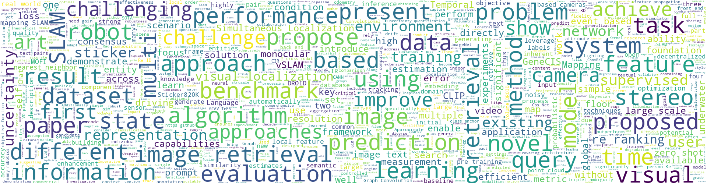
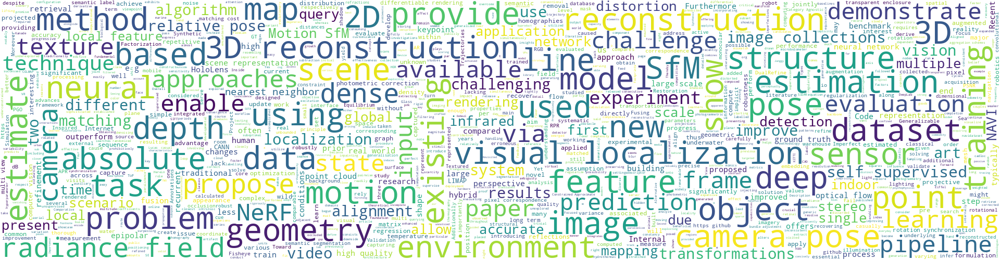
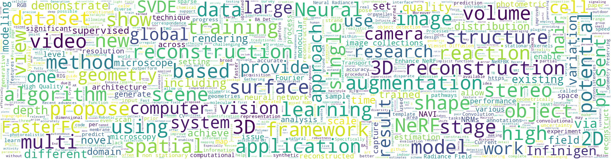
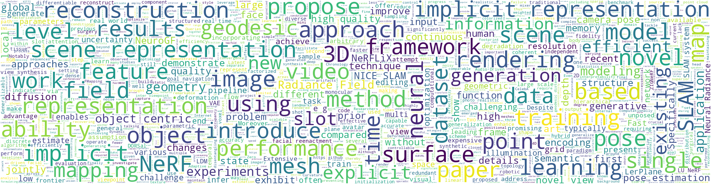
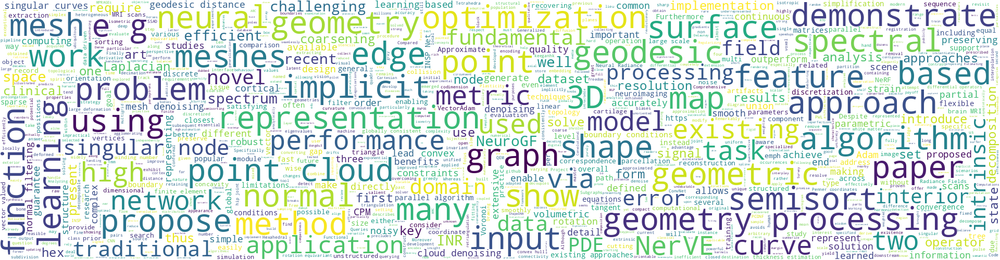

# [Archive] CV Papers from arXiv.org (0617)

> Updated on June 17, 2023  

---

# Table of Contents
* [SLAM](#SLAM) 
* [SFM](#SFM)
* [Visual Localization](#Visual-Localization) 
* [Keypoint Detection](#Keypoint-Detection) 
* [Image Matching](#Image-Matching) 
* [Neural Rendering ](#Neural-Rendering) 
* [3D Reconstruction](#3D-Reconstruction) 
* [Scene Representation](#Scene-Representation) 
* [Geometry Processing](#Geometry-Processing) 

  
Word Cloud

  * The word cloud is constructed based on the newest 200 papers (accessed on June 16, 2023)
    
  <ol>

  * SLAM

  
  
  * SFM
    
  
  
  * Visual Localization

  
  
  * Keypoint Detection
    
  
  
  * Image Matching
    
  
  
  * Neural Rendering
    
  
  
  * 3D Reconstruction
    
  
  
  * Scene Representation
    
  
  
  * Geometry Processing
    
  

  </ol>

---

## SLAM

|Publish Date|Title|Authors|PDF|Code|
|---|---|---|---|---|
|**2023-06-15**|**Yes, we CANN: Constrained Approximate Nearest Neighbors for local feature-based visual localization**|Dror Aiger et.al.|[2306.09012](http://arxiv.org/abs/2306.09012)|null|
|**2023-06-15**|**Prompt Performance Prediction for Generative IR**|Nicolas Bizzozzero et.al.|[2306.08915](http://arxiv.org/abs/2306.08915)|null|
|**2023-06-15**|**Graph Convolution Based Efficient Re-Ranking for Visual Retrieval**|Yuqi Zhang et.al.|[2306.08792](http://arxiv.org/abs/2306.08792)|**[link](https://github.com/WesleyZhang1991/GCN_rerank)**|
|**2023-06-14**|**Investigation of the Challenges of Underwater-Visual-Monocular-SLAM**|Michele Grimaldi et.al.|[2306.08738](http://arxiv.org/abs/2306.08738)|null|
|**2023-06-14**|**Challenges of Indoor SLAM: A multi-modal multi-floor dataset for SLAM evaluation**|Pushyami Kaveti et.al.|[2306.08522](http://arxiv.org/abs/2306.08522)|null|
|**2023-06-13**|**GeneCIS: A Benchmark for General Conditional Image Similarity**|Sagar Vaze et.al.|[2306.07969](http://arxiv.org/abs/2306.07969)|null|
|**2023-06-13**|**MOFI: Learning Image Representations from Noisy Entity Annotated Images**|Wentao Wu et.al.|[2306.07952](http://arxiv.org/abs/2306.07952)|null|
|**2023-06-14**|**iSLAM: Imperative SLAM**|Taimeng Fu et.al.|[2306.07894](http://arxiv.org/abs/2306.07894)|null|
|**2023-06-12**|**Zero-shot Composed Text-Image Retrieval**|Yikun Liu et.al.|[2306.07272](http://arxiv.org/abs/2306.07272)|null|
|**2023-06-12**|**Sticker820K: Empowering Interactive Retrieval with Stickers**|Sijie Zhao et.al.|[2306.06870](http://arxiv.org/abs/2306.06870)|null|
|**2023-06-12**|**Volume-DROID: A Real-Time Implementation of Volumetric Mapping with DROID-SLAM**|Peter Stratton et.al.|[2306.06850](http://arxiv.org/abs/2306.06850)|**[link](https://github.com/peterstratton/volume-droid)**|
|**2023-06-11**|**Self-Enhancement Improves Text-Image Retrieval in Foundation Visual-Language Models**|Yuguang Yang et.al.|[2306.06691](http://arxiv.org/abs/2306.06691)|null|
|**2023-06-07**|**Towards Decentralized Heterogeneous Multi-Robot SLAM and Target Tracking**|Ofer Dagan et.al.|[2306.04570](http://arxiv.org/abs/2306.04570)|null|
|**2023-06-06**|**Rao-Blackwellized Particle Smoothing for Simultaneous Localization and Mapping**|Manon Kok et.al.|[2306.03953](http://arxiv.org/abs/2306.03953)|null|
|**2023-06-03**|**Relieving Triplet Ambiguity: Consensus Network for Language-Guided Image Retrieval**|Xu Zhang et.al.|[2306.02092](http://arxiv.org/abs/2306.02092)|null|
|**2023-06-12**|**Temporal-controlled Frame Swap for Generating High-Fidelity Stereo Driving Data for Autonomy Analysis**|Yedi Luo et.al.|[2306.01704](http://arxiv.org/abs/2306.01704)|**[link](https://github.com/ostadabbas/temporal-controlled-frame-swap-gtav-tefs-)**|
|**2023-06-01**|**Event-based Visual Odometry with Full Temporal Resolution via Continuous-time Gaussian Process Regression**|Jianeng Wang et.al.|[2306.01188](http://arxiv.org/abs/2306.01188)|null|
|**2023-06-03**|**Class Anchor Margin Loss for Content-Based Image Retrieval**|Alexandru Ghita et.al.|[2306.00630](http://arxiv.org/abs/2306.00630)|null|
|**2023-05-31**|**Chatting Makes Perfect -- Chat-based Image Retrieval**|Matan Levy et.al.|[2305.20062](http://arxiv.org/abs/2305.20062)|null|
|**2023-05-31**|**Probabilistic Uncertainty Quantification of Prediction Models with Application to Visual Localization**|Junan Chen et.al.|[2305.20044](http://arxiv.org/abs/2305.20044)|null|

(<a href=#table-of-contents>back to top</a>)

## SFM

|Publish Date|Title|Authors|PDF|Code|
|---|---|---|---|---|
|**2023-06-15**|**NAVI: Category-Agnostic Image Collections with High-Quality 3D Shape and Pose Annotations**|Varun Jampani et.al.|[2306.09109](http://arxiv.org/abs/2306.09109)|null|
|**2023-06-15**|**Yes, we CANN: Constrained Approximate Nearest Neighbors for local feature-based visual localization**|Dror Aiger et.al.|[2306.09012](http://arxiv.org/abs/2306.09012)|null|
|**2023-06-10**|**3D reconstruction using Structure for Motion**|Kshitij Karnawat et.al.|[2306.06360](http://arxiv.org/abs/2306.06360)|**[link](https://github.com/kshitijkarnawat/structure-from-motion)**|
|**2023-06-02**|**Self-supervised Interest Point Detection and Description for Fisheye and Perspective Images**|Marcela Mera-Trujillo et.al.|[2306.01938](http://arxiv.org/abs/2306.01938)|null|
|**2023-05-31**|**FlowCam: Training Generalizable 3D Radiance Fields without Camera Poses via Pixel-Aligned Scene Flow**|Cameron Smith et.al.|[2306.00180](http://arxiv.org/abs/2306.00180)|null|
|**2023-05-19**|**SIDAR: Synthetic Image Dataset for Alignment & Restoration**|Monika Kwiatkowski et.al.|[2305.12036](http://arxiv.org/abs/2305.12036)|**[link](https://github.com/niika/SIDAR)**|
|**2023-05-09**|**Eiffel Tower: A Deep-Sea Underwater Dataset for Long-Term Visual Localization**|Clémentin Boittiaux et.al.|[2305.05301](http://arxiv.org/abs/2305.05301)|**[link](https://github.com/clementinboittiaux/sfm-pipeline)**|
|**2023-05-09**|**Rotation Synchronization via Deep Matrix Factorization**|Gk Tejus et.al.|[2305.05268](http://arxiv.org/abs/2305.05268)|**[link](https://github.com/gktejus/DMF-Synch)**|
|**2023-04-20**|**A Comparative Neural Radiance Field (NeRF) 3D Analysis of Camera Poses from HoloLens Trajectories and Structure from Motion**|Miriam Jäger et.al.|[2304.10664](http://arxiv.org/abs/2304.10664)|null|
|**2023-04-14**|**Fusing Structure from Motion and Simulation-Augmented Pose Regression from Optical Flow for Challenging Indoor Environments**|Felix Ott et.al.|[2304.07250](http://arxiv.org/abs/2304.07250)|null|
|**2023-04-12**|**Visual Localization using Imperfect 3D Models from the Internet**|Vojtech Panek et.al.|[2304.05947](http://arxiv.org/abs/2304.05947)|**[link](https://github.com/v-pnk/cadloc)**|
|**2023-04-08**|**Photometric Correction for Infrared Sensors**|Jincheng Zhang et.al.|[2304.03930](http://arxiv.org/abs/2304.03930)|null|
|**2023-04-07**|**DualRefine: Self-Supervised Depth and Pose Estimation Through Iterative Epipolar Sampling and Refinement Toward Equilibrium**|Antyanta Bangunharcana et.al.|[2304.03560](http://arxiv.org/abs/2304.03560)|**[link](https://github.com/antabangun/dualrefine)**|
|**2023-04-05**|**Semantic Validation in Structure from Motion**|Joseph Rowell et.al.|[2304.02420](http://arxiv.org/abs/2304.02420)|**[link](https://github.com/joerowelll/comp0132_rjxz25)**|
|**2023-03-31**|**Learning Internal Representations of 3D Transformations from 2D Projected Inputs**|Marissa Connor et.al.|[2303.17776](http://arxiv.org/abs/2303.17776)|null|
|**2023-03-30**|**3D Line Mapping Revisited**|Shaohui Liu et.al.|[2303.17504](http://arxiv.org/abs/2303.17504)|**[link](https://github.com/cvg/limap)**|
|**2023-03-27**|**TMO: Textured Mesh Acquisition of Objects with a Mobile Device by using Differentiable Rendering**|Jaehoon Choi et.al.|[2303.15060](http://arxiv.org/abs/2303.15060)|null|
|**2023-03-26**|**On the Importance of Accurate Geometry Data for Dense 3D Vision Tasks**|HyunJun Jung et.al.|[2303.14840](http://arxiv.org/abs/2303.14840)|**[link](https://github.com/junggy/hammer-dataset)**|
|**2023-03-24**|**Seeing Through the Glass: Neural 3D Reconstruction of Object Inside a Transparent Container**|Jinguang Tong et.al.|[2303.13805](http://arxiv.org/abs/2303.13805)|**[link](https://github.com/hirotong/reneus)**|
|**2023-03-24**|**Progressively Optimized Local Radiance Fields for Robust View Synthesis**|Andreas Meuleman et.al.|[2303.13791](http://arxiv.org/abs/2303.13791)|null|

(<a href=#table-of-contents>back to top</a>)

## 3D Reconstruction

|Publish Date|Title|Authors|PDF|Code|
|---|---|---|---|---|
|**2023-06-15**|**Infinite Photorealistic Worlds using Procedural Generation**|Alexander Raistrick et.al.|[2306.09310](http://arxiv.org/abs/2306.09310)|null|
|**2023-06-15**|**NAVI: Category-Agnostic Image Collections with High-Quality 3D Shape and Pose Annotations**|Varun Jampani et.al.|[2306.09109](http://arxiv.org/abs/2306.09109)|null|
|**2023-06-15**|**Enhancing Neural Rendering Methods with Image Augmentations**|Juan C. Pérez et.al.|[2306.08904](http://arxiv.org/abs/2306.08904)|null|
|**2023-06-14**|**Learning to Predict Scene-Level Implicit 3D from Posed RGBD Data**|Nilesh Kulkarni et.al.|[2306.08671](http://arxiv.org/abs/2306.08671)|null|
|**2023-06-13**|**Viewset Diffusion: (0-)Image-Conditioned 3D Generative Models from 2D Data**|Stanislaw Szymanowicz et.al.|[2306.07881](http://arxiv.org/abs/2306.07881)|null|
|**2023-06-12**|**SMART: Spatial Modeling Algorithms for Reaction and Transport**|Justin G. Laughlin et.al.|[2306.07368](http://arxiv.org/abs/2306.07368)|**[link](https://github.com/rangamanilabucsd/smart)**|
|**2023-06-12**|**Reconstructing Heterogeneous Cryo-EM Molecular Structures by Decomposing Them into Polymer Chains**|Bongjin Koo et.al.|[2306.07274](http://arxiv.org/abs/2306.07274)|null|
|**2023-06-14**|**Fast light-field 3D microscopy with out-of-distribution detection and adaptation through Conditional Normalizing Flows**|Josué Page Vizcaíno et.al.|[2306.06408](http://arxiv.org/abs/2306.06408)|**[link](https://github.com/pvjosue/cwfa)**|
|**2023-06-10**|**3D reconstruction using Structure for Motion**|Kshitij Karnawat et.al.|[2306.06360](http://arxiv.org/abs/2306.06360)|**[link](https://github.com/kshitijkarnawat/structure-from-motion)**|
|**2023-06-15**|**NERFBK: A High-Quality Benchmark for NERF-Based 3D Reconstruction**|Ali Karami et.al.|[2306.06300](http://arxiv.org/abs/2306.06300)|**[link](https://github.com/3dom-fbk/nerfbk)**|
|**2023-06-12**|**Neural Haircut: Prior-Guided Strand-Based Hair Reconstruction**|Vanessa Sklyarova et.al.|[2306.05872](http://arxiv.org/abs/2306.05872)|null|
|**2023-06-08**|**2D Supervised Monocular 3D Object Detection by Global-to-Local 3D Reconstruction**|Jiawei He et.al.|[2306.05418](http://arxiv.org/abs/2306.05418)|null|
|**2023-06-08**|**Enhance-NeRF: Multiple Performance Evaluation for Neural Radiance Fields**|Qianqiu Tan et.al.|[2306.05303](http://arxiv.org/abs/2306.05303)|**[link](https://github.com/tanqianq/enhance-nerf)**|
|**2023-06-07**|**BU-CVKit: Extendable Computer Vision Framework for Species Independent Tracking and Analysis**|Mahir Patel et.al.|[2306.04736](http://arxiv.org/abs/2306.04736)|null|
|**2023-06-15**|**DiViNeT: 3D Reconstruction from Disparate Views via Neural Template Regularization**|Aditya Vora et.al.|[2306.04699](http://arxiv.org/abs/2306.04699)|null|
|**2023-06-05**|**BeyondPixels: A Comprehensive Review of the Evolution of Neural Radiance Fields**|AKM Shahariar Azad Rabby et.al.|[2306.03000](http://arxiv.org/abs/2306.03000)|null|
|**2023-06-05**|**Image Reconstruction for Accelerated MR Scan with Faster Fourier Convolutional Neural Networks**|Xiaohan Liu et.al.|[2306.02886](http://arxiv.org/abs/2306.02886)|null|
|**2023-06-05**|**Single-Stage 3D Geometry-Preserving Depth Estimation Model Training on Dataset Mixtures with Uncalibrated Stereo Data**|Nikolay Patakin et.al.|[2306.02878](http://arxiv.org/abs/2306.02878)|null|
|**2023-06-05**|**Computational 3D topographic microscopy from terabytes of data per sample**|Kevin C. Zhou et.al.|[2306.02634](http://arxiv.org/abs/2306.02634)|null|
|**2023-06-08**|**Adaptive Robotic Information Gathering via Non-Stationary Gaussian Processes**|Weizhe Chen et.al.|[2306.01263](http://arxiv.org/abs/2306.01263)|**[link](https://github.com/weizhe-chen/attentive_kernels)**|

(<a href=#table-of-contents>back to top</a>)

## Scene Representation

|Publish Date|Title|Authors|PDF|Code|
|---|---|---|---|---|
|**2023-06-13**|**DORSal: Diffusion for Object-centric Representations of Scenes $\textit{et al.}$**|Allan Jabri et.al.|[2306.08068](http://arxiv.org/abs/2306.08068)|null|
|**2023-06-13**|**Neural Scene Chronology**|Haotong Lin et.al.|[2306.07970](http://arxiv.org/abs/2306.07970)|null|
|**2023-06-13**|**Parametric Implicit Face Representation for Audio-Driven Facial Reenactment**|Ricong Huang et.al.|[2306.07579](http://arxiv.org/abs/2306.07579)|null|
|**2023-06-12**|**H-SLAM: Hybrid Direct-Indirect Visual SLAM**|Georges Younes et.al.|[2306.07363](http://arxiv.org/abs/2306.07363)|**[link](https://github.com/aubvrl/fslam_ros_docker)**|
|**2023-06-12**|**Slot-VAE: Object-Centric Scene Generation with Slot Attention**|Yanbo Wang et.al.|[2306.06997](http://arxiv.org/abs/2306.06997)|null|
|**2023-06-10**|**From NeRFLiX to NeRFLiX++: A General NeRF-Agnostic Restorer Paradigm**|Kun Zhou et.al.|[2306.06388](http://arxiv.org/abs/2306.06388)|null|
|**2023-06-09**|**Beyond Surface Statistics: Scene Representations in a Latent Diffusion Model**|Yida Chen et.al.|[2306.05720](http://arxiv.org/abs/2306.05720)|null|
|**2023-06-08**|**LU-NeRF: Scene and Pose Estimation by Synchronizing Local Unposed NeRFs**|Zezhou Cheng et.al.|[2306.05410](http://arxiv.org/abs/2306.05410)|null|
|**2023-06-06**|**Human 3D Avatar Modeling with Implicit Neural Representation: A Brief Survey**|Mingyang Sun et.al.|[2306.03576](http://arxiv.org/abs/2306.03576)|null|
|**2023-06-05**|**Explicit Neural Surfaces: Learning Continuous Geometry With Deformation Fields**|Thomas Walker et.al.|[2306.02956](http://arxiv.org/abs/2306.02956)|null|
|**2023-06-05**|**ZIGNeRF: Zero-shot 3D Scene Representation with Invertible Generative Neural Radiance Fields**|Kanghyeok Ko et.al.|[2306.02741](http://arxiv.org/abs/2306.02741)|null|
|**2023-06-10**|**NICE-SLAM with Adaptive Feature Grids**|Ganlin Zhang et.al.|[2306.02395](http://arxiv.org/abs/2306.02395)|**[link](https://github.com/zhangganlin/nice-slam-with-adaptive-feature-grids)**|
|**2023-06-03**|**Weight-Aware Implicit Geometry Reconstruction with Curvature-Guided Sampling**|Lu Sang et.al.|[2306.02099](http://arxiv.org/abs/2306.02099)|null|
|**2023-06-01**|**NeuroGF: A Neural Representation for Fast Geodesic Distance and Path Queries**|Qijian Zhang et.al.|[2306.00658](http://arxiv.org/abs/2306.00658)|**[link](https://github.com/keeganhk/neurogf)**|
|**2023-06-01**|**FMapping: Factorized Efficient Neural Field Mapping for Real-Time Dense RGB SLAM**|Tongyan Hua et.al.|[2306.00579](http://arxiv.org/abs/2306.00579)|null|
|**2023-05-31**|**FlowCam: Training Generalizable 3D Radiance Fields without Camera Poses via Pixel-Aligned Scene Flow**|Cameron Smith et.al.|[2306.00180](http://arxiv.org/abs/2306.00180)|null|
|**2023-05-31**|**Neural LerPlane Representations for Fast 4D Reconstruction of Deformable Tissues**|Chen Yang et.al.|[2305.19906](http://arxiv.org/abs/2305.19906)|**[link](https://github.com/loping151/lerplane)**|
|**2023-05-29**|**FastMESH: Fast Surface Reconstruction by Hexagonal Mesh-based Neural Rendering**|Yisu Zhang et.al.|[2305.17858](http://arxiv.org/abs/2305.17858)|null|
|**2023-05-26**|**Generalizable Pose Estimation Using Implicit Scene Representations**|Vaibhav Saxena et.al.|[2305.17252](http://arxiv.org/abs/2305.17252)|null|
|**2023-05-26**|**How To Not Train Your Dragon: Training-free Embodied Object Goal Navigation with Semantic Frontiers**|Junting Chen et.al.|[2305.16925](http://arxiv.org/abs/2305.16925)|null|

(<a href=#table-of-contents>back to top</a>)

## Geometry Processing

|Publish Date|Title|Authors|PDF|Code|
|---|---|---|---|---|
|**2023-06-01**|**NeuroGF: A Neural Representation for Fast Geodesic Distance and Path Queries**|Qijian Zhang et.al.|[2306.00658](http://arxiv.org/abs/2306.00658)|**[link](https://github.com/keeganhk/neurogf)**|
|**2023-05-10**|**Surface Simplification using Intrinsic Error Metrics**|Hsueh-Ti Derek Liu et.al.|[2305.06410](http://arxiv.org/abs/2305.06410)|null|
|**2023-05-08**|**A Closest Point Method for Surface PDEs with Interior Boundary Conditions for Geometry Processing**|Nathan King et.al.|[2305.04711](http://arxiv.org/abs/2305.04711)|null|
|**2023-05-02**|**Cortical analysis of heterogeneous clinical brain MRI scans for large-scale neuroimaging studies**|Karthik Gopinath et.al.|[2305.01827](http://arxiv.org/abs/2305.01827)|null|
|**2023-04-23**|**Globally Consistent Normal Orientation for Point Clouds by Regularizing the Winding-Number Field**|Rui Xu et.al.|[2304.11605](http://arxiv.org/abs/2304.11605)|null|
|**2023-04-20**|**High-Performance and Flexible Parallel Algorithms for Semisort and Related Problems**|Xiaojun Dong et.al.|[2304.10078](http://arxiv.org/abs/2304.10078)|**[link](https://github.com/ucrparlay/parallel-semisort)**|
|**2023-05-15**|**Tetra-NeRF: Representing Neural Radiance Fields Using Tetrahedra**|Jonas Kulhanek et.al.|[2304.09987](http://arxiv.org/abs/2304.09987)|**[link](https://github.com/jkulhanek/tetra-nerf)**|
|**2023-03-29**|**NerVE: Neural Volumetric Edges for Parametric Curve Extraction from Point Cloud**|Xiangyu Zhu et.al.|[2303.16465](http://arxiv.org/abs/2303.16465)|null|
|**2023-03-10**|**Scalable and Efficient Functional Map Computations on Dense Meshes**|Robin Magnet et.al.|[2303.05965](http://arxiv.org/abs/2303.05965)|**[link](https://github.com/robinmagnet/scalable_fm)**|
|**2022-12-15**|**Signal Processing for Implicit Neural Representations**|Dejia Xu et.al.|[2210.08772](http://arxiv.org/abs/2210.08772)|null|
|**2022-09-02**|**Geometric and Learning-based Mesh Denoising: A Comprehensive Survey**|Honghua Chen et.al.|[2209.00841](http://arxiv.org/abs/2209.00841)|null|
|**2022-09-02**|**PCDNF: Revisiting Learning-based Point Cloud Denoising via Joint Normal Filtering**|Zheng Liu et.al.|[2209.00798](http://arxiv.org/abs/2209.00798)|null|
|**2022-08-08**|**A Rotation-Strain Method to Model Surfaces using Plasticity**|Jiahao Wen et.al.|[2208.04364](http://arxiv.org/abs/2208.04364)|null|
|**2023-02-08**|**Generalized Spectral Coarsening**|Alexandros Dimitrios Keros et.al.|[2207.01146](http://arxiv.org/abs/2207.01146)|null|
|**2022-06-23**|**Metric Optimization in Penner Coordinates**|Ryan Capouellez et.al.|[2206.11456](http://arxiv.org/abs/2206.11456)|null|
|**2023-01-31**|**Spectral Maps for Learning on Subgraphs**|Marco Pegoraro et.al.|[2205.14938](http://arxiv.org/abs/2205.14938)|null|
|**2022-11-13**|**VectorAdam for Rotation Equivariant Geometry Optimization**|Selena Ling et.al.|[2205.13599](http://arxiv.org/abs/2205.13599)|null|
|**2022-05-05**|**Approximate Convex Decomposition for 3D Meshes with Collision-Aware Concavity and Tree Search**|Xinyue Wei et.al.|[2205.02961](http://arxiv.org/abs/2205.02961)|**[link](https://github.com/sarahweiii/coacd)**|
|**2022-03-20**|**A direct geometry processing cartilage generation method using segmented bone models from datasets with poor cartilage visibility**|Faezeh Moshfeghifar et.al.|[2203.10667](http://arxiv.org/abs/2203.10667)|**[link](https://github.com/diku-dk/cargen)**|
|**2022-02-19**|**Local Decomposition of Hexahedral Singular Nodes into Singular Curves**|Paul Zhang et.al.|[2202.09686](http://arxiv.org/abs/2202.09686)|null|

(<a href=#table-of-contents>back to top</a>)
